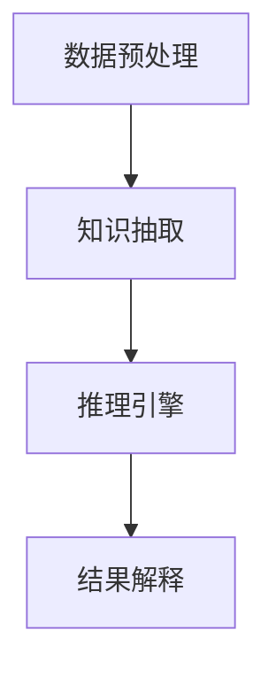
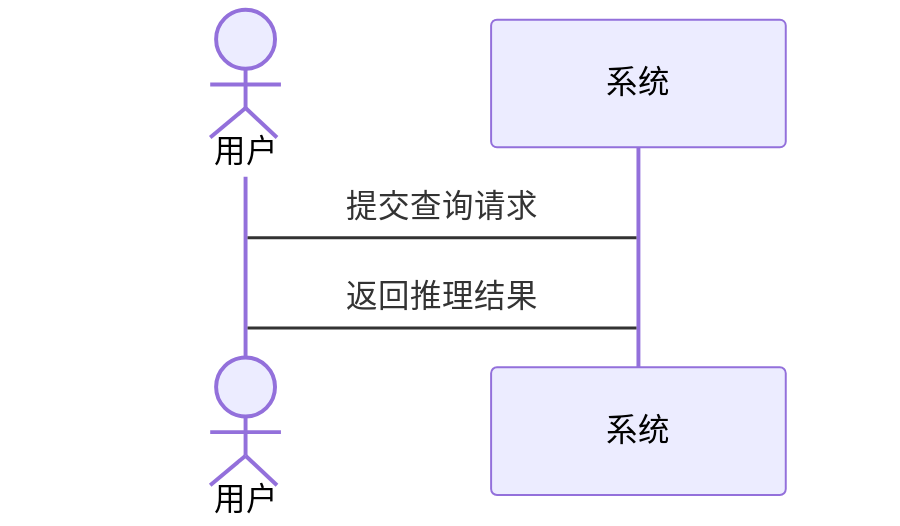

                 


# 知识图谱推理：提升AI Agent的逻辑分析

> **关键词**：知识图谱、推理、AI Agent、逻辑分析、系统设计、算法原理  
> **摘要**：知识图谱推理是人工智能领域的重要技术，通过构建结构化的知识表示和推理算法，显著提升了AI Agent的逻辑分析能力。本文系统地介绍知识图谱的基本概念、推理算法、系统架构，并通过项目实战展示其应用，帮助读者全面掌握知识图谱推理的核心技术与实践方法。

---

## 第1章 知识图谱与知识图谱推理概述

### 1.1 知识图谱的基本概念

#### 1.1.1 知识图谱的定义
知识图谱是一种结构化的语义网络，由实体（Entity）和关系（Relation）组成，用于表示真实世界中的概念及其关联。例如，知识图谱可以表示“苹果是一种水果”或“北京是中国的首都”。

#### 1.1.2 知识图谱的结构与特点
知识图谱的结构基于图模型，具有以下特点：
- **结构化**：实体和关系以节点和边的形式组织。
- **语义丰富**：通过关系描述复杂的语义信息。
- **可扩展性**：支持大规模数据的整合和扩展。

#### 1.1.3 知识图谱的应用场景
知识图谱广泛应用于搜索引擎优化、智能问答系统、推荐系统等领域。例如，搜索引擎可以通过知识图谱提供更精准的搜索结果。

---

### 1.2 知识图谱推理的定义与重要性

#### 1.2.1 知识图谱推理的定义
知识图谱推理是指在知识图谱中，基于已有的事实（三元组）推导新的知识的过程。例如，如果已知“张三是中国人”和“所有中国人都会说中文”，可以推导出“张会说中文”。

#### 1.2.2 知识图谱推理的作用与意义
知识图谱推理增强了AI Agent的理解能力，使其能够处理复杂的关系和逻辑推理，从而提高系统的智能水平。

#### 1.2.3 知识图谱推理与AI Agent的关系
AI Agent通过知识图谱推理，可以更好地理解和处理复杂问题，例如问答系统中的上下文推理。

---

### 1.3 问题背景与问题描述

#### 1.3.1 当前AI Agent在逻辑分析中的挑战
AI Agent在处理复杂逻辑问题时，往往依赖规则或简单的模式匹配，缺乏深度的逻辑推理能力。

#### 1.3.2 知识图谱推理如何解决这些问题
知识图谱推理通过结构化的知识表示和推理算法，帮助AI Agent理解问题的上下文和逻辑关系。

#### 1.3.3 知识图谱推理的边界与外延
知识图谱推理专注于基于知识图谱的逻辑推理，不涉及情感分析或自然语言处理等其他任务。

---

## 第2章 知识图谱推理的核心概念与联系

### 2.1 实体与关系

#### 2.1.1 实体的定义与分类
实体是知识图谱的基本元素，可以是具体的人、事、物或概念。例如，“张三”、“中国”、“苹果”等。

#### 2.1.2 关系的定义与分类
关系描述实体之间的关联，可以是“属于”、“位于”、“是”等。例如，“张三是中国人”中的“是”是一种关系。

#### 2.1.3 实体与关系的关系
实体是独立存在的对象，关系是连接实体的桥梁。例如，实体“张三”和“中国”通过关系“是”连接。

---

### 2.2 属性与事实

#### 2.2.1 属性的定义与类型
属性描述实体的特征，例如“年龄”、“颜色”等。属性可以是单值或多值的。

#### 2.2.2 事实的定义与结构
事实是实体和属性的组合，例如“张三是25岁”。

#### 2.2.3 属性与事实的关系
属性是事实的核心组成部分，事实通过属性描述实体的特征。

---

### 2.3 知识图谱的构建过程

#### 2.3.1 数据抽取与清洗
从文本、数据库等来源抽取结构化数据，并进行清洗和标准化。

#### 2.3.2 实体识别与链接
通过NLP技术识别实体，并将其与知识图谱中的已有实体进行链接。

#### 2.3.3 关系抽取与构建
识别实体之间的关系，并构建三元组（头实体、关系、尾实体）。

---

## 第3章 知识图谱推理的算法原理

### 3.1 基于规则的推理

#### 3.1.1 基于规则的推理原理
基于预定义的规则进行推理，例如“如果A是B，B是C，那么A是C”。

#### 3.1.2 基于规则的推理的实现
使用正向链推理或反向链推理方法，根据规则库进行推理。

#### 3.1.3 基于规则的推理的优缺点
优点：简单易懂，适用于规则明确的场景；缺点：难以处理复杂逻辑。

---

### 3.2 统计推理

#### 3.2.1 统计推理的基本原理
基于概率论进行推理，例如计算某个结论的概率。

#### 3.2.2 统计推理的实现
使用马尔可夫链或贝叶斯网络进行推理。

#### 3.2.3 统计推理的优缺点
优点：能够处理不确定性；缺点：依赖数据质量和数量。

---

### 3.3 基于学习的推理

#### 3.3.1 基于学习的推理原理
利用深度学习模型（如RNN、CNN）进行推理。

#### 3.3.2 基于学习的推理的实现
使用知识图谱嵌入（如TransE、TransH）进行推理。

#### 3.3.3 基于学习的推理的优缺点
优点：能够处理复杂关系；缺点：需要大量数据训练。

---

## 第4章 知识图谱推理的数学模型与公式

### 4.1 概率推理

#### 4.1.1 贝叶斯定理
贝叶斯定理用于计算条件概率，公式为：
$$ P(A|B) = \frac{P(B|A)P(A)}{P(B)} $$

#### 4.1.2 证据的组合
通过贝叶斯网络将多个证据进行组合，推导出最终的概率。

---

### 4.2 图嵌入

#### 4.2.1 TransE模型
TransE模型将实体和关系映射到向量空间，公式为：
$$ \text{score}(h, r, t) = \|h + r - t\| $$

#### 4.2.2 TransH模型
TransH模型将实体和关系映射到超平面，公式为：
$$ \text{score}(h, r, t) = \|h_r + r - t_r\| $$

---

## 第5章 知识图谱推理的系统分析与架构设计

### 5.1 系统架构设计

#### 5.1.1 系统功能模块
- 数据预处理模块
- 知识抽取模块
- 推理引擎模块
- 结果解释模块

#### 5.1.2 系统架构图


---

### 5.2 接口设计与交互流程

#### 5.2.1 系统接口设计
- 输入接口：接收查询请求
- 输出接口：返回推理结果

#### 5.2.2 交互流程


---

## 第6章 知识图谱推理的项目实战

### 6.1 环境配置

#### 6.1.1 环境要求
- Python 3.8+
- PyTorch 1.9+
- KnowledgeGraph库

---

### 6.2 核心代码实现

#### 6.2.1 知识抽取模块
```python
def extractEntities(text):
    # 使用NLP工具抽取实体
    pass
```

#### 6.2.2 推理引擎模块
```python
def infer(h, r):
    # 基于知识图谱推理
    pass
```

---

### 6.3 案例分析

#### 6.3.1 案例背景
构建一个简单的知识图谱推理系统，用于回答问题。

#### 6.3.2 实现步骤
1. 数据预处理
2. 实体抽取
3. 推理引擎

---

## 第7章 知识图谱推理的最佳实践与总结

### 7.1 最佳实践

#### 7.1.1 数据质量的重要性
确保数据的准确性和完整性。

#### 7.1.2 模型可解释性
设计可解释的推理模型，便于调试和优化。

---

### 7.2 小结

知识图谱推理通过结构化的知识表示和推理算法，显著提升了AI Agent的逻辑分析能力。本文从核心概念、算法原理、系统设计到项目实战，全面介绍了知识图谱推理的技术与实践。

---

### 7.3 注意事项

- 数据质量和模型选择对推理结果有重要影响。
- 在实际应用中，需要考虑性能优化和可扩展性。

---

## 作者信息

**作者：AI天才研究院/AI Genius Institute & 禅与计算机程序设计艺术 /Zen And The Art of Computer Programming**

---

**本文是系统的技术博客文章，版权归作者所有，未经授权不得转载。**

