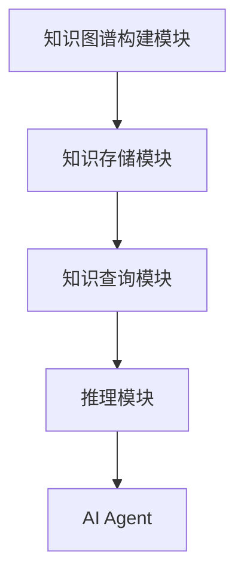
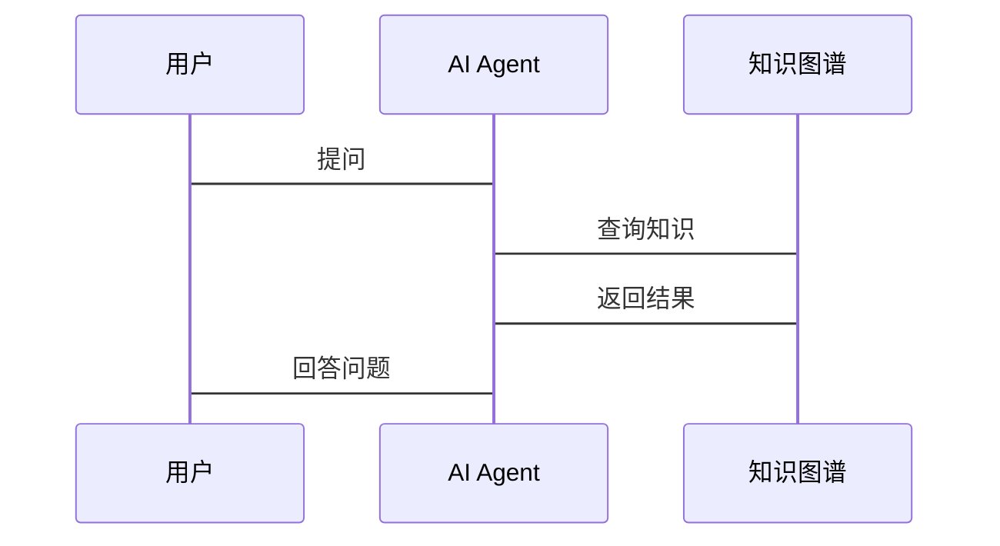

                 


# 知识图谱集成：增强AI Agent的背景知识

## 关键词：知识图谱、AI Agent、背景知识、知识集成、知识融合、语义网络

## 摘要：  
知识图谱作为一种结构化的知识表示方法，能够为AI Agent提供丰富的背景知识，从而增强其理解和推理能力。本文将深入探讨知识图谱的核心概念、构建与集成算法，以及如何将知识图谱集成到AI Agent中，提升其智能水平。通过实际案例分析和系统设计，本文将展示知识图谱在AI Agent中的应用潜力，并为读者提供实践指导和进一步研究的方向。

---

# 第1章 知识图谱集成的核心概念

## 1.1 知识图谱的基本概念

### 1.1.1 知识图谱的定义与特点
知识图谱是一种以三元组（头实体、关系、尾实体）形式表示的知识结构，具有以下特点：
- **结构化**：通过实体和关系构建层次化的知识网络。
- **语义丰富**：支持复杂的语义关系表达。
- **可扩展性**：能够不断扩展和更新知识内容。

### 1.1.2 知识图谱的构建过程
知识图谱的构建通常包括数据收集、预处理、实体识别、关系抽取和知识融合等步骤。

### 1.1.3 知识图谱与AI Agent的关系
知识图谱为AI Agent提供了背景知识，使其能够更好地理解上下文、推理和回答问题。

## 1.2 知识图谱的结构与语义

### 1.2.1 知识图谱的三元组模型
知识图谱的基本单元是三元组（头实体、关系、尾实体），例如：
- 头实体：`北京`
- 关系：`位于`
- 尾实体：`中国`

### 1.2.2 知识图谱的语义网络
知识图谱通过语义网络表示实体之间的关系，例如：
- `北京`是`中国的首都`，`中国`是`一个国家`。

### 1.2.3 知识图谱的可扩展性
知识图谱可以通过添加新的实体和关系不断扩展。

## 1.3 知识图谱集成的背景与意义

### 1.3.1 知识图谱集成的背景
随着AI Agent的广泛应用，需要更丰富的背景知识来支持其智能决策。

### 1.3.2 知识图谱集成的意义
通过集成知识图谱，AI Agent能够更好地理解和处理复杂的问题。

### 1.3.3 知识图谱集成的挑战
知识图谱的构建和集成需要解决数据清洗、语义理解和知识融合等挑战。

## 1.4 本章小结
本章介绍了知识图谱的基本概念、结构和语义，并探讨了其在AI Agent中的集成意义和挑战。

---

# 第2章 知识图谱的核心概念与联系

## 2.1 知识图谱的核心概念

### 2.1.1 实体与属性
- **实体**：具体事物或概念，例如`北京`。
- **属性**：描述实体的特征，例如`首都`。

### 2.1.2 关系与语义
- **关系**：实体之间的联系，例如`位于`。
- **语义**：关系的含义和上下文。

### 2.1.3 知识图谱的层次结构
知识图谱的层次结构包括实体层、关系层和语义层。

## 2.2 知识图谱与相关技术的联系

### 2.2.1 知识图谱与本体论的联系
本体论为知识图谱提供理论基础，知识图谱是本体论的具体实现。

### 2.2.2 知识图谱与图嵌入的关系
图嵌入技术将知识图谱中的实体和关系映射到低维空间。

### 2.2.3 知识图谱与自然语言处理的结合
知识图谱为NLP任务提供结构化的知识支持。

## 2.3 知识图谱的ER实体关系图
```mermaid
er
    entity(Entity) {
        id: string
        name: string
        description: string
    }
    relation(Relation) {
        id: string
        name: string
        description: string
    }
    entity_relation(EntityRelation) {
        entityId: string
        relationId: string
        targetId: string
    }
```

## 2.4 本章小结
本章详细探讨了知识图谱的核心概念及其与相关技术的联系，并通过ER图展示了实体和关系的结构。

---

# 第3章 知识图谱的构建与集成算法

## 3.1 知识图谱的构建算法

### 3.1.1 基于本体论的构建算法
通过本体论方法构建知识图谱，例如：
1. **数据预处理**：清洗和标注数据。
2. **实体识别**：识别文本中的实体。
3. **关系抽取**：抽取实体之间的关系。

### 3.1.2 基于语义网络的构建算法
通过语义网络构建知识图谱，例如：
1. **语义分析**：分析文本中的语义关系。
2. **网络构建**：构建语义网络。

### 3.1.3 知识融合算法
将多个来源的知识融合到知识图谱中，例如：
1. **数据清洗**：消除重复和冗余数据。
2. **对齐实体**：将不同来源的实体进行对齐。
3. **融合知识**：整合不同来源的知识。

## 3.2 知识图谱的集成算法

### 3.2.1 知识对齐算法
通过计算实体的相似度进行对齐，例如：
- **相似度计算**：使用余弦相似度或Jaccard相似度。

### 3.2.2 知识融合算法
将多个来源的知识融合到知识图谱中，例如：
1. **规则驱动融合**：基于预定义的规则进行融合。
2. **基于图的融合**：利用图的结构进行融合。

### 3.2.3 知识图谱的扩展算法
通过持续学习和更新扩展知识图谱，例如：
1. **增量学习**：逐步添加新知识。
2. **动态更新**：实时更新知识图谱。

## 3.3 算法的数学模型与公式

### 3.3.1 知识对齐的数学模型
$$
\text{相似度计算} = \frac{\sum_{i=1}^{n} w_i \cdot s_i}{\sum_{i=1}^{n} w_i}
$$

### 3.3.2 知识融合的数学模型
$$
\text{融合结果} = \sum_{i=1}^{m} \lambda_i \cdot x_i
$$
其中，$\lambda_i$ 是融合权重，$x_i$ 是输入知识。

## 3.4 本章小结
本章介绍了知识图谱的构建与集成算法，并通过数学模型和公式展示了其原理。

---

# 第4章 知识图谱的系统分析与架构设计

## 4.1 系统功能设计
系统功能包括：
1. 知识图谱的构建与管理。
2. 知识图谱的查询与推理。
3. 知识图谱与AI Agent的集成。

## 4.2 系统架构设计


## 4.3 系统接口设计
- **输入接口**：接收外部数据和查询请求。
- **输出接口**：返回查询结果和推理结论。

## 4.4 系统交互流程


## 4.5 本章小结
本章通过系统架构设计展示了知识图谱与AI Agent的集成方式，并通过交互流程图说明了系统的运作过程。

---

# 第5章 知识图谱的项目实战

## 5.1 环境安装
- 安装必要的依赖库，例如：
  ```bash
  pip install numpy
  pip install networkx
  ```

## 5.2 核心代码实现

### 5.2.1 知识图谱构建代码
```python
import networkx as nx

G = nx.Graph()
G.add_edge("北京", "中国", relation="位于")
G.add_edge("中国", "亚洲", relation="属于")
```

### 5.2.2 知识图谱查询代码
```python
def query知识图谱(G, head, relation):
    for edge in G.edges(head):
        if edge[1] == relation:
            return edge[2]
    return None
```

## 5.3 案例分析与详细解读
通过构建一个简单的知识图谱，展示其在AI Agent中的应用。

## 5.4 项目小结
本章通过实际案例展示了知识图谱的构建和集成过程，并分析了其在AI Agent中的应用潜力。

---

# 第6章 最佳实践与注意事项

## 6.1 最佳实践
- 定期更新知识图谱以保持其准确性。
- 使用高效的算法优化知识图谱的构建和查询性能。

## 6.2 小结
通过本文的探讨，读者可以全面了解知识图谱的构建、集成和应用过程。

## 6.3 注意事项
- 知识图谱的构建需要大量的人力和时间。
- 需要解决数据清洗和语义理解等技术挑战。

## 6.4 拓展阅读
推荐阅读相关书籍和论文，深入学习知识图谱的构建和应用技术。

---

# 作者：AI天才研究院/AI Genius Institute & 禅与计算机程序设计艺术 /Zen And The Art of Computer Programming

---

通过本文的系统讲解，读者可以全面理解知识图谱的核心概念、构建与集成算法，并掌握其在AI Agent中的应用方法。希望本文能为读者提供有价值的参考和实践指导。

