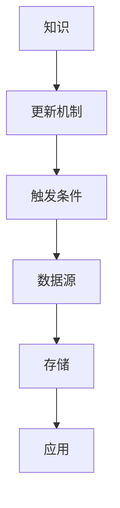
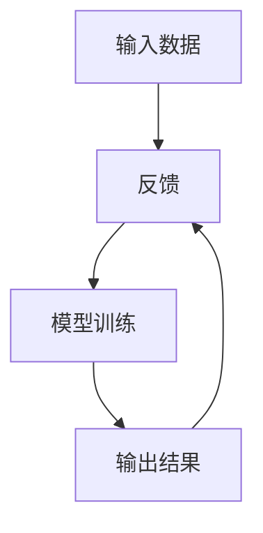
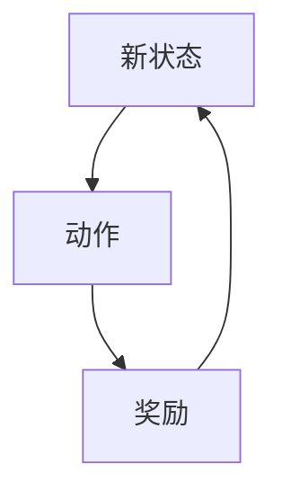
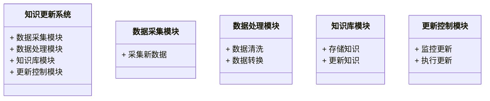
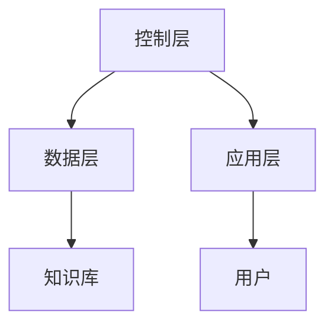
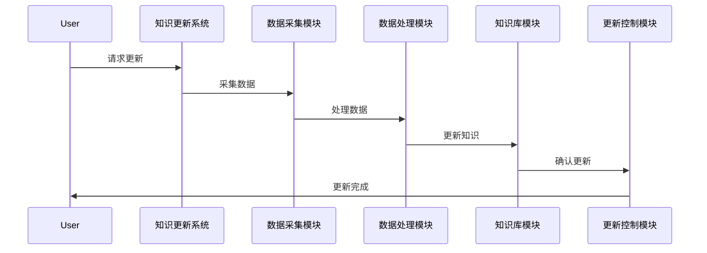

                 


# 知识更新：保持AI Agent信息的时效性

## 关键词
- AI Agent
- 知识更新
- 信息时效性
- 实时反馈
- 动态学习

## 摘要
在AI Agent快速发展的今天，保持其知识库的时效性至关重要。知识更新不仅是提升AI Agent性能的关键，也是确保其能够适应快速变化环境的核心。本文从AI Agent的知识更新机制、核心算法、系统架构设计到项目实战，全面探讨如何有效保持AI Agent信息的时效性。

---

# 第一部分: 知识更新与AI Agent时效性概述

## 第1章: 知识更新的背景与问题

### 1.1 知识更新的必要性
#### 1.1.1 信息过时的定义与影响
信息过时指的是由于环境变化或数据更新，导致AI Agent的知识库内容不再准确或适用。这会直接影响AI Agent的决策能力和用户体验。

#### 1.1.2 AI Agent在信息处理中的角色
AI Agent通过收集、处理和应用知识来完成任务。知识的时效性直接决定了AI Agent的性能和效果。

#### 1.1.3 知识更新的边界与外延
知识更新不仅包括新增知识，还包括修正错误、补充缺失信息等。其外延涉及数据源、更新频率和策略等多个方面。

### 1.2 AI Agent的时效性问题
#### 1.2.1 信息时效性的定义
信息时效性指信息在特定时间内的准确性和适用性。AI Agent需要实时或定期更新知识库，以保持信息的时效性。

#### 1.2.2 AI Agent知识更新的核心要素
知识更新的核心要素包括数据源、更新频率、更新策略和评估机制。

#### 1.2.3 时效性与AI Agent性能的关系
时效性直接影响AI Agent的响应速度和决策质量。及时的知识更新能够提升AI Agent的性能，反之则可能导致错误。

---

## 第2章: 知识更新与AI Agent的关联

### 2.1 知识更新机制
#### 2.1.1 知识更新的触发条件
知识更新可以通过预设时间、事件触发或实时反馈等方式启动。

#### 2.1.2 知识更新的流程
知识更新通常包括数据采集、处理、存储和应用四个步骤。

#### 2.1.3 知识更新的评估标准
评估标准包括准确率、响应时间、更新频率和资源消耗等。

### 2.2 AI Agent的知识表示与存储
#### 2.2.1 知识表示的多样性
知识可以表示为事实、规则、语义网络等多种形式，每种形式都有其优缺点。

#### 2.2.2 知识存储的结构化方法
知识存储需要考虑数据结构和存储效率，常用的方法包括数据库、知识图谱等。

#### 2.2.3 知识表示的动态更新
动态更新需要在不中断AI Agent运行的情况下，实时更新知识库。

### 2.3 知识更新与AI Agent的交互
#### 2.3.1 用户反馈在知识更新中的作用
用户反馈可以为AI Agent提供实时的反馈，帮助其修正错误或补充知识。

#### 2.3.2 知识更新对AI Agent行为的影响
知识更新可以优化AI Agent的决策过程，提升其行为的准确性和效率。

#### 2.3.3 知识更新的实时性要求
实时性要求知识更新能够快速响应变化，以保持AI Agent的实时性。

---

## 第3章: 知识更新的核心概念与联系

### 3.1 知识更新的核心原理
#### 3.1.1 知识更新的基本原理
知识更新通过收集新信息、修正旧信息，保持知识库的准确性和适用性。

#### 3.1.2 知识更新的关键技术
关键技术包括数据挖掘、机器学习和自然语言处理等。

#### 3.1.3 知识更新的实现方法
实现方法包括主动学习、强化学习和监督学习等。

### 3.2 核心概念对比分析
#### 3.2.1 不同知识更新机制的对比
| 机制 | 特点 | 优缺点 |
|------|------|--------|
| 主动学习 | 主动寻求新知识 | 高效但需要大量资源 |
| 强化学习 | 通过奖励机制 | 适应性强但需要长时间训练 |
| 监督学习 | 基于标注数据 | 稳定但可能需要频繁更新 |

#### 3.2.2 知识更新与信息检索的对比
知识更新注重信息的更新和维护，而信息检索注重快速获取信息。

#### 3.2.3 知识更新与数据挖掘的对比
知识更新依赖于数据挖掘技术，但更注重信息的动态更新和应用。

### 3.3 实体关系图


---

## 第4章: 知识更新的算法原理

### 4.1 算法原理概述
知识更新的核心算法包括主动学习和强化学习。

### 4.2 主动学习算法


#### Python代码实现
```python
def active_learning(dataset):
    # 数据预处理
    X, y = dataset
    X_normalized = normalize(X)
    # 特征提取
    features = extract_features(X_normalized)
    # 模型训练
    model = train_model(features, y)
    # 反馈机制
    feedback = get_feedback(model.predict(features))
    return feedback
```

#### 数学模型
$$ P(y|x) = \frac{P(x|y)P(y)}{P(x)} $$

### 4.3 强化学习算法


#### Python代码实现
```python
def reinforce_learning(env):
    # 初始化策略
    policy = initialize_policy(env.actions)
    # 策略评估
    while not done:
        action = select_action(policy)
        reward = env.get_reward(action)
        update_policy(policy, reward)
    return policy
```

#### 数学模型
$$ Q(s,a) = Q(s,a) + \alpha(r + \gamma Q(s',a') - Q(s,a)) $$

---

## 第5章: 系统分析与架构设计

### 5.1 系统应用场景
知识更新系统适用于智能客服、推荐系统等领域。

### 5.2 系统功能设计


### 5.3 系统架构设计


### 5.4 系统接口设计


---

## 第6章: 项目实战

### 6.1 环境配置
安装必要的库：`pip install numpy pandas scikit-learn`

### 6.2 核心代码实现
```python
def update_knowledge_base():
    # 数据采集
    new_data = fetch_data()
    # 数据处理
    processed_data = process_data(new_data)
    # 知识更新
    knowledge_base.update(processed_data)
    return True
```

### 6.3 案例分析
以智能客服为例，展示知识更新在实际应用中的效果。

---

## 第7章: 总结与展望

### 7.1 总结
知识更新是保持AI Agent时效性的关键，需要综合运用多种技术手段。

### 7.2 当前挑战
数据质量、更新频率和计算资源是当前面临的主要挑战。

### 7.3 未来展望
未来知识更新将更加智能化和自动化，结合边缘计算和分布式系统。

### 7.4 最佳实践 Tips
- 定期检查知识库的准确性。
- 采用多种反馈机制。
- 优化知识更新的效率。

---

## 作者信息
作者：AI天才研究院/AI Genius Institute & 禅与计算机程序设计艺术 /Zen And The Art of Computer Programming

---

**全文完**

