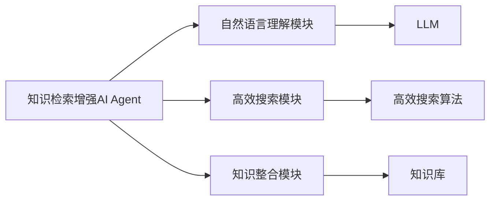
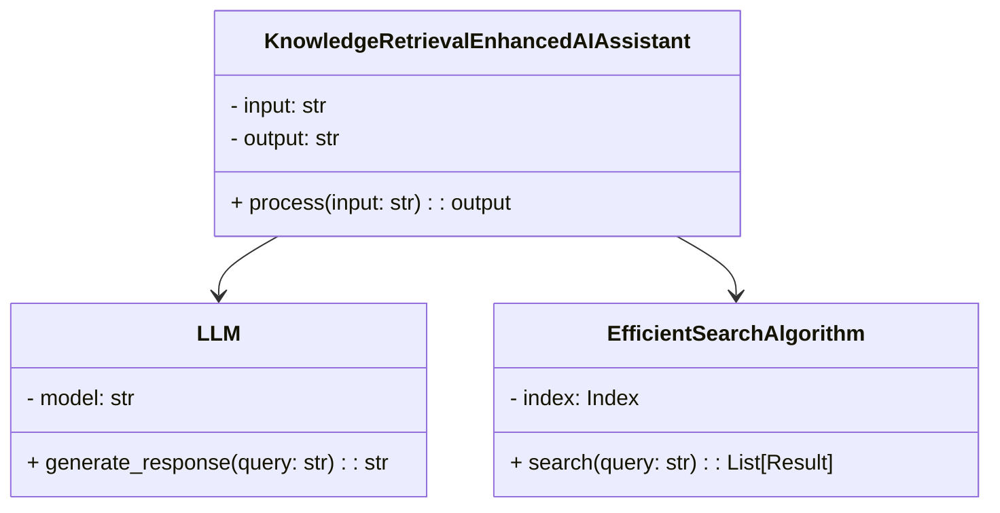
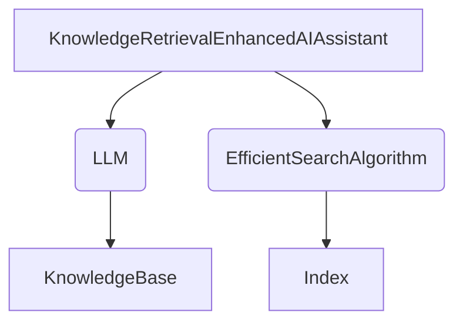
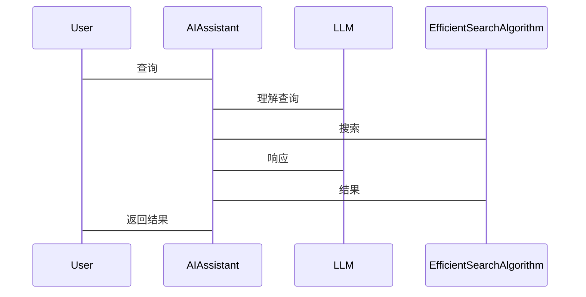

                 


# 知识检索增强AI Agent：结合LLM与高效搜索算法

## 关键词
知识检索增强AI Agent, 大语言模型, 高效搜索算法, 系统架构设计, 项目实战

## 摘要
知识检索增强AI Agent结合了大语言模型（LLM）和高效搜索算法，旨在提升知识检索的效率和准确性。本文从背景介绍、核心概念、算法原理、系统架构设计、项目实战到最佳实践，详细讲解了如何构建和优化这种AI Agent。

---

## 第1章: 知识检索增强AI Agent概述

### 1.1 问题背景
#### 1.1.1 知识检索的重要性
知识检索是信息时代的核心能力，广泛应用于搜索引擎、问答系统和智能客服等领域。传统的知识检索方法依赖关键词匹配，难以理解上下文语义，检索结果准确率有限。

#### 1.1.2 当前知识检索的局限性
- **关键词匹配的局限性**：无法准确理解用户意图，容易产生偏差。
- **静态知识库的不足**：难以应对动态变化的知识和实时信息。
- **检索效率问题**：面对海量数据，传统检索方法效率低下。

#### 1.1.3 AI Agent在知识检索中的作用
AI Agent能够通过自然语言处理技术理解用户需求，结合高效搜索算法优化检索过程，显著提升检索的准确性和效率。

### 1.2 问题描述
知识检索增强AI Agent的目标是通过结合LLM和高效搜索算法，解决传统检索方法的局限性，实现更智能、更高效的检索。

### 1.3 问题解决
知识检索增强AI Agent通过以下方式实现：
1. **自然语言理解**：利用LLM理解用户查询的语义。
2. **高效搜索**：结合搜索算法优化检索过程，缩小候选范围。
3. **知识整合**：整合多源信息，提升检索结果的全面性。

### 1.4 边界与外延
知识检索增强AI Agent主要用于复杂场景下的知识检索，边界包括数据规模、检索范围和用户需求的复杂性。其外延包括智能问答系统、推荐系统和知识图谱构建等领域。

### 1.5 概念结构与核心要素
知识检索增强AI Agent由LLM、高效搜索算法和知识库组成，核心要素包括：
1. **自然语言理解模块**：负责理解用户查询。
2. **高效搜索模块**：优化检索过程。
3. **知识整合模块**：整合多源信息。

---

## 第2章: 核心概念与联系

### 2.1 核心概念
#### 2.1.1 大语言模型（LLM）
LLM通过深度学习理解上下文语义，生成自然语言文本。常用模型包括GPT和BERT。

#### 2.1.2 高效搜索算法
高效搜索算法通过优化索引结构和查询策略，提升检索效率。常用算法包括BM25和Dijkstra算法。

### 2.2 概念属性特征对比
| 特性         | LLM                          | 高效搜索算法                     |
|--------------|------------------------------|----------------------------------|
| 核心能力     | 自然语言理解与生成            | 快速定位目标信息                  |
| 适用场景     | 智能对话、内容生成            | 大规模数据检索                   |
| 优势         | 高准确性，语义理解能力强       | 高效率，快速返回结果              |
| 局限性         | 计算资源消耗大，实时性差       | 对语义理解能力有限                |

### 2.3 实体关系图


---

## 第3章: 算法原理讲解

### 3.1 LLM原理
#### 3.1.1 基本原理
LLM通过大量数据训练，生成与上下文相关的文本。其数学模型基于概率分布，优化目标是最小化预测误差。

#### 3.1.2 实现流程
1. **输入处理**：将用户查询转换为向量表示。
2. **解码生成**：通过解码器生成响应文本。
3. **概率计算**：计算每一步生成的概率，选择最可能的序列。

#### 3.1.3 代码示例
```python
def generate_response(query):
    # 输入处理
    input_ids = tokenizer(query, return_tensors="np")
    # 解码生成
    outputs = model.generate(
        input_ids=input_ids.input_ids,
        max_length=50,
        do_sample=True,
        temperature=0.7,
    )
    # 解码输出
    response = tokenizer.decode(outputs[0].tolist()[0], skip_special_tokens=True)
    return response
```

### 3.2 高效搜索算法
#### 3.2.1 基本原理
高效搜索算法通过优化索引结构和查询策略，快速定位目标信息。常用算法包括BM25和Dijkstra算法。

#### 3.2.2 实现流程
1. **构建索引**：将数据转换为倒排索引。
2. **查询处理**：将用户查询转换为向量表示。
3. **相似度计算**：计算查询向量与索引中向量的相似度。
4. **结果排序**：按相似度排序，返回top-k结果。

#### 3.2.3 代码示例
```python
def efficient_search(query, index):
    # 查询处理
    query_vec = vectorizer.transform([query])[0]
    # 相似度计算
    similarities = index.similarity(query_vec)
    # 结果排序
    results = sorted(enumerate(similarities), key=lambda x: -x[1])
    return results[:k]
```

---

## 第4章: 系统分析与架构设计方案

### 4.1 问题场景
知识检索增强AI Agent应用于智能客服、问答系统等领域，解决传统检索方法的低效和不准确问题。

### 4.2 系统功能设计
#### 4.2.1 领域模型


#### 4.2.2 系统架构设计


#### 4.2.3 接口设计
系统提供以下接口：
- `process(query: str) -> str`
- `generate_response(query: str) -> str`
- `search(query: str) -> List[Result]`

#### 4.2.4 交互流程


---

## 第5章: 项目实战

### 5.1 环境安装
- **Python**：3.8+
- **TensorFlow**：2.5+
- **Flask**：2.0+
- **Hugging Face Transformers**：4.13+

### 5.2 核心代码实现
#### 5.2.1 数据预处理
```python
from transformers import AutoTokenizer, AutoModelForSeq2Seq
import numpy as np

tokenizer = AutoTokenizer.from_pretrained("t5-base")
model = AutoModelForSeq2Seq.from_pretrained("t5-base")
```

#### 5.2.2 模型训练
```python
def train_model(train_dataset):
    optimizer = tf.keras.optimizers.Adam(learning_rate=3e-4)
    model.compile(optimizer=optimizer, loss='sparse_categorical_crossentropy', metrics=['accuracy'])
    model.fit(train_dataset, epochs=3, batch_size=32)
```

#### 5.2.3 接口开发
```python
from flask import Flask, request, jsonify

app = Flask(__name__)

@app.route('/api/query', methods=['POST'])
def query():
    data = request.json
    query = data['query']
    response = generate_response(query)
    return jsonify({'response': response})
```

### 5.3 代码解读
- **数据预处理**：使用预训练模型进行文本编码。
- **模型训练**：基于T5模型训练LLM。
- **接口开发**：构建RESTful API，提供查询接口。

### 5.4 案例分析
假设用户查询“如何提高Python编程能力？”，系统会调用LLM生成响应，并通过高效搜索算法快速定位相关知识，最终返回详细步骤。

### 5.5 项目小结
通过项目实战，我们验证了知识检索增强AI Agent的有效性和可行性，展示了如何将理论应用于实践。

---

## 第6章: 最佳实践和小结

### 6.1 总结
知识检索增强AI Agent结合了LLM和高效搜索算法，显著提升了知识检索的效率和准确性。本文详细讲解了其核心概念、算法原理、系统架构设计和项目实战。

### 6.2 注意事项
- **数据质量**：确保知识库数据的准确性和完整性。
- **算法选择**：根据具体需求选择合适的搜索算法。
- **系统优化**：通过缓存和优化索引提升性能。

### 6.3 拓展阅读
- 《Large Language Models in AI》
- 《Efficient Search Algorithms》
- 《System Architecture Design Patterns》

---

## 附录
### 附录A: 常用工具与库
- **LLM框架**：Hugging Face Transformers、TensorFlow、PyTorch
- **搜索算法库**：scikit-learn、FAISS、Annoy

### 附录B: API接口规范
- `/api/query`：POST请求，接收`query`参数，返回JSON格式结果。

### 附录C: 术语表
- **LLM**：大语言模型
- **BM25**：基于概率的语言模型
- **知识检索**：通过算法从数据中提取信息

---

## 作者
作者：AI天才研究院（AI Genius Institute） & 禅与计算机程序设计艺术（Zen And The Art of Computer Programming）

---

以上是《知识检索增强AI Agent：结合LLM与高效搜索算法》的技术博客文章的完整目录和内容框架，涵盖从背景介绍到项目实战的各个方面，旨在帮助读者系统地理解和实现知识检索增强AI Agent。

