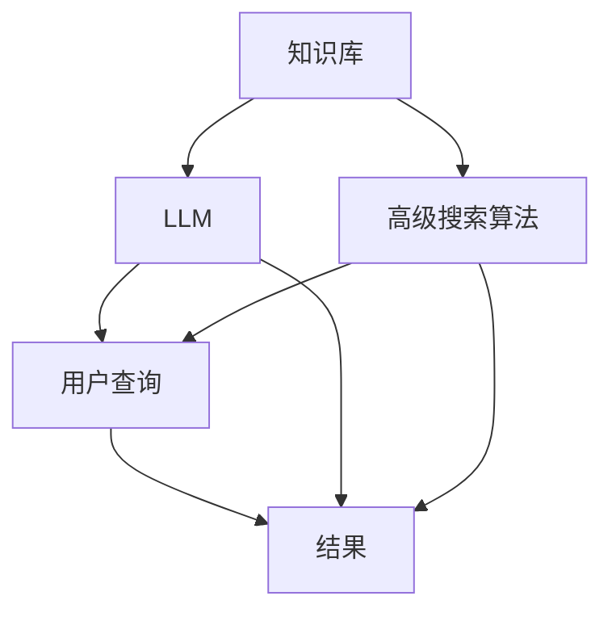
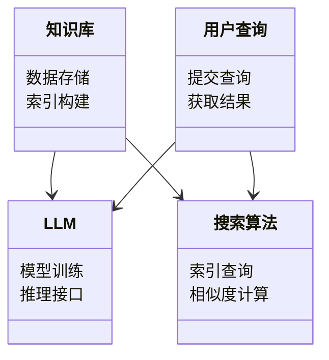
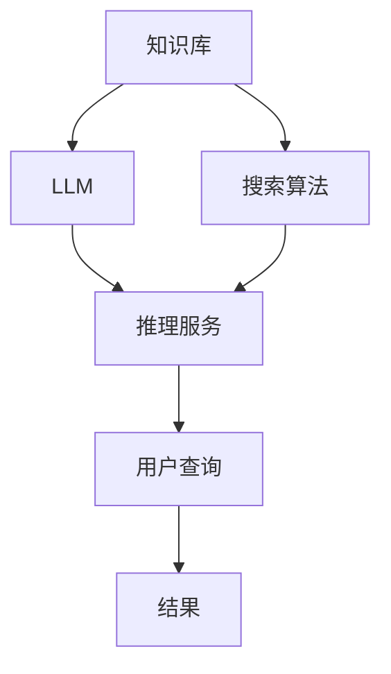

                 


# 知识检索增强型AI Agent：结合LLM与高级搜索算法

## 关键词：知识检索、LLM、AI Agent、搜索算法、实时性、准确性

## 摘要：  
本文探讨了知识检索增强型AI Agent的设计与实现，结合大语言模型（LLM）与高级搜索算法，分析其在提升智能问答系统中的实时性和准确性方面的优势。通过详细解析LLM与搜索算法的核心原理、系统架构设计以及实际案例分析，深入探讨了知识检索增强型AI Agent的技术细节与应用场景，为读者提供了全面的技术视角和实践指南。

---

## 第一部分：知识检索增强型AI Agent的背景与概念

### 第1章：知识检索增强型AI Agent的背景与概念

#### 1.1 知识检索增强型AI Agent的背景

人工智能代理（AI Agent）近年来取得了显著进展，从简单的规则引擎到复杂的智能系统，其核心能力依赖于知识检索能力。知识检索增强型AI Agent通过结合大语言模型（LLM）和高级搜索算法，显著提升了其在处理复杂问题时的准确性和实时性。

#### 1.2 问题背景与挑战

传统AI Agent存在以下问题：
- 知识库依赖性过强，难以实时更新。
- 信息检索效率低下，影响用户体验。
- 缺乏对多模态数据的处理能力。

结合LLM和高级搜索算法，知识检索增强型AI Agent能够实时获取最新信息，提升准确性，同时具备多模态数据处理能力，满足复杂场景的需求。

---

## 第二部分：核心概念与联系

### 第2章：LLM与搜索算法的核心原理

#### 2.1 LLM与搜索算法的原理对比

| **属性**         | **LLM**                | **高级搜索算法**         |
|-------------------|------------------------|--------------------------|
| **准确性**         | 高，依赖大量训练数据 | 中，依赖索引和匹配策略    |
| **实时性**         | 低，需要重算           | 高，基于索引快速检索      |
| **可解释性**       | 低，黑箱模型           | 高，基于规则和统计        |
| **模型复杂度**     | 高，参数众多           | 中，算法相对简单          |
| **数据依赖性**     | 高，需要大量数据       | 中，依赖索引结构          |

#### 2.2 实体关系图（ER图）



---

## 第三部分：算法原理讲解

### 第3章：LLM算法原理

#### 3.1 转换器模型的训练过程

1. **预训练任务**：
   - 掩码语言模型：随机遮盖部分词，预测其值。
   - 任务：$P(w_i | w_{i-1}, w_{i-2}, ..., w_{i-k})$。

2. **损失函数**：
   $$ \text{损失} = -\sum_{i=1}^n \log P(w_i | w_{i-1}, ..., w_{i-k}) $$

3. **优化策略**：
   - 使用Adam优化器。
   - 学习率调整：余弦退火。

### 第4章：高级搜索算法

#### 4.1 BM25算法

1. **原理**：
   - 基于概率统计模型，计算查询与文档的相关性。
   - 余弦相似度：$ \cos(\theta) = \frac{\mathbf{q} \cdot \mathbf{d}}{\|\mathbf{q}\| \|\mathbf{d}\|} $。

2. **实现步骤**：
   - 文本分词与索引构建。
   - 查询处理与相似度计算。

---

## 第四部分：系统架构与实现

### 第5章：系统架构设计

#### 5.1 系统类图



#### 5.2 系统架构图



---

## 第五部分：项目实战

### 第6章：环境安装与代码实现

#### 6.1 环境配置

```bash
pip install transformers faiss-cpu
```

#### 6.2 知识库构建

```python
from sentence_transformers import SentenceTransformer

model = SentenceTransformer('all-mpnet-base-v2')
embeddings = model.encode(docs)
```

#### 6.3 LLM训练

```python
import torch
from torch import nn

class SimpleLM(nn.Module):
    def __init__(self, vocab_size):
        super().__init__()
        self.embedding = nn.Embedding(vocab_size, 512)
        self.decoder = nn.Linear(512, vocab_size)
    
    def forward(self, inputs):
        x = self.embedding(inputs)
        x = self.decoder(x)
        return x
```

---

## 附录

### 附图

1. **实体关系图**：图1展示了知识库、LLM、搜索算法和用户查询之间的关系。
2. **系统类图**：图2展示了系统中各组件的类关系。
3. **算法流程图**：图3展示了BM25算法的流程。

---

## 作者：AI天才研究院 & 禅与计算机程序设计艺术

---

以上是基于用户需求的详细技术博客大纲，涵盖所有必要部分，并通过具体的代码、图表和公式进行深入讲解。

