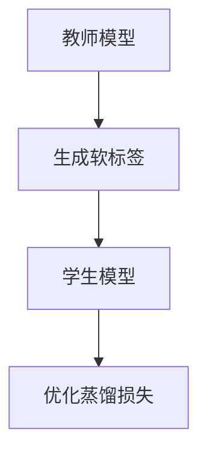
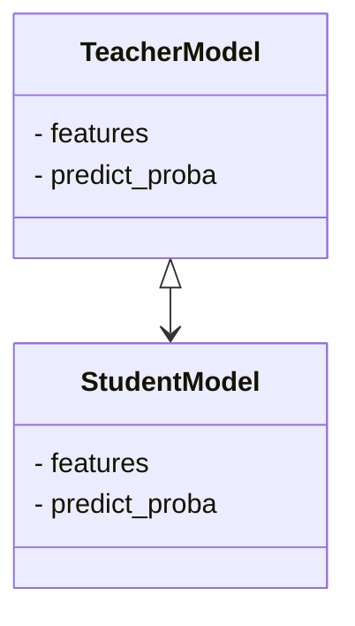
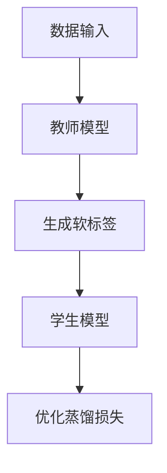

                 


# 知识蒸馏在AI Agent轻量化中的应用

---

## 关键词：知识蒸馏, AI Agent, 模型轻量化, 深度学习, 蒸馏算法, 智能代理

---

## 摘要：知识蒸馏是一种将复杂模型的知识迁移到简单模型的技术，适用于AI Agent的轻量化设计。本文详细分析知识蒸馏的原理、算法、系统架构及应用场景，结合实际案例，探讨其在AI Agent中的应用价值与实现方法。

---

## 第一章：知识蒸馏的背景与概念

### 1.1 知识蒸馏的起源与发展

#### 1.1.1 知识蒸馏的定义
知识蒸馏（Knowledge Distillation）是一种通过将复杂模型（教师模型）的知识迁移到简单模型（学生模型）的技术，旨在降低模型的复杂性和计算成本，同时保持性能。

#### 1.1.2 知识蒸馏的历史发展
- 2015年，Hinton团队提出使用蒸馏技术将大型神经网络的知识迁移到小型网络。
- 近年来，蒸馏技术在自然语言处理、计算机视觉等领域得到广泛应用。

#### 1.1.3 知识蒸馏的核心思想
通过教师模型生成的概率分布指导学生模型学习，使学生模型能够捕捉到教师模型的决策边界。

---

### 1.2 AI Agent的发展现状

#### 1.2.1 AI Agent的基本概念
AI Agent是一种能够感知环境并执行任务的智能实体，广泛应用于对话系统、推荐系统等领域。

#### 1.2.2 AI Agent的主要类型
- 基于规则的Agent
- 基于模型的Agent
- 基于机器学习的Agent

#### 1.2.3 AI Agent的应用场景
- 智能客服
- 智能音箱
- 智能推荐系统

---

### 1.3 知识蒸馏在AI Agent中的应用背景

#### 1.3.1 轻量化AI模型的重要性
- 减少计算资源消耗
- 提高部署效率
- 适用于边缘计算环境

#### 1.3.2 知识蒸馏在AI Agent中的作用
- 降低模型复杂度
- 提高推理速度
- 保持模型性能

---

## 第二章：知识蒸馏的核心概念与原理

### 2.1 知识蒸馏的过程

#### 2.1.1 教师模型与学生模型
- 教师模型：复杂的大型模型，提供指导
- 学生模型：简单的轻量级模型，接收知识

#### 2.1.2 知识蒸馏的核心步骤
1. 训练教师模型
2. 使用教师模型的输出作为学生模型的指导信号
3. 调整蒸馏温度，优化学生模型

#### 2.1.3 蒸馏过程中的关键参数
- 蒸馏温度（Temperature）
- 蒸馏损失（Distillation Loss）
- 知识蒸馏率（Knowledge Distillation Rate）

---

### 2.2 知识蒸馏的损失函数

#### 2.2.1 蒸馏损失函数的定义
蒸馏损失函数用于衡量学生模型预测与教师模型预测之间的差异。

#### 2.2.2 蒸馏损失函数的数学表达式
$$ L_{distill} = -\sum_{i}^{n} T_i \log P_i $$
其中，$T_i$是教师模型的软概率，$P_i$是学生模型的软概率。

#### 2.2.3 蒸馏损失函数的优化方法
- 调整温度参数
- 使用KL散度
- 结合交叉熵损失

---

## 第三章：知识蒸馏的算法原理

### 3.1 蒸馏算法的核心数学模型

#### 3.1.1 KL散度的数学表达
$$ KL(T \parallel P) = \sum T_i \log \frac{T_i}{P_i} $$
其中，$T_i$是教师模型的软概率，$P_i$是学生模型的软概率。

#### 3.1.2 蒸馏算法的流程
1. 训练教师模型
2. 使用教师模型输出作为软标签
3. 蒸馏学生模型，优化蒸馏损失

---

### 3.2 蒸馏算法的流程图



---

### 3.3 Python实现示例

```python
import torch
import torch.nn as nn
import torch.optim as optim

# 教师模型
class TeacherModel(nn.Module):
    def __init__(self):
        super(TeacherModel, self).__init__()
        self.fc = nn.Linear(10, 5)

    def forward(self, x):
        return torch.softmax(x, dim=-1)

# 学生模型
class StudentModel(nn.Module):
    def __init__(self):
        super(StudentModel, self).__init__()
        self.fc = nn.Linear(10, 5)

    def forward(self, x):
        return torch.softmax(x, dim=-1)

# 蒸馏训练
def distill_train(teacher, student, criterion, optimizer, epochs=100):
    for epoch in range(epochs):
        inputs, labels = get_batch()  # 假设有一个数据加载函数
        teacher_logits = teacher(inputs)
        student_logits = student(inputs)
        loss = criterion(teacher_logits, student_logits)
        optimizer.zero_grad()
        loss.backward()
        optimizer.step()
```

---

## 第四章：系统分析与架构设计方案

### 4.1 应用场景分析

#### 4.1.1 智能对话系统
知识蒸馏可用于将大型语言模型的知识迁移到轻量级对话模型，降低计算成本。

#### 4.1.2 智能推荐系统
通过蒸馏技术，将复杂的推荐模型迁移到边缘设备，提升推荐效率。

---

### 4.2 系统功能设计

#### 4.2.1 领域模型设计



---

### 4.3 系统架构设计

#### 4.3.1 系统架构图



---

## 第五章：项目实战

### 5.1 环境安装与配置

#### 5.1.1 安装依赖
```bash
pip install torch
```

#### 5.1.2 配置环境
- 确保Python版本为3.6以上
- 安装必要的深度学习库

---

### 5.2 核心代码实现

#### 5.2.1 教师模型实现

```python
class TeacherModel(nn.Module):
    def __init__(self):
        super(TeacherModel, self).__init__()
        self.fc = nn.Linear(10, 5)

    def forward(self, x):
        return torch.softmax(x, dim=-1)
```

#### 5.2.2 学生模型实现

```python
class StudentModel(nn.Module):
    def __init__(self):
        super(StudentModel, self).__init__()
        self.fc = nn.Linear(10, 5)

    def forward(self, x):
        return torch.softmax(x, dim=-1)
```

---

### 5.3 案例分析与优化

#### 5.3.1 案例分析
假设我们有一个简单的分类任务，使用知识蒸馏将教师模型的知识迁移到学生模型。

#### 5.3.2 优化建议
- 调整蒸馏温度
- 优化损失函数
- 使用动量优化器

---

## 第六章：最佳实践与小结

### 6.1 小结

知识蒸馏是一种有效的模型轻量化技术，能够显著降低模型复杂度，同时保持性能。在AI Agent的应用中，蒸馏技术可以提升模型的部署效率和计算效率。

---

### 6.2 注意事项

- 选择合适的教师模型
- 调整蒸馏温度和损失权重
- 确保数据质量和多样性

---

### 6.3 拓展阅读

- 《Deep Learning》
- 《Neural Networks and Deep Learning》
- 《Effective Deep Learning via Knowledge Distillation》

---

## 作者：AI天才研究院 & 禅与计算机程序设计艺术

---

### 结语

知识蒸馏在AI Agent的轻量化设计中具有重要价值。通过本文的详细讲解，读者可以深入了解知识蒸馏的核心原理、算法实现及应用场景，为实际项目提供参考。

