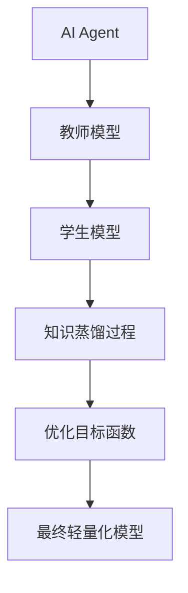

                 


# 知识蒸馏技术在AI Agent轻量化中的创新应用

## 关键词：知识蒸馏技术, AI Agent, 轻量化, 模型压缩, 人工智能

## 摘要：  
本文深入探讨了知识蒸馏技术在AI Agent轻量化中的创新应用。首先，我们介绍了知识蒸馏技术的基本概念及其在AI Agent中的重要性。接着，我们详细分析了知识蒸馏技术的核心原理，包括其数学模型和实现方法。随后，我们从系统架构设计和项目实战两个方面，展示了知识蒸馏技术在AI Agent中的具体应用。最后，我们总结了知识蒸馏技术的优势与挑战，并展望了其未来的发展方向。通过本文的阐述，读者可以全面了解知识蒸馏技术如何帮助AI Agent实现轻量化，并在实际应用中发挥重要作用。

---

## 第一部分：知识蒸馏技术与AI Agent轻量化背景

### 第1章：知识蒸馏技术概述

#### 1.1 知识蒸馏技术的基本概念  
知识蒸馏技术是一种通过将复杂模型的知识迁移到简单模型的技术，旨在在保持性能的同时减少模型的复杂度。其核心思想是将大型模型（教师模型）的知识提取出来，用于训练一个更小、更高效的模型（学生模型）。这种技术在AI Agent中具有重要意义，因为它可以帮助我们构建更轻量、更高效的AI系统，同时保持高性能。

#### 1.2 AI Agent的基本概念与分类  
AI Agent是一种能够感知环境、自主决策并执行任务的智能实体。它可以分为多种类型，包括基于规则的AI Agent、基于模型的AI Agent以及基于机器学习的AI Agent。在实际应用中，AI Agent广泛用于自动驾驶、智能助手、机器人控制等领域。然而，随着应用场景的扩展，AI Agent的复杂性和计算需求也在不断增加，这使得轻量化成为一个重要研究方向。

#### 1.3 知识蒸馏技术与AI Agent轻化的结合  
知识蒸馏技术为AI Agent的轻量化提供了新的可能性。通过将大型模型的知识迁移到轻量级模型中，我们可以显著减少AI Agent的计算资源消耗，同时保持其性能。这种技术不仅有助于提高AI Agent的运行效率，还能够降低其部署成本，使其在资源受限的环境中也能高效运行。

---

## 第二部分：知识蒸馏技术的核心原理与实现方法

### 第2章：知识蒸馏技术的核心原理

#### 2.1 知识蒸馏技术的数学模型与公式  
知识蒸馏技术的核心在于将教师模型的知识迁移到学生模型中。具体来说，教师模型通过软标签（soft label）的方式，为学生模型提供更丰富的信息。软标签是概率分布的形式，与传统的硬标签相比，它能够更好地捕捉到类别之间的相似性。

数学上，知识蒸馏技术的损失函数可以表示为：

$$
\mathcal{L} = \lambda_1 \mathcal{L}_\text{CE} + \lambda_2 \mathcal{L}_\text{KD}
$$

其中，$\mathcal{L}_\text{CE}$是交叉熵损失，$\mathcal{L}_\text{KD}$是知识蒸馏损失，$\lambda_1$和$\lambda_2$是权重系数。知识蒸馏损失的具体形式为：

$$
\mathcal{L}_\text{KD} = -\sum_{i=1}^{n} p_i \log q_i
$$

其中，$p_i$是教师模型的输出概率，$q_i$是学生模型的输出概率。

#### 2.2 知识蒸馏技术的实现方法  
知识蒸馏技术的实现主要包括以下步骤：  
1. **教师模型的训练**：首先需要训练一个性能优良的大型模型（教师模型）。  
2. **学生模型的初始化**：初始化一个轻量级的模型（学生模型）。  
3. **知识蒸馏过程**：通过优化目标函数，将教师模型的知识迁移到学生模型中。  
4. **微调与优化**：在知识蒸馏完成后，对学生模型进行微调，进一步优化其性能。  

### 第3章：知识蒸馏技术在AI Agent中的创新应用

#### 3.1 知识蒸馏技术的系统架构设计  
在AI Agent中，知识蒸馏技术可以通过以下系统架构实现：  



图1：知识蒸馏技术在AI Agent中的系统架构图  

#### 3.2 知识蒸馏技术的项目实战  

##### 3.2.1 项目环境安装与配置  
首先，我们需要安装必要的开发环境和工具。以下是一个典型的Python开发环境配置示例：  

```bash
# 安装Python和pip
# 安装相关库
pip install numpy
pip install matplotlib
pip install scikit-learn
pip install transformers
```

##### 3.2.2 知识蒸馏技术的核心代码实现  
以下是一个简单的知识蒸馏技术实现示例：  

```python
import torch
import torch.nn as nn
import torch.optim as optim

# 定义教师模型和学生模型
class TeacherModel(nn.Module):
    def __init__(self):
        super(TeacherModel, self).__init__()
        self.fc1 = nn.Linear(10, 5)
        self.fc2 = nn.Linear(5, 2)

class StudentModel(nn.Module):
    def __init__(self):
        super(StudentModel, self).__init__()
        self.fc1 = nn.Linear(10, 5)
        self.fc2 = nn.Linear(5, 2)

# 初始化模型
teacher_model = TeacherModel()
student_model = StudentModel()

# 定义损失函数和优化器
criterion = nn.CrossEntropyLoss()
optimizer = optim.SGD(student_model.parameters(), lr=0.01)

# 知识蒸馏过程
for epoch in range(100):
    for inputs, labels in dataloaders:
        # 前向传播
        outputs_teacher = teacher_model(inputs)
        outputs_student = student_model(inputs)
        
        # 计算损失
        loss_CE = criterion(outputs_student, labels)
        loss_KD = -torch.mean(torch.sum(outputs_teacher * torch.log(outputs_student), dim=1))
        loss_total = loss_CE + 0.5 * loss_KD
        
        # 反向传播与优化
        optimizer.zero_grad()
        loss_total.backward()
        optimizer.step()
```

##### 3.2.3 实际案例分析  
以下是一个实际案例分析：  
假设我们有一个图像分类任务，教师模型是一个大型卷积神经网络（CNN），而学生模型是一个轻量级的CNN。通过知识蒸馏技术，我们可以将教师模型的分类知识迁移到学生模型中。具体步骤如下：  
1. **教师模型的训练**：训练教师模型，使其在图像分类任务上达到较高精度。  
2. **学生模型的初始化**：初始化一个轻量级的CNN模型。  
3. **知识蒸馏过程**：通过优化目标函数，将教师模型的软标签迁移到学生模型中。  
4. **微调与优化**：在知识蒸馏完成后，对学生模型进行微调，进一步优化其性能。  

通过这种方式，我们可以显著减少AI Agent的计算资源消耗，同时保持其分类性能。

---

## 第三部分：总结与展望

### 第4章：总结与展望

#### 4.1 总结  
知识蒸馏技术为AI Agent的轻量化提供了新的可能性。通过将复杂模型的知识迁移到简单模型中，我们可以显著减少AI Agent的计算资源消耗，同时保持其性能。本文详细介绍了知识蒸馏技术的核心原理、实现方法及其在AI Agent中的创新应用。

#### 4.2 未来展望  
随着人工智能技术的不断发展，知识蒸馏技术将在AI Agent中发挥越来越重要的作用。未来的研究方向可能包括：  
1. **更高效的蒸馏方法**：探索更高效的蒸馏方法，进一步降低模型的复杂度。  
2. **多任务蒸馏**：研究如何在多任务场景下进行知识蒸馏，提高模型的泛化能力。  
3. **动态蒸馏**：探索动态蒸馏方法，使模型能够根据环境变化自适应地进行知识更新。  

#### 4.3 最佳实践 tips  
- 在实际应用中，建议根据具体场景选择合适的蒸馏方法。  
- 知识蒸馏技术的实现需要结合具体的任务需求，合理设计损失函数和优化目标。  
- 在模型微调阶段，可以结合数据增强等技术进一步优化模型性能。  

---

## 作者：AI天才研究院/AI Genius Institute & 禅与计算机程序设计艺术 /Zen And The Art of Computer Programming  

---

通过本文的阐述，我们深入探讨了知识蒸馏技术在AI Agent轻量化中的创新应用。希望本文能够为读者提供有价值的参考，并激发更多关于知识蒸馏技术与AI Agent结合的研究与实践。

