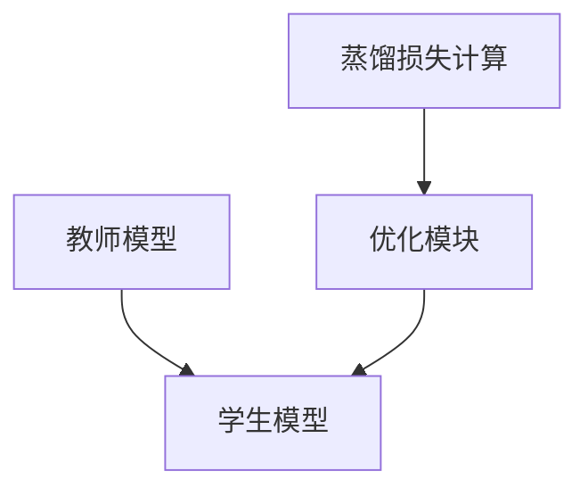
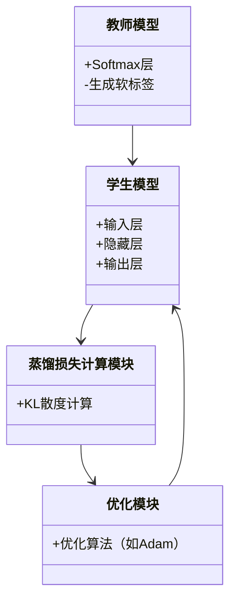

                 


# 知识蒸馏：从大模型到轻量级AI Agent

> 关键词：知识蒸馏，大模型，轻量级AI，AI Agent，模型压缩，机器学习，深度学习

> 摘要：知识蒸馏是一种通过教师模型将知识传递给学生模型的技术，旨在将大模型的知识压缩到更小、更高效的模型中，从而实现轻量级AI Agent的构建。本文将从背景、原理、算法、系统架构到实战项目，全面解析知识蒸馏的技术细节和应用实践。

---

## 第一部分: 知识蒸馏的背景与基础

### 第1章: 知识蒸馏的起源与概念

#### 1.1 问题背景与挑战

##### 1.1.1 大模型的局限性
- 计算资源消耗高：训练和推理都需要大量计算资源，难以在资源受限的环境中部署。
- 部署复杂性：模型体积大，部署在边缘设备上存在困难。
- 成本问题：训练和维护大模型的高昂成本限制了其广泛应用。

##### 1.1.2 轻量级AI的需求
- 实时性需求：在边缘计算和物联网环境中，需要快速响应。
- 资源受限环境：如手机、嵌入式设备等。
- 部署灵活性：需要在不同环境中快速部署。

##### 1.1.3 知识蒸馏的提出
- 知识蒸馏是一种将大模型的知识迁移到小模型的技术。
- 通过教师模型和学生模型的交互，实现知识的有效传递。

#### 1.2 知识蒸馏的核心概念

##### 1.2.1 教师模型与学生模型
- 教师模型：通常是一个大模型，负责提供知识。
- 学生模型：一个更小、更高效的模型，负责学习教师的知识。

##### 1.2.2 知识蒸馏的基本原理
- 通过蒸馏损失函数，将教师模型的输出特征传递给学生模型。
- 学生模型在学习过程中，不仅学习数据本身，还学习教师模型的决策过程。

##### 1.2.3 蒸馏过程中的关键问题
- 如何设计有效的蒸馏损失函数。
- 如何平衡教师模型和学生模型的特征传递。
- 如何在不同任务中应用蒸馏技术。

### 第2章: 知识蒸馏的基本原理

#### 2.1 知识蒸馏的核心思想

##### 2.1.1 知识蒸馏的定义
- 知识蒸馏是通过教师模型的软预测，引导学生模型学习更柔和的概率分布。
- 软预测通过概率分布的方式，将教师的知识传递给学生模型。

##### 2.1.2 蒸馏过程的数学模型
- 蒸馏损失函数：将教师模型和学生模型的输出之间的差距最小化。
- 蒸馏损失函数的公式：
  $$ L_{distill} = \alpha \cdot KL(p_t||p_s) $$
  其中，$\alpha$ 是蒸馏系数，$p_t$ 是教师模型的输出概率分布，$p_s$ 是学生模型的输出概率分布。

##### 2.1.3 蒸馏与传统模型压缩的区别
- 传统模型压缩：通过剪枝、量化等方法直接压缩模型参数。
- 知识蒸馏：通过知识传递的方式，间接压缩模型，同时保留模型的性能。

#### 2.2 知识蒸馏的关键步骤

##### 2.2.1 教师模型的构建
- 选择一个已经训练好的大模型作为教师模型。
- 教师模型通常具有较高的准确性和丰富的特征表示能力。

##### 2.2.2 学生模型的选择
- 学生模型通常是一个小模型，如小型神经网络或轻量级模型。
- 学生模型的设计需要与教师模型的特征维度相匹配。

##### 2.2.3 蒸馏损失函数的设计
- 设计有效的蒸馏损失函数，确保学生模型能够有效学习教师模型的知识。
- 蒸馏损失函数需要平衡分类损失和蒸馏损失，例如：
  $$ L = L_{class} + \alpha \cdot L_{distill} $$

### 第3章: 知识蒸馏的核心算法与数学模型

#### 3.1 蒸馏损失函数的数学推导

##### 3.1.1 KL散度的定义与公式
- KL散度衡量两个概率分布之间的差异：
  $$ KL(p||q) = \sum p_i \log \frac{p_i}{q_i} $$

##### 3.1.2 蒸馏损失的构建
- 蒸馏损失函数通过KL散度衡量教师模型和学生模型输出概率分布的差异。
- 蒸馏损失的公式：
  $$ L_{distill} = \alpha \cdot KL(p_t||p_s) $$

#### 3.2 蒸馏过程的算法流程

##### 3.2.1 软蒸馏
- 教师模型输出概率分布，学生模型通过最小化KL散度损失进行优化。

##### 3.2.2 硬蒸馏
- 教师模型输出类别标签，学生模型通过交叉熵损失进行优化。

##### 3.2.3 对比学习蒸馏
- 通过对比学习的方式，将教师模型的特征表示传递给学生模型。

### 第4章: 知识蒸馏与其他模型压缩技术的对比

#### 4.1 模型压缩技术的分类

##### 4.1.1 参数剪枝
- 通过剪枝算法移除冗余的模型参数，减少模型体积。

##### 4.1.2 知识蒸馏
- 通过知识传递的方式，压缩模型体积，同时保持模型性能。

##### 4.1.3 知识迁移
- 通过迁移学习的方式，将教师模型的知识传递给学生模型。

#### 4.2 蒸馏与传统压缩技术的对比

##### 4.2.1 技术特点对比
| 技术 | 参数剪枝 | 知识蒸馏 | 知识迁移 |
|------|----------|----------|----------|
| 核心思想 | 剪枝冗余参数 | 传递概率分布 | 迁移特征表示 |
| 优点 | 模型体积小 | 性能较好 | 跨任务迁移 |
| 缺点 | 易损失性能 | 需教师模型 | 需大量数据 |

##### 4.2.2 优缺点分析
- 参数剪枝：优点是模型体积小，缺点是可能损失部分性能。
- 知识蒸馏：优点是性能较好，缺点是需要教师模型。
- 知识迁移：优点是跨任务迁移，缺点是需要大量数据。

##### 4.2.3 适用场景对比
- 参数剪枝适用于对模型体积要求极高，但对性能要求较低的场景。
- 知识蒸馏适用于需要保持较高性能，同时希望减少模型体积的场景。
- 知识迁移适用于需要跨任务迁移，但数据量较大的场景。

---

## 第二部分: 知识蒸馏的系统与架构设计

### 第5章: 知识蒸馏的系统架构设计

#### 5.1 系统功能设计

##### 5.1.1 系统目标
- 实现知识蒸馏技术，将大模型的知识迁移到小模型中。
- 构建轻量级AI Agent，能够在资源受限的环境中运行。

##### 5.1.2 系统模块划分
- 教师模型模块：负责提供知识。
- 学生模型模块：负责学习知识。
- 蒸馏损失计算模块：负责计算蒸馏损失。
- 优化模块：负责优化学生模型。

##### 5.1.3 系统功能流程图


#### 5.2 系统架构设计

##### 5.2.1 分层架构设计
- 教师模型层：负责生成软标签。
- 学生模型层：负责学习软标签。
- 蒸馏损失计算层：负责计算蒸馏损失。
- 优化层：负责优化学生模型。

##### 5.2.2 模块之间的交互关系
- 教师模型生成软标签，传递给学生模型。
- 学生模型生成概率分布，传递给蒸馏损失计算模块。
- 蒸馏损失计算模块计算损失，传递给优化模块。
- 优化模块优化学生模型参数，形成新的概率分布。

##### 5.2.3 系统的可扩展性设计
- 支持多种教师模型和学生模型的组合。
- 支持多种蒸馏损失函数的设计。
- 支持多种优化算法的实现。

#### 5.3 系统实现

##### 5.3.1 系统功能模块实现
- 教师模型实现：加载预训练的大模型。
- 学生模型实现：定义小模型的结构。
- 蒸馏损失计算实现：计算KL散度。
- 优化模块实现：优化学生模型的参数。

##### 5.3.2 系统架构实现


### 第6章: 知识蒸馏的系统实现

#### 6.1 系统环境安装

##### 6.1.1 环境要求
- Python 3.6+
- PyTorch 1.5+
- CUDA 10+

##### 6.1.2 安装依赖
```bash
pip install torch
pip install matplotlib
pip install seaborn
```

#### 6.2 系统核心实现源代码

##### 6.2.1 教师模型实现
```python
import torch
import torch.nn as nn
import torch.optim as optim

class TeacherModel(nn.Module):
    def __init__(self, input_size, hidden_size, output_size):
        super(TeacherModel, self).__init__()
        self.softmax = nn.Softmax(dim=1)
        self.fc1 = nn.Linear(input_size, hidden_size)
        self.fc2 = nn.Linear(hidden_size, output_size)
    
    def forward(self, x):
        x = self.fc1(x)
        x = self.fc2(x)
        x = self.softmax(x)
        return x
```

##### 6.2.2 学生模型实现
```python
class StudentModel(nn.Module):
    def __init__(self, input_size, hidden_size, output_size):
        super(StudentModel, self).__init__()
        self.fc1 = nn.Linear(input_size, hidden_size)
        self.fc2 = nn.Linear(hidden_size, output_size)
    
    def forward(self, x):
        x = self.fc1(x)
        x = self.fc2(x)
        return x
```

##### 6.2.3 蒸馏损失计算
```python
def distillation_loss(teacher_output, student_output, alpha=0.5, T=3):
    teacher_output = teacher_output / T
    student_output = student_output / T
    loss_fn = nn.KLDivLoss(reduction='batchmean')
    loss = loss_fn(torch.log(student_output), teacher_output)
    return alpha * loss
```

##### 6.2.4 优化模块实现
```python
def train_student_model(student_model, teacher_model, optimizer, train_loader, epochs=100):
    for epoch in range(epochs):
        for inputs, labels in train_loader:
            student_outputs = student_model(inputs)
            with torch.no_grad():
                teacher_outputs = teacher_model(inputs)
            loss = distillation_loss(teacher_outputs, student_outputs)
            optimizer.zero_grad()
            loss.backward()
            optimizer.step()
    return student_model
```

#### 6.3 代码实现解读

##### 6.3.1 教师模型解读
- 教师模型是一个简单的前馈神经网络，包含两个全连接层和一个Softmax层。
- 教师模型通过Softmax层生成概率分布，作为学生的参考。

##### 6.3.2 学生模型解读
- 学生模型也是一个简单的前馈神经网络，包含两个全连接层。
- 学生模型通过学习教师模型生成的概率分布，进行知识蒸馏。

##### 6.3.3 蒸馏损失计算解读
- 使用KL散度损失函数，衡量教师模型和学生模型输出概率分布之间的差异。
- 蒸馏系数alpha控制蒸馏损失和分类损失的权重。
- 温度T控制软标签的软化程度。

##### 6.3.4 优化模块解读
- 使用Adam优化器，优化学生模型的参数。
- 在每个epoch中，学生模型向前传播，计算蒸馏损失，反向传播，更新参数。

#### 6.4 实际案例分析与详细讲解

##### 6.4.1 实验环境
- 训练数据集：MNIST手写数字识别数据集。
- 教师模型：LeNet-5。
- 学生模型：小型前馈神经网络。

##### 6.4.2 实验结果
- 学生模型在蒸馏过程中的训练损失和验证准确率的变化。
- 对比蒸馏前后的学生模型性能。

##### 6.4.3 实验分析
- 蒸馏过程能够有效提升学生模型的性能。
- 蒸馏系数alpha和温度T对蒸馏效果有重要影响。

#### 6.5 项目小结
- 知识蒸馏是一种有效的模型压缩技术。
- 通过蒸馏，可以在保持较高性能的同时，显著降低模型体积。
- 蒸馏技术在实际应用中具有广泛的应用前景。

---

## 第三部分: 总结与展望

### 第7章: 知识蒸馏的应用与挑战

#### 7.1 知识蒸馏的应用场景
- 轻量级AI Agent的构建。
- 边缘计算中的模型部署。
- 物联网环境中的实时推理。

#### 7.2 知识蒸馏的优缺点
- 优点：模型体积小，性能较好，易于部署。
- 缺点：依赖教师模型，计算资源消耗较高。

#### 7.3 知识蒸馏的挑战
- 如何进一步降低蒸馏过程的计算资源消耗。
- 如何提升蒸馏技术的通用性和可扩展性。
- 如何解决多任务学习中的知识传递问题。

### 第8章: 知识蒸馏的未来展望

#### 8.1 未来研究方向
- 跨任务知识蒸馏：研究如何在多任务学习中实现知识蒸馏。
- 跨模态知识蒸馏：研究如何在不同模态之间实现知识传递。
- 自适应蒸馏：研究如何根据任务需求自适应地调整蒸馏参数。

#### 8.2 知识蒸馏的未来趋势
- 知识蒸馏技术将更加通用化，能够适应更多的应用场景。
- 蒸馏技术将更加智能化，能够自适应地调整蒸馏参数。
- 蒸馏技术将与其它模型压缩技术结合，形成更加高效的模型压缩方法。

---

## 作者：AI天才研究院/AI Genius Institute & 禅与计算机程序设计艺术 /Zen And The Art of Computer Programming

---

**小结：** 通过本文的详细讲解，我们了解了知识蒸馏技术的核心思想、算法原理、系统架构和实际应用。知识蒸馏是一种有效的模型压缩技术，能够将大模型的知识迁移到小模型中，从而实现轻量级AI Agent的构建。未来，随着技术的不断发展，知识蒸馏将在更多领域得到广泛应用。

