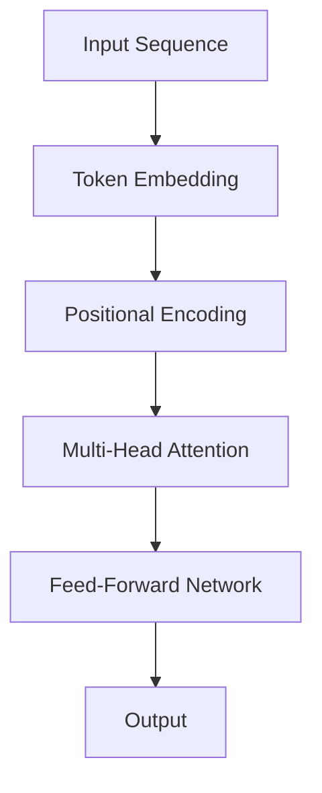
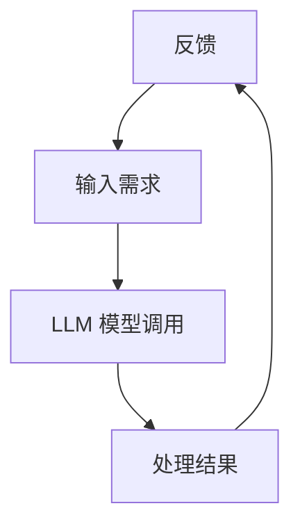
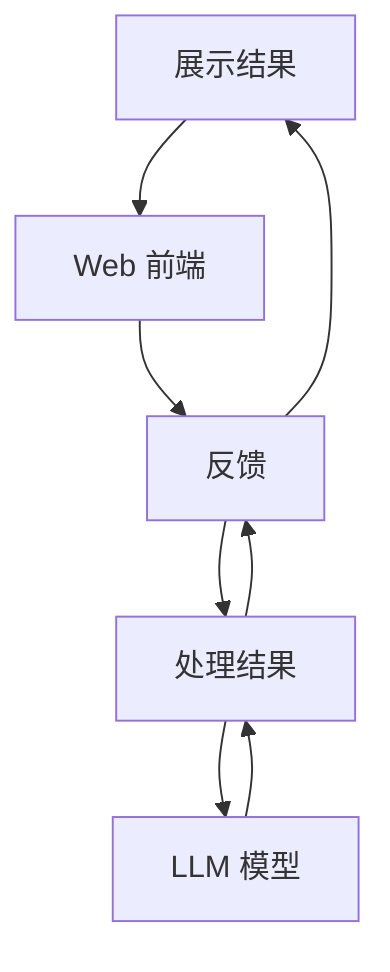

                 


# 研发助手 AI Agent：LLM 在科研过程中的辅助作用

## 关键词：AI Agent, LLM, 科研, 人工智能, 自然语言处理, 科研辅助

## 摘要：  
随着人工智能技术的快速发展，大语言模型（LLM）在科研过程中的应用越来越广泛。本文详细探讨了AI Agent作为研发助手在科研中的辅助作用，涵盖了LLM的核心原理、应用场景、系统架构设计以及项目实战等内容。通过分析LLM在文献分析、论文写作、数据分析等科研环节中的具体应用，本文展示了AI Agent如何提升科研效率和质量。同时，本文还提供了系统的架构设计和实现方案，帮助读者更好地理解和应用AI Agent技术。

---

# 第一章: AI Agent 与 LLM 的基本概念

## 1.1 AI Agent 的定义与特点

### 1.1.1 AI Agent 的定义  
AI Agent（人工智能代理）是指能够感知环境并采取行动以实现目标的智能实体。它可以是一个软件程序、一个机器人，或者任何能够与环境交互的智能系统。AI Agent的核心目标是通过自动化的方式帮助用户完成任务或提供决策支持。

### 1.1.2 AI Agent 的核心特点  
AI Agent 具有以下特点：  
1. **自主性**：能够在没有人工干预的情况下独立运行。  
2. **反应性**：能够实时感知环境并做出相应的反应。  
3. **目标导向**：所有行为都以实现特定目标为导向。  
4. **学习能力**：能够通过数据和经验不断优化自身性能。  

### 1.1.3 AI Agent 的类型与应用场景  
AI Agent 可以分为以下几类：  
- **简单反射型代理**：基于预设规则做出反应，适用于简单的任务（如自动回复邮件）。  
- **基于模型的反射型代理**：基于内部模型理解和预测环境变化，适用于复杂任务（如自动驾驶）。  
- **目标驱动型代理**：以明确的目标为导向，适用于科研中的数据分析和论文写作。  

---

## 1.2 大语言模型（LLM）的基本概念

### 1.2.1 什么是大语言模型  
大语言模型（Large Language Model，LLM）是一种基于深度学习的自然语言处理模型，通常基于Transformer架构。LLM 通过大量语料库的训练，能够理解并生成人类语言文本。  

### 1.2.2 LLM 的主要特点  
1. **大规模训练数据**：通常使用数十亿级别的数据进行训练，能够覆盖广泛的语言模式。  
2. **上下文理解能力**：通过注意力机制，能够理解文本的上下文关系。  
3. **多任务处理能力**：能够完成多种自然语言处理任务，如文本生成、翻译、问答等。  

### 1.2.3 LLM 的发展历史与现状  
- **发展历史**：从早期的简单语言模型（如n-gram模型）到现代的Transformer模型，LLM经历了多次技术革新。  
- **现状**：当前主流的LLM包括GPT系列、BERT系列等，广泛应用于各个领域。  

---

## 1.3 AI Agent 在科研中的作用

### 1.3.1 科研过程中的关键问题  
科研过程中存在以下关键问题：  
1. **文献检索与分析**：科研人员需要快速找到相关文献并进行分析。  
2. **论文写作与优化**：论文写作耗时且需要不断优化。  
3. **数据分析与建模**：数据分析过程复杂且需要高效的工具支持。  

### 1.3.2 AI Agent 如何解决这些问题  
AI Agent 可以通过以下方式帮助解决科研中的问题：  
1. **自动化文献检索**：基于关键词和上下文理解，快速检索相关文献。  
2. **论文生成与优化**：通过自然语言生成技术，帮助撰写论文并优化语言表达。  
3. **数据分析与建模**：利用AI代理的计算能力，快速完成数据分析和建模任务。  

### 1.3.3 AI Agent 在科研中的具体应用场景  
- **文献分析**：快速筛选文献并生成综述。  
- **论文写作**：辅助撰写论文并提供建议。  
- **数据分析**：协助进行数据清洗、建模和可视化。  

---

## 1.4 本章小结  
本章介绍了AI Agent 和 LLM 的基本概念，并重点阐述了AI Agent 在科研中的作用及其应用场景。AI Agent 作为一种智能化的代理，能够显著提升科研效率，是未来科研的重要辅助工具。

---

# 第二章: LLM 的模型结构与训练原理

## 2.1 模型结构

### 2.1.1 基于 Transformer 的架构  
Transformer模型由编码器和解码器两部分组成，其核心思想是将序列转化为全局关系。编码器负责将输入序列转化为高维向量，解码器则根据编码器输出生成目标序列。  



### 2.1.2 注意力机制的原理  
注意力机制通过计算输入序列中每个词与其他词的相关性，确定每个词的重要性。其数学公式如下：  

$$ \text{Attention}(Q, K, V) = \text{softmax}\left(\frac{QK^T}{\sqrt{d_k}}\right)V $$  

其中，$Q$ 是查询向量，$K$ 是键向量，$V$ 是值向量，$d_k$ 是向量的维度。  

### 2.1.3 模型的训练目标与损失函数  
LLM 的训练目标是最小化预测与真实值之间的差异。常用的损失函数是交叉熵损失：  

$$ \text{损失函数} = -\sum_{i=1}^{n} \log P(x_i | x_{<i}) $$  

---

## 2.2 LLM 的训练过程

### 2.2.1 数据预处理与输入  
训练LLM需要大量的语料库数据，通常需要进行分词、去除停用词等预处理步骤。  

### 2.2.2 梯度下降与优化算法  
常用的优化算法包括随机梯度下降（SGD）和Adam优化器。Adam优化器的数学公式如下：  

$$ \text{Adam}(\theta) = \theta - \eta \frac{\beta_1 g_t + (1-\beta_1)g_t}{1-\beta_2^t} $$  

其中，$\theta$ 是参数，$\eta$ 是学习率，$\beta_1$ 和 $\beta_2$ 是动量参数，$g_t$ 是梯度。  

### 2.2.3 并行训练与分布式计算  
为了加快训练速度，可以采用并行计算和分布式训练技术，如多GPU并行和模型并行。  

---

## 2.3 模型的推理过程

### 2.3.1 解码策略  
常用的解码策略包括贪心解码和蒙特卡洛采样。贪心解码选择概率最高的词，蒙特卡洛采样则通过随机采样生成多种可能的结果。  

### 2.3.2 采样方法  
- **贪心采样**：选择概率最高的词生成结果。  
- **Top-k 采样**：随机选择概率最高的k个词中的一个。  
- **温度采样**：通过调整温度参数控制生成结果的多样性。  

### 2.3.3 动态调整机制  
动态调整机制可以根据输入内容自动调整生成策略，例如在生成技术性文本时提高准确性，在生成创造性文本时增加多样性。  

---

## 2.4 本章小结  
本章详细介绍了LLM的模型结构和训练原理，包括基于Transformer的架构、注意力机制、训练目标与损失函数，以及推理过程中的解码策略和采样方法。这些内容为后续章节的应用奠定了基础。

---

# 第三章: AI Agent 在文献分析中的应用

## 3.1 文献检索与筛选

### 3.1.1 自动化的文献检索  
AI Agent 可以根据用户提供的关键词自动检索相关文献，并通过自然语言处理技术对文献进行分类和筛选。  

### 3.1.2 文献筛选与分类  
通过主题模型（如LDA）对文献进行主题分类，帮助用户快速找到感兴趣的内容。  

### 3.1.3 关键词提取与主题分析  
利用关键词提取算法（如TF-IDF）提取文献中的关键词，并生成主题分析报告。  

---

## 3.2 文献综述的自动生成

### 3.2.1 文献摘要的生成  
AI Agent 可以根据文献内容自动生成摘要，帮助用户快速了解文献的核心内容。  

### 3.2.2 文献结构的分析  
通过自然语言处理技术分析文献的结构，例如提取引言、方法、结果和结论部分。  

### 3.2.3 综述内容的自动生成  
基于文献分析结果，AI Agent 可以自动生成文献综述，包括研究现状、研究空白和未来研究方向。  

---

## 3.3 知识图谱的构建与可视化

### 3.3.1 知识图谱的构建方法  
通过实体识别、关系抽取和知识融合技术构建领域知识图谱。  

### 3.3.2 图谱的可视化展示  
使用图数据库（如Neo4j）和可视化工具（如Gephi）展示知识图谱的结构。  

### 3.3.3 图谱的动态更新与维护  
根据最新文献不断更新知识图谱，确保图谱内容的时效性。  

---

## 3.4 本章小结  
本章详细探讨了AI Agent 在文献分析中的应用，包括文献检索与筛选、文献综述的自动生成以及知识图谱的构建与可视化。这些技术能够显著提升科研人员的文献处理效率。

---

# 第四章: AI Agent 系统的架构设计

## 4.1 系统功能模块划分

### 4.1.1 用户交互模块  
用户通过图形界面与AI Agent 进行交互，输入需求并获取结果。  

### 4.1.2 模型调用模块  
负责调用LLM模型进行文本生成和分析任务。  

### 4.1.3 数据处理模块  
对输入数据进行预处理和后处理，确保数据的完整性和准确性。  

### 4.1.4 结果展示模块  
将分析结果以可视化形式展示给用户。  

---

## 4.2 系统架构设计

### 4.2.1 系统功能设计  
- 用户输入需求  
- 系统调用LLM模型进行处理  
- 处理结果反馈给用户  



### 4.2.2 系统架构图  


### 4.2.3 接口设计  
- 用户端接口：用于接收用户输入和展示结果。  
- 模型调用接口：用于与LLM模型进行交互。  

### 4.2.4 交互流程  
用户通过Web前端输入需求，系统调用LLM模型处理后将结果反馈给用户。  

---

## 4.3 本章小结  
本章详细设计了AI Agent 系统的架构，包括功能模块划分、系统架构图和交互流程。这些设计为后续的项目实现奠定了基础。

---

# 第五章: 项目实战

## 5.1 环境安装与配置

### 5.1.1 安装 Python 环境  
使用虚拟环境管理工具（如venv）安装Python环境，并安装必要的库（如transformers、torch、fastapi）。  

### 5.1.2 安装 LLM 模型  
安装预训练的LLM模型，例如使用Hugging Face提供的模型。  

### 5.1.3 配置开发环境  
配置IDE（如PyCharm）并安装必要的插件。  

---

## 5.2 系统核心实现

### 5.2.1 LLM 模型的调用  
使用Hugging Face的transformers库调用GPT模型生成文本。  

```python
from transformers import GPT2LMHeadModel, GPT2Tokenizer

tokenizer = GPT2Tokenizer.from_pretrained('gpt2')
model = GPT2LMHeadModel.from_pretrained('gpt2')

input_text = "研究论文的引言部分应该包含哪些内容？"
inputs = tokenizer.encode(input_text, return_tensors='np')
outputs = model.generate(inputs, max_length=100, temperature=0.7)
print(tokenizer.decode(outputs[0], skip_special_tokens=True))
```

### 5.2.2 文献分析功能的实现  
使用自然语言处理库（如spaCy）进行文献分析和关键词提取。  

```python
import spacy

nlp = spacy.load("en_core_web_sm")
doc = nlp("This is a sample text for document analysis.")
for token in doc:
    print(token.text, token.pos_, token.dep_)
```

---

## 5.3 实际案例分析

### 5.3.1 案例背景  
假设我们需要撰写一篇关于机器学习的论文，AI Agent 可以帮助我们生成引言和文献综述。  

### 5.3.2 系统实现  
1. 用户输入关键词“机器学习”。  
2. 系统检索相关文献并生成文献综述。  
3. 用户根据生成的内容进一步优化论文。  

---

## 5.4 本章小结  
本章通过项目实战展示了AI Agent 系统的核心实现，包括环境配置、模型调用和文献分析功能的实现。通过实际案例分析，验证了系统的实用性和有效性。

---

# 附录

## 附录 A: 术语表  
- AI Agent：人工智能代理。  
- LLM：大语言模型。  
- Transformer：一种基于注意力机制的深度学习模型。  

## 附录 B: 工具安装指南  
- Python 安装：使用官方安装包（https://www.python.org/）。  
- transformers 库安装：`pip install transformers`。  

## 附录 C: 参考文献  
1. Vaswani, A., et al. "Attention Is All You Need." arXiv preprint arXiv:1706.03798 (2017).  
2. Brown, T., et al. "Language Models Have Extractive Reasoning." arXiv preprint arXiv:2005.14168 (2020).  

---

# 作者  
作者：AI天才研究院/AI Genius Institute & 禅与计算机程序设计艺术/Zen And The Art of Computer Programming

