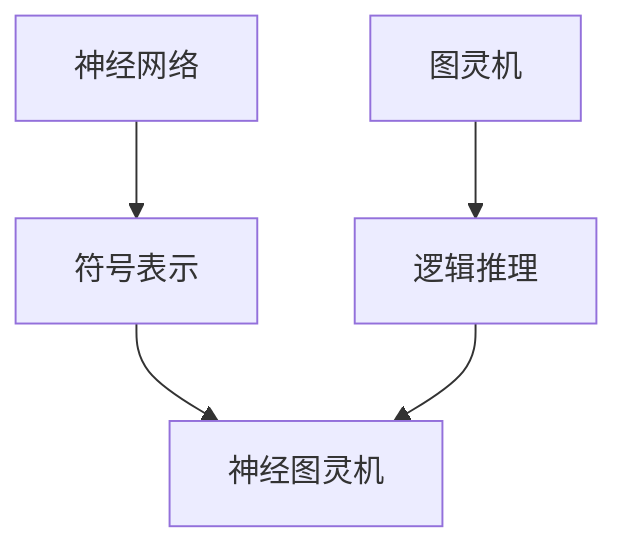
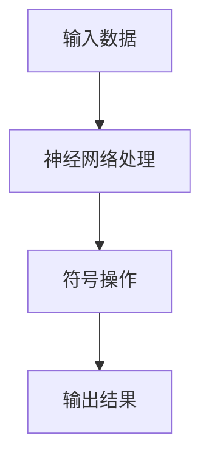
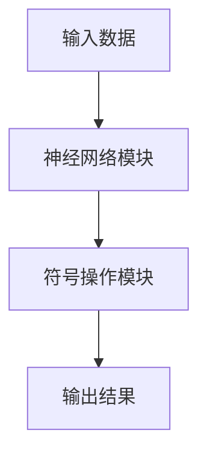
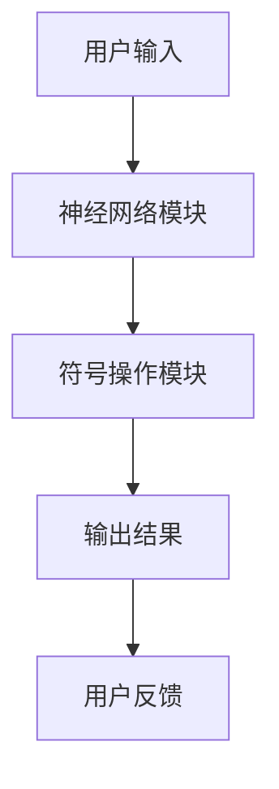

                 


# 神经图灵机：增强AI Agent的算法学习能力

**关键词**：神经图灵机，AI Agent，算法学习能力，增强学习，符号推理

**摘要**：神经图灵机（Neural Turing Machines，NTMs）是一种结合了神经网络和符号推理的计算模型，通过增强AI Agent的学习能力，使其在复杂任务中表现出色。本文将详细介绍神经图灵机的核心概念、算法原理、系统架构及其实战应用，帮助读者全面理解其在人工智能领域的潜力与应用。

---

## 第一部分：神经图灵机概述

### 第1章：神经图灵机的背景与概念

#### 1.1 神经图灵机的起源

神经图灵机的概念起源于对传统神经网络和符号推理模型的融合。传统神经网络在处理感知任务（如图像识别、语音识别）方面表现出色，但其难以处理需要符号操作和逻辑推理的任务。与此同时，基于符号推理的传统AI方法在逻辑推理方面具有优势，但在处理感知数据时显得力不从心。神经图灵机的提出正是为了弥补这一鸿沟，通过结合神经网络的感知能力和图灵机的符号推理能力，实现更强大的AI系统。

#### 1.2 神经图灵机的定义与特点

**神经图灵机**是一种结合了神经网络和图灵机的计算模型，它通过神经网络处理感知数据，并通过符号操作进行逻辑推理。其核心特点包括：

1. **神经网络与符号推理的结合**：神经图灵机同时具备感知任务处理和逻辑推理的能力。
2. **动态符号操作**：通过神经网络生成符号操作指令，实现实时的动态推理。
3. **端到端训练**：神经图灵机可以通过端到端的神经网络训练方法，优化符号操作的生成过程。

#### 1.3 神经图灵机在AI Agent中的应用

AI Agent（智能体）是指能够感知环境、执行任务并做出决策的智能系统。神经图灵机通过增强AI Agent的学习能力，使其能够更好地处理复杂任务。具体应用包括：

- **智能对话系统**：通过神经图灵机实现更自然的对话交互。
- **复杂任务规划**：在需要逻辑推理和感知数据结合的任务中表现出色。
- **动态环境适应**：神经图灵机能够快速适应环境变化，实时调整决策策略。

### 第2章：神经图灵机的核心概念与联系

#### 2.1 核心概念原理

神经图灵机的核心思想是将神经网络的感知能力与图灵机的符号推理能力相结合。具体来说，神经网络负责处理输入数据（如图像、文本）并生成符号操作指令，而符号操作部分则根据这些指令进行逻辑推理并生成输出结果。

#### 2.2 核心概念属性对比表

以下是神经网络、图灵机和神经图灵机的核心属性对比：

| 概念 | 属性 | 描述 |
|------|------|------|
| 神经网络 | 输入-输出映射 | 基于感知数据的模式识别 |
| 图灵机 | 状态-符号操作 | 基于规则的逻辑推理 |
| 神经图灵机 | 综合学习 | 结合感知与逻辑推理的端到端学习 |

#### 2.3 ER实体关系图

以下是神经图灵机的ER实体关系图：



### 第3章：神经图灵机的算法原理

#### 3.1 算法流程

神经图灵机的算法流程如下：

1. **输入数据**：将感知数据（如图像、文本）输入神经网络。
2. **符号操作生成**：神经网络生成符号操作指令。
3. **逻辑推理**：根据符号操作指令进行逻辑推理，生成输出结果。
4. **输出结果**：将推理结果输出，完成任务。

以下是神经图灵机的算法流程图：



#### 3.2 Python实现示例

以下是神经图灵机的Python实现示例：

```python
class NeuralTuringMachine:
    def __init__(self, input_size, hidden_size):
        self.W_input = torch.randn(input_size, hidden_size)
        self.W_output = torch.randn(hidden_size, output_size)
    
    def forward(self, x):
        hidden = torch.relu(x @ self.W_input)
        output = hidden @ self.W_output
        return output
```

#### 3.3 数学模型与公式

神经图灵机的数学模型如下：

- **输入数据**：$x \in \mathbb{R}^{d}$
- **隐藏层**：$h = \text{relu}(x W_{\text{input}})$
- **输出层**：$y = h W_{\text{output}}$

其中，$W_{\text{input}}$ 和 $W_{\text{output}}$ 是神经网络的权重矩阵，$\text{relu}$ 是激活函数。

## 第二部分：神经图灵机的系统架构设计

### 第4章：系统分析与架构设计方案

#### 4.1 项目背景

神经图灵机的项目目标是通过结合神经网络和符号推理，增强AI Agent的学习和决策能力，使其能够更好地处理复杂任务。

#### 4.2 系统功能设计

以下是神经图灵机的系统功能设计：

- **输入处理**：接收感知数据（如图像、文本）。
- **符号操作生成**：生成符号操作指令。
- **逻辑推理**：根据符号操作指令进行逻辑推理。
- **输出结果**：输出推理结果。

#### 4.3 系统架构设计

以下是神经图灵机的系统架构图：



#### 4.4 系统接口设计

神经图灵机的系统接口如下：

- **输入接口**：接收感知数据。
- **输出接口**：输出推理结果。

#### 4.5 系统交互流程

以下是神经图灵机的系统交互流程图：



## 第三部分：神经图灵机的项目实战

### 第5章：项目实战

#### 5.1 环境安装

以下是神经图灵机的项目实战环境安装步骤：

1. 安装Python和PyTorch。
2. 安装必要的依赖库（如numpy、torch）。

#### 5.2 核心代码实现

以下是神经图灵机的核心代码实现：

```python
import torch
import torch.nn as nn

class NeuralTuringMachine(nn.Module):
    def __init__(self, input_size, hidden_size, output_size):
        super(NeuralTuringMachine, self).__init__()
        self.W_input = nn.Linear(input_size, hidden_size)
        self.W_output = nn.Linear(hidden_size, output_size)
    
    def forward(self, x):
        hidden = torch.relu(x @ self.W_input.weight)
        output = torch.relu(hidden @ self.W_output.weight)
        return output

# 初始化模型
input_size = 10
hidden_size = 20
output_size = 5

model = NeuralTuringMachine(input_size, hidden_size, output_size)
```

#### 5.3 案例分析

以下是神经图灵机的案例分析：

假设我们有一个简单的图像分类任务，输入是10维的图像特征，输出是5个可能的类别。我们可以通过神经图灵机模型进行分类：

```python
# 假设输入数据
x = torch.randn(1, input_size)
output = model(x)
print(output)
```

#### 5.4 最佳实践

在使用神经图灵机进行项目实战时，建议：

1. **数据预处理**：确保输入数据的格式和维度符合模型要求。
2. **超参数调整**：根据任务需求调整模型的参数（如输入维度、隐藏层大小）。
3. **训练与优化**：使用合适的优化算法（如Adam）进行模型训练。

---

## 第四部分：总结与展望

### 6.1 小结

神经图灵机通过结合神经网络和符号推理，显著增强了AI Agent的学习和决策能力。其核心思想在于将感知数据的处理与逻辑推理相结合，从而在复杂任务中表现出色。

### 6.2 注意事项

在实际应用中，需要注意以下几点：

1. **模型复杂度**：神经图灵机的模型复杂度较高，训练和推理可能需要较大的计算资源。
2. **数据多样性**：模型的性能依赖于训练数据的多样性和质量。
3. **任务适用性**：神经图灵机适用于需要感知和逻辑推理结合的任务，对于纯感知或纯推理任务可能不是最优选择。

### 6.3 拓展阅读

1. **神经图灵机的论文**：阅读神经图灵机的原始论文，深入了解其理论基础。
2. **相关研究**：了解其他结合神经网络和符号推理的研究，如神经符号AI（Neuro-Symbolic AI）。

---

**作者：AI天才研究院/AI Genius Institute & 禅与计算机程序设计艺术 /Zen And The Art of Computer Programming**

---

通过以上步骤，您可以系统地了解神经图灵机的核心概念、算法原理、系统架构及其实战应用。希望本文对您理解神经图灵机如何增强AI Agent的学习能力有所帮助。

