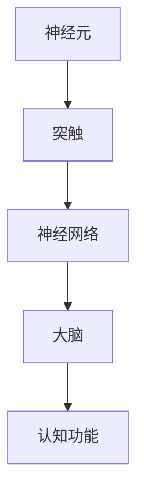
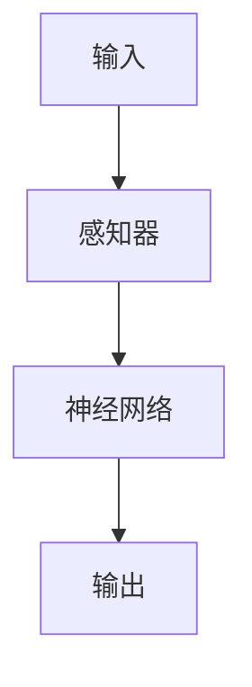
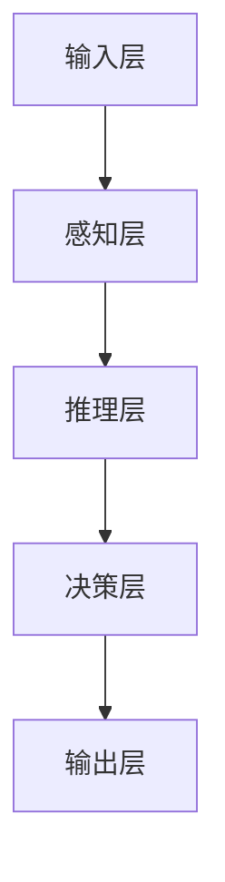
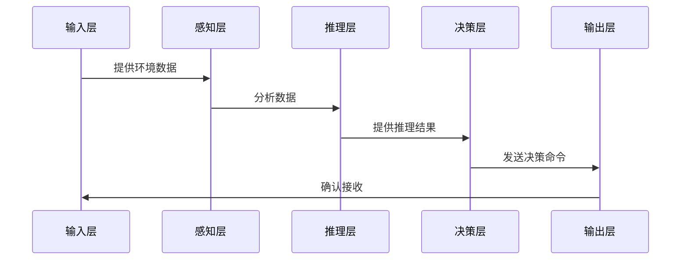

                 


# 神经科学启发的AI Agent认知模型设计

## 关键词：
- 神经科学
- AI Agent
- 认知模型
- 系统架构
- 项目实战

## 摘要：
本文探讨了神经科学如何启发AI Agent的认知模型设计，从神经元的基本结构到AI Agent的核心功能，结合实际案例分析，展示了如何通过神经科学原理构建高效的AI系统。文章详细讲解了算法原理、系统架构，并提供了具体的项目实现和代码示例。

---

# 神经科学启发的AI Agent认知模型设计

## 第1章 神经科学与AI Agent概述

### 1.1 神经科学的基本概念

#### 1.1.1 神经元的结构与功能
神经元是神经系统的基本单位，由树突、胞体和轴突组成。树突接收信号，胞体处理信息，轴突传递信号。神经元通过电化学信号传递信息，包括动作电位和突触传递。

#### 1.1.2 神经网络的工作原理
神经网络由大量神经元连接而成，通过层次结构处理信息。输入层接收数据，隐藏层进行处理，输出层产生结果。神经网络的学习通过调整权重实现。

#### 1.1.3 大脑的认知机制
大脑通过记忆、注意力和决策等机制处理信息。记忆存储信息，注意力选择相关信息，决策基于这些信息做出选择。

### 1.2 AI Agent的基本概念

#### 1.2.1 AI Agent的定义与类型
AI Agent是能够感知环境并采取行动的智能体。类型包括基于规则的简单反射型、基于模型的复杂推理型等。

#### 1.2.2 AI Agent的核心功能
AI Agent具备感知、记忆、推理和决策功能，能够在复杂环境中自主行动。

#### 1.2.3 神经科学与AI Agent的结合
神经科学提供了AI Agent设计的生物基础，如记忆和决策机制的模拟。

### 1.3 本章小结
本章介绍了神经科学的基本概念和AI Agent的核心功能，强调了两者的结合对认知模型设计的重要性。

---

## 第2章 神经科学基础

### 2.1 神经元的结构与功能

#### 2.1.1 神经元的组成部分
神经元由树突、胞体和轴突组成，负责接收、处理和传递信号。

#### 2.1.2 神经元的电生理活动
神经元通过动作电位传递信号，由静息电位、去极化、峰值和复极化组成。

#### 2.1.3 神经元的信息传递机制
神经元通过轴突-树突突触传递信息，释放神经递质并传递信号。

### 2.2 神经网络的结构与功能

#### 2.2.1 突触的形成与作用
突触由轴突末端、树突或胞体膜组成，负责传递信号。

#### 2.2.2 神经网络的层次结构
神经网络分为输入层、隐藏层和输出层，各层负责不同的信息处理。

#### 2.2.3 神经网络的学习机制
通过调整突触权重实现学习，常用反向传播算法优化权重。

### 2.3 大脑的认知机制

#### 2.3.1 记忆的形成与存储
记忆通过海马体和杏仁核处理，长期记忆存储在皮层。

#### 2.3.2 注意的分配与控制
注意力选择相关信息，避免信息过载，提升处理效率。

#### 2.3.3 决策的神经基础
决策涉及前额叶皮层和纹状体，通过多巴胺调节奖赏机制。

### 2.4 本章小结
本章详细介绍了神经元的结构和功能，神经网络的层次结构，以及大脑的记忆、注意和决策机制。

---

## 第3章 AI Agent的基本概念与设计原则

### 3.1 AI Agent的定义与类型

#### 3.1.1 简单反射型AI Agent
基于预定义规则快速响应，适用于简单任务，如自动门。

#### 3.1.2 基于规则的AI Agent
通过规则库处理复杂任务，如专家系统。

#### 3.1.3 基于模型的AI Agent
使用内部模型推理和决策，如自动驾驶系统。

### 3.2 AI Agent的核心功能

#### 3.2.1 感知与理解
通过传感器接收环境信息，理解并解析数据。

#### 3.2.2 记忆与存储
存储和检索信息，支持长期决策。

#### 3.2.3 推理与决策
基于知识和环境信息进行推理，制定决策。

#### 3.2.4 行为与执行
根据决策执行动作，与环境交互。

### 3.3 神经科学启发的设计原则

#### 3.3.1 神经元启发的处理单元
AI Agent的处理单元模拟神经元的信息处理。

#### 3.3.2 突触启发的连接结构
AI Agent的连接结构模拟突触，实现信息传递和权重调整。

#### 3.3.3 层次结构的设计
AI Agent的层次结构参考神经网络，优化信息处理流程。

### 3.4 本章小结
本章介绍了AI Agent的类型和核心功能，强调了神经科学对其设计的启发。

---

## 第4章 核心概念与联系

### 4.1 核心概念的原理

| 神经科学概念       | AI Agent对应概念       |
|--------------------|------------------------|
| 神经元             | AI Agent处理单元       |
| 突触               | AI Agent连接结构       |
| 神经网络层次结构   | AI Agent层次结构       |
| 记忆               | AI Agent存储机制       |
| 注意               | AI Agent注意力机制     |
| 决策               | AI Agent决策机制       |

### 4.2 实体关系图



### 4.3 本章小结
本章通过表格和图表展示了神经科学和AI Agent之间的概念对比和实体关系，明确了设计方向。

---

## 第5章 算法原理

### 5.1 算法原理概述

#### 5.1.1 感知器
感知器通过输入向量和权重计算输出，用于分类任务。

#### 5.1.2 神经网络
神经网络通过多层处理，提取特征并分类。

### 5.2 算法流程图



### 5.3 Python代码实现

```python
import numpy as np

def perceptron(input, weights, bias):
    return np.dot(input, weights) + bias

def activation(x):
    return 1 if x > 0 else 0

input = np.array([1, 1])
weights = np.array([1, 1])
bias = 0.5

output = perceptron(input, weights, bias)
activation_output = activation(output)
print("感知器输出:", activation_output)
```

### 5.4 数学模型

感知器的输入为：
$$
x = w_1x_1 + w_2x_2 + b
$$
激活函数为：
$$
f(x) = 1 \text{ 如果 } x > 0 \text{ 否则 } 0
$$

### 5.5 本章小结
本章详细讲解了感知器和神经网络的算法原理，并提供了代码示例和数学模型。

---

## 第6章 系统分析与架构设计

### 6.1 项目介绍

#### 6.1.1 项目背景
设计一个基于神经科学的AI Agent，模拟大脑的认知过程。

#### 6.1.2 项目目标
实现一个能够感知、推理和决策的AI Agent。

### 6.2 系统功能设计

#### 6.2.1 领域模型


### 6.3 系统架构设计



### 6.4 系统接口设计

#### 6.4.1 接口定义
- 输入接口：接收环境数据。
- 输出接口：发送决策结果。
- 通信接口：与其他系统交互。

#### 6.4.2 交互序列图



### 6.5 本章小结
本章详细设计了系统的功能和架构，并提供了交互序列图，明确了各模块的关系。

---

## 第7章 项目实战

### 7.1 环境安装

#### 7.1.1 安装Python
安装最新版本的Python，推荐使用Anaconda。

#### 7.1.2 安装依赖库
安装numpy和matplotlib用于数据处理和可视化。

### 7.2 系统核心实现

#### 7.2.1 神经元实现

```python
class Neuron:
    def __init__(self, weights, bias):
        self.weights = weights
        self.bias = bias

    def activate(self, x):
        return 1 if x > 0 else 0
```

#### 7.2.2 突触实现

```python
class Synapse:
    def __init__(self, weight):
        self.weight = weight
```

#### 7.2.3 神经网络实现

```python
class NeuralNetwork:
    def __init__(self, neurons):
        self.neurons = neurons

    def forward(self, input):
        output = 0
        for neuron in self.neurons:
            output += neuron.activate(input * neuron.weights + neuron.bias)
        return output
```

### 7.3 代码应用解读

#### 7.3.1 神经元类
定义神经元的权重和激活函数，实现输入处理。

#### 7.3.2 突触类
定义突触的权重，实现信息传递。

#### 7.3.3 神经网络类
定义神经网络的结构，实现前向传播。

### 7.4 案例分析与实现

#### 7.4.1 简单分类任务
使用神经网络对输入数据进行分类，验证模型性能。

#### 7.4.2 实际应用案例
在实际场景中应用模型，展示其效果。

### 7.5 项目小结
本章通过实际项目展示了神经科学启发的AI Agent认知模型的设计与实现。

---

## 第8章 总结与展望

### 8.1 总结

#### 8.1.1 核心内容回顾
本文介绍了神经科学启发的AI Agent认知模型的设计，涵盖了从理论到实践的各个方面。

#### 8.1.2 研究总结
神经科学为AI Agent的设计提供了丰富的理论基础，结合实际应用，能够构建高效的智能系统。

### 8.2 未来展望

#### 8.2.1 当前研究前沿
当前研究集中在深度学习、强化学习和人脑模拟。

#### 8.2.2 未来发展方向
未来将更加注重生物真实性和通用性，探索更复杂的认知模型。

### 8.3 最佳实践 tips

#### 8.3.1 设计原则
遵循神经科学的启发，注重模块化和层次化设计。

#### 8.3.2 实现技巧
使用成熟的深度学习框架，结合实际需求优化模型。

#### 8.3.3 注意事项
关注模型的可解释性和实时性，确保系统的稳定性和高效性。

### 8.4 拓展阅读
推荐阅读《深度学习》、《神经科学导论》等书籍，深入理解相关知识。

### 8.5 本章小结
本章总结了全文内容，展望了未来的研究方向，并给出了实践建议。

---

## 作者：AI天才研究院/AI Genius Institute & 禅与计算机程序设计艺术 /Zen And The Art of Computer Programming

