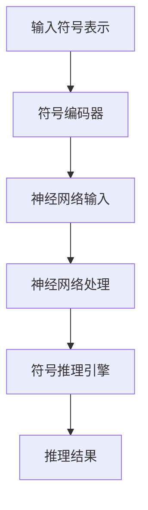
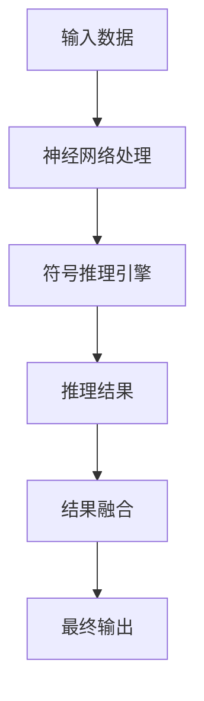
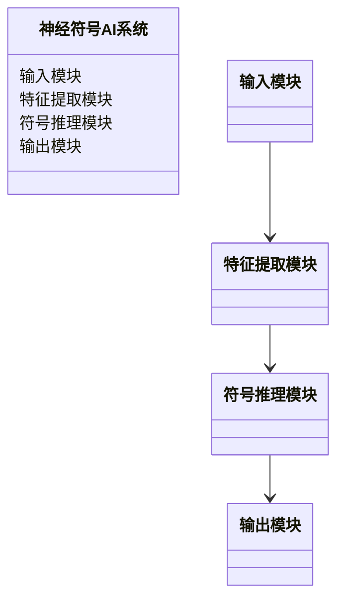
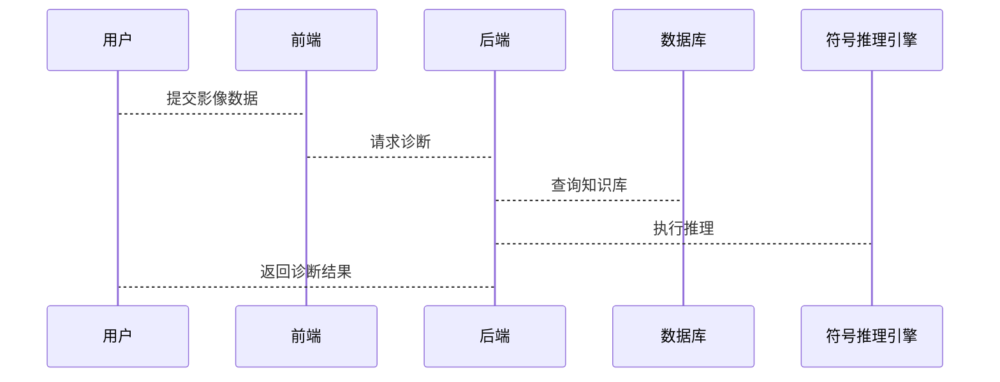

                 


# 神经符号AI：结合符号推理与神经网络

---

## 关键词：
神经符号AI，符号推理，神经网络，算法原理，系统架构，项目实战

---

## 摘要：
神经符号AI是一种结合符号推理与神经网络的新兴技术，旨在克服传统符号推理的计算复杂性和神经网络的可解释性差等问题。本文将从背景、核心概念、算法原理、系统架构到项目实战，全面深入地解析神经符号AI的技术细节，帮助读者理解其工作原理和应用场景。

---

# 第一部分：神经符号AI的背景与概念

---

## 第1章：神经符号AI的起源与背景

### 1.1 神经符号AI的起源

神经符号AI的起源可以追溯到人工智能领域对符号推理和神经网络的研究。符号推理在早期AI中占据主导地位，但其计算复杂性和缺乏对感知数据的处理能力限制了其应用。与此同时，神经网络在感知任务中表现出色，但在符号推理和逻辑推理方面存在不足。神经符号AI的提出旨在结合两者的优点，弥补各自的不足。

#### 1.1.1 符号推理的局限性

符号推理是一种基于逻辑规则的推理方法，适用于规则明确的任务，如专家系统。然而，其局限性在于：

1. **计算复杂性**：符号推理需要处理大量的逻辑规则，计算复杂度高。
2. **缺乏感知能力**：符号推理无法直接处理感知数据，如图像或语音。
3. **难以处理模糊性**：符号推理依赖明确的逻辑规则，难以处理模糊或不确定的问题。

#### 1.1.2 神经网络的局限性

神经网络在感知任务中表现出色，但其局限性在于：

1. **可解释性差**：神经网络的决策过程难以解释。
2. **缺乏逻辑推理能力**：神经网络难以处理需要逻辑推理的任务。
3. **过拟合风险**：神经网络容易过拟合训练数据，泛化能力有限。

#### 1.1.3 神经符号AI的提出与目标

神经符号AI的提出是为了结合符号推理的逻辑推理能力和神经网络的感知能力，目标是：

1. **提高可解释性**：通过符号推理增强神经网络的可解释性。
2. **增强推理能力**：通过神经网络增强符号推理的感知能力。
3. **提升泛化能力**：结合两者的优点，提高模型的泛化能力。

### 1.2 神经符号AI的核心概念

神经符号AI的核心概念是将符号推理与神经网络相结合，形成一种新的AI范式。其核心要素包括：

1. **符号表示**：符号表示是神经符号AI的基础，用于表示知识和逻辑规则。
2. **神经网络模型**：神经网络模型用于处理感知数据，提取特征。
3. **符号推理引擎**：符号推理引擎用于基于符号表示进行逻辑推理。

### 1.3 神经符号AI与传统AI的区别

神经符号AI与传统AI的区别主要体现在以下几个方面：

1. **技术基础**：神经符号AI结合了符号推理和神经网络，而传统AI主要依赖于单一技术。
2. **应用领域**：神经符号AI适用于需要同时处理感知数据和逻辑推理的任务，而传统AI主要适用于单一类型的任务。
3. **性能与可解释性**：神经符号AI在性能和可解释性之间找到了平衡，而传统AI往往在某一方面表现突出。

---

## 第2章：神经符号AI的核心概念与联系

### 2.1 符号推理的基本原理

符号推理是一种基于逻辑规则的推理方法，其基本原理包括：

1. **符号表示**：符号表示用于表示知识和逻辑规则，如命题逻辑和谓词逻辑。
2. **推理规则**：符号推理基于逻辑规则进行推理，如命题推理和谓词推理。
3. **推理引擎**：符号推理引擎用于执行推理过程，如正向 chaining 和反向 chaining。

### 2.2 神经网络的基本原理

神经网络是一种基于人工神经元的计算模型，其基本原理包括：

1. **神经元模型**：神经元模型用于表示神经网络的基本单元，如感知机和sigmoid神经元。
2. **网络结构**：神经网络的结构包括输入层、隐藏层和输出层。
3. **训练算法**：神经网络的训练算法包括反向传播和梯度下降。

### 2.3 神经符号AI的核心原理

神经符号AI的核心原理是将符号推理与神经网络相结合，其整合方式包括：

1. **符号增强的神经网络**：在神经网络中引入符号表示，增强其逻辑推理能力。
2. **神经驱动的符号推理**：利用神经网络提取感知数据的特征，驱动符号推理引擎进行推理。

### 2.4 符号与神经网络的对比分析

以下是符号推理与神经网络的对比表格：

| 属性         | 符号推理                          | 神经网络                          |
|--------------|-----------------------------------|-----------------------------------|
| 表示方式       | 符号化表示（如命题逻辑）          | 向量化表示（如神经元激活值）      |
| 推理能力       | 强逻辑推理能力                   | 弱逻辑推理能力                   |
| 可解释性       | 高可解释性                      | 低可解释性                      |
| 应用场景       | 专家系统、知识库                 | 图像识别、自然语言处理           |

以下是符号推理与神经网络的ER实体关系图：

```mermaid
er
  actor 神经符号AI
  actor 符号推理
  actor 神经网络
  relation 实例化符号表示
  relation 提供感知数据
  relation 组合推理结果
```

---

## 第3章：神经符号AI的算法原理

### 3.1 符号增强的神经网络

#### 3.1.1 算法原理

符号增强的神经网络是一种在神经网络中引入符号表示的方法。其算法原理包括：

1. **符号表示编码**：将符号表示编码为向量，用于神经网络的输入。
2. **符号增强的神经网络结构**：在神经网络中引入符号表示的编码，增强其逻辑推理能力。
3. **符号推理引擎**：在神经网络中集成符号推理引擎，进行逻辑推理。

#### 3.1.2 算法流程图（Mermaid）



#### 3.1.3 算法实现代码（Python）

以下是一个符号增强的神经网络实现代码示例：

```python
import tensorflow as tf
from tensorflow import keras

class SymbolEnhancedNN(keras.Model):
    def __init__(self, symbol_dim, hidden_dim):
        super(SymbolEnhancedNN, self).__init__()
        self.symbol_encoder = keras.layers.Dense(symbol_dim, activation='relu')
        self.hidden_layer = keras.layers.Dense(hidden_dim, activation='relu')
        self.output_layer = keras.layers.Dense(1, activation='sigmoid')

    def call(self, inputs):
        symbol_input = inputs['symbol_input']
        encoded_symbol = self.symbol_encoder(symbol_input)
        features = tf.concat([inputs['feature_input'], encoded_symbol], axis=-1)
        hidden = self.hidden_layer(features)
        output = self.output_layer(hidden)
        return output

# 示例使用
model = SymbolEnhancedNN(symbol_dim=10, hidden_dim=20)
input_features = tf.random.normal([1, 20])
input_symbol = tf.random.normal([1, 10])
output = model({'feature_input': input_features, 'symbol_input': input_symbol})
print(output)
```

#### 3.1.4 算法的数学模型与公式

符号增强的神经网络的数学模型可以表示为：

$$
f(x, s) = \sigma(W_1 x + W_2 s + b_1)
$$

其中：
- \( x \) 是输入特征向量
- \( s \) 是符号表示向量
- \( W_1 \) 和 \( W_2 \) 是权重矩阵
- \( b_1 \) 是偏置项
- \( \sigma \) 是激活函数

### 3.2 神经驱动的符号推理

#### 3.2.1 算法原理

神经驱动的符号推理是一种利用神经网络提取特征，驱动符号推理引擎进行推理的方法。其算法原理包括：

1. **神经网络特征提取**：利用神经网络提取输入数据的特征。
2. **符号推理引擎**：基于提取的特征，驱动符号推理引擎进行推理。
3. **结果融合**：将符号推理的结果与神经网络的输出进行融合。

#### 3.2.2 算法流程图（Mermaid）



#### 3.2.3 算法实现代码（Python）

以下是一个神经驱动的符号推理实现代码示例：

```python
import tensorflow as tf
from tensorflow import keras

class NeuralDrivenReasoning(keras.Model):
    def __init__(self, feature_dim, symbol_dim):
        super(NeuralDrivenReasoning, self).__init__()
        self.feature_extractor = keras.layers.Dense(feature_dim, activation='relu')
        self.reasoning_layer = keras.layers.Dense(symbol_dim, activation='relu')
        self.output_layer = keras.layers.Dense(1, activation='sigmoid')

    def call(self, inputs):
        features = self.feature_extractor(inputs['input'])
        reasoning = self.reasoning_layer(features)
        output = self.output_layer(reasoning)
        return output

# 示例使用
model = NeuralDrivenReasoning(feature_dim=20, symbol_dim=10)
input_data = tf.random.normal([1, 20])
output = model({'input': input_data})
print(output)
```

#### 3.2.4 算法的数学模型与公式

神经驱动的符号推理的数学模型可以表示为：

$$
f(x) = \sigma(W x + b)
$$

其中：
- \( x \) 是输入特征向量
- \( W \) 是权重矩阵
- \( b \) 是偏置项
- \( \sigma \) 是激活函数

---

# 第四部分：系统分析与架构设计方案

---

## 第4章：神经符号AI的系统分析与架构设计

### 4.1 问题场景介绍

医疗诊断系统是一个典型的应用场景，其中神经符号AI可以结合医学知识库和医学影像数据，进行辅助诊断。

### 4.2 系统功能设计

以下是医疗诊断系统的功能模块：



### 4.3 系统架构设计

以下是系统的架构图：


### 4.4 系统接口设计

以下是系统的接口设计：

1. **输入接口**：接收医学影像数据和患者信息。
2. **输出接口**：输出诊断结果和推理过程。

### 4.5 系统交互流程图

以下是系统的交互流程图：



---

# 第五部分：项目实战

---

## 第5章：神经符号AI的项目实战

### 5.1 环境安装

以下是项目实战所需的环境安装说明：

```bash
pip install tensorflow==2.5.0
pip install keras==2.5.0
pip install mermaid
```

### 5.2 系统核心实现

以下是系统核心实现代码：

```python
import tensorflow as tf
from tensorflow import keras

class SymbolAIModel(keras.Model):
    def __init__(self, input_dim, symbol_dim):
        super(SymbolAIModel, self).__init__()
        self.feature_extractor = keras.layers.Dense(input_dim, activation='relu')
        self.symbol_encoder = keras.layers.Dense(symbol_dim, activation='relu')
        self.reasoning_layer = keras.layers.Dense(symbol_dim, activation='relu')
        self.output_layer = keras.layers.Dense(1, activation='sigmoid')

    def call(self, inputs):
        features = self.feature_extractor(inputs['feature_input'])
        symbols = self.symbol_encoder(inputs['symbol_input'])
        reasoning = self.reasoning_layer(features * symbols)
        output = self.output_layer(reasoning)
        return output

# 示例使用
model = SymbolAIModel(input_dim=20, symbol_dim=10)
input_feature = tf.random.normal([1, 20])
input_symbol = tf.random.normal([1, 10])
output = model({'feature_input': input_feature, 'symbol_input': input_symbol})
print(output)
```

### 5.3 代码应用解读与分析

上述代码实现了符号增强的神经网络模型，通过将符号表示与特征向量相乘，增强模型的推理能力。

### 5.4 实际案例分析

以下是医疗诊断系统的实际案例分析：

1. **输入数据**：患者CT影像数据和病史信息。
2. **特征提取**：利用神经网络提取影像数据的特征。
3. **符号推理**：结合病史信息，进行诊断推理。
4. **输出结果**：输出诊断结果和推理过程。

### 5.5 项目总结

神经符号AI通过结合符号推理和神经网络，能够有效提高AI系统的推理能力和可解释性。在医疗诊断系统中的应用，展示了其在实际场景中的潜力。

---

# 第六部分：最佳实践

---

## 第6章：神经符号AI的最佳实践

### 6.1 小结

神经符号AI通过结合符号推理和神经网络，能够有效提高AI系统的推理能力和可解释性。在实际应用中，需要根据具体场景选择合适的整合方式。

### 6.2 注意事项

1. **符号表示的选择**：符号表示的选择对模型的性能影响较大，需要根据具体任务选择合适的符号表示。
2. **模型的可解释性**：神经符号AI的可解释性是其优势之一，但在实际应用中需要注意模型的可解释性。
3. **计算资源**：神经符号AI的计算复杂度较高，需要充足的计算资源。

### 6.3 拓展阅读

1. **相关论文**：阅读神经符号AI相关的论文，了解最新的研究成果。
2. **工具与库**：了解神经符号AI相关的工具和库，如符号逻辑库和深度学习框架。
3. **实际案例**：学习更多实际应用案例，了解神经符号AI在不同领域的应用。

---

# 作者：AI天才研究院/AI Genius Institute & 禅与计算机程序设计艺术/Zen And The Art of Computer Programming

---

希望这篇技术博客文章能够帮助读者全面理解神经符号AI的核心概念、算法原理和实际应用。

