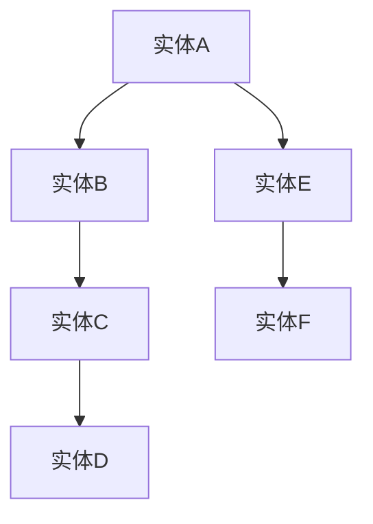
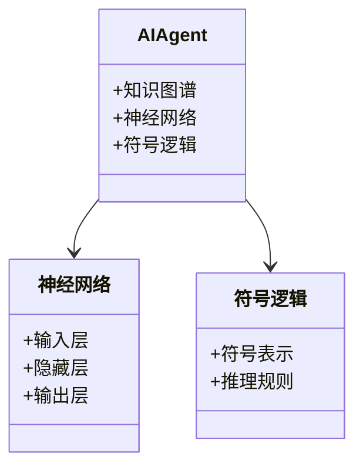

                 


# 神经符号推理在AI Agent常识推理中的应用

> 关键词：神经符号推理，AI Agent，常识推理，符号逻辑，神经网络

> 摘要：神经符号推理结合了符号逻辑与神经网络的优势，为AI Agent的常识推理提供了新的解决方案。本文将从背景、核心概念、算法原理、系统设计、项目实战等方面详细探讨神经符号推理在AI Agent中的应用，通过实际案例分析其优势与挑战。

---

## 第一部分：背景与基础

### 第1章：神经符号推理概述

#### 1.1 问题背景

- **1.1.1 AI Agent的常识推理需求**  
  AI Agent需要在动态环境中做出决策，其核心能力之一是常识推理。常识推理是指AI能够理解并运用人类普遍认为正确的知识，例如“鸟会飞”或“猫会叫”。

- **1.1.2 神经符号推理的提出**  
  传统的符号逻辑推理在处理复杂问题时缺乏灵活性，而纯神经网络推理难以解释且容易过拟合。神经符号推理通过结合符号逻辑与神经网络的优势，弥补了两者的不足。

- **1.1.3 神经符号推理的应用场景**  
  神经符号推理适用于需要结合知识库和动态推理的任务，例如智能问答系统、自动驾驶、机器人路径规划等。

#### 1.2 核心概念

- **1.2.1 符号逻辑与神经网络的结合**  
  符号逻辑提供明确的规则和推理能力，神经网络擅长处理非结构化数据和复杂模式。

- **1.2.2 神经符号推理的定义与特点**  
  神经符号推理是将符号逻辑嵌入神经网络中，通过神经网络学习符号表示，并利用符号逻辑进行推理。

- **1.2.3 常识推理的挑战与解决方案**  
  常识推理的挑战包括知识的模糊性、动态环境的不确定性等。神经符号推理通过结合知识图谱和神经网络，提供了一种更灵活的解决方案。

#### 1.3 技术优势

- **1.3.1 神经符号推理的优势**  
  - 解释性：符号逻辑提供了可解释的推理过程。  
  - 灵活性：神经网络能够处理复杂和模糊的数据。  
  - 结合知识库：神经符号推理可以利用预定义的知识图谱进行推理。

- **1.3.2 与传统符号推理的对比**  
  传统符号推理缺乏对非结构化数据的处理能力，而神经符号推理结合了符号逻辑与神经网络，能够处理复杂数据。

- **1.3.3 与纯神经网络推理的对比**  
  纯神经网络推理难以解释且容易过拟合，神经符号推理结合了符号逻辑，提供了更可靠的推理能力。

#### 1.4 研究现状

- **1.4.1 神经符号推理的发展历程**  
  神经符号推理的研究起源于20世纪90年代，近年来随着深度学习的兴起，得到了广泛关注。

- **1.4.2 当前研究热点**  
  - 神经符号推理的模型优化。  
  - 神经符号推理在自然语言处理中的应用。  
  - 神经符号推理与知识图谱的结合。

- **1.4.3 未来研究方向**  
  - 提高神经符号推理的效率和可扩展性。  
  - 研究神经符号推理在动态环境中的应用。  
  - 结合强化学习，提升神经符号推理的决策能力。

#### 1.5 本章小结

本章介绍了神经符号推理的背景、核心概念、技术优势及研究现状，为后续章节奠定了基础。

---

## 第二部分：核心概念与联系

### 第2章：符号逻辑与神经网络基础

#### 2.1 符号逻辑基础

- **2.1.1 命题逻辑**  
  命题逻辑是符号逻辑的基础，通过真值和逻辑运算符（如AND、OR、NOT）构建逻辑表达式。

- **2.1.2 一阶逻辑**  
  一阶逻辑（FOL）在命题逻辑的基础上引入了谓词和量词（如∀、∃），能够表示更复杂的逻辑关系。

- **2.1.3 逻辑推理规则**  
  常见的逻辑推理规则包括恒真式、蕴含式等，用于从前提推导出结论。

#### 2.2 神经网络基础

- **2.2.1 神经网络的基本结构**  
  神经网络由输入层、隐藏层和输出层组成，通过非线性激活函数进行信息处理。

- **2.2.2 常见神经网络模型**  
  - 循环神经网络（RNN）：适用于序列数据处理。  
  - Transformer：基于自注意力机制，适用于并行处理。  
  - 图神经网络（GNN）：适用于图结构数据处理。

- **2.2.3 神经网络的训练与优化**  
  神经网络通过反向传播和梯度下降优化模型参数，常用的优化算法包括随机梯度下降（SGD）、Adam等。

#### 2.3 符号与神经网络的结合

- **2.3.1 知识图谱与符号表示**  
  知识图谱是一种符号化的知识表示方式，通过节点（实体）和边（关系）构建知识网络。

- **2.3.2 神经符号推理的基本流程**  
  1. 将符号逻辑嵌入神经网络中，构建神经符号模型。  
  2. 通过神经网络学习符号表示，并利用符号逻辑进行推理。

- **2.3.3 神经符号推理的挑战**  
  - 知识表示的复杂性。  
  - 神经网络与符号逻辑的结合方式。  
  - 推理过程中的计算效率问题。

#### 2.4 本章小结

本章详细讲解了符号逻辑与神经网络的基础知识，为理解神经符号推理的核心原理奠定了基础。

---

## 第三部分：算法原理与数学模型

### 第3章：神经符号推理的核心原理

#### 3.1 神经符号推理的原理

- **3.1.1 神经符号推理的基本流程**  
  1. 输入：结构化知识和非结构化数据。  
  2. 处理：神经网络提取特征，符号逻辑进行推理。  
  3. 输出：推理结果。

- **3.1.2 神经符号推理的数学模型**  
  神经符号推理的模型可以表示为：  
  $$ f(x) = g(h(x)) $$  
  其中，$h(x)$是神经网络的输出，$g$是符号逻辑推理函数。

- **3.1.3 神经符号推理的算法流程**  
  1. 数据预处理：将知识图谱嵌入神经网络。  
  2. 神经网络提取特征。  
  3. 符号逻辑推理得到结果。

#### 3.2 核心概念的属性特征对比

| **属性**       | **符号逻辑**          | **神经网络**          |
|-----------------|-----------------------|-----------------------|
| 表示方式         | 符号化表示             | 向量化表示             |
| 处理数据         | 结构化数据             | 非结构化数据             |
| 可解释性         | 高                     | 低                     |
| 训练方式         | 基于规则             | 基于数据             |
| 优点             | 准确性高             | 处理复杂数据能力强         |

#### 3.3 ER实体关系图架构



#### 3.4 本章小结

本章详细讲解了神经符号推理的核心原理，包括基本流程、数学模型和实体关系图架构。

---

## 第四部分：系统分析与架构设计

### 第4章：系统分析与架构设计

#### 4.1 项目介绍

- **项目目标**  
  开发一个基于神经符号推理的AI Agent，能够进行常识推理。

- **系统功能设计**  
  - 知识图谱构建：将常识知识表示为知识图谱。  
  - 神经符号推理：结合神经网络和符号逻辑进行推理。  
  - 接口设计：提供API接口供其他系统调用。

#### 4.2 系统架构设计



#### 4.3 接口设计

- **输入接口**  
  - 输入：非结构化数据（如文本）。  
  - 输出：结构化数据。

- **输出接口**  
  - 输入：结构化数据。  
  - 输出：推理结果。

#### 4.4 本章小结

本章详细讲解了系统分析与架构设计，包括项目目标、系统功能设计、架构设计和接口设计。

---

## 第五部分：项目实战

### 第5章：项目实战

#### 5.1 环境安装

- **安装Python**：确保Python版本为3.6及以上。  
- **安装依赖库**：使用pip安装以下库：  
  - numpy  
  - tensorflow  
  - pytorch  
  - networkx  

#### 5.2 系统核心实现

```python
import torch
import torch.nn as nn
import torch.nn.functional as F

class NeuralSymbolicReasoning(nn.Module):
    def __init__(self, input_size, hidden_size, output_size):
        super(NeuralSymbolicReasoning, self).__init__()
        self.embedding = nn.Linear(input_size, hidden_size)
        self.reasoning = nn.LSTM(hidden_size, hidden_size)
        self.classifier = nn.Linear(hidden_size, output_size)

    def forward(self, x):
        x = F.relu(self.embedding(x))
        x, _ = self.reasoning(x)
        x = self.classifier(x)
        return x
```

#### 5.3 代码应用解读

- **输入层**：将输入数据嵌入到隐藏层。  
- **推理层**：利用LSTM进行推理。  
- **输出层**：输出推理结果。

#### 5.4 案例分析

- **案例背景**：假设输入是“鸟会飞”，推理“鸵鸟是否会飞”。  
- **推理过程**：神经网络提取“鸟会飞”的特征，符号逻辑推理得出“鸵鸟不会飞”。

#### 5.5 本章小结

本章通过实际案例分析，详细讲解了神经符号推理的实现过程。

---

## 第六部分：总结与展望

### 第6章：总结与展望

#### 6.1 本章小结

本文详细探讨了神经符号推理在AI Agent常识推理中的应用，包括背景、核心概念、算法原理、系统设计和项目实战。

#### 6.2 未来展望

- **模型优化**：提高神经符号推理的效率和准确性。  
- **动态推理**：研究神经符号推理在动态环境中的应用。  
- **跨领域应用**：探索神经符号推理在其他领域的应用。

#### 6.3 最佳实践 tips

- **数据质量**：确保知识图谱的质量。  
- **模型选择**：根据任务选择合适的模型。  
- **可解释性**：注重推理过程的可解释性。

---

## 作者信息

作者：AI天才研究院/AI Genius Institute & 禅与计算机程序设计艺术 /Zen And The Art of Computer Programming

---

以上是《神经符号推理在AI Agent常识推理中的应用》的完整目录大纲和部分详细内容。

