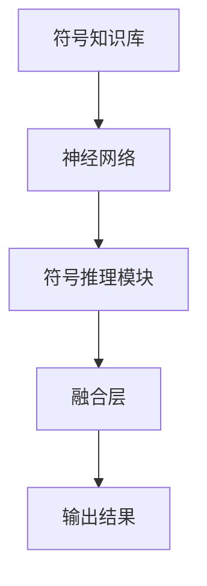
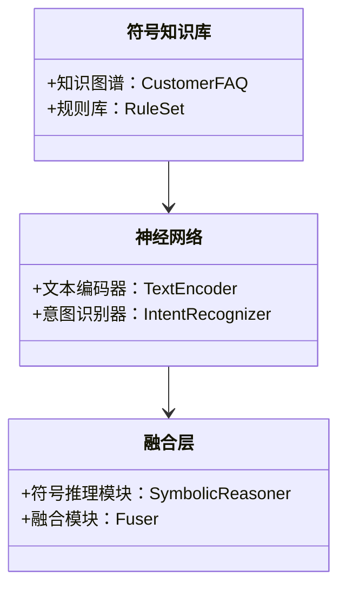
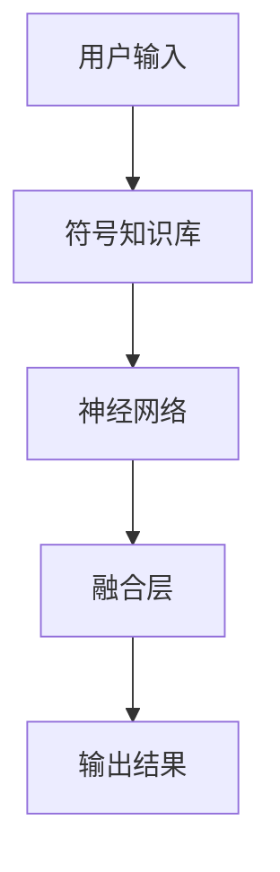
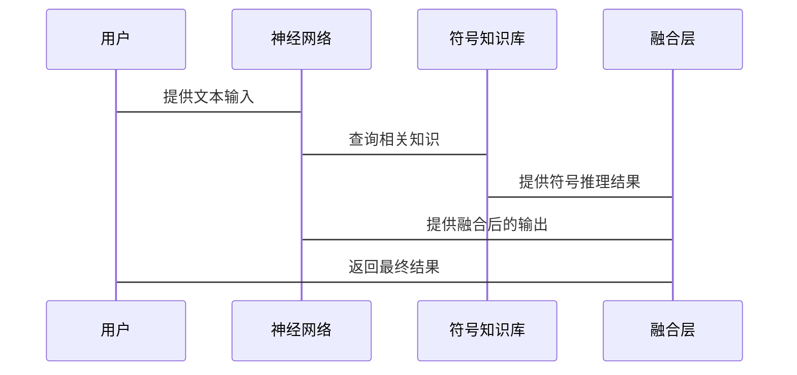

                 


# 神经符号融合：结合规则与学习的AI Agent

## 关键词
神经符号融合，AI Agent，符号推理，神经网络，规则学习，深度学习，知识图谱

## 摘要
神经符号融合是一种结合符号推理和神经网络学习的新兴技术，旨在构建更智能、更可解释的AI代理。本文系统地介绍神经符号融合的核心概念、算法原理、系统架构及应用场景。通过理论分析与实践案例，探讨如何将符号规则与机器学习模型有效结合，提升AI Agent的推理能力与决策性能。文章内容包括背景介绍、核心概念、算法实现、系统设计、项目实战及未来展望，为读者提供全面而深入的技术解析。

---

## 第1章 神经符号融合概述

### 1.1 神经符号融合的背景与问题背景
#### 1.1.1 传统符号推理的局限性
传统符号推理依赖专家规则，难以处理复杂、动态和模糊的问题，且难以扩展到大规模数据和复杂场景。

#### 1.1.2 神经网络学习的优势与不足
神经网络在处理感知、模式识别等方面表现卓越，但缺乏可解释性，且难以利用先验知识。

#### 1.1.3 神经符号融合的必要性与目标
通过结合符号推理的可解释性和神经网络的泛化能力，神经符号融合旨在构建更高效、更智能的AI代理。

### 1.2 神经符号融合的核心概念
#### 1.2.1 符号表示与神经网络的结合
符号表示（如知识图谱、逻辑规则）与神经网络的特征表示相结合，实现知识的表达与学习的统一。

#### 1.2.2 神经符号融合的定义与特点
神经符号融合是一种跨领域的技术，结合了符号推理的规则性和神经网络的学习性，具有可解释性、灵活性和高效性。

#### 1.2.3 神经符号融合的边界与外延
神经符号融合既不是完全符号化的推理，也不是纯粹的神经网络学习，而是两者的有机融合。

### 1.3 神经符号融合的核心要素组成
#### 1.3.1 符号知识的表达方式
知识图谱、逻辑规则、语义网络等符号表示形式。

#### 1.3.2 神经网络的学习机制
深度学习模型（如CNN、RNN、Transformer）用于特征提取和模式识别。

#### 1.3.3 神经符号融合的实现架构
符号层、神经层、融合层的分层架构，实现符号知识与神经网络的协同工作。

---

## 第2章 神经符号融合的核心概念与联系

### 2.1 神经符号融合的核心原理
#### 2.1.1 符号表示与神经网络的结合方式
符号知识嵌入到神经网络的表示空间，通过注意力机制、门控机制等方式实现符号与神经表示的交互。

#### 2.1.2 神经符号融合的数学模型
符号表示与神经网络表示的联合优化，通过能量函数或损失函数实现符号与神经网络的协同训练。

#### 2.1.3 神经符号融合的实现框架
基于符号增强的神经网络模型，如符号增强的Transformer、符号增强的图神经网络。

### 2.2 神经符号融合的核心概念对比
#### 2.2.1 符号推理与神经网络的对比分析
符号推理：基于规则，可解释，但计算效率低；神经网络：基于数据，不可解释，但计算效率高。

#### 2.2.2 神经符号融合与传统符号推理的区别
神经符号融合结合了神经网络的学习能力，增强了符号推理的实用性和效率。

#### 2.2.3 神经符号融合与纯神经网络方法的差异
神经符号融合引入符号知识，提高了模型的可解释性和泛化能力。

### 2.3 神经符号融合的ER实体关系图


---

## 第3章 神经符号融合的算法原理

### 3.1 神经符号融合的算法流程
#### 3.1.1 符号知识的编码与嵌入
将符号知识（如知识图谱）编码为向量，嵌入到神经网络的表示空间中。

#### 3.1.2 神经网络的特征提取
通过神经网络提取输入数据的特征表示，如图像、文本的特征向量。

#### 3.1.3 符号推理与神经网络的联合优化
在符号层和神经层之间建立约束，通过联合优化实现符号推理与神经网络的协同训练。

### 3.2 神经符号融合的数学模型
#### 3.2.1 符号表示的数学表达
符号知识可以用向量或张量表示，例如知识图谱中的节点和边可以用向量嵌入。

#### 3.2.2 神经网络的数学模型
神经网络的输出可以用概率分布、向量或张量表示，例如Transformer的输出是序列的向量表示。

#### 3.2.3 融合层的数学公式
符号层和神经层的输出通过融合层进行加权求和或非线性变换，例如：
$$ y = \sigma(W_s x_s + W_n x_n) $$
其中，$x_s$是符号表示，$x_n$是神经网络的输出，$\sigma$是激活函数。

### 3.3 神经符号融合的算法实现
#### 3.3.1 符号增强的神经网络模型
基于符号知识增强的神经网络，如符号增强的Transformer。

#### 3.3.2 融合层的实现方式
通过门控机制或注意力机制实现符号层和神经层的动态融合。

#### 3.3.3 算法的优化与改进
引入符号增强的正则化项，优化模型的泛化能力和解释性。

---

## 第4章 神经符号融合的系统分析与架构设计

### 4.1 系统分析
#### 4.1.1 系统目标与功能需求
构建一个结合符号推理和神经网络的AI代理，具备知识表示、符号推理、神经推理和融合推理功能。

#### 4.1.2 系统的输入与输出
输入：符号知识、感知数据（如图像、文本）；输出：推理结果、决策建议。

#### 4.1.3 系统的性能指标
推理速度、准确率、可解释性、资源利用率。

### 4.2 系统架构设计
#### 4.2.1 系统架构的总体设计
分层架构：符号层、神经层、融合层。

#### 4.2.2 模块划分与功能分配
符号层负责符号知识的表示与推理，神经层负责特征提取与学习，融合层负责符号与神经表示的交互。

#### 4.2.3 系统架构的优缺点分析
优点：可解释性高、知识表示能力强；缺点：计算复杂度较高。

### 4.3 系统接口设计
#### 4.3.1 系统内部接口设计
符号层与神经层之间的接口：符号表示与神经表示的转换。

#### 4.3.2 系统外部接口设计
API接口：供上层应用调用AI代理的服务。

---

## 第5章 项目实战：基于神经符号融合的智能客服系统

### 5.1 项目背景与目标
构建一个结合符号推理和神经网络的智能客服系统，提升对话理解和问题解决能力。

### 5.2 系统功能设计
#### 5.2.1 领域模型设计


#### 5.2.2 系统架构设计


#### 5.2.3 系统交互设计


### 5.3 项目实现与代码解读
#### 5.3.1 环境安装
安装必要的依赖：TensorFlow、Keras、符号推理库（如RDFlib）。

#### 5.3.2 系统核心代码实现
```python
# 符号知识库的构建
from rdflib import Graph, Literal, BNode, Namespace, URIRef

kb = Graph()
kb.add((URIRef('http://example.org/customerFAQ'), URIRef('http://example.org/hasFAQ'), Literal('退款问题')))
```

#### 5.3.3 代码应用解读与分析
符号知识库用于存储常见问题，神经网络用于处理用户输入的自然语言文本，融合层通过符号推理和神经推理生成最终的输出。

### 5.4 实际案例分析与详细讲解
通过具体案例（如用户询问退款政策），展示神经符号融合在智能客服中的应用效果。

### 5.5 项目小结
总结项目实现的关键点，如符号知识的表示、神经网络的训练、融合层的设计等。

---

## 第6章 总结与展望

### 6.1 总结
神经符号融合结合了符号推理的可解释性和神经网络的泛化能力，为AI代理的设计提供了新的思路。

### 6.2 未来展望
未来的研究方向包括更高效的符号表示、更强大的融合机制、更广泛的应用场景。

### 6.3 最佳实践 tips
- 在符号知识的表示上，尽量选择高效的向量表示方法。
- 在融合层的设计上，可以尝试多种机制（如门控机制、注意力机制）。
- 在实际应用中，需要考虑计算效率和可解释性的平衡。

---

## 作者
作者：AI天才研究院 & 禅与计算机程序设计艺术  
（本文基于神经符号融合技术的研究与实践，结合理论与实践，旨在为AI领域的研究者和实践者提供参考。）

