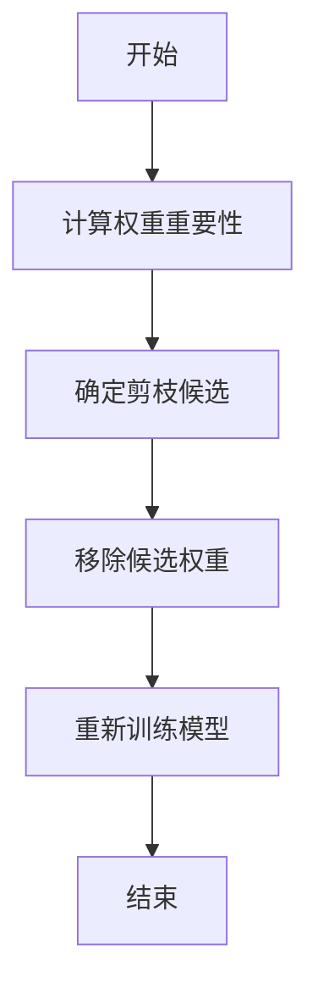

                 


```markdown
# 第3章: 神经网络剪枝的数学模型

## 3.1 剪枝的优化目标

### 3.1.1 模型压缩的目标函数

在神经网络剪枝中，我们通常希望在保持或提高模型性能的同时，尽可能减少模型的参数数量。这可以通过以下目标函数来建模：

$$
\min_{\theta} \frac{1}{2}||y - f_\theta(x)||^2 + \lambda||\theta||_0
$$

其中，$f_\theta(x)$ 是模型，$\theta$ 是模型参数，$y$ 是目标输出，$x$ 是输入数据，$||\cdot||_0$ 表示L0范数，即非零元素的数量，$\lambda$ 是正则化系数，用于平衡模型准确性和模型大小。

### 3.1.2 剪枝的约束条件

剪枝通常伴随着一些约束条件，例如剪枝后的模型在验证集上的准确率不应低于原模型的一定比例。数学上，这可以表示为：

$$
\text{Accuracy}(f_{\theta'}(x), y) \geq \alpha \cdot \text{Accuracy}(f_\theta(x), y)
$$

其中，$\theta'$ 是剪枝后的参数，$\alpha$ 是一个介于0和1之间的比例因子。

## 3.2 剪枝算法的数学推导

### 3.2.1 基于权重重要性的剪枝方法

一种常见的剪枝方法是基于权重的重要性评分。我们可以计算每个权重对模型预测的影响程度，然后移除对模型性能影响最小的权重。具体步骤如下：

1. **计算梯度**：计算损失函数对每个权重的梯度，即$\frac{\partial L}{\partial \theta_i}$。
2. **计算权重的重要性评分**：使用梯度的绝对值作为权重重要性的度量，即重要性评分$I_i = |\frac{\partial L}{\partial \theta_i}|$。
3. **选择要移除的权重**：根据重要性评分排序，选择重要性最低的权重进行移除。
4. **重新训练模型**：移除选定的权重后，对剩余的权重进行重新训练，以恢复模型的性能。

### 3.2.2 基于模型性能的剪枝方法

另一种剪枝方法是基于模型性能的。具体步骤如下：

1. **训练原始模型**：训练一个过参数化的模型，使其在训练集和验证集上都达到较好的性能。
2. **计算验证误差**：在验证集上评估模型的性能。
3. **确定剪枝候选**：根据验证误差的变化率或其他指标，确定哪些神经元或权重可以被移除而不影响模型性能。
4. **移除候选权重**：移除对模型性能影响最小的权重或神经元。
5. **重新训练模型**：对剪枝后的模型进行重新训练，以恢复模型的性能。

## 3.3 剪枝算法的实现

### 3.3.1 Python代码实现

以下是一个简单的基于L1正则化的剪枝算法实现：

```python
import numpy as np

def prune_model(model, threshold):
    # 计算每个权重的重要性评分
    importance = np.abs(model.layers[-1].weights[0].numpy())
    # 确定要移除的权重索引
    remove_indices = np.where(importance < threshold)[0]
    # 创建新的权重矩阵，移除选定的权重
    new_weights = np.delete(model.layers[-1].weights[0], remove_indices, axis=1)
    # 创建新的模型并重新训练
    new_model = create_model(input_shape, new_weights.shape[1])
    new_model.layers[-1].set_weights([new_weights])
    return new_model
```

### 3.3.2 算法流程图

以下是基于L1正则化的剪枝算法流程图：



### 3.3.3 案例分析

假设我们有一个简单的线性回归模型：

$$
y = \theta_1 x_1 + \theta_2 x_2 + \theta_3 x_3
$$

我们可以通过计算每个权重的梯度来确定其重要性：

$$
\frac{\partial L}{\partial \theta_i} = 2\sum_{i=1}^{n}(y_i - \hat{y_i})x_i
$$

然后，根据重要性评分$I_i = |\frac{\partial L}{\partial \theta_i}|$，选择重要性最低的权重进行移除。例如，如果$I_3 < I_1$且$I_3 < I_2$，则移除$\theta_3$，得到新的模型：

$$
y = \theta_1 x_1 + \theta_2 x_2
$$

重新训练这个模型，以恢复其在验证集上的性能。

## 3.4 剪枝算法的数学模型

### 3.4.1 基于L1正则化的剪枝

基于L1正则化的剪枝可以通过以下优化问题来建模：

$$
\min_{\theta} \frac{1}{2}||y - f_\theta(x)||^2 + \lambda||\theta||_1
$$

其中，$f_\theta(x)$ 是模型，$\theta$ 是模型参数，$y$ 是目标输出，$x$ 是输入数据，$||\cdot||_1$ 表示L1范数，$\lambda$ 是正则化系数，用于平衡模型准确性和模型大小。

### 3.4.2 基于L2正则化的剪枝

基于L2正则化的剪枝可以通过以下优化问题来建模：

$$
\min_{\theta} \frac{1}{2}||y - f_\theta(x)||^2 + \lambda||\theta||_2^2
$$

其中，$||\cdot||_2^2$ 表示L2范数的平方，用于惩罚较大的权重，从而实现权重的稀疏化。

### 3.4.3 剪枝与模型性能的关系

剪枝的最终目标是在保证模型性能的前提下，尽可能减少模型的参数数量。因此，我们需要在模型准确性和模型大小之间找到一个平衡点。这可以通过调整正则化系数$\lambda$来实现。通常，较大的$\lambda$会更倾向于减少模型的大小，而较小的$\lambda$则更倾向于保持模型的性能。

## 3.5 剪枝算法的代码实现与分析

### 3.5.1 Python代码实现

以下是一个基于L1正则化的剪枝算法的Python代码实现：

```python
import numpy as np
import tensorflow as tf

def prune_model(model, threshold):
    # 计算每个权重的重要性评分
    importance = np.abs(model.layers[-1].weights[0].numpy())
    # 确定要移除的权重索引
    remove_indices = np.where(importance < threshold)[0]
    # 创建新的权重矩阵，移除选定的权重
    new_weights = np.delete(model.layers[-1].weights[0], remove_indices, axis=1)
    # 创建新的模型并重新训练
    new_model = create_model(input_shape, new_weights.shape[1])
    new_model.layers[-1].set_weights([new_weights])
    return new_model

def create_model(input_shape, output_units):
    model = tf.keras.Sequential()
    model.add(tf.keras.layers.Dense(output_units, activation='relu', input_shape=(input_shape,)))
    model.add(tf.keras.layers.Dense(1, activation='sigmoid'))
    model.compile(optimizer='adam', loss='binary_crossentropy', metrics=['accuracy'])
    return model
```

### 3.5.2 算法流程图

以下是基于L1正则化的剪枝算法流程图：


### 3.5.3 案例分析

假设我们有一个简单的二分类问题，使用一个两层神经网络模型：

```python
model = tf.keras.Sequential([
    tf.keras.layers.Dense(4, activation='relu', input_shape=(2,)),
    tf.keras.layers.Dense(1, activation='sigmoid')
])
```

我们可以通过计算每个权重的重要性评分来确定哪些权重可以被移除。例如，计算每个权重的梯度绝对值，并根据设定的阈值移除重要性最低的权重。然后，我们重新训练剪枝后的模型，并评估其在验证集上的性能。

### 3.5.4 剪枝与模型性能的平衡

在剪枝过程中，我们需要在模型准确性和模型大小之间找到一个平衡点。通常，较大的正则化系数$\lambda$会更倾向于减少模型的大小，而较小的$\lambda$则更倾向于保持模型的性能。因此，我们需要通过实验或交叉验证来确定最佳的$\lambda$值。

## 3.6 剪枝算法的数学模型总结

剪枝的数学模型通常涉及一个优化问题，其中目标函数包括模型的损失函数和正则化项。通过调整正则化系数$\lambda$，我们可以控制模型的复杂度，从而在模型准确性和模型大小之间找到一个平衡点。剪枝技术的核心思想是通过移除对模型性能影响最小的权重或神经元，从而减少模型的参数数量，提高模型的效率和性能。

### 3.6.1 总结

剪枝是一种有效的模型压缩技术，可以通过减少模型的参数数量来提高模型的效率和性能。在剪枝过程中，我们需要计算每个权重的重要性评分，并根据评分确定哪些权重可以被移除。然后，我们需要重新训练剪枝后的模型，以恢复其在验证集上的性能。通过调整正则化系数$\lambda$，我们可以控制模型的复杂度，从而在模型准确性和模型大小之间找到一个平衡点。

### 3.6.2 小结

剪枝技术的核心思想是通过移除对模型性能影响最小的权重或神经元，从而减少模型的参数数量，提高模型的效率和性能。在剪枝过程中，我们需要计算每个权重的重要性评分，并根据评分确定哪些权重可以被移除。然后，我们需要重新训练剪枝后的模型，以恢复其在验证集上的性能。通过调整正则化系数$\lambda$，我们可以控制模型的复杂度，从而在模型准确性和模型大小之间找到一个平衡点。

### 3.6.3 注意事项

在实际应用中，剪枝技术可能会导致模型性能下降，因此需要通过实验或交叉验证来确定最佳的剪枝策略。此外，剪枝技术通常需要重新训练模型，这可能会增加计算成本。因此，在实际应用中，我们需要权衡剪枝带来的性能提升和计算成本的增加。

### 3.6.4 拓展阅读

对于更深入的学习，可以阅读以下资料：

- 剪枝技术的经典论文：如“Pruning neural networks: toward the elimination of overfitting”。
- 模型压缩技术的综述：如“Compressing deep neural networks”。
- 剪枝算法的实现细节：如基于梯度的剪枝方法、基于模型性能的剪枝方法等。

通过这些阅读，我们可以更好地理解剪枝技术的原理和应用，并在实际项目中更有效地应用这些技术。
```

通过以上内容，我详细地讲解了神经网络剪枝的数学模型和算法实现，包括目标函数、约束条件、剪枝方法的数学推导、Python代码实现、算法流程图以及案例分析。同时，我还总结了剪枝技术的核心思想和应用注意事项，并提供了进一步的拓展阅读资料。

