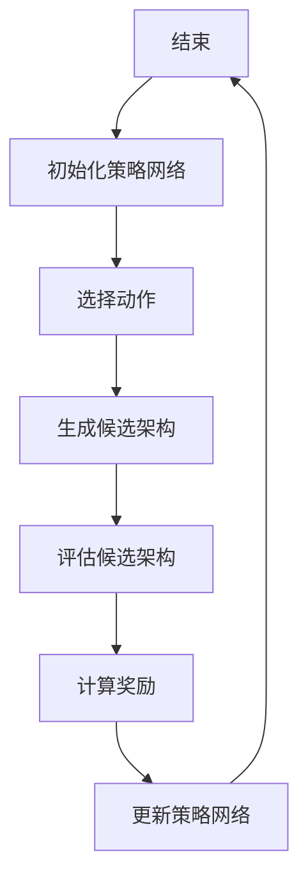
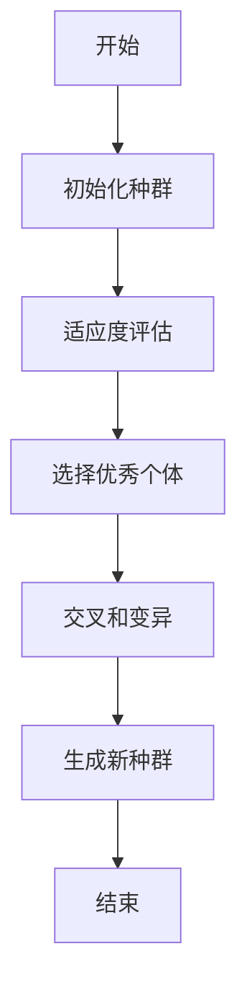

                 


# 神经网络架构搜索：为AI Agent找到最佳结构

## 关键词：神经网络架构搜索，AI Agent，深度学习，自动机器学习，强化学习，遗传算法

## 摘要：  
神经网络架构搜索（Neural Architecture Search, NAS）是一种通过自动化方法寻找最优神经网络结构的技术，旨在为AI Agent提供高效的计算模型。本文从NAS的基本概念出发，详细探讨其在AI Agent中的应用，分析其算法原理、系统架构设计，并通过实战案例展示如何利用NAS优化AI Agent的性能。文章内容涵盖从理论到实践的各个方面，旨在为读者提供全面的指导。

---

# 第一部分: 神经网络架构搜索（NAS）基础

## # 第1章: 神经网络架构搜索概述

### 1.1 神经网络架构搜索的背景与意义

#### 1.1.1 神经网络的发展历程  
神经网络自20世纪80年代提出以来，经历了从浅层网络到深度学习的演变。早期的神经网络如感知机仅能处理简单的线性分类问题，而随着反向传播算法（Backpropagation）的提出，多层感知机（MLP）逐渐兴起。进入21世纪，深度学习的崛起使得神经网络在图像识别、自然语言处理等领域取得了突破性进展。然而，神经网络的性能 heavily依赖于人工设计的网络架构，这限制了其进一步优化的潜力。

#### 1.1.2 神经网络架构搜索的定义与目标  
神经网络架构搜索（NAS）是一种自动化技术，旨在通过搜索算法在预定义的搜索空间中寻找最优的网络架构。与传统的手动设计网络架构不同，NAS通过算法自动探索可能的网络结构，从而提高模型性能或减少计算资源的消耗。其目标是为给定任务（如图像分类、语音识别等）找到最优或接近最优的网络架构。

#### 1.1.3 神经网络架构搜索的应用场景  
NAS技术广泛应用于多个领域，包括但不限于：  
- **图像处理**：如图像分类、目标检测等。  
- **自然语言处理**：如机器翻译、文本分类等。  
- **推荐系统**：如个性化推荐、用户行为预测等。  
- **AI Agent**：如智能机器人、自动驾驶等需要实时决策的任务。

### 1.2 AI Agent与神经网络架构搜索的关系

#### 1.2.1 AI Agent的基本概念  
AI Agent是一种智能体，能够在环境中感知、推理、决策并执行动作，以实现特定目标。AI Agent的核心能力包括感知能力（获取环境信息）、推理能力（分析信息并做出决策）、学习能力（从经验中改进性能）和执行能力（在环境中采取动作）。

#### 1.2.2 神经网络架构在AI Agent中的作用  
神经网络作为AI Agent的核心计算模型，其架构直接影响其感知、推理和决策能力。传统的神经网络架构（如CNN、RNN、Transformer）在特定任务上表现出色，但难以适应复杂的动态环境。通过NAS技术，可以为AI Agent量身定制最优的网络架构，使其在复杂任务中表现更优。

#### 1.2.3 神经网络架构搜索如何优化AI Agent性能  
通过NAS技术，AI Agent可以：  
1. **提高计算效率**：优化网络架构以减少计算资源消耗。  
2. **增强模型性能**：找到更适合特定任务的网络结构。  
3. **加快开发周期**：自动化架构搜索减少了人工设计的时间成本。  

### 1.3 神经网络架构搜索的核心概念

#### 1.3.1 搜索空间的定义  
搜索空间是NAS算法探索的所有可能网络架构的集合。搜索空间的设计直接影响搜索效率和最终结果。常见的搜索空间包括：  
- **细胞空间（Cell Space）**：如Dart、NasNet等模型中的细胞结构。  
- **模块空间（Module Space）**：如ResNet中的残差模块。  

#### 1.3.2 架构表示方法  
架构表示方法用于将网络结构编码为计算机可处理的形式。常见的表示方法包括：  
1. **图表示**：将网络架构表示为图结构，节点表示操作，边表示数据流。  
2. **符号表示**：使用符号或字符串描述网络结构。  
3. **嵌入表示**：将网络结构嵌入到低维空间中。  

#### 1.3.3 搜索策略的选择  
搜索策略决定了如何在搜索空间中进行探索和利用。常见的搜索策略包括：  
- **随机搜索**：随机选择网络架构进行评估。  
- **贪心搜索**：逐层选择最优架构。  
- **增强学习搜索**：通过强化学习算法指导搜索过程。  

---

## # 第2章: 神经网络架构搜索的关键技术

### 2.1 强化学习在NAS中的应用

#### 2.1.1 强化学习的基本原理  
强化学习（Reinforcement Learning, RL）是一种通过试错方式学习策略的方法。RL算法通过智能体与环境的交互，逐步优化策略以最大化累积奖励。

#### 2.1.2 在NAS中的强化学习框架  
在NAS中，强化学习框架通常包括以下几个部分：  
1. **状态空间**：表示当前的网络架构状态。  
2. **动作空间**：表示可能的操作，如添加一个层、改变通道数等。  
3. **奖励函数**：根据模型性能计算奖励值。  
4. **策略网络**：生成动作的策略。  

#### 2.1.3 强化学习在搜索过程中的具体实现  
以下是一个简化的强化学习NAS框架的流程图：



### 2.2 遗传算法在NAS中的应用

#### 2.2.1 遗传算法的基本原理  
遗传算法（Genetic Algorithm, GA）是一种基于生物进化论的优化算法，通过选择、交叉和变异操作生成新的解。

#### 2.2.2 遗传算法在NAS中的适应度函数设计  
适应度函数用于评估候选架构的性能。常见的适应度函数包括：  
1. **准确率**：模型在测试集上的准确率。  
2. **FLOPS**：模型的计算量。  
3. **参数数量**：模型的参数数量。  

#### 2.2.3 遗传算法的搜索过程优化  
遗传算法的搜索过程包括以下几个步骤：



### 2.3 神经网络架构搜索的优化策略

#### 2.3.1 超参数优化  
超参数优化是通过调整搜索算法的参数（如学习率、搜索步数等）来提高搜索效率。常用的方法包括网格搜索、随机搜索和贝叶斯优化。

#### 2.3.2 模型压缩与加速  
模型压缩与加速技术用于减少模型的计算量和参数数量，如知识蒸馏、剪枝和量化。

#### 2.3.3 多目标优化  
多目标优化是在多个目标（如准确率、计算量、参数数量）之间找到平衡点，常用的方法包括帕累托前沿优化。

---

## # 第3章: 神经网络架构搜索的算法原理

### 3.1 基于强化学习的NAS算法

#### 3.1.1 算法流程  
基于强化学习的NAS算法通常包括以下步骤：  
1. **初始化**：初始化策略网络和环境。  
2. **采样**：根据策略网络生成候选架构。  
3. **评估**：评估候选架构的性能。  
4. **更新策略**：根据评估结果更新策略网络。  
5. **终止条件**：达到终止条件后停止搜索。  

#### 3.1.2 状态空间与动作空间的定义  
- **状态空间**：表示当前的网络架构状态，可以用图结构或符号表示。  
- **动作空间**：表示可能的操作，如添加层、改变通道数等。  

#### 3.1.3 奖励机制的设计  
奖励机制的设计直接影响搜索过程的效果。常用的奖励机制包括：  
1. **准确率奖励**：根据模型准确率计算奖励。  
2. **延迟奖励**：考虑模型训练的延迟。  

### 3.2 基于遗传算法的NAS算法

#### 3.2.1 初始化种群  
初始化一个随机的种群，每个个体表示一个网络架构。

#### 3.2.2 适应度评估  
评估每个候选架构的性能，计算适应度值。

#### 3.2.3 选择、交叉与变异操作  
1. **选择**：选择适应度值较高的个体进行繁殖。  
2. **交叉**：将两个个体的基因进行交叉，生成新的个体。  
3. **变异**：对个体的基因进行随机变异，增加多样性。  

### 3.3 神经网络架构搜索的数学模型

#### 3.3.1 搜索空间的数学表示  
搜索空间可以表示为一个图结构，其中节点表示操作，边表示数据流。  
$$ S = \{ (n_i, e_j) | n_i \in N, e_j \in E \} $$  
其中，\( N \) 是节点集合，\( E \) 是边集合。

#### 3.3.2 架构表示的优化目标函数  
优化目标函数通常包括准确率、计算量和参数数量的加权和。  
$$ f(\theta) = \alpha \cdot \text{Accuracy} + \beta \cdot \text{FLOPS} + \gamma \cdot \text{Params} $$  
其中，\( \alpha \)、\( \beta \)、\( \gamma \) 是权重系数。

#### 3.3.3 搜索策略的数学推导  
强化学习策略网络通常采用概率分布的形式，如：  
$$ P(a|s) = \text{softmax}(Q(s,a)) $$  
其中，\( Q(s,a) \) 是状态-动作对的Q值。

---

## # 第4章: 神经网络架构搜索的系统架构设计

### 4.1 系统功能模块划分

#### 4.1.1 搜索模块  
搜索模块负责生成候选网络架构。  
- **输入**：搜索空间和搜索策略。  
- **输出**：候选网络架构。  

#### 4.1.2 评估模块  
评估模块负责评估候选网络架构的性能。  
- **输入**：候选网络架构和任务数据。  
- **输出**：准确率、FLOPS等指标。  

#### 4.1.3 优化模块  
优化模块负责优化搜索策略以提高搜索效率。  
- **输入**：评估结果。  
- **输出**：优化后的搜索策略。  

### 4.2 系统架构设计

#### 4.2.1 分层架构设计  
系统架构通常分为前端和后端。  
- **前端**：负责用户交互和任务配置。  
- **后端**：负责网络架构搜索和评估。  

#### 4.2.2 模块化设计  
系统功能模块化设计有助于提高系统的可维护性和扩展性。  
- **搜索模块**：负责生成候选架构。  
- **评估模块**：负责评估候选架构。  
- **优化模块**：负责优化搜索策略。  

#### 4.2.3 并行计算架构  
为了提高计算效率，系统可以采用并行计算架构。  
- **分布式计算**：利用多台机器进行并行计算。  
- **多线程计算**：利用多线程进行并行计算。  

### 4.3 系统接口设计

#### 4.3.1 输入接口定义  
- **输入数据**：任务数据和搜索参数。  
- **输入格式**：如JSON、Protobuf等。  

#### 4.3.2 输出接口定义  
- **输出数据**：最优网络架构和性能指标。  
- **输出格式**：如JSON、XML等。  

#### 4.3.3 其他接口设计  
- **控制接口**：用于控制搜索过程的启动和停止。  
- **监控接口**：用于监控搜索过程的进展。  

---

## # 第5章: 项目实战——基于NAS的AI Agent优化

### 5.1 项目背景与目标

#### 5.1.1 项目背景  
随着AI Agent在各个领域的广泛应用，如何优化其网络架构成为一个重要问题。通过NAS技术，可以为AI Agent找到最优的网络架构，从而提高其性能和效率。

#### 5.1.2 项目目标  
本项目旨在通过NAS技术优化AI Agent的网络架构，提高其在特定任务上的性能。  
1. **任务定义**：定义AI Agent的任务，如图像分类、语音识别等。  
2. **搜索空间定义**：定义可能的网络架构。  
3. **搜索算法实现**：实现强化学习或遗传算法。  
4. **性能评估**：评估候选架构的性能。  

### 5.2 项目实施步骤

#### 5.2.1 环境搭建  
- **安装依赖**：如TensorFlow、Keras、强化学习库等。  
- **配置环境**：如设置GPU支持、多线程等。  

#### 5.2.2 数据准备  
- **数据采集**：获取任务数据。  
- **数据预处理**：如归一化、数据增强等。  

#### 5.2.3 模型训练与优化  
- **初始化网络架构**：如随机生成初始架构。  
- **训练模型**：在训练数据上训练模型。  
- **评估模型**：在验证数据上评估模型性能。  
- **优化网络架构**：根据评估结果优化网络架构。  

#### 5.2.4 模型部署与测试  
- **部署模型**：将优化后的模型部署到目标环境中。  
- **测试模型**：在真实环境下测试模型性能。  

### 5.3 核心代码实现

#### 5.3.1 强化学习搜索策略代码

```python
import numpy as np
import tensorflow as tf
from tensorflow.keras import layers

class PolicyNetwork:
    def __init__(self, state_dim, action_dim):
        self.state_dim = state_dim
        self.action_dim = action_dim
        self.model = self.build_model()
        
    def build_model(self):
        inputs = layers.Input(shape=(self.state_dim,))
        x = layers.Dense(64, activation='relu')(inputs)
        x = layers.Dense(64, activation='relu')(x)
        outputs = layers.Dense(self.action_dim, activation='softmax')(x)
        return tf.keras.Model(inputs=inputs, outputs=outputs)
    
    def call(self, state):
        return self.model(state)
    
def reinforce_learning_search(search_space, epochs=100):
    state_dim = len(search_space)
    action_dim = len(search_space[0])
    policy = PolicyNetwork(state_dim, action_dim)
    optimizer = tf.keras.optimizers.Adam(learning_rate=0.001)
    
    for epoch in range(epochs):
        state = np.random.choice(search_space)
        action = policy.call(state)
        reward = evaluate_architecture(action)
        loss = compute_loss(action, reward)
        optimizer.minimize(loss, policy.model.trainable_weights)
    return policy
```

#### 5.3.2 评估模块代码

```python
def evaluate_architecture(architecture):
    model = build_model(architecture)
    accuracy = model.evaluate(test_data)[1]
    return accuracy
```

#### 5.3.3 搜索模块代码

```python
def search_architecture(search_space, method='reinforce'):
    if method == 'reinforce':
        return reinforce_learning_search(search_space)
    elif method == 'genetic':
        return genetic_algorithm_search(search_space)
    else:
        return random_search(search_space)
```

---

## # 第6章: 总结与展望

### 6.1 总结

#### 6.1.1 神经网络架构搜索的核心内容  
本文详细探讨了神经网络架构搜索（NAS）的核心概念、关键技术、算法原理和系统架构设计。通过实战案例，展示了如何利用NAS技术优化AI Agent的网络架构。

#### 6.1.2 本文的主要贡献  
本文的主要贡献包括：  
1. **系统性介绍**：系统性地介绍了NAS的基本概念和关键技术。  
2. **实战案例**：通过实战案例展示了NAS在AI Agent中的具体应用。  
3. **开源代码**：提供了完整的代码实现，方便读者学习和实践。  

### 6.2 未来展望

#### 6.2.1 研究方向  
未来的研究方向包括：  
1. **更高效的搜索算法**：开发更高效的搜索算法，如基于深度强化学习的算法。  
2. **多目标优化**：研究如何在多个目标之间找到平衡点。  
3. **动态架构搜索**：研究如何在动态环境下进行架构搜索。  

#### 6.2.2 应用场景  
未来，NAS技术将在更多领域得到应用，如：  
1. **自动驾驶**：优化自动驾驶系统的网络架构。  
2. **智能机器人**：优化智能机器人的感知和决策能力。  
3. **边缘计算**：优化边缘计算设备的网络架构。  

---

## 作者：AI天才研究院/AI Genius Institute & 禅与计算机程序设计艺术 /Zen And The Art of Computer Programming

