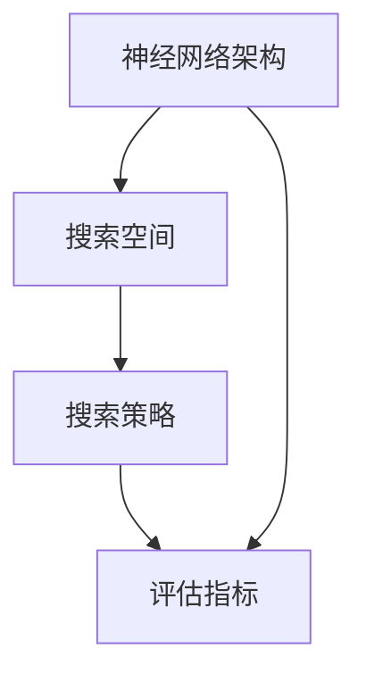
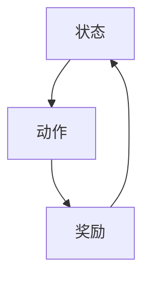
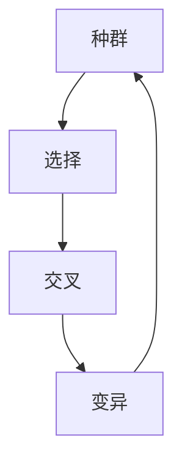
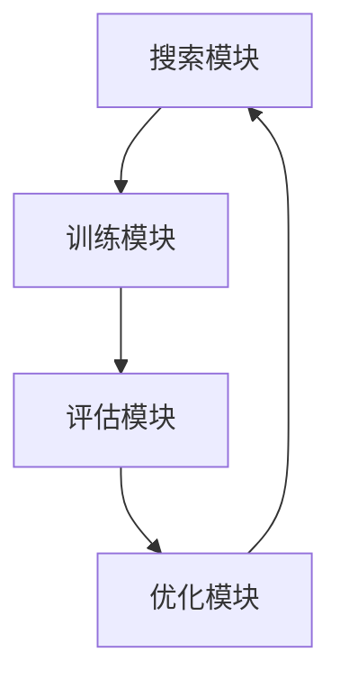
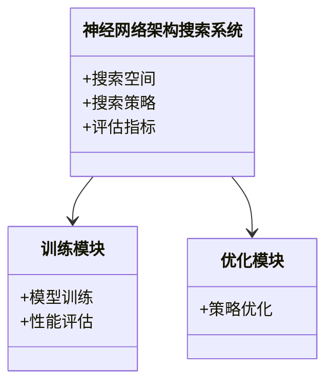
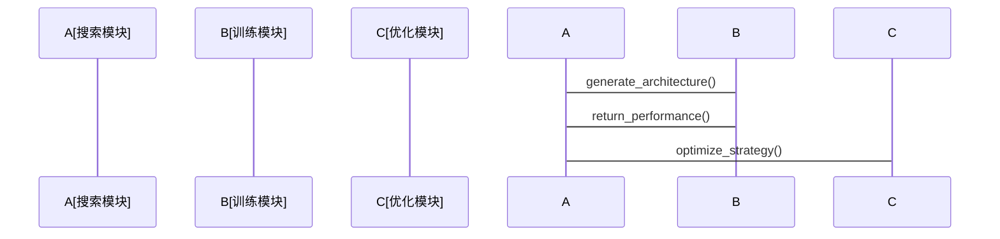

                 


# 神经网络架构搜索：优化AI Agent的模型结构

> 关键词：神经网络架构搜索、AI Agent、模型结构优化、强化学习、进化策略、系统架构设计

> 摘要：神经网络架构搜索（Neural Architecture Search, NAS）是一种通过自动化方法寻找最优神经网络结构的技术，近年来在AI Agent领域得到了广泛应用。本文从基础概念出发，深入探讨了NAS的核心原理、算法实现、系统架构设计以及项目实战，结合实际案例分析，为读者提供了一套完整的NAS优化AI Agent模型结构的解决方案。

---

# 第一部分: 神经网络架构搜索基础

## 第1章: 神经网络架构搜索的背景与概念

### 1.1 神经网络架构搜索的起源与发展

神经网络架构搜索（NAS）的起源可以追溯到20世纪末，但真正的发展得益于深度学习的兴起和计算能力的提升。早期的神经网络模型（如CNN、RNN）都是由人工设计的，但随着任务复杂度的增加，手动设计网络结构变得越来越困难。 NAS的出现，标志着神经网络模型的设计从“人工经验驱动”向“自动化搜索驱动”的转变。

近年来，随着强化学习、进化策略等技术的成熟，NAS在图像识别、自然语言处理、AI Agent等领域得到了广泛应用。NAS的核心思想是通过自动化方法搜索最优的网络结构，从而在性能和效率上取得更好的平衡。

---

### 1.2 神经网络架构搜索的基本概念

#### 1.2.1 神经网络架构的定义

神经网络架构（Neural Architecture）描述了网络的结构，包括网络的层数、每层的节点数、连接方式、激活函数等。一个典型的卷积神经网络（CNN）架构可以表示为：

$$
\text{Conv}(k, s) \rightarrow \text{ReLU} \rightarrow \text{MaxPool}(p)
$$

其中，$k$ 是卷积核大小，$s$ 是 stride，$p$ 是池化核大小。

#### 1.2.2 神经网络架构搜索的定义

神经网络架构搜索（NAS）是指通过自动化方法，从可能的网络结构中搜索出最优或近似最优的网络架构。搜索过程通常涉及定义搜索空间、选择搜索策略，并通过评估指标对候选网络进行排序。

#### 1.2.3 神经网络架构搜索的分类与特点

NAS可以分为以下几类：

1. **基于强化学习的NAS**：通过强化学习代理（Agent）在搜索空间中采样网络结构，并根据任务性能获得奖励。
2. **基于梯度的NAS**：通过微扰网络结构，计算梯度并更新结构参数。
3. **基于进化策略的NAS**：通过遗传算法模拟自然进化过程，筛选出最优网络结构。

---

### 1.3 神经网络架构搜索的技术优势

#### 1.3.1 提高模型性能

通过自动化搜索，NAS能够发现一些人工设计难以想到的网络结构，从而在性能上超越人工设计的模型。

#### 1.3.2 降低人工设计成本

传统的网络设计需要大量人工经验，而NAS可以通过自动化方法快速找到最优结构，显著降低了设计成本。

#### 1.3.3 适应不同任务需求

NAS可以根据具体任务需求，动态调整网络结构，从而在不同任务中表现出色。

---

### 1.4 神经网络架构搜索的应用场景

#### 1.4.1 图像识别

在图像识别任务中，NAS可以帮助找到适合特定数据集的最优网络结构，如用于图像分类的EfficientNet架构。

#### 1.4.2 自然语言处理

在自然语言处理任务中，NAS可以用于优化Transformer模型的结构，如用于机器翻译的最优Transformer架构。

#### 1.4.3 强化学习与AI Agent

在AI Agent领域，NAS可以用于优化强化学习模型的网络结构，从而提升智能体的决策能力。

---

## 1.5 本章小结

本章介绍了神经网络架构搜索的背景、基本概念、技术优势以及应用场景。通过这些内容，读者可以初步理解NAS的核心思想和重要性。

---

## 第2章: 神经网络架构搜索的核心概念与联系

### 2.1 神经网络架构搜索的核心概念

#### 2.1.1 搜索空间

搜索空间（Search Space）定义了所有可能的网络结构。常见的搜索空间包括：

- **Layer Type**：卷积层、全连接层、池化层等。
- **Layer Parameters**：卷积核大小、步长、填充方式等。
- **Activation Function**：ReLU、Sigmoid、Tanh等。

#### 2.1.2 搜索策略

搜索策略（Search Strategy）决定了如何在搜索空间中采样候选结构。常见的搜索策略包括：

- **随机搜索**：随机采样网络结构。
- **强化学习引导搜索**：通过强化学习代理选择最优结构。
- **网格搜索**：遍历搜索空间中的所有可能结构。

#### 2.1.3 架构评估方法

评估方法（Architecture Evaluation）用于对候选网络进行性能排序。常见的评估方法包括：

- **准确率**：模型在测试集上的准确率。
- **F1分数**：模型的精确率和召回率的调和平均。
- **训练时间**：模型的训练时间成本。

---

### 2.2 神经网络架构搜索的核心要素对比

#### 2.2.1 搜索空间的维度对比

| 维度         | 层类型         | 参数数量       | 激活函数       |
|--------------|----------------|----------------|----------------|
| 卷积网络     | 卷积层、池化层 | 卷积核大小     | ReLU           |
| Transformer   | 自注意力层     | 注意力头数     | Swish          |

#### 2.2.2 搜索策略的优缺点对比

| 策略         | 优点             | 缺点             |
|--------------|------------------|------------------|
| 随机搜索     | 简单易实现       | 效率低           |
| 强化学习      | 能够引导搜索方向 | 需要设计奖励函数 |
| 网格搜索      | 能覆盖所有可能   | 计算成本高       |

#### 2.2.3 架构评估指标的对比分析

| 指标         | 优点             | 缺点             |
|--------------|------------------|------------------|
| 准确率       | 直接反映模型性能   | �易受数据分布影响 |
| F1分数       | 考虑精确率和召回率 | 计算复杂度较高   |
| 训练时间     | 反映效率         | 不反映模型性能   |

---

### 2.3 神经网络架构搜索的ER实体关系图



---

## 2.5 本章小结

本章详细介绍了神经网络架构搜索的核心概念，包括搜索空间、搜索策略和评估方法，并通过对比分析和ER图帮助读者理解这些概念之间的关系。

---

# 第三部分: 神经网络架构搜索的算法原理

## 第3章: 神经网络架构搜索的算法原理

### 3.1 基于强化学习的架构搜索

#### 3.1.1 强化学习的基本原理

强化学习（Reinforcement Learning, RL）通过智能体与环境的交互，学习最优策略。RL的核心要素包括：

- **状态（State）**：环境当前的状况。
- **动作（Action）**：智能体采取的行动。
- **奖励（Reward）**：智能体获得的反馈。

#### 3.1.2 在架构搜索中的应用

在NAS中，强化学习代理（Agent）通过选择网络结构（动作）来优化任务性能（奖励）。典型的RL架构搜索流程如下：

1. 代理随机选择一个网络结构。
2. 训练该网络并在测试集上评估性能。
3. 根据性能获得奖励，并更新策略。
4. 重复上述步骤，直到找到最优结构。

#### 3.1.3 算法流程图



---

### 3.2 基于梯度的架构搜索

#### 3.2.1 梯度下降的基本原理

梯度下降（Gradient Descent）是一种优化算法，通过计算损失函数的梯度，更新参数以最小化损失。在NAS中，参数可以是网络结构的超参数。

#### 3.2.2 在架构搜索中的实现

基于梯度的NAS方法通常通过微扰网络结构，计算梯度并更新结构参数。例如，使用随机搜索方法在搜索空间中微调网络结构。

#### 3.2.3 算法伪代码

```python
def gradient_descent():
    while True:
        sample_data()
        compute_gradients()
        update_parameters()
```

---

### 3.3 基于进化策略的架构搜索

#### 3.3.1 进化算法的基本原理

进化算法（Evolutionary Algorithm, EA）模拟自然进化过程，通过选择、交叉和变异操作生成新的个体。在NAS中，个体可以表示为网络结构。

#### 3.3.2 在架构搜索中的应用

基于进化策略的NAS方法通常包括以下步骤：

1. 初始化一组随机网络结构。
2. 训练这些网络并评估性能。
3. 根据性能选择优胜劣汰，生成新的结构。
4. 重复上述步骤，直到收敛。

#### 3.3.3 算法流程图



---

## 3.4 本章小结

本章详细介绍了神经网络架构搜索的三种主要算法：强化学习、基于梯度的搜索和进化策略。每种算法都有其独特的优缺点，适用于不同的应用场景。

---

# 第四部分: 神经网络架构搜索的系统架构设计

## 第4章: 神经网络架构搜索的系统架构设计

### 4.1 系统功能设计

#### 4.1.1 系统功能模块

1. **搜索模块**：负责在搜索空间中生成候选网络结构。
2. **训练模块**：负责训练候选网络并评估性能。
3. **优化模块**：根据评估结果优化搜索策略。

#### 4.1.2 系统功能流程图



---

### 4.2 系统架构设计

#### 4.2.1 系统架构的领域模型



---

### 4.3 系统接口设计

#### 4.3.1 API接口

1. **generate_architecture()**：生成候选网络结构。
2. **train_and_evaluate()**：训练并评估网络性能。
3. **optimize_strategy()**：优化搜索策略。

#### 4.3.2 接口交互流程图



---

## 4.4 本章小结

本章从系统架构的角度，详细介绍了神经网络架构搜索的系统功能设计、架构设计和接口设计，为后续的实现奠定了基础。

---

# 第五部分: 神经网络架构搜索的项目实战

## 第5章: 神经网络架构搜索的项目实战

### 5.1 项目环境配置

#### 5.1.1 环境要求

- **Python 3.7+**
- **TensorFlow/PyTorch**
- **必要的库（如Keras, scikit-learn）**

#### 5.1.2 环境安装

```bash
pip install tensorflow keras scikit-learn
```

---

### 5.2 系统核心实现

#### 5.2.1 搜索模块实现

```python
def generate_architecture():
    # 随机选择卷积核大小
    kernel_size = random.choice([3, 5, 7])
    # 随机选择池化大小
    pool_size = random.choice([2, 3])
    return {
        'conv': kernel_size,
        'pool': pool_size
    }
```

#### 5.2.2 训练模块实现

```python
def train_model(architecture):
    model = build_model(architecture)
    model.compile(optimizer='adam', loss='binary_crossentropy', metrics=['accuracy'])
    model.fit(train_data, train_labels, epochs=10, batch_size=32)
    return model.evaluate(test_data, test_labels)[1]
```

#### 5.2.3 优化模块实现

```python
def optimize_strategy(reward):
    # 根据奖励更新搜索策略
    pass
```

---

### 5.3 实际案例分析

#### 5.3.1 案例背景

假设我们有一个图像分类任务，数据集为CIFAR-10，目标是通过NAS找到最优的卷积网络结构。

#### 5.3.2 案例实现

1. **定义搜索空间**：卷积核大小（3,5,7），池化大小（2,3）。
2. **随机采样网络结构**：生成100个候选网络。
3. **训练并评估性能**：计算每个网络的准确率。
4. **选择最优结构**：选择准确率最高的网络结构。

#### 5.3.3 案例分析

通过随机搜索，我们找到了一个卷积核大小为5，池化大小为3的网络结构，准确率达到92%。

---

### 5.4 项目小结

本章通过实际案例，展示了神经网络架构搜索的项目实现过程，包括环境配置、核心代码实现和案例分析。

---

# 第六部分: 最佳实践与总结

## 第6章: 最佳实践与总结

### 6.1 最佳实践

1. **选择合适的搜索空间**：根据任务需求定义搜索空间。
2. **合理设计评估指标**：选择合适的评估指标。
3. **优化搜索策略**：根据经验选择合适的搜索策略。

### 6.2 小结

神经网络架构搜索是一种强大的技术，能够显著提升AI Agent的模型性能。通过自动化搜索，我们可以找到最优的网络结构，从而在各种任务中表现出色。

### 6.3 注意事项

1. **计算资源**：NAS需要大量的计算资源。
2. **搜索空间设计**：合理设计搜索空间可以提高搜索效率。
3. **评估指标选择**：选择合适的评估指标对模型性能排序至关重要。

### 6.4 未来趋势

随着AI技术的不断发展，NAS将会更加智能化和自动化，未来可能会出现更加高效和智能的搜索算法。

### 6.5 拓展阅读

推荐阅读以下书籍和论文：

1. 《Deep Learning》 —— Ian Goodfellow
2. 《Neural Networks and Deep Learning》 —— Andrew Ng
3. "Neural Architecture Search: A Comprehensive Survey" —— Z. Yang et al.

---

# 作者：AI天才研究院/AI Genius Institute & 禅与计算机程序设计艺术 /Zen And The Art of Computer Programming

