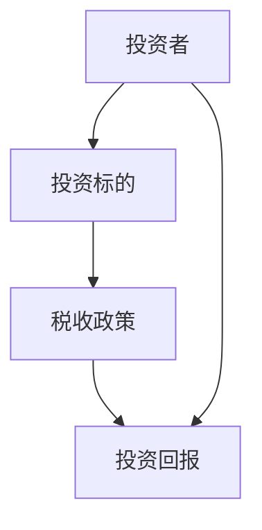
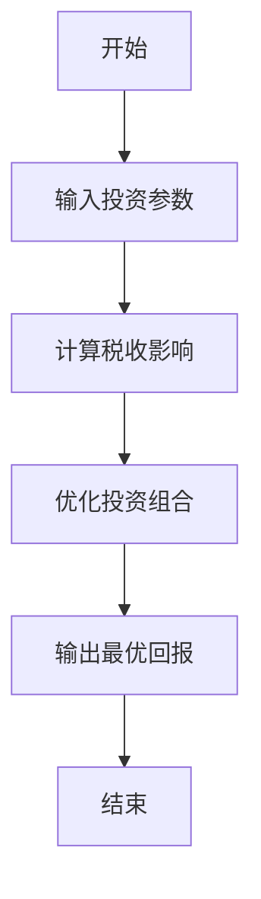
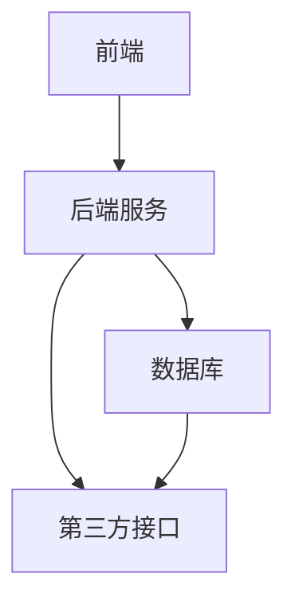

                 

# 税收效率投资：最大化投资回报的策略

## 关键词：税收效率，投资回报，最大化，策略，优化

## 摘要：  
税收效率投资是指通过优化税务规划和投资策略，最大化投资回报的过程。本文从背景、概念、算法、系统架构、实战案例等多维度深入分析税收效率投资的核心要素和实现策略，帮助读者掌握如何在投资决策中充分利用税收优惠政策，实现投资回报最大化。

---

## 目录大纲

### 第一部分：税收效率投资的背景与概念

#### 第1章：税收效率投资的定义与背景

##### 1.1 问题背景
- 税收政策对企业投资的影响
- 税收效率在投资决策中的重要性
- 当前投资回报率与税收效率的现状分析

##### 1.2 概念结构
- 投资回报的核心要素
- 税收效率的构成与影响
- 税收效率与投资回报的相互作用

##### 1.3 边界与外延
- 税收效率的适用范围
- 投资回报的边界条件
- 税收效率与投资回报的外延扩展

#### 第2章：税收效率与投资回报的核心概念

##### 2.1 核心概念
- 税收效率的定义与特征
- 投资回报的定义与计算
- 税收效率与投资回报的联系

##### 2.2 属性特征对比
- 税收效率与投资回报的属性对比
- 税收效率与投资回报的特征分析

##### 2.3 ER实体关系图

### 第二部分：税收效率投资的算法原理与数学模型

#### 第3章：税收效率投资的算法原理

##### 3.1 算法概述
- 税收效率投资的算法目标
- 税收效率投资的算法步骤
- 税收效率投资的算法特点

##### 3.2 数学模型
- 投资回报最大化模型
- 税收效率优化模型
- 税收与投资的协同优化模型

##### 3.3 算法流程图

### 第三部分：系统分析与架构设计

#### 第4章：系统功能设计

##### 4.1 系统功能模块
- 税收政策分析模块
- 投资回报计算模块
- 投资组合优化模块
- 风险评估与控制模块

##### 4.2 领域模型

#### 第5章：系统架构设计

##### 5.1 架构图

##### 5.2 接口设计
- API接口定义
- 接口调用流程
- 接口安全设计

### 第四部分：项目实战与案例分析

#### 第6章：项目实战

##### 6.1 环境安装
- 代码运行环境配置
- 第三方库安装

##### 6.2 核心实现
- 税收效率计算代码
- 投资组合优化代码

##### 6.3 代码解读
- 关键函数实现
- 代码逻辑分析

#### 第7章：案例分析

##### 7.1 实际案例
- 案例背景介绍
- 案例分析与解决
- 案例结果与总结

### 第五部分：最佳实践与总结

#### 第8章：最佳实践

##### 8.1 投资策略建议
- 税收效率优先策略
- 风险控制策略
- 长期投资策略

##### 8.2 小结
- 核心知识点回顾
- 实际应用中的注意事项
- 未来研究方向

#### 第9章：注意事项与拓展阅读

##### 9.1 注意事项
- 税收政策变化的影响
- 投资风险的控制
- 税收效率与回报的平衡

##### 9.2 拓展阅读
- 相关书籍推荐
- 专业期刊论文
- 在线课程资源

### 附录：作者信息

作者：AI天才研究院/AI Genius Institute & 禅与计算机程序设计艺术 /Zen And The Art of Computer Programming

---

这个大纲涵盖了税收效率投资的各个方面，从基础概念到算法实现，再到系统设计和项目实战，结构清晰，内容详实，适合深入研究和实践。

