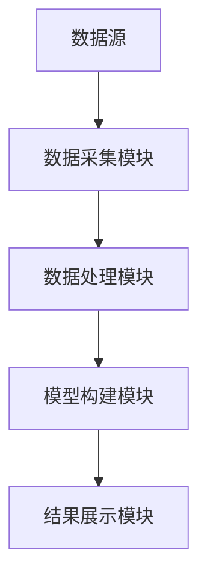
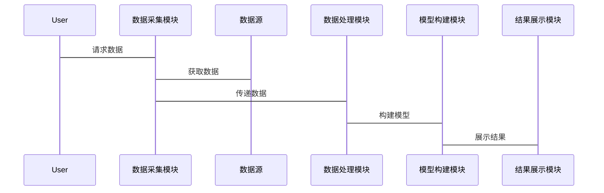

                 


# 约瑟夫·拉科尼克的价值投资者的质量评估

**关键词**：价值投资、质量评估、基本面分析、财务指标、投资策略、约瑟夫·拉科尼克

**摘要**：本文深入探讨了约瑟夫·拉科尼克的价值投资方法，重点分析了其质量评估的核心思想、方法和实际应用。通过系统化的分析和案例研究，本文为投资者提供了如何在实际操作中评估投资标的质量的实用指导。

---

## 第一部分：价值投资与质量评估基础

### 第1章：价值投资与质量评估概述

#### 1.1 价值投资的基本概念
##### 1.1.1 价值投资的定义与核心理念
价值投资是一种以内在价值为导向的投资策略，旨在通过分析企业的基本面，寻找被市场低估的投资标的。约瑟夫·拉科尼克的价值投资方法强调对企业质量的深度评估，而非单纯依赖市场情绪或短期价格波动。

##### 1.1.2 约瑟夫·拉科尼克的投资方法
约瑟夫·拉科尼克是价值投资领域的杰出代表，其投资方法的核心在于对企业质量的系统性评估。他强调通过分析企业的财务状况、竞争优势和行业地位，寻找具有长期增长潜力的优质企业。

##### 1.1.3 质量评估在价值投资中的重要性
质量评估是价值投资的关键环节，通过对企业的质量进行量化评估，投资者可以更准确地判断其内在价值，从而做出更为明智的投资决策。

#### 1.2 质量评估的核心要素
##### 1.2.1 质量评估的定义与目标
质量评估是指通过对企业的财务、管理、市场竞争力等多维度进行分析，量化其质量和潜在价值的过程。其目标是为投资者提供可靠的决策依据。

##### 1.2.2 质量评估的核心维度
质量评估的核心维度包括：
1. **财务状况**：如盈利能力、资产负债情况、现金流等。
2. **管理能力**：如管理层的稳定性、战略眼光等。
3. **市场竞争力**：如市场份额、产品创新能力等。
4. **行业地位**：如行业周期、竞争格局等。

##### 1.2.3 质量评估与投资决策的关系
质量评估是连接企业内在价值与投资决策的桥梁。通过质量评估，投资者可以更准确地判断企业的长期发展潜力，从而做出更为理性的投资决策。

#### 1.3 价值投资的背景与现状
##### 1.3.1 价值投资的历史发展
价值投资起源于20世纪初，其代表人物包括本杰明·格雷厄姆和菲利普·费雪。约瑟夫·拉科尼克在这一传统基础上，进一步发展了质量评估的方法论。

##### 1.3.2 当前价值投资的市场环境
当前，价值投资在金融市场中依然占据重要地位，尤其是在全球经济不确定性增加的背景下，优质企业的投资价值更加凸显。

##### 1.3.3 质量评估在现代投资中的应用
随着大数据和人工智能技术的发展，质量评估方法也在不断进化，从传统的财务指标分析，发展到多维度、多模型的综合评估体系。

---

## 第二部分：价值投资中的质量评估方法

### 第2章：质量评估的多维度模型

#### 2.1 基本面分析方法
##### 2.1.1 财务指标分析
财务指标是质量评估的重要组成部分。常用的指标包括：
- **ROE（净资产收益率）**：衡量企业盈利能力的重要指标。
- **ROA（资产净利率）**：衡量企业资产利用效率的指标。
- **毛利率**：衡量企业产品盈利能力的指标。
- **净利率**：衡量企业净利润与收入的比例。

##### 2.1.2 行业分析与竞争优势评估
行业分析是质量评估的另一个关键环节。通过分析行业周期、市场容量和竞争格局，可以更好地判断企业的竞争优势。

##### 2.1.3 质量评估的多维度模型
多维度模型将企业的财务状况、管理能力、市场竞争力等多个维度纳入评估体系，通过加权评分的方式，得出综合质量评分。

---

### 第3章：质量评估的算法原理

#### 3.1 质量评估的数学模型
##### 3.1.1 线性回归模型
线性回归模型是质量评估中常用的数学模型之一。其基本公式为：
$$ y = \beta_0 + \beta_1x_1 + \beta_2x_2 + \dots + \beta_nx_n $$

其中，$y$ 是质量评分，$x_i$ 是各个评估维度的指标，$\beta_i$ 是对应的回归系数。

##### 3.1.2 决策树模型
决策树模型是一种基于树状结构的分类模型，适用于多维度质量评估。其构建过程如下：
1. 选择最优特征，划分数据集。
2. 递归地构建子树，直到数据集无法进一步划分。
3. 剪枝，避免过拟合。

##### 3.1.3 神经网络模型
神经网络模型是一种非线性模型，适用于复杂的质量评估问题。其训练过程包括：
1. 初始化网络参数。
2. 前向传播，计算预测值。
3. 反向传播，调整网络参数。

---

## 第三部分：系统架构与质量评估方案

### 第4章：系统架构与质量评估方案

#### 4.1 系统架构设计
##### 4.1.1 系统功能模块划分
- 数据采集模块：负责收集企业的财务数据、行业数据等。
- 数据处理模块：对数据进行清洗、转换和标准化处理。
- 模型构建模块：基于多维度数据，构建质量评估模型。
- 结果展示模块：将评估结果以可视化的方式呈现。

##### 4.1.2 系统架构的Mermaid图


#### 4.2 系统交互流程
##### 4.2.1 系统交互的Mermaid序列图


#### 4.3 系统实现与测试
##### 4.3.1 系统实现的详细步骤
- 数据采集：通过API接口获取企业数据。
- 数据处理：使用Python的pandas库进行数据清洗。
- 模型构建：基于机器学习算法，构建质量评估模型。
- 结果展示：使用可视化工具（如Matplotlib）展示评估结果。

---

## 第四部分：质量评估的实战案例

### 第5章：质量评估的实战案例

#### 5.1 实战案例分析
##### 5.1.1 案例背景介绍
以某制造业企业为例，分析其质量评估的过程。

##### 5.1.2 数据收集与处理
收集企业的财务数据、行业数据和市场数据，进行清洗和标准化处理。

##### 5.1.3 模型构建与验证
基于线性回归模型，构建质量评估模型，并通过历史数据进行验证。

#### 5.2 案例实现与解读
##### 5.2.1 Python代码实现案例
```python
import pandas as pd
from sklearn.linear_model import LinearRegression

# 数据加载
data = pd.read_csv('data.csv')

# 模型训练
model = LinearRegression()
model.fit(data[['ROE', 'ROA', '毛利率']], data['质量评分'])

# 模型预测
print(model.predict([[20, 15, 30]]))
```

##### 5.2.2 案例结果的详细解读
通过模型预测，该企业的质量评分为85分，表明其具有较高的投资价值。

#### 5.3 案例总结与经验分享
##### 5.3.1 案例总结
质量评估是价值投资的核心环节，准确的质量评估能够帮助投资者做出更为明智的投资决策。

##### 5.3.2 实战经验分享
在实际操作中，建议投资者结合多种评估方法，综合分析企业的质量，以提高评估的准确性。

---

## 第五部分：结论与展望

### 第6章：结论与展望

#### 6.1 研究总结
本文深入探讨了约瑟夫·拉科尼克的价值投资方法，重点分析了其质量评估的核心思想和实际应用。通过系统化的分析和案例研究，为投资者提供了如何在实际操作中评估投资标的质量的实用指导。

#### 6.2 未来展望
随着人工智能和大数据技术的不断发展，质量评估方法将更加精准和多样化。未来的研究可以进一步探索如何将这些技术应用于价值投资的实践中，以实现更高效的投资决策。

---

**作者**：AI天才研究院 & 禅与计算机程序设计艺术

