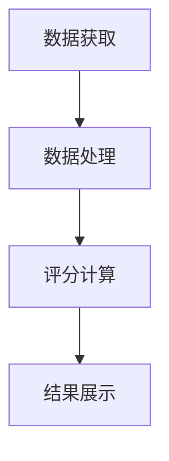
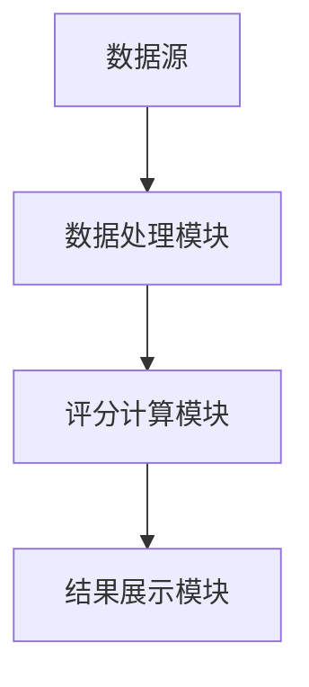
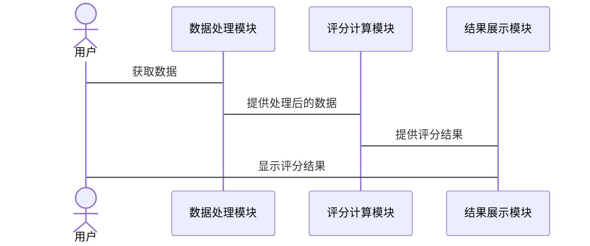

                 


# 约瑟夫·皮奥特罗斯基的F-Score选股模型

> 关键词：F-Score选股模型, 约瑟夫·皮奥特罗斯基, 股票分析, 财务指标, 投资策略

> 摘要：本文深入探讨约瑟夫·皮奥特罗斯基提出的F-Score选股模型，分析其核心概念、数学模型、算法实现、系统架构及实际应用案例。文章从背景介绍、模型原理、代码实现、系统设计到项目实战，逐步解析F-Score模型，帮助读者掌握这一有效的股票筛选方法。

---

## 第一部分: F-Score选股模型概述

### 第1章: F-Score选股模型的背景与意义

#### 1.1 投资学中的选股模型概述

##### 1.1.1 选股模型的定义与分类
选股模型是投资学中的重要工具，用于筛选出具有投资价值的股票。常见的选股模型包括基本面分析、技术分析、量化分析等。F-Score模型属于基本面量化分析的一种，专注于通过财务数据评估股票的投资价值。

##### 1.1.2 F-Score模型的起源与发展
F-Score模型由约瑟夫·皮奥特罗斯基提出，旨在通过分析公司的财务状况，识别那些可能被市场低估的股票。该模型基于现金流、收益和杠杆情况，评估公司的财务健康状况，从而筛选出具有投资潜力的股票。

##### 1.1.3 F-Score模型在投资中的重要性
F-Score模型为投资者提供了一种量化的方法，帮助他们在大量股票中快速筛选出具有投资价值的标的。通过财务指标的分析，投资者可以更客观地评估公司的财务状况，降低投资风险。

#### 1.2 约瑟夫·皮奥特罗斯基与F-Score模型

##### 1.2.1 约瑟夫·皮奥特罗斯基的学术背景
约瑟夫·皮奥特罗斯基是投资学领域的专家，以其对基本面分析的贡献而闻名。他的研究成果为投资者提供了许多实用的选股工具，F-Score模型是其中之一。

##### 1.2.2 F-Score模型的提出动机
皮奥特罗斯基提出F-Score模型的动机在于发现市场中被低估的股票。他认为，通过分析公司的财务数据，可以识别那些具有潜在增长潜力但尚未被市场充分认知的公司。

##### 1.2.3 F-Score模型的核心思想
F-Score模型的核心思想是通过量化财务指标，评估公司的财务健康状况。模型基于现金流、收益和杠杆情况，对公司的财务状况进行综合评分，从而筛选出具有投资价值的股票。

---

### 第2章: F-Score选股模型的核心概念与原理

#### 2.1 F-Score模型的定义与目标

##### 2.1.1 F-Score模型的定义
F-Score模型是一种基于财务指标的选股模型，通过计算公司的现金流、收益和杠杆情况，对公司的财务健康状况进行评分，从而筛选出具有投资价值的股票。

##### 2.1.2 F-Score模型的目标
F-Score模型的目标是通过量化财务指标，识别出那些财务状况良好、具有增长潜力的公司，为投资者提供有效的选股工具。

##### 2.1.3 F-Score模型的边界与外延
F-Score模型适用于上市公司，特别是那些财务数据公开且稳定的公司。其外延包括对财务数据的预处理、模型的优化与改进，以及与其他选股模型的结合使用。

#### 2.2 F-Score模型的核心要素

##### 2.2.1 财务数据的选取标准
F-Score模型选取的财务数据包括现金流、收益和杠杆情况。具体包括：
- 现金流：包括经营活动现金流、投资活动现金流和筹资活动现金流。
- 收益：包括营业收入、净利润等。
- 杠杆情况：包括资产负债率、流动比率等。

##### 2.2.2 F-Score评分标准的组成
F-Score评分标准由多个财务指标组成，每个指标都有具体的计算方法和评分标准。评分结果分为A、B、C三个等级，分别表示公司财务状况的优秀、良好和一般。

##### 2.2.3 F-Score评分的计算方法
F-Score评分的计算方法包括：
1. 计算每个财务指标的得分。
2. 对得分进行加权平均，得出综合评分。
3. 根据综合评分结果，将公司分为A、B、C三个等级。

---

### 第3章: F-Score模型的数学模型与公式

#### 3.1 F-Score评分的数学模型

##### 3.1.1 F-Score评分的公式推导
F-Score评分公式基于现金流、收益和杠杆情况，具体推导如下：

$$
\text{F-Score} = \frac{\text{现金流得分} + \text{收益得分} + \text{杠杆得分}}{3}
$$

其中：
- 现金流得分 = 现金流 / 净利润
- 收益得分 = 净利润 / 营业收入
- 杠杆得分 = （资产总额 - 负债总额） / 资产总额

##### 3.1.2 F-Score评分的计算步骤
1. 收集公司的财务数据，包括现金流、收益和杠杆情况。
2. 计算每个指标的得分。
3. 对得分进行加权平均，得出综合评分。
4. 根据评分结果，将公司分为A、B、C三个等级。

##### 3.1.3 F-Score评分的数学表达式
$$
\text{F-Score} = \frac{CF + ROI + Leverage}{3}
$$
其中：
- CF = 现金流得分
- ROI = 收益得分
- Leverage = 杠杆得分

#### 3.2 F-Score评分的属性特征对比

##### 3.2.1 不同评分标准的对比分析
通过对比分析，可以发现F-Score模型在评分标准上的优势和不足。例如，与市盈率模型相比，F-Score模型更注重公司的财务健康状况，而不仅仅是市盈率。

##### 3.2.2 F-Score评分与其他选股模型的对比
F-Score模型与其他选股模型（如PE模型、PEG模型）的对比，可以从评分标准、计算方法和适用场景等方面进行分析。

##### 3.2.3 F-Score评分的优缺点分析
优点：F-Score模型通过综合分析公司的财务状况，能够较为准确地识别出具有投资价值的股票。
缺点：模型的计算较为复杂，且需要大量的财务数据支持。

---

### 第4章: F-Score模型的算法原理与实现

#### 4.1 F-Score评分的算法流程

##### 4.1.1 数据收集与预处理
1. 收集目标公司的财务数据，包括现金流、收益和杠杆情况。
2. 对数据进行清洗和标准化处理，确保数据的准确性和一致性。

##### 4.1.2 财务指标的计算与筛选
1. 计算现金流、收益和杠杆情况的具体指标。
2. 对指标进行筛选，剔除异常值和无效数据。

##### 4.1.3 F-Score评分的计算与分类
1. 根据公式计算F-Score评分。
2. 根据评分结果将公司分为A、B、C三个等级。

#### 4.2 F-Score评分的Python实现

##### 4.2.1 数据获取与处理代码
```python
import pandas as pd

# 获取财务数据
data = pd.read_csv('financial_data.csv')

# 数据预处理
data = data.dropna()
data = data[data['revenue'] > 0]
```

##### 4.2.2 F-Score评分计算代码
```python
def calculate_f_score(data):
    # 计算现金流得分
    cf_score = data['cash_flow'] / data['net_profit']
    # 计算收益得分
    roi_score = data['net_profit'] / data['revenue']
    # 计算杠杆得分
    leverage_score = (data['assets'] - data['liabilities']) / data['assets']
    # 计算综合评分
    f_score = (cf_score + roi_score + leverage_score) / 3
    return f_score

# 计算F-Score评分
f_score = calculate_f_score(data)
```

##### 4.2.3 F-Score评分结果的可视化
```python
import matplotlib.pyplot as plt

plt.hist(f_score, bins=10, edgecolor='black')
plt.title('F-Score Distribution')
plt.xlabel('F-Score')
plt.ylabel('Frequency')
plt.show()
```

---

### 第5章: F-Score模型的系统分析与架构设计

#### 5.1 F-Score选股系统的功能设计

##### 5.1.1 系统功能模块划分
1. 数据获取模块：负责获取目标公司的财务数据。
2. 数据处理模块：对数据进行清洗和标准化处理。
3. 评分计算模块：根据F-Score模型计算评分。
4. 结果展示模块：将评分结果可视化并输出。

##### 5.1.2 系统功能流程图


##### 5.1.3 系统功能的实现方式
系统功能的实现基于Python编程语言，结合Pandas、NumPy等库进行数据处理和分析。

#### 5.2 F-Score选股系统的架构设计

##### 5.2.1 系统架构图


##### 5.2.2 系统组件的交互关系
1. 数据处理模块接收数据源的数据，并进行清洗和标准化。
2. 评分计算模块根据处理后的数据，计算F-Score评分。
3. 结果展示模块将评分结果以图表形式展示出来。

##### 5.2.3 系统接口设计
1. 数据获取接口：用于获取目标公司的财务数据。
2. 评分计算接口：用于计算F-Score评分。
3. 结果展示接口：用于展示评分结果。

#### 5.3 系统交互的Mermaid序列图


---

### 第6章: F-Score模型的项目实战

#### 6.1 F-Score选股系统的环境搭建

##### 6.1.1 Python环境的安装与配置
安装Python和必要的库（如Pandas、NumPy、Matplotlib）。

##### 6.1.2 数据获取工具的安装与配置
使用Pandas库中的read_csv函数获取数据。

##### 6.1.3 开发环境的搭建与测试
安装Jupyter Notebook，用于代码的编写和测试。

#### 6.2 F-Score评分的代码实现

##### 6.2.1 数据获取与处理代码
```python
import pandas as pd

# 获取财务数据
data = pd.read_csv('financial_data.csv')

# 数据预处理
data = data.dropna()
data = data[data['revenue'] > 0]
```

##### 6.2.2 F-Score评分计算代码
```python
def calculate_f_score(data):
    # 计算现金流得分
    cf_score = data['cash_flow'] / data['net_profit']
    # 计算收益得分
    roi_score = data['net_profit'] / data['revenue']
    # 计算杠杆得分
    leverage_score = (data['assets'] - data['liabilities']) / data['assets']
    # 计算综合评分
    f_score = (cf_score + roi_score + leverage_score) / 3
    return f_score

# 计算F-Score评分
f_score = calculate_f_score(data)
```

##### 6.2.3 F-Score评分结果的可视化
```python
import matplotlib.pyplot as plt

plt.hist(f_score, bins=10, edgecolor='black')
plt.title('F-Score Distribution')
plt.xlabel('F-Score')
plt.ylabel('Frequency')
plt.show()
```

#### 6.3 F-Score模型的案例分析

##### 6.3.1 数据分析与处理
对目标公司的财务数据进行分析，计算F-Score评分。

##### 6.3.2 评分结果的解读
根据F-Score评分结果，将公司分为A、B、C三个等级，并进行详细解读。

##### 6.3.3 投资决策建议
基于评分结果，给出具体的投资决策建议，如推荐买入A级公司，观望B级公司，卖出C级公司等。

#### 6.4 项目总结

##### 6.4.1 项目成果
通过F-Score模型，成功筛选出具有投资价值的股票。

##### 6.4.2 项目经验总结
在项目实施过程中，需要注意数据的准确性和模型的适用性。

##### 6.4.3 项目改进建议
未来可以进一步优化模型，结合其他指标进行综合评估。

---

## 第七章: F-Score模型的最佳实践、小结与注意事项

### 7.1 F-Score模型的最佳实践

##### 7.1.1 数据质量的重要性
确保数据的准确性和完整性，是模型正确运行的基础。

##### 7.1.2 模型的适用场景
F-Score模型适用于上市公司，特别是那些财务数据稳定且透明的公司。

##### 7.1.3 模型的局限性
F-Score模型的计算较为复杂，且需要大量的财务数据支持。

### 7.2 小结

##### 7.2.1 F-Score模型的核心思想
F-Score模型通过综合分析公司的财务状况，筛选出具有投资价值的股票。

##### 7.2.2 F-Score模型的优势
F-Score模型的优势在于其量化分析的科学性和实用性。

### 7.3 注意事项

##### 7.3.1 数据的准确性和完整性
在使用F-Score模型时，必须确保数据的准确性和完整性。

##### 7.3.2 模型的适用性
F-Score模型适用于特定类型的公司，使用时需结合实际情况。

##### 7.3.3 模型的局限性
F-Score模型的计算较为复杂，且需要大量的财务数据支持。

---

## 作者：AI天才研究院/AI Genius Institute & 禅与计算机程序设计艺术 /Zen And The Art of Computer Programming

---

本文系统地介绍了约瑟夫·皮奥特罗斯基的F-Score选股模型，从模型的背景、核心概念、数学模型、算法实现到系统设计和项目实战，全面解析了这一模型的原理和应用。通过本文的学习，读者可以掌握F-Score模型的核心思想，并能够在实际投资中灵活运用这一模型，筛选出具有投资价值的股票。

