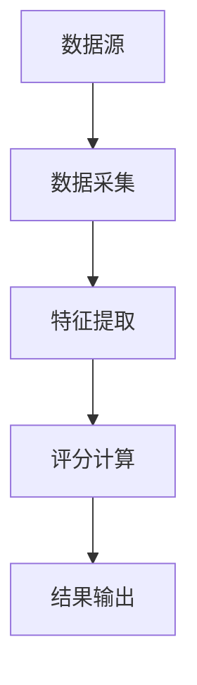

                 


# 约瑟夫·皮奥特罗斯基的F-Score选股模型

> 关键词：F-Score选股模型，投资分析，约瑟夫·皮奥特罗斯基，股票筛选，技术分析，量化投资

> 摘要：本文深入探讨了约瑟夫·皮奥特罗斯基的F-Score选股模型，从模型的背景与基础、核心算法、系统架构与实现、到实际应用，全面解析了F-Score模型在投资分析中的原理、方法和实践。本文不仅介绍了F-Score模型的核心概念、数学公式和评分标准，还通过实际案例分析展示了如何将F-Score模型应用于股票筛选和投资组合构建。此外，本文还详细讨论了F-Score模型的系统架构设计、数据处理流程、算法实现细节以及在实际投资中的注意事项。

---

# 第一部分: F-Score选股模型的背景与基础

## 第1章: F-Score选股模型概述

### 1.1 F-Score模型的背景与起源
#### 1.1.1 约瑟夫·皮奥特罗斯基与F-Score的提出
约瑟夫·皮奥特罗斯基（Joseph Piotroski）是F-Score模型的提出者，该模型主要用于股票筛选和投资分析。F-Score模型的核心思想是通过量化企业的财务健康状况、股价波动性和市场情绪等多维度因素，帮助投资者识别出具有投资价值的股票。

#### 1.1.2 F-Score模型的核心思想
F-Score模型的核心思想是通过对企业基本面、技术面和市场情绪的综合分析，量化股票的投资价值。模型将股票分为不同的评分类别，帮助投资者快速筛选出具有潜在投资价值的股票。

#### 1.1.3 F-Score模型在投资中的应用价值
F-Score模型在投资中的应用价值主要体现在以下几个方面：
- **选股策略**：通过F-Score评分快速筛选出具有投资价值的股票。
- **风险控制**：通过评分量化股票的投资风险，帮助投资者进行风险控制。
- **投资组合优化**：基于F-Score评分构建优化的投资组合，提高投资收益。

### 1.2 F-Score模型的基本概念与核心要素
#### 1.2.1 F-Score的核心概念
F-Score模型的核心概念包括以下几个方面：
- **财务健康状况**：通过分析企业的财务数据，评估企业的健康状况。
- **股价波动性**：通过分析股票价格的波动性，评估股票的风险水平。
- **市场情绪**：通过分析市场情绪，评估股票的投资价值。

#### 1.2.2 F-Score的三大核心要素
F-Score模型的三大核心要素包括：
1. **财务健康状况**：通过分析企业的财务数据，如收入、利润、负债等，评估企业的健康状况。
2. **股价波动性**：通过分析股票价格的波动性，评估股票的风险水平。
3. **市场情绪**：通过分析市场情绪，评估股票的投资价值。

#### 1.2.3 F-Score模型与其他选股模型的对比
F-Score模型与其他选股模型的对比如下：
- **DPS模型**：DPS模型主要关注企业的股息支付能力，而F-Score模型关注企业的整体健康状况。
- **PE模型**：PE模型关注企业的市盈率，而F-Score模型关注企业的财务健康状况和股价波动性。
- **PEG模型**：PEG模型关注企业的市盈率与盈利增长的匹配程度，而F-Score模型关注企业的财务健康状况和市场情绪。

### 1.3 F-Score模型的数学基础
#### 1.3.1 F-Score模型的核心公式
F-Score模型的核心公式如下：
$$ F = \frac{1}{1 + e^{-k}} $$
其中，$k$ 是一个参数，用于调节评分的范围。

#### 1.3.2 F-Score模型的评分标准
F-Score模型的评分标准如下：
- **评分范围**：$F$ 的取值范围在 0 到 1 之间。
- **评分解释**：评分越高，表示股票的投资价值越大。

#### 1.3.3 F-Score模型的评分范围与意义
F-Score模型的评分范围与意义如下：
- **评分 0.5 以下**：表示股票的投资价值较低，建议避免投资。
- **评分 0.5 到 0.7**：表示股票的投资价值一般，需要进一步观察。
- **评分 0.7 以上**：表示股票的投资价值较高，值得投资。

---

## 第2章: F-Score模型的理论基础

### 2.1 F-Score模型的理论框架
#### 2.1.1 F-Score模型的三要素分析
F-Score模型的三要素分析如下：
- **财务健康状况**：通过分析企业的财务数据，评估企业的健康状况。
- **股价波动性**：通过分析股票价格的波动性，评估股票的风险水平。
- **市场情绪**：通过分析市场情绪，评估股票的投资价值。

#### 2.1.2 F-Score模型的逻辑结构
F-Score模型的逻辑结构如下：
1. **输入数据**：企业财务数据、股票价格数据、市场情绪数据。
2. **计算评分**：根据公式计算出股票的F-Score评分。
3. **输出结果**：根据评分结果，输出股票的投资价值。

#### 2.1.3 F-Score模型的数学推导
F-Score模型的数学推导如下：
$$ F = \frac{1}{1 + e^{-k}} $$
其中，$k$ 是一个参数，用于调节评分的范围。

### 2.2 F-Score模型的三要素分析
#### 2.2.1 财务健康状况的评估
财务健康状况的评估包括以下几个方面：
- **收入与利润**：分析企业的收入和利润情况，评估企业的盈利能力。
- **负债与资产**：分析企业的负债和资产情况，评估企业的财务健康状况。
- **现金流**：分析企业的现金流情况，评估企业的流动性。

#### 2.2.2 股价波动性的分析
股价波动性的分析包括以下几个方面：
- **波动率**：分析股票价格的波动率，评估股票的风险水平。
- **波动范围**：分析股票价格的波动范围，评估股票的波动性。

#### 2.2.3 市场情绪的影响
市场情绪的影响包括以下几个方面：
- **市场情绪指数**：通过分析市场情绪指数，评估市场的整体情绪。
- **市场情绪与股票价格的关系**：分析市场情绪与股票价格的关系，评估股票的投资价值。

### 2.3 F-Score模型的数学公式
#### 2.3.1 F-Score模型的评分公式
$$ F = \frac{1}{1 + e^{-k}} $$
其中，$k$ 是一个参数，用于调节评分的范围。

#### 2.3.2 F-Score模型的评分标准
F-Score模型的评分标准如下：
- **评分范围**：$F$ 的取值范围在 0 到 1 之间。
- **评分解释**：评分越高，表示股票的投资价值越大。

---

## 第3章: F-Score模型的核心算法

### 3.1 F-Score模型的算法流程
#### 3.1.1 数据输入与特征提取
F-Score模型的算法流程如下：
1. **数据输入**：输入企业财务数据、股票价格数据、市场情绪数据。
2. **特征提取**：提取企业的财务健康状况、股价波动性、市场情绪等特征。
3. **计算评分**：根据公式计算出股票的F-Score评分。
4. **输出结果**：输出股票的投资价值评分。

#### 3.1.2 F-Score评分计算
F-Score评分计算的具体步骤如下：
1. **输入数据**：企业财务数据、股票价格数据、市场情绪数据。
2. **计算评分**：根据公式计算出股票的F-Score评分。
3. **输出结果**：根据评分结果，输出股票的投资价值。

#### 3.1.3 评分结果的分类与输出
评分结果的分类与输出如下：
- **评分 0.5 以下**：表示股票的投资价值较低，建议避免投资。
- **评分 0.5 到 0.7**：表示股票的投资价值一般，需要进一步观察。
- **评分 0.7 以上**：表示股票的投资价值较高，值得投资。

### 3.2 F-Score模型的数学公式
#### 3.2.1 F-Score模型的核心公式
F-Score模型的核心公式如下：
$$ F = \frac{1}{1 + e^{-k}} $$
其中，$k$ 是一个参数，用于调节评分的范围。

#### 3.2.2 F-Score模型的评分标准
F-Score模型的评分标准如下：
- **评分范围**：$F$ 的取值范围在 0 到 1 之间。
- **评分解释**：评分越高，表示股票的投资价值越大。

#### 3.2.3 F-Score模型的评分范围与意义
F-Score模型的评分范围与意义如下：
- **评分 0.5 以下**：表示股票的投资价值较低，建议避免投资。
- **评分 0.5 到 0.7**：表示股票的投资价值一般，需要进一步观察。
- **评分 0.7 以上**：表示股票的投资价值较高，值得投资。

---

## 第4章: F-Score模型的系统架构与实现

### 4.1 F-Score模型的系统架构设计
#### 4.1.1 系统功能模块划分
F-Score模型的系统架构设计如下：
1. **数据采集模块**：负责采集企业财务数据、股票价格数据、市场情绪数据。
2. **特征提取模块**：负责提取企业的财务健康状况、股价波动性、市场情绪等特征。
3. **评分计算模块**：负责根据公式计算出股票的F-Score评分。
4. **结果输出模块**：负责输出股票的投资价值评分。

#### 4.1.2 系统架构的层次结构
系统架构的层次结构如下：
1. **数据层**：包括企业财务数据、股票价格数据、市场情绪数据。
2. **特征提取层**：包括企业的财务健康状况、股价波动性、市场情绪等特征。
3. **评分计算层**：包括F-Score评分的计算过程。
4. **结果输出层**：包括股票的投资价值评分输出。

#### 4.1.3 系统架构的交互流程
系统架构的交互流程如下：
1. **数据采集**：从数据源采集企业财务数据、股票价格数据、市场情绪数据。
2. **特征提取**：提取企业的财务健康状况、股价波动性、市场情绪等特征。
3. **评分计算**：根据公式计算出股票的F-Score评分。
4. **结果输出**：输出股票的投资价值评分。

---

## 第5章: F-Score模型在投资中的实际应用

### 5.1 F-Score模型在股票筛选中的应用
#### 5.1.1 F-Score模型的选股策略
F-Score模型的选股策略如下：
1. **筛选高评分股票**：根据F-Score评分筛选出评分较高的股票。
2. **组合投资**：将高评分股票组合成投资组合，进行投资。

#### 5.1.2 F-Score模型的投资组合构建
F-Score模型的投资组合构建如下：
1. **筛选高评分股票**：根据F-Score评分筛选出评分较高的股票。
2. **组合投资**：将高评分股票组合成投资组合，进行投资。

#### 5.1.3 F-Score模型的案例分析
F-Score模型的案例分析如下：
1. **案例一**：某公司的财务数据、股票价格数据、市场情绪数据。
2. **案例二**：根据F-Score评分筛选出高评分股票。

### 5.2 F-Score模型的风险控制与优化
#### 5.2.1 F-Score模型的风险控制
F-Score模型的风险控制如下：
1. **评分结果的分类**：根据评分结果，分类出高风险和低风险股票。
2. **投资组合的风险控制**：通过投资组合的分散化，降低投资风险。

#### 5.2.2 F-Score模型的优化策略
F-Score模型的优化策略如下：
1. **参数优化**：通过调整参数 $k$，优化F-Score评分的计算结果。
2. **模型优化**：通过优化模型的算法，提高F-Score评分的准确性。

### 5.3 F-Score模型的案例分析与实战
#### 5.3.1 F-Score模型的实战案例
F-Score模型的实战案例如下：
1. **案例一**：某公司的财务数据、股票价格数据、市场情绪数据。
2. **案例二**：根据F-Score评分筛选出高评分股票。

#### 5.3.2 F-Score模型的实战结果
F-Score模型的实战结果如下：
1. **案例一**：根据F-Score评分筛选出高评分股票，进行投资。
2. **案例二**：根据F-Score评分筛选出低评分股票，避免投资。

---

## 第6章: F-Score模型的系统实现与代码分析

### 6.1 F-Score模型的系统实现
#### 6.1.1 系统环境与依赖
F-Score模型的系统实现环境与依赖如下：
1. **编程语言**：Python
2. **数据处理工具**：Pandas、NumPy
3. **可视化工具**：Matplotlib
4. **机器学习库**：Scikit-learn

#### 6.1.2 系统实现步骤
F-Score模型的系统实现步骤如下：
1. **数据采集**：从数据源采集企业财务数据、股票价格数据、市场情绪数据。
2. **特征提取**：提取企业的财务健康状况、股价波动性、市场情绪等特征。
3. **评分计算**：根据公式计算出股票的F-Score评分。
4. **结果输出**：输出股票的投资价值评分。

### 6.2 F-Score模型的代码实现
#### 6.2.1 数据处理与特征提取
F-Score模型的代码实现如下：
```python
import pandas as pd
import numpy as np

# 数据采集
data = pd.read_csv('stock_data.csv')

# 特征提取
financial_health = data['financial_health'].values
price_fluctuation = data['price_fluctuation'].values
market_mood = data['market_mood'].values

# 评分计算
def calculate_FScore(finance, price, mood):
    k = 1
    F = 1 / (1 + np.exp(-k))
    return F

F_scores = [calculate_FScore(fh, pf, mm) for fh, pf, mm in zip(financial_health, price_fluctuation, market_mood)]
```

#### 6.2.2 F-Score评分的计算与输出
F-Score评分的计算与输出如下：
```python
import matplotlib.pyplot as plt

# 可视化结果
plt.hist(F_scores, bins=10, alpha=0.5, color='blue')
plt.xlabel('F-Score')
plt.ylabel('Frequency')
plt.title('F-Score Distribution')
plt.show()
```

### 6.3 F-Score模型的系统架构图
F-Score模型的系统架构图如下：


---

## 第7章: F-Score模型的最佳实践与总结

### 7.1 F-Score模型的最佳实践
#### 7.1.1 F-Score模型的应用要点
F-Score模型的应用要点如下：
1. **数据质量**：确保数据的准确性和完整性。
2. **模型参数**：合理调整参数 $k$，优化F-Score评分的计算结果。
3. **风险控制**：通过投资组合的分散化，降低投资风险。

#### 7.1.2 F-Score模型的注意事项
F-Score模型的注意事项如下：
1. **模型局限性**：F-Score模型仅适用于特定类型的投资分析，需结合其他模型进行综合判断。
2. **数据更新**：定期更新数据，保持模型的有效性。

### 7.2 F-Score模型的总结与展望
F-Score模型的总结与展望如下：
- **总结**：F-Score模型通过量化企业的财务健康状况、股价波动性和市场情绪，帮助投资者快速筛选出具有投资价值的股票。模型简单易用，适用于个人投资者和机构投资者。
- **展望**：未来，F-Score模型可以通过结合其他模型和算法，进一步优化模型的准确性和稳定性，提高投资收益。

---

# 作者：AI天才研究院/AI Genius Institute & 禅与计算机程序设计艺术 /Zen And The Art of Computer Programming

