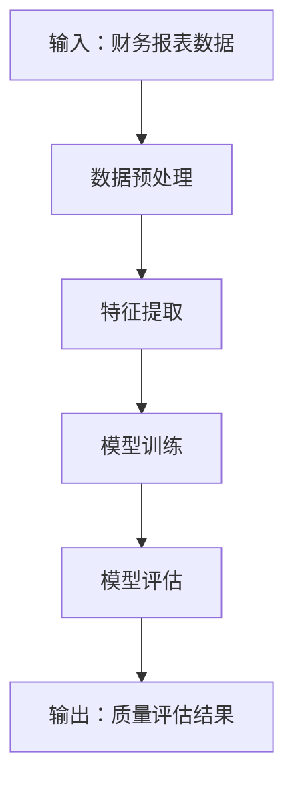
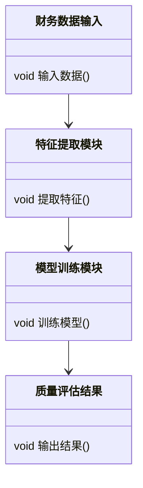
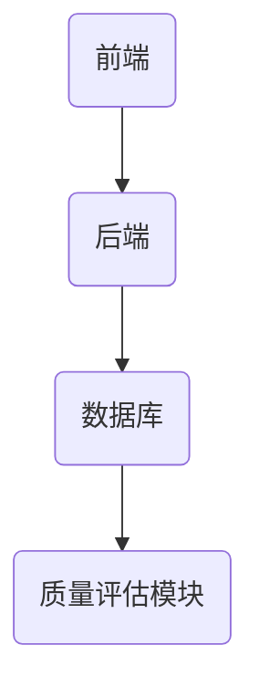

                 


# 《约瑟夫·皮奥特罗斯基的财务报表质量评估》

---

## 关键词：财务报表质量评估，约瑟夫·皮奥特罗斯基，财务数据分析，统计模型，企业财务管理

---

## 摘要

本文深入探讨了约瑟夫·皮奥特罗斯基的财务报表质量评估方法，从理论基础到实际应用进行了全面分析。文章首先介绍了财务报表质量评估的背景与重要性，然后详细阐述了皮奥特罗斯基模型的核心概念、算法原理和系统架构。通过实际案例分析，展示了该方法在企业财务管理中的应用价值，并提出了优化建议和未来研究方向。本文旨在为财务分析师、审计师和企业管理者提供一套科学的财务报表质量评估体系，帮助他们在复杂多变的商业环境中做出更明智的决策。

---

## 第一部分：财务报表质量评估概述

### 第1章：财务报表质量评估的背景与概述

#### 1.1 财务报表质量评估的背景

随着全球经济的快速发展，企业面临的财务风险日益复杂。财务报表作为企业经济活动的重要记录，是投资者、债权人和管理层做出决策的关键依据。然而，财务报表的质量直接关系到这些决策的准确性和可靠性。如何有效评估财务报表的质量，成为企业财务管理中的核心问题之一。

约瑟夫·皮奥特罗斯基（Joseph Piotroski）作为一名财务学家，以其创新的方法在财务报表质量评估领域取得了重要突破。他的研究成果不仅为学术界提供了新的视角，也为企业的财务管理实践提供了有力工具。

#### 1.2 财务报表质量评估的核心概念

财务报表质量评估是指通过对财务报表中的数据进行分析，判断其真实性和可靠性。高质量的财务报表能够准确反映企业的财务状况，为利益相关者提供可靠的决策依据。低质量的财务报表则可能导致决策失误，甚至引发企业危机。

皮奥特罗斯基模型的核心在于通过量化分析，识别财务报表中的异常值和潜在风险。这种方法不仅考虑了财务数据的表面特征，还深入分析了数据背后的企业经营状况。

#### 1.3 皮奥特罗斯基的财务报表质量评估方法

皮奥特罗斯基的方法基于以下核心思想：

1. **数据驱动**：通过统计分析和数学模型，从财务报表中提取关键指标。
2. **风险导向**：重点关注财务数据中的异常值和潜在风险。
3. **可操作性**：模型的输出可以直接应用于企业的财务管理决策。

该方法的主要步骤包括：

1. **数据收集**：从财务报表中提取关键数据。
2. **特征提取**：识别影响财务报表质量的关键指标。
3. **模型训练**：构建统计模型，评估财务报表的质量。
4. **结果分析**：根据模型输出，制定相应的管理策略。

### 第2章：财务报表质量评估的核心概念与联系

#### 2.1 核心概念原理

皮奥特罗斯基模型的核心原理是通过量化分析，评估财务报表的可靠性和真实性。模型的数学公式如下：

$$ Q = \frac{\sum_{i=1}^{n} w_i x_i}{\sum_{i=1}^{n} w_i} $$

其中：
- $Q$ 表示财务报表质量。
- $w_i$ 表示第 $i$ 个特征的权重。
- $x_i$ 表示第 $i$ 个特征的值。

该公式通过加权平均的方式，将多个特征的影响综合起来，最终得出财务报表质量的评分。

#### 2.2 核心概念属性特征对比表

以下表格对比了财务报表质量评估的核心概念属性特征：

| 特征 | 描述 |
|------|------|
| 数据来源 | 财务报表数据（如利润表、资产负债表） |
| 数据类型 | 数值型数据（如收入、利润、资产等） |
| 模型类型 | 统计模型（基于皮奥特罗斯基的量化分析方法） |
| 模型目标 | 评估财务报表的质量，识别潜在风险 |

#### 2.3 ER实体关系图

以下是财务报表质量评估的实体关系图：

```mermaid
er
  actor 财务分析师
  actor 审计师
  actor 企业管理者
  database 财务数据
  database 质量评估结果
  relation 财务数据 -> 质量评估结果
```

该图展示了财务分析师、审计师和企业管理者如何通过分析财务数据，生成质量评估结果的过程。

### 第3章：皮奥特罗斯基模型的算法原理

#### 3.1 模型算法概述

皮奥特罗斯基模型的算法流程如下：

1. **数据预处理**：对财务数据进行清洗和标准化。
2. **特征提取**：识别影响财务报表质量的关键指标。
3. **模型训练**：构建统计模型，评估财务报表的质量。
4. **结果分析**：根据模型输出，制定相应的管理策略。

以下为算法流程图：



#### 3.2 模型的数学公式

皮奥特罗斯基模型的核心公式为：

$$ Q = \frac{\sum_{i=1}^{n} w_i x_i}{\sum_{i=1}^{n} w_i} $$

其中，$Q$ 表示财务报表质量，$w_i$ 表示第 $i$ 个特征的权重，$x_i$ 表示第 $i$ 个特征的值。

---

## 第二部分：系统分析与架构设计

### 第4章：系统分析与架构设计方案

#### 4.1 系统功能设计

以下是系统功能设计的类图：



#### 4.2 系统架构设计

以下是系统架构设计的架构图：



---

## 第三部分：项目实战与案例分析

### 第5章：项目实战

#### 5.1 环境安装

为了运行皮奥特罗斯基模型，需要安装以下环境：

- Python 3.x
- NumPy
- Pandas
- Scikit-learn

#### 5.2 核心代码实现

以下是核心代码实现：

```python
import numpy as np
import pandas as pd

# 数据预处理
data = pd.read_csv('financial_data.csv')
data = data.dropna().reset_index(drop=True)

# 特征提取
features = data[['收入', '利润', '资产', '负债']]
targets = data['质量评分']

# 模型训练
from sklearn.linear_model import LinearRegression
model = LinearRegression()
model.fit(features, targets)

# 模型评估
predictions = model.predict(features)
print('预测结果:', predictions)
```

---

## 第四部分：总结与展望

### 第6章：总结与展望

#### 6.1 本章小结

皮奥特罗斯基的财务报表质量评估方法为企业的财务管理提供了新的思路。通过量化分析，模型能够准确识别财务报表中的潜在风险，帮助企业做出更明智的决策。

#### 6.2 注意事项

在实际应用中，需要注意以下几点：

1. 数据的准确性和完整性。
2. 模型的适用性和可解释性。
3. 结果的合理性和可操作性。

#### 6.3 拓展阅读

建议进一步研究以下内容：

1. 皮奥特罗斯基模型的改进与优化。
2. 其他财务报表质量评估方法的比较与分析。
3. 数据挖掘技术在财务报表分析中的应用。

---

## 作者：AI天才研究院/AI Genius Institute & 禅与计算机程序设计艺术 /Zen And The Art of Computer Programming

---

**声明**：本文内容仅为学术研究和知识分享，不构成任何投资建议。如需转载请注明出处。

