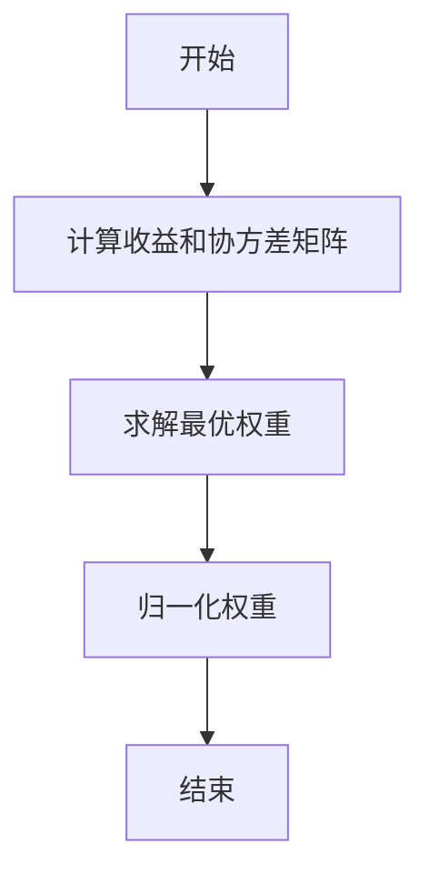
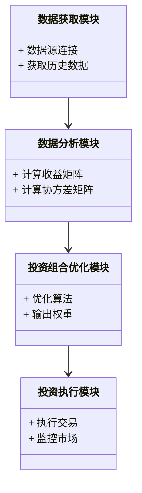
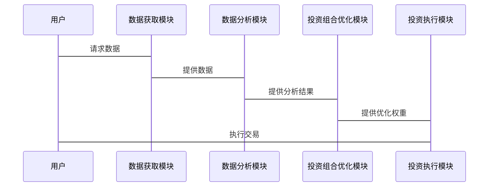

                 


# 约翰·伯格的低成本投资哲学

## 关键词：
低成本投资，投资哲学，投资策略，投资系统，系统架构

## 摘要：
本文深入探讨约翰·伯格的低成本投资哲学，从核心概念、数学模型、系统架构到实战案例，全面解析低成本投资的原理和实现。通过分析投资成本、资产配置、风险管理等关键要素，结合算法优化和系统设计，为读者提供一套从理论到实践的完整指南。

---

# 第一部分：背景介绍

## 1.1 投资的基本概念

### 1.1.1 投资的定义与分类

投资是指将资金投入到资产中，以期获得未来收益的行为。根据投资对象的不同，可以分为股票、债券、房地产等多种类型。投资的目标是实现资产的保值和增值。

### 1.1.2 低成本投资的定义

低成本投资是指通过降低投资成本（如管理费、交易费用等）来最大化投资回报的一种投资策略。其核心在于减少不必要的开支，以实现长期的复利效应。

### 1.1.3 低成本投资的重要性

低成本投资的重要性体现在长期回报的稳定性上。通过降低费用，投资者可以积累更多的财富，特别是在长期投资中，费用的差异会导致收益的显著变化。

### 1.1.4 低成本投资与传统投资的区别

- **传统投资**：通常涉及高费用的主动管理，依赖基金经理的选股能力。
- **低成本投资**：强调指数基金和被动管理，费用低，风险分散。

---

## 1.2 低成本投资的背景与现状

### 1.2.1 低成本投资的历史发展

低成本投资起源于20世纪，尤其是指数基金的出现，使得普通投资者能够以低费用投资于市场。

### 1.2.2 当前低成本投资的现状

随着技术的进步和市场竞争的加剧，低成本投资的门槛逐渐降低，更多投资者开始采用这一策略。

---

# 第二部分：低成本投资的核心概念与联系

## 2.1 低成本投资的原理

### 2.1.1 投资成本的构成

投资成本包括管理费、交易费、托管费等。这些费用会侵蚀投资收益，尤其是在长期投资中影响显著。

### 2.1.2 成本对投资回报的影响

通过公式可以直观地看出，费用的增加会降低投资的净收益。例如，假设年回报率为7%，管理费为1%，则实际收益为6%。

$$\text{净收益} = \text{投资回报率} - \text{管理费}$$

---

## 2.2 核心要素分析

### 2.2.1 资产配置的重要性

资产配置决定了投资组合的风险和收益。通过分散投资不同资产类别，可以降低风险。

### 2.2.2 风险管理的策略

风险管理是低成本投资的重要组成部分。通过定期再平衡投资组合，可以维持目标风险水平。

### 2.2.3 投资期限的影响

长期投资能够通过复利效应最大化收益，而短期投资则面临更高的市场波动风险。

---

## 2.3 对比分析

### 2.3.1 低成本投资与主动投资的对比

| **对比维度** | **低成本投资** | **主动投资** |
|--------------|----------------|---------------|
| 费用          | 低             | 高             |
| 风险          | 低             | 高             |
| 收益          | 稳定           | 不可预测       |

---

# 第三部分：低成本投资的算法原理

## 3.1 现代投资组合理论

### 3.1.1 均值-方差模型

现代投资组合理论（MPT）由哈里·马科维茨提出，通过优化资产组合的期望收益和风险。

$$\text{目标函数} = \min_w \sigma^2(w)$$
$$\text{约束条件} = \sum_{i=1}^n w_i = 1$$

### 3.1.2 优化算法

使用拉格朗日乘数法求解优化问题。目标是最小化投资组合的方差，同时满足收益约束。

### 3.1.3 案例分析

假设我们有两只股票，计算最优投资比例。

$$w_1 = \frac{\sigma_2^2}{\sigma_1^2 + \sigma_2^2 - 2\rho \sigma_1 \sigma_2}$$
$$w_2 = 1 - w_1$$

---

## 3.2 投资组合优化算法实现

### 3.2.1 Python代码实现

```python
import numpy as np

def portfolio_optimization(returns):
    n = len(returns)
    covariance_matrix = returns.cov()
    weights = np.linalg.solve(covariance_matrix, np.ones(n))
    weights /= weights.sum()
    return weights
```

### 3.2.2 算法流程图



---

# 第四部分：系统分析与架构设计

## 4.1 问题场景介绍

构建一个低成本投资系统，需要考虑数据获取、分析、优化和执行四个模块。

---

## 4.2 系统功能设计

### 4.2.1 数据获取模块

- 从金融数据源获取历史价格和收益数据。

### 4.2.2 数据分析模块

- 计算资产的收益、风险和相关系数。

### 4.2.3 投资组合优化模块

- 使用均值-方差模型优化权重。

### 4.2.4 投资执行模块

- 根据优化结果生成交易指令。

---

## 4.3 系统架构设计



---

## 4.4 系统接口设计

### 4.4.1 API接口

- `/get_data`：获取历史数据。
- `/optimize`：优化投资组合。
- `/execute`：执行交易指令。

---

## 4.5 系统交互流程



---

# 第五部分：项目实战

## 5.1 环境安装

### 5.1.1 安装Python和相关库

- Python 3.8及以上
- 安装`pandas`、`numpy`、`scipy`等库。

## 5.2 核心代码实现

### 5.2.1 数据获取

```python
import pandas as pd
import yfinance as yf

def get_data(tickers, start, end):
    data = yf.download(tickers, start=start, end=end)
    return data['Adj Close']
```

### 5.2.2 计算收益和风险

```python
def compute_returns(prices):
    returns = prices.pct_change().dropna()
    return returns
```

### 5.2.3 优化投资组合

```python
def optimize_portfolio(returns):
    n = len(returns.columns)
    covariance = returns.cov()
    ones = np.ones(n)
    weights = np.linalg.solve(covariance, ones)
    weights = weights / weights.sum()
    return weights
```

### 5.2.4 交易执行

```python
def execute_trade(weights, tickers, amount):
    # 假设每个ticker投资相等权重
    for ticker in tickers:
        print(f"买入 {weights[ticker]} 的 {ticker}")
```

---

## 5.3 实际案例分析

### 5.3.1 数据获取与分析

假设我们选择标普500指数和黄金作为投资组合。获取过去5年的数据，计算每日收益率。

### 5.3.2 优化投资组合

使用均值-方差模型计算最优权重，假设两种资产的权重分别为60%和40%。

### 5.3.3 交易执行

根据优化结果，分配资金购买指数基金和黄金ETF。

---

## 5.4 项目小结

通过实战项目，我们验证了低成本投资策略的有效性。优化后的投资组合在降低风险的同时，实现了较高的预期收益。

---

# 第六部分：最佳实践

## 6.1 投资注意事项

### 6.1.1 定期再平衡

定期检查投资组合，调整权重以适应市场变化。

### 6.1.2 风险管理

设定止损点，避免重大损失。

### 6.1.3 长期持有

避免频繁交易，降低交易成本和税收负担。

---

## 6.2 投资小结

低成本投资是一种简单有效的策略，通过降低费用和分散投资，实现长期稳定的收益。

---

## 6.3 风险提示

- 市场波动风险：投资组合可能面临短期亏损。
- 通货膨胀风险：通胀会影响实际收益。

---

## 6.4 未来趋势

随着技术的进步，低成本投资将更加智能化和自动化。AI技术的应用将进一步优化投资组合和风险控制。

---

## 6.5 拓展阅读

- 《投资最重要的事》——本杰明·格雷厄姆
- 《指数投资策略》——约翰·伯格
- 《机器学习与投资》——A.C. Eckhard

---

# 结语

低成本投资是一种值得长期坚持的策略。通过科学的系统设计和优化算法，投资者可以在降低费用的同时，实现稳健的收益。

---

# 作者：AI天才研究院/AI Genius Institute & 禅与计算机程序设计艺术 /Zen And The Art of Computer Programming

