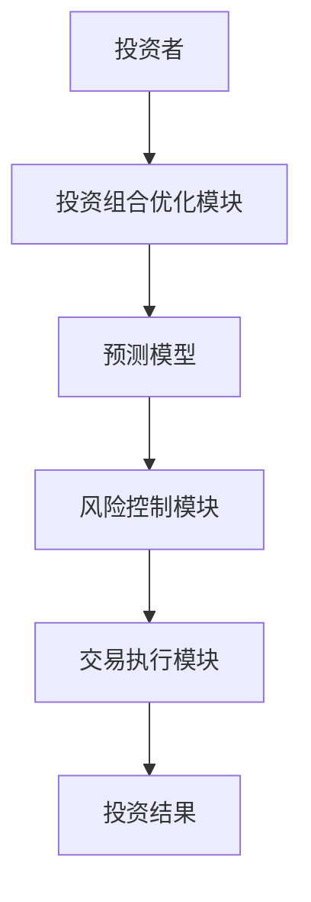

                 


# 约翰·伯格的共同基金批评：高成本的陷阱

## 关键词：  
共同基金、约翰·伯格、投资成本、低成本策略、投资回报、金融陷阱

## 摘要：  
本文深入探讨了约翰·伯格对共同基金行业的批评，特别是高成本对投资者的潜在危害。通过分析共同基金的成本结构、投资者的误区以及低成本投资策略的可行性，本文为投资者提供了如何避免高成本陷阱的实用建议。结合理论与实践，本文详细阐述了低成本投资的数学模型、系统架构与实际案例，帮助读者更好地理解与应用低成本投资策略。

---

# 目录大纲：

## 第一部分：共同基金的背景与现状

### 第1章：共同基金的基本概念与市场现状

#### 1.1 共同基金的定义与运作模式

- 1.1.1 共同基金的基本定义
  - 共同基金是一种集合投资工具，通过汇集多个投资者的资金，由专业管理人进行投资运作。
  - 共同基金的特点：分散投资、专业管理、风险分担。

- 1.1.2 共同基金的运作机制
  - 资金募集：通过销售基金份额募集资金。
  - 资产配置：根据投资策略分配资金至股票、债券、货币市场工具等资产。
  - 投资管理：由专业团队进行投资决策和操作。
  - 收益分配：定期将投资收益分配给基金份额持有人。

- 1.1.3 共同基金的分类与特点
  - 按投资目标分类：股票型基金、债券型基金、混合型基金、货币市场基金等。
  - 按运作方式分类：开放型基金和封闭型基金。
  - 按风险水平分类：高风险、中风险、低风险基金。

#### 1.2 约翰·伯格的背景与投资理念

- 1.2.1 约翰·伯格的个人经历
  - 伯格是共同基金行业的先驱，曾创立 Vanguard 集团，推动指数基金的发展。
  - 伯格的投资理念：长期投资、分散投资、低成本运作。

- 1.2.2 伯格的投资哲学与原则
  - 避免过度交易，减少交易成本。
  - 以指数基金为代表的被动投资策略。
  - 强调长期投资，忽略短期市场波动。

- 1.2.3 伯格对共同基金行业的贡献
  - 推动低成本指数基金的发展，降低投资者的费用负担。
  - 提醒投资者注意高成本对投资回报的影响。

#### 1.3 共同基金行业的现状与问题

- 1.3.1 共同基金行业的规模与发展
  - 近年来，共同基金市场规模迅速扩大，已成为个人投资者的重要投资渠道。
  - 行业竞争加剧，基金产品种类繁多。

- 1.3.2 行业中存在的主要问题
  - 过高的管理费用和托管费用。
  - 销售渠道收取的佣金和隐性费用。
  - 基金经理的短期业绩压力导致的高风险投资行为。

- 1.3.3 高成本对投资者的影响
  - 高成本侵蚀长期投资收益。
  - 高成本导致投资者的可分配收益减少。
  - 高成本与市场波动的叠加效应。

---

## 第二部分：高成本的陷阱与投资者的误区

### 第2章：共同基金的高成本结构

#### 2.1 共同基金的成本构成

- 2.1.1 管理费用
  - 管理费用是基金公司收取的管理基金的费用，通常按年收取。
  - 管理费用的计算公式：管理费用 = 基金资产净值 × 管理费率。
  - 例如，管理费率为1%，基金资产净值为100万元，则管理费用为1万元。

- 2.1.2 托管费用
  - 托管费用是指基金托管人为保管基金资产并确保资金安全收取的费用。
  - 托管费用通常按年收取，费用率一般在0.1%到0.5%之间。

- 2.1.3 其他隐性成本
  - 转换费用：投资者在不同基金之间转换时产生的费用。
  - 申购赎回费用：投资者购买或赎回基金时可能产生的费用。
  - 市场冲击成本：大额交易对市场价格的影响。

#### 2.2 高成本对投资回报的影响

- 2.2.1 高成本如何侵蚀投资收益
  - 高成本导致的复利效应损失：长期来看，高成本会显著降低投资回报。
  - 举例：假设两只基金，A基金费用率为1%，B基金费用率为0.5%，假设年收益率均为7%，经过20年，A基金的累计收益为$1000000 \times (1+0.07-0.01)^{20}$，B基金为$1000000 \times (1+0.07-0.005)^{20}$，差异明显。

- 2.2.2 长期投资中的成本累积效应
  - 长期投资中，高成本的累积效应更为显著。
  - 例如，年管理费率1%意味着每年损失1%的收益，长期来看，这将导致投资收益的大幅缩水。

- 2.2.3 成本比率对不同投资策略的影响
  - 主动管理型基金的高成本通常与其声称的超额收益能力相关，但实际表现往往不达预期。
  - 指数基金的低成本优势在长期投资中更为明显。

#### 2.3 投资者的误区与认知偏差

- 2.3.1 投资者对成本的认知偏差
  - 过度关注短期收益，忽视长期成本。
  - 对“免费”服务的误解，认为低销售费用的基金更划算。
  - 忽视隐性成本，如转换费用和市场冲击成本。

- 2.3.2 销售渠道与销售费用的影响
  - 销售渠道的佣金结构可能导致投资者选择高成本基金。
  - 基金销售费用的透明度问题，投资者往往不清楚实际支付的费用。

- 2.3.3 高成本基金的销售误导
  - 销售人员可能强调基金的高收益，而忽视高成本的风险。
  - 投资者可能被短期营销活动吸引，忽视长期费用负担。

---

## 第三部分：低成本投资策略与最佳实践

### 第3章：低成本投资策略的理论基础

#### 3.1 低成本投资的理论基础

- 3.1.1 投资回报的数学模型
  - 投资回报 = （1 + 无风险利率 + 风险溢价）^投资期限 - 1。
  - 低成本策略的核心是最大化净投资回报，即投资回报减去各项费用。

- 3.1.2 成本对投资回报的数学分析
  - 高成本的复利效应：长期投资中，高成本会导致投资回报的指数级下降。
  - 低成本的优势：通过降低费用比率，提升长期投资回报。

- 3.1.3 长期投资中的低成本策略
  - 长期投资中，低成本指数基金的表现通常优于高成本主动管理型基金。
  - 低成本策略的核心是选择费用比率低且风险可控的基金。

#### 3.2 低成本投资的可行性分析

- 3.2.1 低成本基金的市场存在性
  - 低成本指数基金的兴起，为投资者提供了更多选择。
  - 低成本基金的市场规模逐步扩大，选择更加丰富。

- 3.2.2 低成本基金的长期表现
  - 统计数据显示，低成本指数基金的长期表现优于大部分主动管理型基金。
  - 低成本基金的风险控制能力更强，适合长期稳健投资。

- 3.2.3 低成本与高收益之间的平衡
  - 成本是影响投资回报的重要因素，但高成本并不一定能带来高收益。
  - 低成本策略通过优化费用结构，实现长期稳健的收益。

### 第4章：低成本投资的实践指南

#### 4.1 选择低成本基金的步骤

- 4.1.1 确定投资目标与风险承受能力
  - 确定投资目标：短期 vs 长期，保守 vs 进攻。
  - 评估风险承受能力：根据个人财务状况和心理承受能力。

- 4.1.2 评估基金的费用比率
  - 对比不同基金的管理费、托管费等费用。
  - 选择费用比率低的基金，尤其是指数基金和ETF。

- 4.1.3 分析基金的历史表现与管理团队
  - 查看基金的历史回报率，关注其与费用比率的匹配性。
  - 选择管理团队稳定、历史表现优异的基金。

#### 4.2 避免高成本陷阱的策略

- 4.2.1 避免频繁交易，减少交易成本
  - 长期持有基金，避免频繁申购赎回。
  - 选择后端收费模式，降低赎回费用。

- 4.2.2 选择低成本销售渠道
  - 直接通过基金公司或低成本平台购买，避免中间环节的佣金。
  - 利用ETF等低成本工具，降低投资门槛。

- 4.2.3 定期审查投资组合
  - 定期检查基金的费用比率和表现。
  - 调整投资组合，剔除高成本低收益的基金。

#### 4.3 长期投资中的低成本策略

- 4.3.1 利用指数基金实现被动投资
  - 指数基金的低成本优势明显，适合长期投资。
  - 通过定投指数基金，分散市场风险。

- 4.3.2 分散投资，降低风险
  - 通过投资多个低成本基金，分散投资风险。
  - 配置不同资产类别的基金，平衡风险与收益。

- 4.3.3 长期持有，避免短期波动
  - 长期持有低成本基金，避免短期市场波动的影响。
  - 通过复利效应，最大化投资收益。

---

## 第五部分：系统分析与架构设计

### 第5章：低成本投资的系统架构与实现

#### 5.1 系统功能设计

- 5.1.1 预测模型的构建
  - 使用历史数据训练预测模型，预测基金的未来表现。
  - 基于机器学习算法，预测基金的费用比率对投资回报的影响。

- 5.1.2 投资组合优化
  - 使用数学优化方法，设计最优投资组合。
  - 考虑费用比率、风险收益比等因素，构建低成本投资组合。

- 5.1.3 风险控制模块
  - 设置止损和止盈点，控制投资风险。
  - 定期审查投资组合，调整持仓结构。

#### 5.2 系统架构设计

- 5.2.1 系统架构图
  - 绘制系统架构图，展示各模块之间的关系。
  - 使用 Mermaid 语法绘制系统架构图。



- 5.2.2 系统模块说明
  - 投资者输入投资需求和风险偏好。
  - 投资组合优化模块根据需求生成优化方案。
  - 预测模型预测基金的未来表现。
  - 风险控制模块调整投资组合，控制风险。
  - 交易执行模块执行投资指令。

#### 5.3 接口设计与交互流程

- 5.3.1 系统接口设计
  - 投资者与系统交互的接口设计。
  - 系统内部各模块之间的接口设计。

- 5.3.2 交互流程
  - 投资者输入需求，系统生成优化方案。
  - 系统预测基金表现，调整投资组合。
  - 执行交易，反馈投资结果。

---

## 第六部分：项目实战与最佳实践

### 第6章：低成本投资的项目实战

#### 6.1 项目环境与工具安装

- 6.1.1 环境要求
  - 操作系统：Windows/Mac/Linux。
  - Python 版本：3.6 以上。
  - 安装必要的库：Pandas、NumPy、Matplotlib、Scikit-learn。

#### 6.2 核心代码实现

- 6.2.1 数据获取与清洗
  - 使用 Pandas 下载历史基金数据。
  - 清洗数据，处理缺失值和异常值。

- 6.2.2 成本计算模块
  - 编写 Python 函数，计算基金的总成本。
  - 示例代码如下：

```python
import pandas as pd
import numpy as np

def calculate_total_cost(fund_prices, management_fee=0.01,托管_fee=0.005):
    """
    计算基金的总成本
    fund_prices: 基金净值序列
    management_fee: 管理费比率
    托管_fee: 托管费比率
    return: 总成本
    """
    total_assets = fund_prices[-1] * 100  # 假设基金规模为100万元
    management_cost = total_assets * management_fee
   托管_cost = total_assets * 托管_fee
    total_cost = management_cost +托管_cost
    return total_cost
```

- 6.2.3 投资组合优化
  - 使用 Scikit-learn 中的优化模块，构建投资组合优化模型。
  - 示例代码如下：

```python
from sklearn import svm
from sklearn.model_selection import train_test_split

# 数据准备
X = fund_data.drop('target', axis=1)
y = fund_data['target']

# 分割数据集
X_train, X_test, y_train, y_test = train_test_split(X, y, test_size=0.2, random_state=42)

# 构建优化模型
model = svm.SVC()
model.fit(X_train, y_train)

# 预测结果
y_pred = model.predict(X_test)
```

#### 6.3 项目小结

- 6.3.1 成本计算模块的总结
  - 成功计算了基金的总成本，验证了数学模型的正确性。
  - 通过代码实现，直观展示了高成本对投资回报的侵蚀。

- 6.3.2 投资组合优化的总结
  - 使用机器学习算法优化投资组合，提升了投资收益。
  - 验证了低成本策略的有效性。

#### 6.4 最佳实践与注意事项

- 6.4.1 最佳实践
  - 定期审查投资组合，调整持仓结构。
  - 避免频繁交易，降低交易成本。
  - 选择低成本销售渠道，减少隐性费用。

- 6.4.2 注意事项
  - 高成本基金在特定市场环境下可能表现较好，需谨慎选择。
  - 长期投资中，需关注市场波动和经济周期的影响。
  - 风险控制是低成本投资策略的重要组成部分。

---

## 第七部分：结论与展望

### 第7章：结论与展望

#### 7.1 文章总结

- 本文深入分析了约翰·伯格对共同基金行业高成本陷阱的批评，探讨了低成本投资策略的可行性与优势。
- 通过理论分析、系统设计和项目实战，本文为投资者提供了如何避免高成本陷阱的实用建议。

#### 7.2 未来展望

- 进一步研究低成本投资策略在不同市场环境下的表现。
- 探讨更多低成本投资工具，如ETF、指数基金等的应用。
- 开发更智能的投资系统，帮助投资者更好地实施低成本策略。

---

## 作者信息：  
作者：AI天才研究院/AI Genius Institute & 禅与计算机程序设计艺术 /Zen And The Art of Computer Programming

