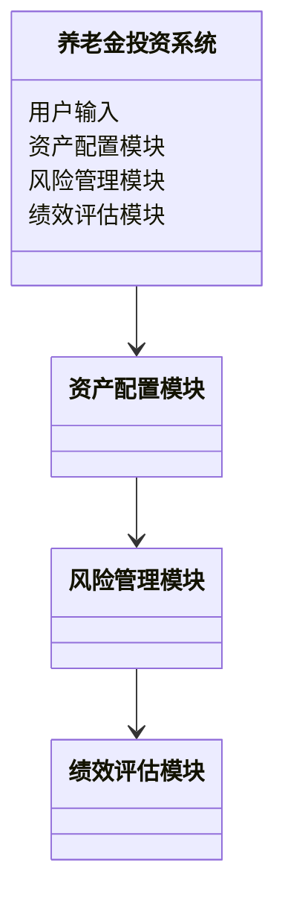

                 


# 约翰·伯格的养老金投资管理原则

## 关键词：养老金投资、约翰·伯格、指数基金、资产配置、风险管理

## 摘要：  
约翰·伯格是全球知名的投资专家，他的养老金投资管理原则以低成本指数基金为核心，强调长期投资和分散风险。本文深入分析了伯格的投资理念、策略及实践，结合实际案例和数学模型，为读者提供系统的知识体系和实用指导。

---

## 正文

### 第一部分：养老金投资管理的背景与基础

#### 第1章：养老金投资管理的背景与重要性

##### 1.1 养老金的基本概念
- **1.1.1 养老金的定义与分类**
  养老金是为退休后提供经济支持的基金，通常分为企业养老金、个人储蓄养老金等。  
  - 企业养老金：由雇主和员工共同缴纳，如401(k)计划。  
  - 个人养老金：通过个人投资账户积累，如IRA。

- **1.1.2 养老金在个人和家庭财务中的作用**
  养老金是保障晚年生活质量的重要资金来源，需通过投资实现保值增值。

- **1.1.3 养老金投资的挑战**
  通货膨胀、市场波动、寿命延长等因素增加了养老金投资的复杂性。

##### 1.2 投资在养老金管理中的重要性
- **1.2.1 养老金投资的目标与原则**
  目标是实现资产增值，原则包括安全性、流动性、收益性。

- **1.2.2 养老金投资与个人财务规划的关系**
  养老金是财务规划的核心部分，需与其他财务目标（如教育、医疗）结合。

- **1.2.3 养老金投资的长期性与风险控制**
  长期投资有助于摊薄风险，但需通过分散投资降低波动性。

##### 1.3 约翰·伯格的生平与贡献
- **1.3.1 伯格的个人经历与投资理念**
  伯格是Vanguard创始人，倡导低成本、被动投资策略。

- **1.3.2 伯格对指数基金的贡献**
  推广指数基金，降低管理费用，提高投资效率。

- **1.3.3 伯格对养老金投资的影响**
  强调长期投资，避免频繁交易，降低费用对收益的影响。

---

### 第二部分：约翰·伯格的核心投资原则

#### 第2章：伯格的投资理念与原则

##### 2.1 伯格的投资哲学
- **2.1.1 长期投资的重要性**
  长期持有指数基金，避免频繁交易，降低费用影响。

- **2.1.2 分散投资的风险**
  通过多样化投资降低非系统性风险，指数基金天然具备分散性。

- **2.1.3 避免市场择时的误区**
  市场预测难度大，被动投资更可靠。

##### 2.2 伯格的指数基金策略
- **2.2.1 指数基金的定义与特点**
  指数基金跟踪市场指数，费用低，风险分散。

- **2.2.2 指数基金的成本优势**
  低成本意味着更高的净收益，长期累积效应显著。

- **2.2.3 指数基金的长期收益表现**
  长期来看，指数基金收益稳定，跑赢大部分主动管理基金。

##### 2.3 伯格的投资组合管理
- **2.3.1 资产配置的策略**
  根据风险承受能力，合理配置股票、债券等资产。

- **2.3.2 定期再平衡的重要性**
  定期调整资产配置，保持目标比例，优化收益与风险。

- **2.3.3 如何应对市场波动**
  通过分散投资和长期持有，降低短期波动的影响。

---

### 第三部分：养老金投资的策略与实践

#### 第3章：养老金投资的策略分析

##### 3.1 资产配置的核心作用
- **3.1.1 不同资产类别的风险与收益**
  股票收益高、风险大，债券收益稳定、风险低。

- **3.1.2 根据风险承受能力进行配置**
  年轻时可多配股票，临近退休可增加债券配置。

- **3.1.3 如何选择合适的资产配置**
  考虑年龄、职业、家庭状况等因素，制定个性化配置。

##### 3.2 分散投资与风险管理
- **3.2.1 分散投资的实现方式**
  通过投资不同资产类别、地域和行业降低风险。

- **3.2.2 风险管理的工具与方法**
  使用止损、保险策略等工具，控制潜在损失。

- **3.2.3 伯格的风险管理原则**
  通过低成本指数基金分散风险，避免过度集中。

##### 3.3 定期再平衡的重要性
- **3.3.1 再平衡的定义与作用**
  定期调整资产比例，保持目标配置，优化风险收益。

- **3.3.2 再平衡的实施方法**
  定期检查，根据市场变化进行调整。

- **3.3.3 再平衡的成本控制**
  尽量减少交易费用，选择合适的时机。

---

### 第四部分：养老金投资的风险管理与心理因素

#### 第4章：养老金投资中的心理因素与行为偏差

##### 4.1 常见的心理偏差
- **4.1.1 贪婪与恐惧**
  市场上涨时贪婪，下跌时恐惧，影响理性决策。

- **4.1.2 过度自信**
  过高估计自己的预测能力，导致错误决策。

- **4.1.3 沉没成本效应**
  过度关注过去投入，影响当前决策。

##### 4.2 克服心理偏差的策略
- **4.2.1 提高金融素养**
  学习投资知识，了解市场规律。

- **4.2.2 设定投资计划**
  制定投资策略，避免情绪化决策。

- **4.2.3 寻求专业帮助**
  委托专业机构管理，减少个人偏差影响。

##### 4.3 伯格的投资心态
- **4.3.1 保持耐心与纪律**
  长期持有，避免频繁交易。

- **4.3.2 顺势而为**
  遵循市场规律，顺势调整策略。

- **4.3.3 保持理性与冷静**
  面对市场波动，保持冷静，避免情绪化决策。

---

### 第五部分：养老金投资的全球化视角

#### 第5章：全球化视角下的养老金投资

##### 5.1 全球化投资的优势
- **5.1.1 分散地域风险**
  投资全球市场，降低区域经济波动影响。

- **5.1.2 捕捉全球增长机会**
  全球化资产配置，把握不同地区的增长潜力。

- **5.1.3 利用汇率差异**
  通过汇率变化优化收益。

##### 5.2 新兴市场的机会与挑战
- **5.2.1 新兴市场的高增长潜力**
  新兴经济体增长快，投资回报高。

- **5.2.2 新兴市场的高风险**
  政治、经济不稳定因素较多。

- **5.2.3 伯格的全球化投资观点**
  通过指数基金分散投资，降低区域风险。

##### 5.3 全球化投资的策略
- **5.3.1 分散配置**
  按比例分配资产到不同国家和地区。

- **5.3.2 选择全球指数基金**
  通过购买全球指数基金实现分散投资。

- **5.3.3 监测与调整**
  定期评估投资组合，根据市场变化进行调整。

---

### 第六部分：养老金投资的未来趋势

#### 第6章：养老金投资的未来发展方向

##### 6.1 技术进步对投资的影响
- **6.1.1 大数据与人工智能的应用**
  利用大数据分析和AI技术优化投资决策。

- **6.1.2 自动化投资工具的发展**
  罗智能投顾平台提供自动化投资服务。

##### 6.2 ESG投资的兴起
- **6.2.1 ESG投资的定义与优势**
  ESG（环境、社会、治理）投资注重企业社会责任，长期收益潜力大。

- **6.2.2 伯格对ESG投资的看法**
  伯格未特别强调ESG，但长期投资理念与ESG一致。

- **6.2.3 ESG投资的未来前景**
  随着环保和可持续发展的重要性增加，ESG投资将吸引更多资金。

##### 6.3 数字化转型的影响
- **6.3.1 数字化服务的普及**
  在线投资平台和移动应用使投资管理更便捷。

- **6.3.2 数字化工具的应用**
  使用算法和AI优化投资组合。

- **6.3.3 数字化对风险管理的作用**
  通过实时数据分析，提前识别和应对风险。

---

### 第七部分：总结与展望

#### 第7章：总结与未来展望

##### 7.1 养老金投资管理的核心要点
- 长期投资、分散风险、低成本指数基金。

##### 7.2 伯格投资原则的启示
- 保持耐心、纪律，避免情绪化决策，坚持长期投资。

##### 7.3 未来养老金投资的趋势
- 技术驱动、ESG投资、全球化配置。

---

### 图表与代码示例

#### 图表示例：资产配置类图


#### 代码示例：资产配置优化算法
```python
def asset_allocation(weights, returns, risk_free_rate=0.02):
    # 计算夏普比率
    portfolio_return = sum(w * r for w, r in zip(weights, returns))
    portfolio_risk = np.std(weights * returns)
    sharpe_ratio = (portfolio_return - risk_free_rate) / portfolio_risk
    return sharpe_ratio

# 示例权重和收益
weights = [0.6, 0.3, 0.1]
returns = [0.08, 0.05, 0.02]
risk_free_rate = 0.02

print(f"夏普比率：{asset_allocation(weights, returns, risk_free_rate)}")
```

---

### 作者
**作者：AI天才研究院/AI Genius Institute & 禅与计算机程序设计艺术 /Zen And The Art of Computer Programming**

