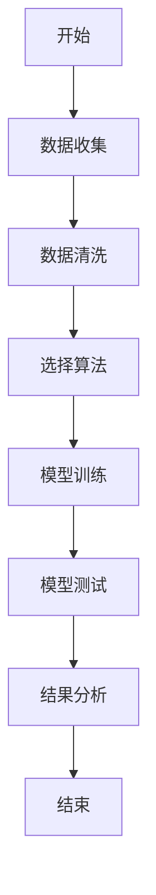
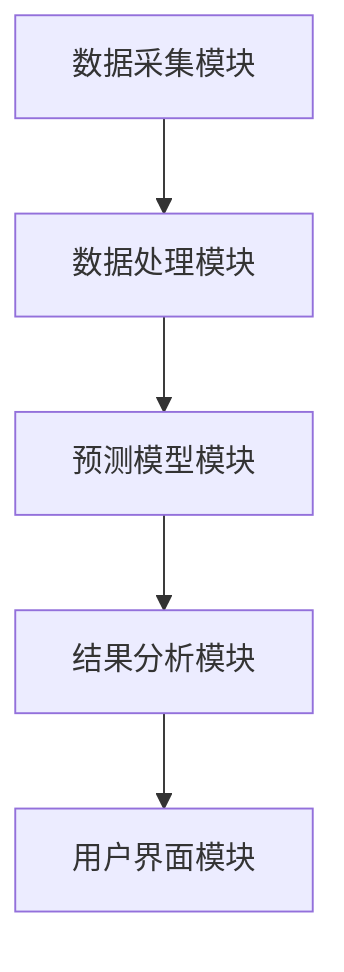

                 


# 约翰·伯格的市场预测警告：为什么不要试图择时

> 关键词：市场预测，约翰·伯格，投资策略，随机漫步理论，有效市场假说，技术分析，基本面分析，风险管理，长期投资

> 摘要：本文深入探讨了约翰·伯格对市场预测的批判，分析了市场预测的挑战与局限性，结合技术分析和基本面分析的算法原理，通过系统架构设计和项目实战，展示了为什么长期投资优于短期市场预测。文章还总结了最佳投资实践和风险管理策略。

---

## 第一部分: 市场预测的挑战与约翰·伯格的投资理念

### 第1章: 市场预测的背景与挑战

#### 1.1 什么是市场预测
##### 1.1.1 市场预测的定义与核心概念
市场预测是指通过分析历史数据和市场趋势，预测未来市场走势的行为。其核心概念包括价格走势、成交量、市场情绪等。

##### 1.1.2 市场预测的常见方法
市场预测的方法主要有技术分析、基本面分析和统计套利等。

##### 1.1.3 市场预测的局限性
市场预测的局限性在于市场的不可预测性和噪声数据的影响，导致预测结果的不确定性。

#### 1.2 约翰·伯格的投资理念
##### 1.2.1 约翰·伯格的生平简介
约翰·伯格是著名的投资专家，以长期投资和价值投资闻名。

##### 1.2.2 约翰·伯格的投资哲学
伯格强调长期投资，认为市场预测难以准确把握短期走势。

##### 1.2.3 约翰·伯格对市场预测的批判
伯格指出，市场预测的不可靠性使得长期投资策略更为可靠。

### 第2章: 市场预测的核心概念与联系

#### 2.1 市场预测的基本原理
##### 2.1.1 随机漫步理论
随机漫步理论认为市场走势是随机的，无法通过技术分析预测。

##### 2.1.2 有效市场假说
有效市场假说认为市场价格反映了所有可用信息，使得预测变得困难。

##### 2.1.3 市场预测的不确定性
市场价格波动受多种因素影响，增加了预测的难度。

#### 2.2 核心概念对比分析
##### 2.2.1 不同市场预测方法的对比表格
| 方法         | 基础 | 工具 | 假设                  |
|--------------|------|------|-----------------------|
| 技术分析     | 价格 | 图表 | 市场走势可预测         |
| 基本面分析     | 公司 | 财务 | 公司价值可评估         |
| 统计套利      | 数据 | 模型 | 数据相关性可利用       |

##### 2.2.2 市场预测方法的ER实体关系图
```mermaid
erd
actor 投资者
actor 市场数据
actor 预测结果
```

### 第3章: 市场预测的算法原理

#### 3.1 常见市场预测算法
##### 3.1.1 技术分析算法
技术分析算法基于价格和成交量数据，通过移动平均线等指标预测趋势。

##### 3.1.2 基本面分析算法
基本面分析算法分析公司财务数据，评估其内在价值。

##### 3.1.3 统计套利算法
统计套利算法利用数据相关性，寻找套利机会。

#### 3.2 算法原理的Mermaid流程图


#### 3.3 算法实现的Python代码示例
```python
import pandas as pd
import numpy as np

def calculate_sma(prices, window):
    return prices.rolling(window).mean()

# 示例数据
prices = pd.Series([100, 102, 101, 103, 104])
sma_3 = calculate_sma(prices, 3)
print(sma_3)
```

## 第二部分: 数学模型与系统架构设计

### 第4章: 数学模型

#### 4.1 随机漫步模型
随机漫步模型描述市场价格的随机波动，公式为：
$$P_{t} = P_{t-1} + \epsilon$$
其中，$\epsilon$ 是随机误差项。

#### 4.2 布朗运动模型
布朗运动模型用于模拟价格波动：
$$dP = \mu dt + \sigma dW$$

### 第5章: 系统架构设计

#### 5.1 系统功能设计
系统功能包括数据采集、预测模型、结果分析等模块。

#### 5.2 系统架构的Mermaid图


## 第三部分: 项目实战与最佳实践

### 第6章: 项目实战

#### 6.1 环境安装
安装Python和相关库，如Pandas和NumPy。

#### 6.2 代码实现
实现一个基于技术指标的交易系统。

#### 6.3 案例分析
分析实际市场数据，评估系统的性能。

### 第7章: 最佳实践

#### 7.1 总结
强调长期投资和风险管理的重要性。

#### 7.2 风险管理建议
建议设定止损点和止盈点。

#### 7.3 拓展阅读
推荐相关书籍和资源。

---

## 作者：AI天才研究院/AI Genius Institute & 禅与计算机程序设计艺术 /Zen And The Art of Computer Programming

---

这篇文章系统地探讨了市场预测的挑战，结合约翰·伯格的投资理念，分析了不同预测方法的优劣，并通过实际案例展示了长期投资的优势。希望读者能从中理解市场预测的局限性，并学会如何制定有效的投资策略。

