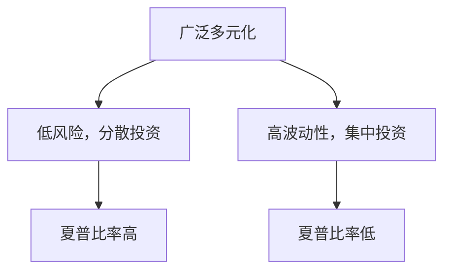
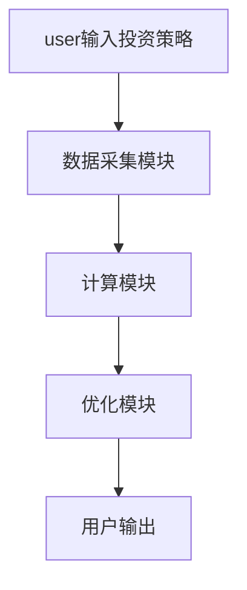

                 


# 约翰·伯格的广泛多元化vs聚焦投资

## 关键词：投资策略，广泛多元化，聚焦投资，数学模型，系统架构，Python实现

## 摘要：本文探讨了约翰·伯格提出的两种投资策略——广泛多元化与聚焦投资的核心概念、数学模型和实际应用。通过对比分析，帮助读者理解这两种策略的优缺点及其适用场景，同时结合系统架构设计和项目实战，提供可操作的投资决策方案。

---

## 第一部分：投资背景与核心概念

### 第1章：投资的基本概念与约翰·伯格的生平

#### 1.1 投资的基本概念

投资是将资源（如资金）投入到某个项目或资产中，以期望在未来获得收益的过程。投资的核心目标是通过资产配置和风险管理，实现财富的保值与增值。投资可以分为股票、债券、房地产等多种形式，每种形式都有其独特的风险和收益特征。

投资的三大基本要素包括：
1. **资金的时间价值**：资金在不同时间点的价值不同，投资需要考虑资金的时间价值。
2. **风险与收益的权衡**：高收益通常伴随着高风险，投资需要在风险与收益之间找到平衡点。
3. **资产配置**：通过合理的资产配置，分散风险，提高收益。

---

#### 1.2 约翰·伯格的生平与成就

约翰·伯格（John Bogle）是美国著名投资专家，被誉为“指数基金之父”。他在投资领域的主要贡献包括：
1. **指数基金的推广**：伯格创立了 Vanguard 集团，并推出全球第一只指数基金（Vanguard Index Fund），这一创新降低了普通投资者的投资成本，使指数基金成为大众化投资工具。
2. **价值投资理念的践行者**：伯格深受本杰明·格雷厄姆（Benjamin Graham）的影响，主张长期持有优质资产，避免频繁交易。
3. **简化投资理念**：伯格强调投资的简单性，反对过度复杂化，认为长期持有低成本指数基金是实现财富增长的最佳方式。

---

#### 1.3 广泛多元化与聚焦投资的背景

随着金融市场的发展，投资者面临越来越多的投资选择。伯格提出的两种投资策略——广泛多元化与聚焦投资，分别代表了两种极端的投资风格：
- **广泛多元化**：通过分散投资于多种资产或行业，降低风险，追求稳定收益。
- **聚焦投资**：集中投资于少数优质资产或行业，追求超额收益。

本文将通过对比分析这两种策略的核心概念、数学模型和实际应用，帮助投资者根据自身需求选择合适的投资策略。

---

## 第二部分：广泛多元化与聚焦投资的核心概念对比

### 第2章：核心概念与原理

#### 2.1 广泛多元化的定义与特点

##### 2.1.1 定义
广泛多元化是指将资金分散投资于多个资产类别、行业或地区，以降低单一资产或市场的波动性风险。这种策略的核心在于通过多样化降低投资组合的整体波动性，追求相对稳定的收益。

##### 2.1.2 特点
- **分散风险**：通过投资多个不相关的资产，降低单一资产价格波动对整体投资组合的影响。
- **稳定性高**：投资组合的波动性较低，适合风险承受能力较低的投资者。
- **收益相对稳定**：由于分散投资，收益可能不如聚焦投资显著，但波动性小。

##### 2.1.3 优缺点
- **优点**：
  - 风险较低，适合保守型投资者。
  - 投资组合的波动性较小，易于管理。
- **缺点**：
  - 收益可能不如聚焦投资显著。
  - 需要较高的分散度，可能导致管理复杂性增加。

---

#### 2.2 聚焦投资的定义与特点

##### 2.2.1 定义
聚焦投资是指将资金集中投资于少数优质资产、行业或地区，通过深度研究和精选优质标的，追求超额收益。这种策略的核心在于通过集中投资实现更高的收益，但需要承担更高的风险。

##### 2.2.2 特点
- **集中投资**：将资金集中投资于少数优质资产，通过深度研究提高收益潜力。
- **高风险高收益**：投资组合的波动性较高，收益可能显著高于广泛多元化策略。
- **管理难度大**：需要对标的资产进行深度研究，且需要承担较高的市场波动风险。

##### 2.2.3 优缺点
- **优点**：
  - 收益潜力高，适合风险承受能力较高的投资者。
  - 通过精选优质资产，可能实现超额收益。
- **缺点**：
  - 风险较高，投资组合的波动性较大。
  - 管理难度大，需要持续跟踪和调整标的资产。

---

#### 2.3 两种策略的对比分析

##### 2.3.1 比较维度：风险、收益、管理难度

| 比较维度      | 广泛多元化                     | 聚焦投资                     |
|---------------|-------------------------------|-------------------------------|
| **风险**      | 低风险，分散投资降低波动性     | 高风险，集中投资增加波动性   |
| **收益**      | 收益稳定，波动小               | 收益潜力高，波动大             |
| **管理难度**   | 管理相对简单，分散投资易于操作 | 管理难度大，需要持续跟踪标的资产 |

##### 2.3.2 案例对比：广泛多元化 vs 聚焦投资的实际表现

以美股市场为例，假设我们有两种投资组合：
- **组合A**：广泛多元化，投资于标普500指数基金，年化收益8%。
- **组合B**：聚焦投资，投资于科技行业龙头股（如苹果、谷歌等），年化收益12%。

从案例中可以看出，虽然聚焦投资的收益潜力更高，但其波动性也更大，且需要承担更高的风险。

---

## 第三部分：数学模型与算法原理

### 第3章：数学模型与投资决策

#### 3.1 投资组合的数学模型

##### 3.1.1 投资组合的期望收益与风险

- **期望收益**：$E(R_p) = \sum w_i E(R_i)$，其中 $w_i$ 是第 $i$ 个资产的权重，$E(R_i)$ 是第 $i$ 个资产的期望收益。
- **风险（波动性）**：$Var(R_p) = \sum w_i^2 Var(R_i) + 2 \sum_{i < j} w_i w_j Cov(R_i, R_j)$，其中 $Cov(R_i, R_j)$ 是第 $i$ 和第 $j$ 个资产之间的协方差。

##### 3.1.2 投资组合的夏普比率

夏普比率衡量的是投资组合单位风险所获得的超额收益：
$$
Sharpe Ratio = \frac{E(R_p) - R_f}{\sigma_p}
$$
其中，$R_f$ 是无风险利率，$\sigma_p$ 是投资组合的波动性。

---

#### 3.2 广泛多元化与聚焦投资的数学公式

##### 3.2.1 广泛多元化组合的方差计算

假设我们有 $n$ 个资产，权重为 $w_1, w_2, ..., w_n$，则投资组合的方差为：
$$
\sigma_p^2 = \sum_{i=1}^{n} w_i^2 \sigma_i^2 + 2 \sum_{i < j} w_i w_j Cov(R_i, R_j)
$$
通过分散投资，方差会随着资产数量的增加而降低。

##### 3.2.2 聚焦投资的集中度风险模型

假设我们集中投资于 $k$ 个资产，则投资组合的方差为：
$$
\sigma_p^2 = \sum_{i=1}^{k} w_i^2 \sigma_i^2 + 2 \sum_{i < j} w_i w_j Cov(R_i, R_j)
$$
由于 $k$ 较小，方差主要取决于个别资产的风险。

---

#### 3.3 代码实现与案例分析

##### 3.3.1 使用Python进行投资组合优化

```python
import numpy as np
import pandas as pd
from sklearn.covariance import MinCovarianceDeterminant

# 示例数据：假设我们有两只资产，A和B
returns = np.array([[0.1, 0.15], [0.15, 0.1]])
weights = np.array([0.5, 0.5])

# 计算投资组合的期望收益
expected_return = np.dot(weights, returns.mean())

# 计算投资组合的波动性
cov_matrix = np.cov(returns)
portfolio_variance = np.dot(weights.T, np.dot(cov_matrix, weights))
portfolio_volatility = np.sqrt(portfolio_variance)

print(f"Expected Return: {expected_return}")
print(f"Volatility: {portfolio_volatility}")
```

##### 3.3.2 算法流程图：广泛多元化与聚焦投资的数学模型对比



---

## 第四部分：系统分析与架构设计

### 第4章：投资决策系统的架构设计

#### 4.1 系统功能设计

##### 4.1.1 数据采集模块
- 从金融数据源（如Yahoo Finance、Alpha Vantage）获取实时数据。
- 数据清洗与预处理。

##### 4.1.2 投资策略分析模块
- 计算资产的期望收益、波动性、协方差等。
- 生成广泛多元化与聚焦投资的策略建议。

##### 4.1.3 风险评估与优化模块
- 计算投资组合的夏普比率。
- 根据风险承受能力优化投资组合。

---

#### 4.2 系统架构设计

##### 4.2.1 分层架构
- **数据层**：数据采集与存储。
- **计算层**：投资组合分析与优化。
- **用户层**：用户界面与策略输出。

##### 4.2.2 数据流与模块交互设计
- 数据从数据层流入计算层，计算结果反馈给用户层。

##### 4.2.3 系统接口设计
- 数据接口：与金融数据源的API交互。
- 用户接口：图形化界面展示投资组合分析结果。

---

#### 4.3 系统交互设计

##### 4.3.1 用户界面设计
- 输入：用户选择投资策略（广泛多元化或聚焦投资）。
- 输出：系统生成投资组合的夏普比率、波动性等指标。

##### 4.3.2 系统流程图



---

## 第五部分：项目实战与案例分析

### 第5章：项目实战与代码实现

#### 5.1 项目实战

##### 5.1.1 环境安装
- 安装Python及必要的库（如numpy、pandas、scikit-learn）。

##### 5.1.2 核心代码实现

```python
import numpy as np
import pandas as pd
from sklearn.covariance import MinCovarianceDeterminant

# 示例数据：假设我们有两只资产，A和B
returns = np.array([[0.1, 0.15], [0.15, 0.1]])
weights = np.array([0.5, 0.5])

# 计算投资组合的期望收益
expected_return = np.dot(weights, returns.mean())

# 计算投资组合的波动性
cov_matrix = np.cov(returns)
portfolio_variance = np.dot(weights.T, np.dot(cov_matrix, weights))
portfolio_volatility = np.sqrt(portfolio_variance)

print(f"Expected Return: {expected_return}")
print(f"Volatility: {portfolio_volatility}")
```

##### 5.1.3 案例分析
- 假设我们有两只资产，A和B，分别计算广泛多元化与聚焦投资的夏普比率。
- 通过比较，选择适合自己的投资策略。

---

## 第六部分：总结与最佳实践

### 第6章：总结与最佳实践

#### 6.1 总结

本文通过对比分析约翰·伯格提出的广泛多元化与聚焦投资策略，揭示了两种策略的核心概念、数学模型和实际应用。广泛多元化适合风险承受能力较低的投资者，而聚焦投资适合风险承受能力较高的投资者。

---

#### 6.2 最佳实践 tips

1. **根据自身风险承受能力选择策略**。
2. **长期投资，避免频繁交易**。
3. **定期调整投资组合，保持最优配置**。

#### 6.3 小结

投资是一门艺术，也是一门科学。无论是选择广泛多元化还是聚焦投资，都需要深入理解其原理，并结合市场环境和个人需求进行调整。通过本文的分析，希望读者能够更好地理解这两种策略，并找到最适合自己的投资方式。

---

## 作者：AI天才研究院/AI Genius Institute & 禅与计算机程序设计艺术 /Zen And The Art of Computer Programming

---

### 总结

本文通过详细分析约翰·伯格的广泛多元化与聚焦投资策略，揭示了两种策略的核心概念、数学模型和实际应用。通过对比分析，帮助读者理解这两种策略的优缺点及其适用场景，并结合系统架构设计和项目实战，提供了可操作的投资决策方案。希望本文能够为投资者提供有价值的参考，帮助他们在复杂的金融市场中找到适合自己的投资策略。

