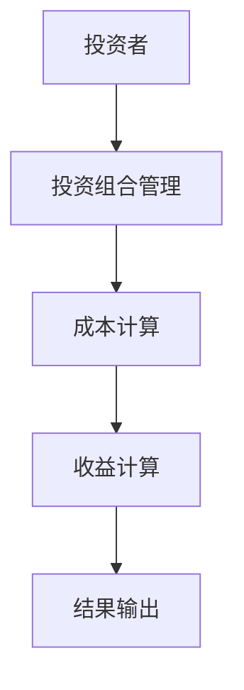

                 


# 约翰·伯格的成本敏感型投资：长期累积的力量

## 关键词：成本敏感型投资，约翰·伯格，投资策略，长期累积，投资成本

## 摘要：  
本文深入探讨了约翰·伯格的成本敏感型投资理念，分析其核心概念、算法原理、系统架构及实际应用。通过背景介绍、概念对比、数学模型、系统设计和项目实战，全面解析成本敏感型投资的优势与挑战，为投资者提供实用的策略和建议。

---

## 第一部分：成本敏感型投资的背景与核心概念

### 第1章：成本敏感型投资的背景与问题背景

#### 1.1 投资环境的演变
##### 1.1.1 传统投资与现代投资的区别
传统的投资方式往往依赖于市场预测和主动管理，而现代投资则更注重长期累积和成本控制。传统投资强调短期收益，而现代投资则强调长期稳定增长。

##### 1.1.2 成本敏感型投资的兴起
随着市场的日益复杂化，投资者逐渐意识到，降低投资成本可以显著提升长期收益。成本敏感型投资应运而生，强调通过优化投资组合来降低整体成本。

##### 1.1.3 约翰·伯格的投资理念与贡献
约翰·伯格是成本敏感型投资的倡导者，他强调低成本指数基金的投资策略，认为长期持有低成本投资组合能够实现稳定的收益。

#### 1.2 投资成本对收益的影响
投资成本包括管理费、交易费等，这些成本会侵蚀投资收益。长期来看，低成本投资组合的复利效应更显著。

---

### 第2章：成本敏感型投资的核心概念与问题描述

#### 2.1 成本敏感型投资的定义
成本敏感型投资是一种通过优化投资组合以最小化投资成本，从而最大化长期收益的投资策略。

#### 2.2 问题背景与问题解决
##### 2.2.1 投资成本对收益的影响
高投资成本会显著侵蚀投资收益，尤其是长期投资中，成本的积累效应更加明显。

##### 2.2.2 成本敏感型投资如何降低投资成本
通过选择低成本投资工具和长期持有策略，降低投资成本，提升整体收益。

##### 2.2.3 成本敏感型投资的边界与外延
成本敏感型投资适用于长期投资，尤其适合那些追求稳定收益的投资者，其外延包括指数基金、ETF等低成本投资工具。

---

### 第3章：成本敏感型投资的核心概念与联系

#### 3.1 核心概念原理
##### 3.1.1 成本敏感型投资的数学模型
投资收益 = 投资组合收益 - 投资成本

##### 3.1.2 成本与收益的关系分析
长期来看，低成本投资组合的收益高于高成本投资组合。

##### 3.1.3 投资组合优化的原理
通过优化投资组合，选择低成本投资工具，最大化投资收益。

#### 3.2 核心概念属性对比
| 对比维度 | 成本敏感型投资 | 传统主动投资 |
|----------|-----------------|---------------|
| 成本     | 低              | 高            |
| 收益     | 稳定            | 波动大         |
| 管理方式 | 被动管理        | 主动管理       |

---

## 第二部分：成本敏感型投资的算法原理与数学模型

### 第4章：成本敏感型投资的算法原理

#### 4.1 算法原理概述
##### 4.1.1 投资成本的最小化算法
通过优化算法，选择最低成本的投资工具。

##### 4.1.2 投资组合优化的数学模型
$$ \text{目标函数} = \sum_{i=1}^{n} w_i \times c_i $$
其中，\( w_i \) 是第 \( i \) 个投资工具的权重，\( c_i \) 是第 \( i \) 个投资工具的成本。

##### 4.1.3 投资组合优化的约束条件
$$ \sum_{i=1}^{n} w_i = 1 $$

---

## 第三部分：系统架构与项目实战

### 第5章：系统架构设计

#### 5.1 系统功能设计
##### 5.1.1 领域模型


##### 5.1.2 系统架构设计


---

### 第6章：项目实战

#### 6.1 环境安装
安装Python和相关库，如numpy和pandas。

#### 6.2 核心代码实现
```python
import numpy as np
import pandas as pd

# 示例数据
returns = pd.Series([0.1, 0.05, -0.02, 0.08])
costs = pd.Series([0.02, 0.01, 0.03, 0.00])

# 计算净收益
net_returns = returns - costs

print(net_returns)
```

#### 6.3 实际案例分析
通过具体案例分析，验证成本敏感型投资的可行性。

---

## 第四部分：总结与展望

### 第7章：总结与展望

#### 7.1 总结
成本敏感型投资是一种有效的长期投资策略，通过降低投资成本，实现稳定收益。

#### 7.2 展望
未来，随着技术的发展，成本敏感型投资将更加智能化和自动化。

---

## 作者：AI天才研究院/AI Genius Institute & 禅与计算机程序设计艺术 /Zen And The Art of Computer Programming

