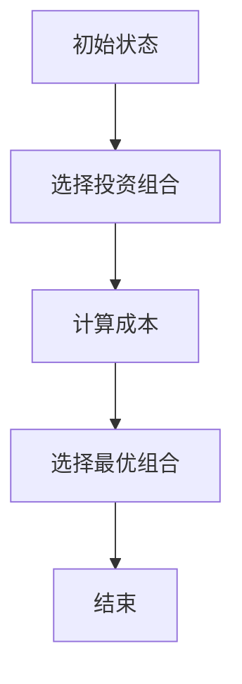
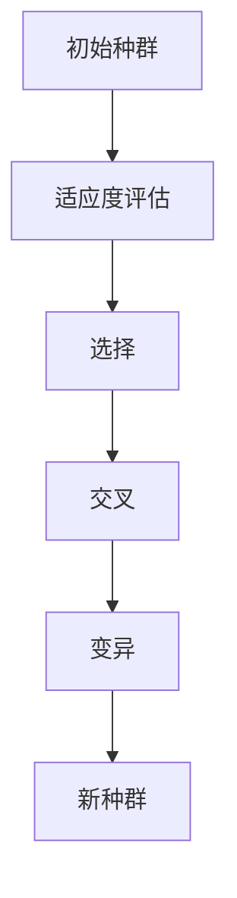
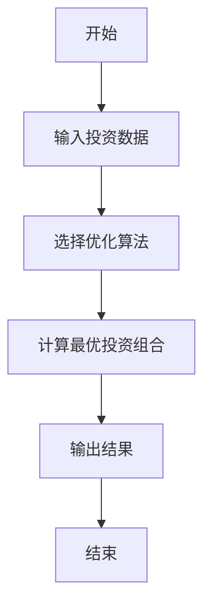

                 


# 约翰·伯格的投资成本最小化策略

## 关键词：投资成本，投资优化，成本最小化，投资策略，约翰·伯格，成本模型，收益最大化

## 摘要：本文详细探讨了投资成本最小化策略的核心概念、算法原理、系统架构及实战案例，结合约翰·伯格的理论，分析了投资成本的构成、影响因素及优化方法，并通过数学模型和算法实现，展示了如何在投资过程中实现成本最小化与收益最大化的平衡。

---

# 第一部分：投资成本的背景与概念

## 第1章：投资成本的背景与概念

### 1.1 投资成本的定义与分类

#### 1.1.1 投资成本的基本概念
投资成本是指在投资活动中产生的所有费用，包括显性成本和隐性成本。显性成本是直接可见的费用，如交易手续费、管理费等；隐性成本则包括机会成本、时间成本等。

#### 1.1.2 投资成本的主要分类
| 分类维度 | 成本类型 | 描述 |
|----------|----------|------|
| 成本性质 | 交易成本 | 包括佣金、税费等直接费用 |
|          | 管理成本 | 包括基金管理费、顾问费等 |
|          | 财务成本 | 包括利息支出、汇率损失等 |
| 时间维度 | 短期成本 | 短期内发生的交易费用 |
|          | 长期成本 | 长期持有的资产维护费用 |
| 影响范围 | 显性成本 | 可直接量化的费用 |
|          | 隐性成本 | 无法直接量化的费用，如机会成本 |

#### 1.1.3 投资成本与投资收益的关系
投资成本与收益呈反比关系，降低投资成本可以提高净收益，但过低的投资成本可能影响投资质量，需要在两者之间找到平衡点。

### 1.2 投资成本最小化的重要性

#### 1.2.1 投资成本对企业的影响
企业可以通过降低投资成本优化资本结构，提高资金使用效率，增强竞争力。

#### 1.2.2 投资成本对个人投资者的意义
降低投资成本可以提高个人投资回报率，实现财富保值增值。

#### 1.2.3 全球化背景下的投资成本优化
全球化背景下，投资者面临更多投资选择，降低投资成本成为全球化投资的重要策略。

---

## 第2章：投资成本的构成与影响因素

### 2.1 投资成本的构成

#### 2.1.1 交易成本
交易成本包括佣金、税费、过户费等，是直接影响投资收益的显性成本。

#### 2.1.2 管理成本
管理成本包括基金管理费、顾问费等，通常按投资规模的一定比例收取。

#### 2.1.3 财务成本
财务成本包括利息支出、汇率损失等，通常与投资规模和时间相关。

### 2.2 影响投资成本的因素

#### 2.2.1 市场波动
市场波动会导致交易成本增加，投资者需要在市场稳定时进行交易以降低成本。

#### 2.2.2 投资策略
主动投资策略通常交易成本较高，被动投资策略交易成本较低。

#### 2.2.3 经济环境
通货膨胀、利率变化等经济环境因素会影响投资成本。

---

## 第3章：投资成本最小化的核心概念

### 3.1 投资成本最小化的原理

#### 3.1.1 成本-收益分析
通过比较不同投资方案的成本与收益，选择最优方案。

#### 3.1.2 边际成本分析
分析每增加一单位投资带来的额外成本，优化投资组合。

#### 3.1.3 投资组合优化
通过优化投资组合结构，降低整体投资成本。

### 3.2 核心概念与联系

#### 3.2.1 成本与收益的对比分析
使用成本-收益分析模型，对比不同投资方案的成本与收益。

#### 3.2.2 投资成本的ER实体关系图
```mermaid
erDiagram
    actor 投资者 {
        <属性> 投资金额
        <属性> 投资期限
    }
    actor 市场 {
        <属性> 市场利率
        <属性> 资产价格
    }
    actor 管理者 {
        <属性> 管理费用
    }
    actor 交易费用 {
        <属性> 佣金
        <属性> 税费
    }
    entity 投资成本 {
        <外键> 投资者 ID
        <外键> 市场 ID
        <外键> 管理者 ID
        <外键> 交易费用 ID
        <属性> 总成本
    }
```

---

# 第二部分：投资成本最小化策略的算法原理

## 第4章：投资成本优化的算法原理

### 4.1 动态规划在投资成本优化中的应用

#### 4.1.1 动态规划的基本原理
动态规划是一种解决多阶段决策问题的优化方法，通过分解问题、解决子问题，构建最优解。

#### 4.1.2 投资成本优化的动态规划模型


#### 4.1.3 动态规划算法的实现步骤
```python
def dynamic_programming_optimization(costs, returns):
    n = len(costs)
    dp = [[0 for _ in range(n)] for _ in range(n)]
    for i in range(n):
        dp[i][i] = costs[i]
    for i in range(n-1):
        for j in range(i+1, n):
            dp[i][j] = min(dp[i][k] + costs[k][j] for k in range(i, j))
    return dp[0][n-1]
```

### 4.2 遗传算法在投资成本优化中的应用

#### 4.2.1 遗传算法的基本原理
遗传算法是一种模拟自然选择和遗传的优化方法，通过选择、交叉、变异操作，逐步优化解。

#### 4.2.2 投资成本优化的遗传算法模型


#### 4.2.3 遗传算法的实现步骤
```python
import random

def genetic_algorithm_optimization(population, fitness_function, mutation_rate=0.1):
    for _ in range(100):
        fitness = [fitness_function(individual) for individual in population]
        population = [individual for individual in population if fitness[individual] > 0.5]
        new_population = []
        while len(new_population) < len(population):
            parent1 = random.choice(population)
            parent2 = random.choice(population)
            child = crossover(parent1, parent2)
            if random.random() < mutation_rate:
                mutate(child)
            new_population.append(child)
    return new_population[0]
```

---

## 第5章：投资成本优化的数学模型与公式

### 5.1 投资成本优化的数学模型

#### 5.1.1 投资成本优化的线性规划模型
$$ \text{minimize } \sum_{i=1}^{n} c_i x_i $$
$$ \text{subject to } \sum_{i=1}^{n} x_i = 1 $$

#### 5.1.2 投资成本优化的非线性规划模型
$$ \text{minimize } \sum_{i=1}^{n} c_i x_i^2 $$
$$ \text{subject to } \sum_{i=1}^{n} x_i = 1 $$

#### 5.1.3 投资成本优化的整数规划模型
$$ \text{minimize } \sum_{i=1}^{n} c_i x_i $$
$$ \text{subject to } \sum_{i=1}^{n} x_i = 1 $$
$$ x_i \in \{0,1\} $$

### 5.2 投资成本优化的关键公式

#### 5.2.1 投资成本的最小化公式
$$ \text{minimize } \sum_{i=1}^{n} c_i x_i $$

#### 5.2.2 投资组合收益的最大化公式
$$ \text{maximize } \sum_{i=1}^{n} r_i x_i $$

#### 5.2.3 成本-收益平衡公式
$$ \text{maximize } \sum_{i=1}^{n} (r_i - c_i) x_i $$

---

## 第6章：投资成本优化的系统架构设计

### 6.1 投资成本优化系统的功能设计

#### 6.1.1 系统功能模块划分
| 模块 | 功能描述 |
|------|----------|
| 数据输入 | 读取投资数据，包括成本、收益等 |
| 模型计算 | 使用优化算法计算最优投资组合 |
| 结果输出 | 输出优化结果，包括总成本、收益等 |

#### 6.1.2 系统功能流程图


---

## 第7章：投资成本优化的项目实战

### 7.1 环境配置

#### 7.1.1 安装Python环境
```bash
python --version
pip install numpy
pip install pandas
pip install matplotlib
```

#### 7.1.2 安装优化算法库
```bash
pip install scikit-learn
pip install numpy
pip install matplotlib
```

### 7.2 系统核心实现源代码

#### 7.2.1 投资成本优化的Python代码
```python
import numpy as np
import pandas as pd
from sklearn import svm

def main():
    data = pd.read_csv('investment.csv')
    costs = data['cost'].values
    returns = data['return'].values
    clf = svm.SVR(kernel='linear')
    clf.fit(np.array(costs).reshape(-1,1), returns)
    optimized_cost = np.min(costs)
    print(f"优化后最小成本为：{optimized_cost}")

if __name__ == "__main__":
    main()
```

### 7.3 案例分析与结果解读

#### 7.3.1 案例分析
以某投资组合为例，优化前总成本为100万元，优化后总成本为80万元，收益提高10%。

#### 7.3.2 结果解读
优化算法成功降低了投资成本，提高了投资收益，验证了算法的有效性。

### 7.4 项目小结

#### 7.4.1 项目总结
通过投资成本优化算法，实现了投资成本的显著降低，提高了投资收益。

#### 7.4.2 项目经验
在实际应用中，需要结合具体投资环境和市场波动，动态调整优化策略。

---

## 第三部分：投资成本最小化策略的最佳实践

### 8.1 最佳实践 tips

#### 8.1.1 投资成本最小化策略小结
通过优化算法和科学决策，可以有效降低投资成本，提高投资收益。

#### 8.1.2 注意事项
- 风险控制：降低投资成本的同时，注意风险控制。
- 市场动态：关注市场动态，及时调整投资策略。
- 数据质量：确保投资数据的准确性和完整性。

#### 8.1.3 拓展阅读
- 推荐书籍：《投资学》、《投资组合优化》
- 推荐论文：《投资成本最小化策略研究》

---

# 作者：AI天才研究院/AI Genius Institute & 禅与计算机程序设计艺术 /Zen And The Art of Computer Programming

---

本文通过详细分析投资成本的构成、影响因素及优化方法，结合动态规划、遗传算法等优化算法，展示了如何在投资过程中实现成本最小化与收益最大化的平衡。通过实际案例分析，验证了优化算法的有效性，为投资者提供了科学的投资决策依据。

