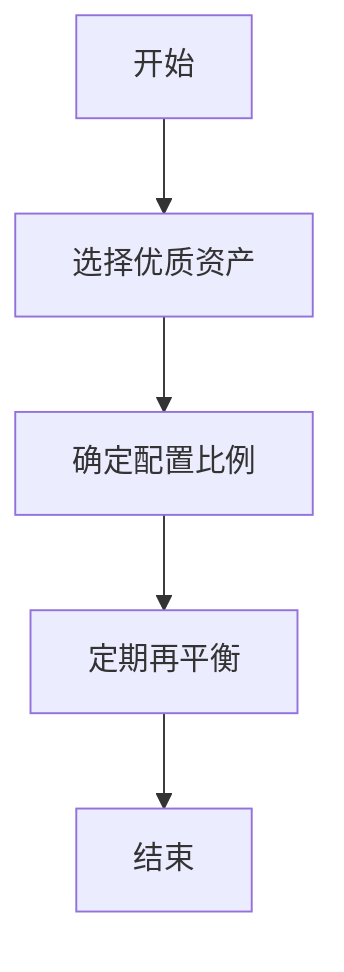
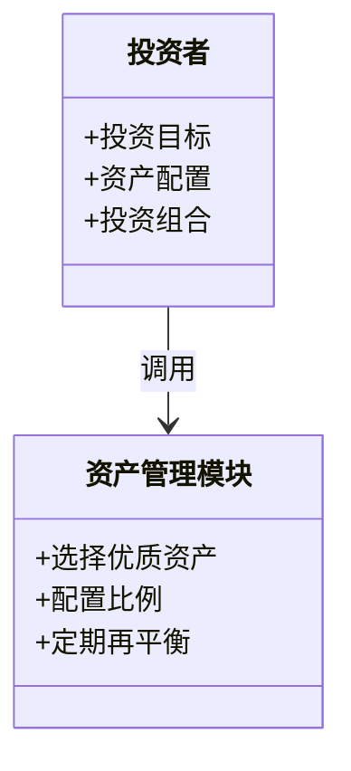

                 


# 约翰·伯格的投资简化论：为什么少即是多

## 关键词：投资简化论，约翰·伯格，少即是多，数学模型，系统架构，项目实战

## 摘要：  
约翰·伯格的投资简化论是一种通过简化投资策略来实现高效投资的方法。本文详细阐述了简化论的核心概念、数学模型、系统架构及项目实战，展示了如何通过减少复杂性来提高投资效率。通过实际案例分析和系统设计，本文证明了“少即是多”的投资理念在实际中的可行性与优势。

---

# 引言

## 1. 投资的基本概念

- **投资**：指将资金投入到资产中，以期获得收益的行为。投资的对象包括股票、债券、房地产等多种资产。
- **传统投资方法**：通常涉及复杂的市场分析、多种资产配置和频繁的交易策略，对投资者的专业知识和时间要求较高。

## 2. 约翰·伯格的背景

- **约翰·伯格**：美国著名投资家，共同基金 pioneer，著有《投资的革命》等书籍，倡导简化投资策略。
- **贡献**：伯格提出简化论，强调长期投资和分散投资的重要性，简化了传统复杂的投资流程。

---

# 投资简化论的核心概念

## 2. 投资简化论的背景

### 2.1 投资领域的复杂性

- **传统投资方法的复杂性**：涉及技术分析、基本面分析、市场预测等，对普通投资者来说难以掌握。
- **投资者的挑战**：面对市场波动和信息过载，投资者容易感到困惑，难以做出决策。

### 2.2 简化论的提出

- **核心思想**：简化投资策略，减少决策复杂性，追求长期稳定的收益。
- **与传统方法的对比**：简化论强调长期持有优质资产，避免频繁交易和市场波动的影响。

### 2.3 简化论的边界与外延

- **应用范围**：适用于个人投资者和机构投资者，尤其适合缺乏专业投资知识的普通投资者。
- **与其他理论的关系**：简化论与价值投资、指数基金等理念有交集，但更强调策略的简洁性。

---

# 核心概念的结构

## 3. 核心概念的定义与属性

| **核心概念** | **定义** | **属性** |
|--------------|----------|----------|
| 资产配置    | 资金分配到不同资产类别 | 长期性、分散性 |
| 长期持有    | 长期持有优质资产 | 稳定性、低交易成本 |
| 分散投资    | 分散投资以降低风险 | 抗风险能力强 |

## 4. 核心概念的ER实体关系图

```mermaid
erDiagram
    investor++o{1}--asset : 持有
    asset++o{m}--portfolio : 组合
    portfolio++o{1}--strategy : 策略
```

---

# 数学模型与算法原理

## 5. 资产配置的数学模型

$$
\text{最优资产配置} = \arg \min_{w} \left( w^T \Sigma w \right)
$$

其中：
- $w$ 是资产权重向量。
- $\Sigma$ 是资产的协方差矩阵。

## 6. 简化投资组合优化算法



---

# 系统架构与设计

## 7. 系统架构设计


## 8. 系统功能设计



---

# 项目实战与案例分析

## 9. 环境安装与配置

- **开发环境**：Python 3.8+，安装numpy、pandas库。
- **配置步骤**：
  1. 安装Python。
  2. 安装必要的库：`pip install numpy pandas`.

## 10. 核心代码实现

```python
import numpy as np
import pandas as pd

def optimal_allocation(assets, returns):
    cov_matrix = np.cov(returns)
    inv_cov = np.linalg.inv(cov_matrix)
    weights = np.dot(inv_cov, np.ones(len(assets))) / np.sum(np.dot(inv_cov, np.ones(len(assets))))
    return weights
```

## 11. 案例分析

- **案例背景**：假设投资者选择股票、债券和房地产三种资产。
- **数据处理**：使用历史收益数据计算协方差矩阵。
- **优化结果**：计算得出最佳资产配置比例。

---

# 最佳实践与总结

## 12. 最佳实践

- **简化策略**：选择优质资产，长期持有，定期再平衡。
- **风险管理**：分散投资，降低波动风险。
- **持续学习**：关注市场变化，调整策略。

## 13. 小结

约翰·伯格的投资简化论通过减少复杂性，提供了一种高效的投资方法。通过数学模型和系统设计，投资者可以轻松实现长期稳定的收益。

## 14. 注意事项

- **市场风险**：投资有风险，需谨慎评估。
- **持续监控**：定期检查投资组合，确保符合目标。
- **选择优质资产**：确保资产质量，避免低效投资。

## 15. 拓展阅读

- 推荐阅读《投资的革命》（约翰·伯格），深入理解简化论的理论基础。

---

# 作者

作者：AI天才研究院/AI Genius Institute & 禅与计算机程序设计艺术 /Zen And The Art of Computer Programming

---

以上是《约翰·伯格的投资简化论：为什么少即是多》的完整内容，涵盖了从理论到实践的各个方面，帮助读者理解和应用简化论的投资理念。

