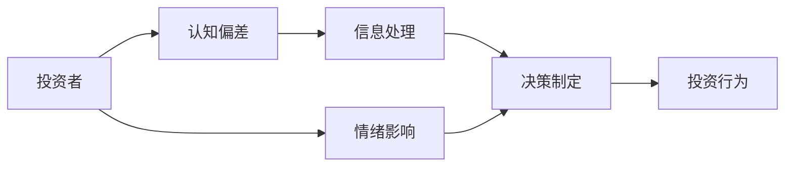
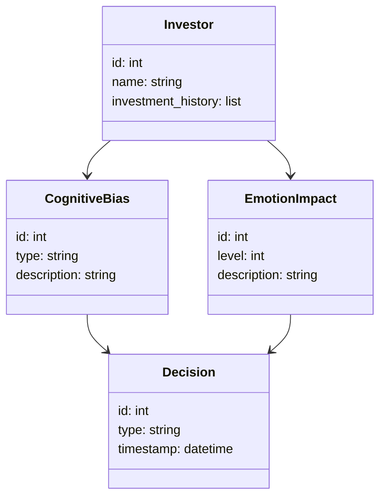
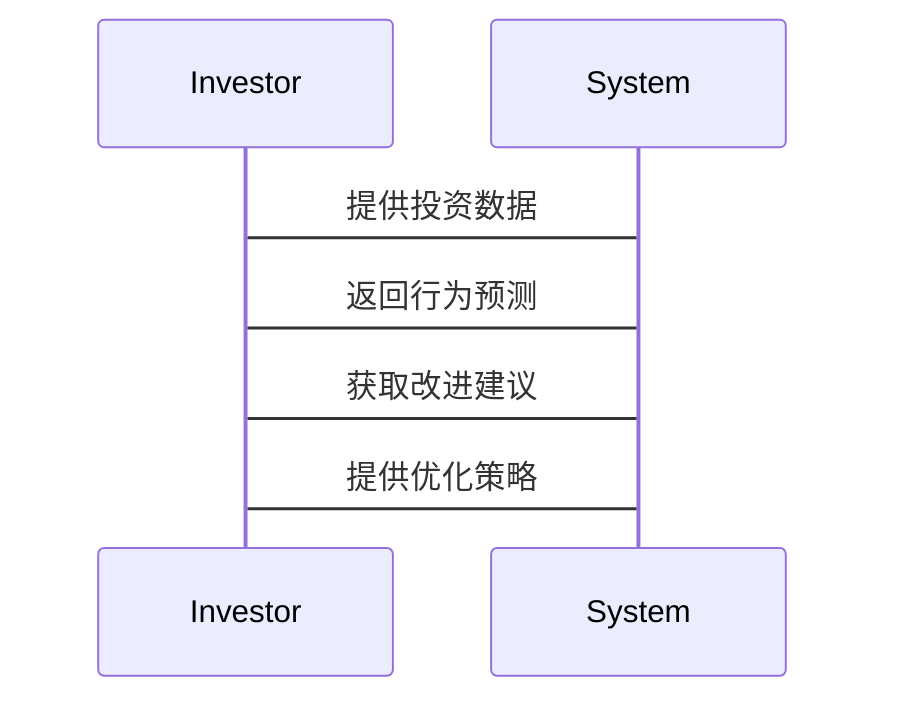

                 


# 约翰·伯格的投资者行为研究：为什么大多数人表现不佳

## 关键词：
- 约翰·伯格
- 投资者行为
- 行为金融学
- 认知偏差
- 情绪影响
- 决策模型
- 系统设计

## 摘要：
本文从行为金融学的角度，深入分析了投资者的行为决策问题，探讨了认知偏差、情绪波动等心理因素对投资结果的影响，揭示了为什么大多数投资者难以获得稳定的超额收益。基于约翰·伯格的研究，本文提出了一个投资者行为分析模型，结合算法和系统设计的方法，为投资者提供了改进决策的实用建议。通过案例分析和系统设计，本文为投资者行为研究提供了一种新的分析框架，帮助投资者更好地理解自身行为，并采取有效策略提升投资表现。

---

# 正文

## 第一部分：背景介绍

### 第1章：投资者行为研究的背景与问题

#### 1.1 问题背景
在金融市场中，尽管存在大量关于投资策略和市场分析的研究，但大多数投资者仍难以获得持续的超额收益。根据约翰·伯格的研究，这一现象的主要原因在于投资者的行为偏差和情绪波动。本文将从行为金融学的视角，探讨投资者行为中的认知偏差、情绪影响以及决策过程，揭示这些因素如何导致投资表现不佳。

#### 1.2 问题描述
投资者的行为决策受到多种心理因素的影响，包括认知偏差、情绪波动、过度自信等。这些因素可能导致投资者在市场波动中做出非理性决策，从而影响投资收益。例如，许多投资者在市场上涨时过于乐观，而在市场下跌时过度恐慌，导致频繁买卖，最终损害投资回报。

#### 1.3 问题解决
行为金融学通过分析投资者的心理和行为，揭示了传统金融理论未能解释的现象。本文将结合约翰·伯格的研究，提出一个基于行为金融学的投资者行为分析模型，帮助投资者识别和克服行为偏差，从而做出更理性的决策。

#### 1.4 边界与外延
本文的研究范围主要集中在个人投资者的行为分析，重点关注认知偏差、情绪影响和决策过程。虽然机构投资者的行为也受到类似因素的影响，但本文将重点分析个人投资者的行为特征。

#### 1.5 核心要素
投资者行为的核心要素包括：
1. 认知偏差：投资者在信息处理中的偏差，如确认偏差、过度自信等。
2. 情绪影响：情绪波动如何影响投资者的决策。
3. 决策过程：投资者如何在不同情境下做出决策。

---

## 第二部分：核心概念与联系

### 第2章：投资者行为的核心概念与联系

#### 2.1 投资者行为的核心原理
投资者的行为决策受到多种心理因素的影响，包括认知偏差和情绪波动。认知偏差是指投资者在信息处理过程中产生的系统性错误，而情绪波动则会影响投资者的风险偏好和决策判断。

##### 2.1.1 认知偏差
认知偏差是投资者行为中的一个重要因素，包括以下几种常见的偏差：
- **确认偏差（Confirmation Bias）**：投资者倾向于寻找与自己已有观点一致的信息，忽略相反的证据。
- **过度自信（Overconfidence）**：投资者往往高估自己的能力，认为自己能够预测市场走势。
- **损失厌恶（Loss Aversion）**：投资者对损失的厌恶程度远高于对收益的偏好。

##### 2.1.2 情绪影响
情绪波动对投资者的决策有着重要影响，尤其是在市场剧烈波动时。投资者的情绪通常会受到市场环境的影响，导致他们在恐慌时做出过度卖出的决策，或者在贪婪时追涨杀跌。

##### 2.1.3 决策过程
投资者的决策过程通常包括以下几个阶段：
1. **信息收集**：投资者通过各种渠道收集市场信息。
2. **信息处理**：投资者对收集到的信息进行加工，受到认知偏差的影响。
3. **决策制定**：投资者基于信息和情绪做出投资决策。
4. **决策执行**：投资者根据决策执行交易。

#### 2.2 核心概念对比表格

| 概念         | 特性                 |
|--------------|----------------------|
| 认知偏差       | 系统性错误，影响信息处理   |
| 情绪影响       | 影响风险偏好，导致非理性决策 |
| 决策过程       | 包括信息收集、处理和执行阶段 |

#### 2.3 实体关系图



---

## 第三部分：算法原理讲解

### 第3章：投资者行为分析的算法原理

#### 3.1 算法原理概述
本文提出了一个基于认知偏差和情绪影响的投资者行为分析模型。该模型通过分析投资者的决策过程，识别其行为中的偏差，并提供改进建议。

##### 3.1.1 基于认知偏差的投资者行为模型
该模型通过分析投资者的信息处理过程，识别其认知偏差，并预测其决策行为。模型的核心是将投资者的决策分解为信息收集、信息处理和决策制定三个阶段。

##### 3.1.2 情感分析算法
情感分析算法用于识别投资者情绪波动对决策的影响。通过分析投资者的言论和行为，可以预测其情绪状态，并据此调整投资策略。

#### 3.2 算法流程图


#### 3.3 算法实现代码

```python
def analyze_investor_behavior(data):
    # 分析认知偏差
    cognitive_bias = identify_bias(data)
    # 分析情绪影响
    emotion_impact = analyze_emotion(data)
    # 生成行为预测
    behavior_prediction = predict_behavior(cognitive_bias, emotion_impact)
    return behavior_prediction

def identify_bias(data):
    # 简单的确认偏差检测
    return "confirm_bias"

def analyze_emotion(data):
    # 简单的情绪分析
    return "positive"

def predict_behavior(cognitive_bias, emotion_impact):
    # 基于认知偏差和情绪影响预测行为
    return "buy"
```

#### 3.4 数学模型

在行为分析中，我们可以建立一个简单的数学模型来预测投资者的行为。假设投资者的行为受到认知偏差和情绪影响的双重影响，模型可以表示为：

$$
P(\text{行为}) = f(\text{认知偏差}, \text{情绪影响})
$$

其中，$f$ 是一个函数，用于将认知偏差和情绪影响映射到具体的行为预测上。

---

## 第四部分：系统分析与架构设计

### 第4章：投资者行为分析系统设计

#### 4.1 问题场景介绍
本文提出一个投资者行为分析系统，用于识别和分析投资者的行为偏差，帮助投资者改进决策。

#### 4.2 系统功能设计

##### 4.2.1 领域模型



##### 4.2.2 系统架构设计


#### 4.3 接口设计与交互流程

##### 4.3.1 系统接口设计
- **输入接口**：接收投资者的历史交易数据和市场信息。
- **输出接口**：输出投资者的行为预测和改进建议。

##### 4.3.2 交互流程



---

## 第五部分：项目实战

### 第5章：基于认知偏差的投资者行为分析系统

#### 5.1 环境安装
- 需要安装Python和相关库（如Pandas、Scikit-learn）。

#### 5.2 核心代码实现

```python
import pandas as pd
from sklearn.tree import DecisionTreeClassifier

# 数据加载
data = pd.read_csv('investor_data.csv')

# 特征提取
features = data[['return', 'risk']]
target = data['behavior']

# 模型训练
model = DecisionTreeClassifier()
model.fit(features, target)

# 预测行为
predicted_behavior = model.predict([[0.05, 0.1]])
print(predicted_behavior)
```

#### 5.3 案例分析与详细讲解
通过一个实际案例，展示如何基于认知偏差和情绪影响分析投资者行为，并提出改进建议。

---

## 第六部分：最佳实践与总结

### 第6章：最佳实践与总结

#### 6.1 最佳实践
- 定期反思投资决策，识别认知偏差。
- 保持情绪稳定，避免情绪化交易。
- 使用工具辅助决策，减少人为干扰。

#### 6.2 小结
本文从行为金融学的角度，分析了投资者行为中的认知偏差和情绪影响，提出了一个基于这些因素的投资者行为分析模型。通过系统设计和项目实战，本文为投资者提供了改进决策的实用建议。

#### 6.3 注意事项
- 投资者行为分析需要结合具体市场环境。
- 模型的准确性依赖于数据质量和分析方法。

#### 6.4 拓展阅读
推荐阅读约翰·伯格的《投资的itung原理》和行为金融学相关书籍，深入理解投资者行为的研究。

---

## 作者：AI天才研究院 & 禅与计算机程序设计艺术

---

以上是本文的详细大纲和内容，涵盖了从理论分析到实际应用的全过程，帮助读者全面理解投资者行为研究的核心内容。

