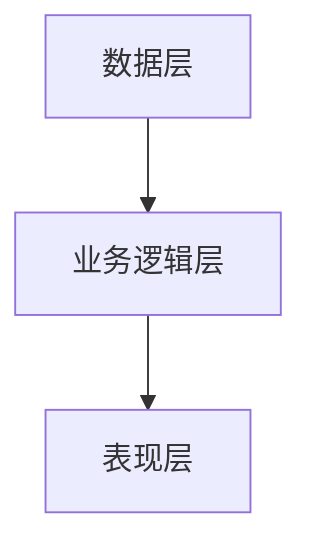
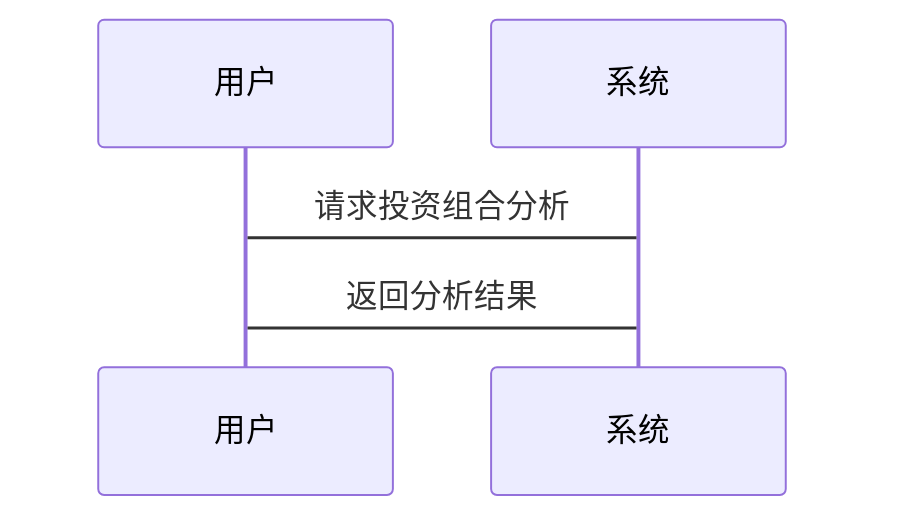

                 


# 约翰·伯格的被动投资与公司治理影响

## 关键词：被动投资、公司治理、投资策略、治理机制、股东价值、系统架构、项目实战

## 摘要：  
本文探讨了约翰·伯格的被动投资策略及其对公司治理的影响。通过分析被动投资的核心概念、策略与实施方法，结合公司治理的机制与影响，揭示两者之间的相互作用及其对股东价值的影响。文章还结合数学模型、系统架构和项目实战，提供深入的理论分析与实践指导。

---

## 第1章：被动投资与公司治理的核心概念

### 1.1 被动投资的定义与特点
被动投资是一种长期投资策略，强调遵循市场指数，避免频繁交易和市场预测。其特点包括：
- **长期性**：注重长期价值，而非短期波动。
- **低成本**：通过跟踪指数基金降低管理费用。
- **分散化**：通过广泛投资分散风险。

### 1.2 公司治理的定义与特点
公司治理是通过明确的规则和结构，确保公司有效运作和股东权益保护。其特点包括：
- **透明性**：确保决策过程公开透明。
- **责任性**：明确董事会和管理层的责任。
- **利益平衡**：平衡股东、管理层和利益相关者的利益。

### 1.3 被动投资与公司治理的关联性
被动投资与公司治理相互影响：
- 被动投资者依赖公司治理结构来维护自身权益。
- 公司治理的效率直接影响被动投资的回报。

---

## 第2章：被动投资策略的制定与实施

### 2.1 被动投资的主要策略
- **指数基金投资**：通过跟踪市场指数（如标普500）构建投资组合。
- **定投策略**：定期定额投资，分散市场波动风险。
- **价值投资**：选择低估的公司长期持有。

### 2.2 被动投资的实施方法
- **资产配置**：根据风险承受能力分配资产。
- **风险控制**：通过分散投资降低市场风险。
- **费用优化**：选择低费率的指数基金。

### 2.3 被动投资的优缺点分析
- **优点**：风险低、费用低、操作简单。
- **缺点**：收益受限于市场表现，缺乏主动管理。

---

## 第3章：公司治理的机制与影响

### 3.1 公司治理的主要机制
- **股东大会**：决定公司重大事项。
- **董事会结构**：负责公司战略和监督。
- **管理层监督**：确保管理层高效运作。

### 3.2 公司治理的影响因素
- **治理效率**：影响公司决策和执行效率。
- **透明度**：影响投资者信心和市场表现。

### 3.3 公司治理对股东价值的影响
- **治理效率提升**：优化公司运营，提升股东回报。
- **透明度增强**：提高市场信任度，吸引长期投资者。

---

## 第4章：被动投资与公司治理的相互作用

### 4.1 被动投资对股东权益的影响
- 通过持有股权影响公司治理，但影响力有限。

### 4.2 公司治理对被动投资的影响
- 有效的治理机制提升投资回报，反之则增加风险。

### 4.3 被动投资与公司治理的相互影响
- 被动投资者依赖良好的治理机制，而公司治理依赖被动投资者的长期支持。

---

## 第5章：数学模型与算法

### 5.1 投资回报模型
投资回报可以表示为：
$$ R = \mu - \frac{1}{2}\sigma^2 $$
其中，$\mu$为期望回报，$\sigma$为投资风险。

### 5.2 治理效率对投资回报的影响
治理效率 $E$ 与投资回报 $R$ 的关系：
$$ R = \alpha E + \beta $$

### 5.3 夏普比率
夏普比率衡量投资回报与风险的关系：
$$ \text{夏普比率} = \frac{R_p - R_f}{\sigma_p} $$

---

## 第6章：系统分析与架构设计

### 6.1 系统功能设计
- **领域模型**：展示公司治理与被动投资的关系。
- **系统架构**：设计分层架构，包括数据层、业务逻辑层和表现层。

### 6.2 系统架构图


### 6.3 系统接口设计
- API接口用于数据交互，如 `get_portfolio()` 和 `evaluate_governance()`。

### 6.4 系统交互图


---

## 第7章：项目实战

### 7.1 环境安装
安装Python和必要的库：
```bash
pip install pandas numpy matplotlib
```

### 7.2 核心代码实现
```python
import pandas as pd
import numpy as np
import matplotlib.pyplot as plt

# 数据处理
def calculate_return(portfolio):
    return portfolio.mean()

# 可视化
def plot_governance_impact(governance_scores):
    plt.plot(governance_scores)
    plt.xlabel('年份')
    plt.ylabel('治理评分')
    plt.title('公司治理评分变化')
    plt.show()
```

### 7.3 案例分析
分析某公司治理评分对投资回报的影响，绘制治理评分变化图。

### 7.4 实践小结
通过项目实战，验证被动投资与公司治理的相互影响，优化投资组合。

---

## 第8章：最佳实践与总结

### 8.1 小结
被动投资与公司治理相互影响，优化治理结构能提升投资回报。

### 8.2 注意事项
- 定期评估投资组合。
- 关注公司治理动态。
- 结合主动投资策略。

### 8.3 拓展阅读
- 《投资学》
- 《公司治理原则》

---

## 作者：AI天才研究院/AI Genius Institute & 禅与计算机程序设计艺术 /Zen And The Art of Computer Programming

---

通过以上结构，文章系统地分析了约翰·伯格的被动投资策略及其对公司治理的影响，结合数学模型和系统架构，提供了理论与实践的双重指导。

