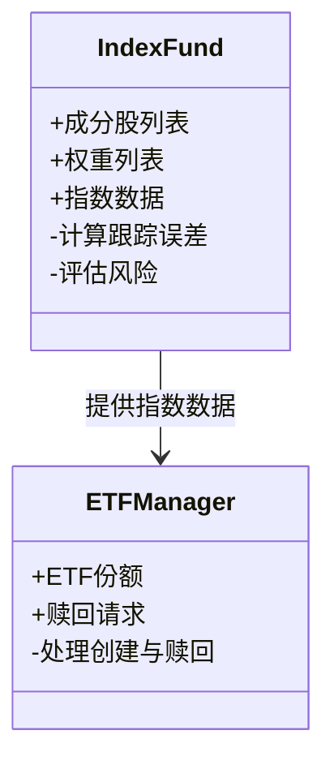

                 


# 约翰·伯格的被动投资：ETF时代的新发展

## 关键词：被动投资，ETF，指数基金，约翰·伯格，现代投资组合理论

## 摘要：本文深入探讨了被动投资的核心理念及其在ETF时代的最新发展。通过分析约翰·伯格的贡献、指数基金的运作机制、ETF的兴起以及现代投资策略的应用，本文揭示了被动投资在降低风险、提高收益方面的独特优势。文章还结合实际案例，详细阐述了被动投资的算法原理、系统架构设计以及项目实战中的具体实现，为读者提供了全面的理论与实践指导。

---

## 第一部分：被动投资与ETF的背景介绍

### 第1章：被动投资与ETF概述

#### 1.1 被动投资的基本概念

被动投资是一种以指数基金或ETF为基础的投资策略，其核心理念是通过跟踪市场指数来实现长期稳定的收益，而非通过频繁交易或选股来获得超额收益。被动投资的核心在于“不主动干预”，通过分散投资来降低风险，追求与市场同步的增长。

##### 1.1.1 被动投资的定义与特点
- **定义**：被动投资是指通过投资指数基金或其他跟踪市场指数的金融工具，以获得与市场指数相似收益的投资策略。
- **特点**：
  - 成本低：被动投资的管理费用通常低于主动管理型基金。
  - 风险分散：通过投资多样化资产，降低特定资产的风险。
  - 简单易行：投资者无需频繁交易或选股，适合长期投资。

##### 1.1.2 被动投资与主动投资的区别
| 对比维度 | 被动投资 | 主动投资 |
|----------|----------|----------|
| 投资目标 | 追踪市场指数 | 寻找被低估或高增长的资产 |
| 管理方式 | 无需主动管理 | 需要专业经理人管理 |
| 成本 | 低 | 高 |
| 风险 | 低 | 高 |

##### 1.1.3 被动投资的历史发展
被动投资的理念起源于20世纪中期，但真正的发展始于20世纪70年代，随着指数基金的出现而逐渐普及。1975年，约翰·伯格创立了先锋集团（Vanguard），并推出了一系列低成本的指数基金，标志着被动投资进入了一个新的发展阶段。

---

#### 1.2 ETF的基本原理

ETF（交易所交易基金）是一种在交易所上市交易的开放式基金，兼具封闭式基金和开放式基金的特点。ETF的投资者可以通过在交易所买卖ETF份额，间接投资于一揽子证券。

##### 1.2.1 ETF的定义与运作机制
- **定义**：ETF是一种跟踪特定指数、商品或一篮子资产的金融工具，投资者可以通过在交易所买卖ETF份额，间接投资于标的资产。
- **运作机制**：
  - ETF由基金管理公司发行，包含多种资产（如股票、债券等）。
  - 投资者购买ETF份额，相当于间接持有标的资产。
  - ETF在交易所上市交易，价格实时更新，投资者可以随时买卖。

##### 1.2.2 ETF的优势与劣势
| 优势 | 劣势 |
|------|------|
| 流动性高 | 存在市场波动风险 |
| 成本低 | 受市场指数波动影响 |
| 多样化投资 | 无法超越市场表现 |

##### 1.2.3 ETF的分类与应用场景
- **分类**：
  - 根据标的资产：股票型ETF、债券型ETF、商品型ETF等。
  - 根据指数类型：宽基指数ETF（如沪深300）、窄基指数ETF（如科技股指数）。
- **应用场景**：
  - 长期资产配置：通过投资宽基ETF实现资产的长期增值。
  - 行业配置：通过窄基ETF投资特定行业或主题。

---

#### 1.3 约翰·伯格的贡献

##### 1.3.1 约翰·伯格的生平简介
约翰·伯格（John C. Bogle）是被动投资领域的先驱，被誉为“指数基金之父”。他于1940年出生于美国宾夕法尼亚州，毕业于宾夕法尼亚大学，后加入富达投资公司，1974年创立了先锋集团（Vanguard Group）。

##### 1.3.2 先锋基金的被动投资理念
- **低成本策略**：先锋基金通过规模经济降低了管理费用，使其指数基金具有竞争力。
- **分散化投资**：通过投资指数基金，先锋基金实现了资产的广泛分散，降低了投资风险。
- **长期投资**：伯格倡导长期投资理念，认为市场波动是短期的，长期来看，指数基金能够实现稳定的收益。

##### 1.3.3 ETF的起源与发展
- **起源**：1975年，先锋集团推出了第一只指数基金——Vanguard 500 Index Fund，标志着被动投资时代的到来。
- **发展**：随着技术的进步和市场的成熟，ETF逐渐成为投资者的重要工具，市场规模迅速扩大。

---

## 第二部分：被动投资的核心概念与联系

### 第2章：被动投资的原理与策略

#### 2.1 指数基金的投资策略

##### 2.1.1 指数基金的定义与特点
- **定义**：指数基金是以特定市场指数为标的，按照指数成分股的构成比例进行投资的基金。
- **特点**：
  - 成本低：指数基金的管理费用通常低于主动管理型基金。
  - 风险低：通过分散投资，降低特定资产的风险。
  - 简单易行：投资者无需选股，只需选择合适的指数基金即可。

##### 2.1.2 指数基金的投资策略
- **买入并持有**：指数基金的投资策略通常是买入并持有，通过长期持有获得市场平均收益。
- **定期再平衡**：为了保持与指数的一致性，指数基金需要定期进行再平衡，调整持仓比例。

##### 2.1.3 指数基金的风险管理
- **分散化**：通过投资广泛分散的资产，降低特定资产的风险。
- **长期视角**：指数基金的波动性较低，适合长期投资者。

---

#### 2.2 ETF的运作机制

##### 2.2.1 ETF的结构与运作流程
- **结构**：ETF由基金管理公司发行，包含一揽子资产（如股票、债券等），投资者通过购买ETF份额间接持有这些资产。
- **运作流程**：
  1. 投资者购买ETF份额，支付资金给基金管理公司。
  2. 基金管理公司用这些资金购买标的资产。
  3. ETF在交易所上市交易，投资者可以随时买卖ETF份额。
  4. 当投资者卖出ETF份额时，基金管理公司赎回资金。

##### 2.2.2 ETF的创建与赎回机制
- **创建**：当市场对某种ETF的需求增加时，大型机构投资者可以向基金管理公司提交一篮子资产，换取ETF份额。
- **赎回**：当需求减少时，机构投资者可以将ETF份额赎回，换取一篮子资产。

##### 2.2.3 ETF的市场流动性与交易成本
- **流动性**：ETF在交易所上市交易，具有较高的流动性，投资者可以随时买卖。
- **交易成本**：ETF的交易成本通常较低，但与股票类似，存在买卖价差。

---

## 第三部分：被动投资的算法原理

### 第3章：指数复制与风险模型

#### 3.1 指数复制方法

##### 3.1.1 指数复制的定义与目的
- **定义**：指数复制是指通过购买一定比例的指数成分股，复制市场指数的表现。
- **目的**：通过复制指数，投资者可以实现与市场指数相似的收益，同时降低交易成本和管理费用。

##### 3.1.2 指数复制的实现方法
- **完全复制**：购买全部指数成分股，按照指数权重进行投资。
- **部分复制**：根据成本和流动性等因素，选择部分成分股进行投资。
- **优化复制**：通过数学优化方法，选择最优的成分股组合，以最小化跟踪误差。

##### 3.1.3 跟踪误差的计算
- **定义**：跟踪误差是指指数基金的实际收益与目标指数收益之间的差异。
- **计算公式**：$$跟踪误差 = \sqrt{\text{实际收益} - \text{预期收益}}$$
- **优化目标**：通过优化复制方法，最小化跟踪误差。

---

#### 3.2 风险模型

##### 3.2.1 风险模型的定义与作用
- **定义**：风险模型是用于量化投资组合风险的数学模型。
- **作用**：帮助投资者评估投资组合的风险，优化资产配置。

##### 3.2.2 风险模型的分类
- **单一风险模型**：只考虑市场风险。
- **多因素风险模型**：考虑多个风险因素（如市场风险、行业风险、风格风险等）。

##### 3.2.3 风险模型的实现
- **现代投资组合理论（MPT）**：通过分散化投资降低风险。
- **资本资产定价模型（CAPM）**：用于评估资产的预期收益与风险。

---

#### 3.3 数学模型与公式推导

##### 3.3.1 指数复制的数学模型
- **目标**：最小化跟踪误差。
- **优化函数**：$$\min \text{跟踪误差}$$
- **约束条件**：
  - 投资比例之和为1。
  - 投资比例非负。

##### 3.3.2 风险模型的数学公式
- **方差-协方差矩阵**：$$\sigma^2 = \mathbf{w}^T \Sigma \mathbf{w}$$
- **权重向量**：$$\mathbf{w} = \argmin \mathbf{w}^T \Sigma \mathbf{w}$$

---

## 第四部分：系统分析与架构设计方案

### 第4章：被动投资系统的架构设计

#### 4.1 系统功能设计

##### 4.1.1 功能模块
- **数据获取**：从交易所获取指数成分股数据。
- **指数复制**：根据指数权重构建投资组合。
- **风险评估**：评估投资组合的风险。
- **交易执行**：根据策略执行买卖操作。

##### 4.1.2 领域模型（Mermaid 类图）


---

#### 4.2 系统架构设计

##### 4.2.1 架构图（Mermaid 架构图）


---

#### 4.3 系统接口设计

##### 4.3.1 接口描述
- **数据接口**：与交易所或数据源对接，获取指数成分股数据。
- **交易接口**：与交易系统对接，执行买卖操作。
- **用户接口**：提供用户查询和管理功能。

---

## 第五部分：项目实战

### 第5章：被动投资系统的实现

#### 5.1 环境安装

##### 5.1.1 Python环境
- 安装Python 3.x
- 安装Pandas、NumPy、Matplotlib等库。

#### 5.2 核心实现

##### 5.2.1 ETF数据获取与处理
```python
import pandas as pd
import numpy as np

# 获取指数成分股数据
index_components = pd.read_csv('index_components.csv')
weights = pd.read_csv('weights.csv')
```

##### 5.2.2 指数复制实现
```python
def compute_tracking_error(weights, returns):
    covariance_matrix = returns.cov()
    tracking_error = np.sqrt(weights.T @ covariance_matrix @ weights)
    return tracking_error

weights = weights.values
returns = index_components.pct_change().dropna()
tracking_error = compute_tracking_error(weights, returns)
print(f"Tracking Error: {tracking_error}")
```

##### 5.2.3 风险评估与优化
```python
from scipy.optimize import minimize

def minimize_tracking_error(weights):
    returns = index_components.pct_change().dropna()
    covariance_matrix = returns.cov()
    result = minimize(lambda x: (x.T @ covariance_matrix @ x), weights, 
                      constraints={'type': 'eq', 'fun': lambda x: np.sum(x) - 1})
    return result.x

optimized_weights = minimize_tracking_error(weights)
print(f"Optimized Weights: {optimized_weights}")
```

---

## 第六部分：最佳实践、小结与注意事项

### 第6章：总结与展望

#### 6.1 最佳实践
- **低成本策略**：选择管理费用低的指数基金或ETF。
- **分散化投资**：通过投资广泛分散的资产降低风险。
- **长期视角**：被动投资适合长期投资者，避免短期波动的影响。

#### 6.2 小结
被动投资是一种简单有效的投资策略，通过投资指数基金或ETF，投资者可以实现长期稳定的收益。本文详细介绍了被动投资的核心理念、ETF的运作机制、指数复制方法以及系统实现，为读者提供了全面的理论与实践指导。

#### 6.3 注意事项
- **市场风险**：ETF的价格受市场波动影响，存在一定的投资风险。
- **费用问题**：选择低成本的ETF可以提高长期收益。
- **流动性风险**：部分ETF可能存在流动性不足的问题，影响交易效率。

---

## 作者信息

作者：AI天才研究院/AI Genius Institute & 禅与计算机程序设计艺术 /Zen And The Art of Computer Programming

