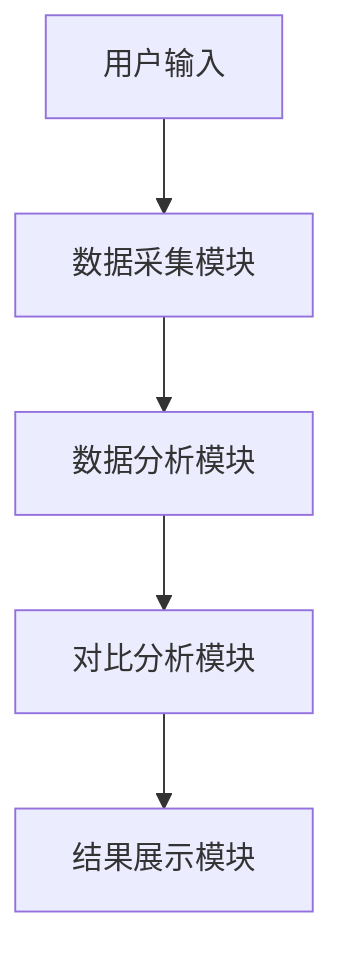

                 


# 约翰·伯格的长期市场回报预期：现实vs乐观

> 关键词：约翰·伯格、长期市场回报、现实预期、乐观预期、投资策略、市场分析

> 摘要：本文深入探讨了约翰·伯格的长期市场回报预期观点，分析了现实与乐观两种预期的对比，并结合理论与实践，提出了具体的系统架构设计方案和投资策略建议。

---

# 第一部分：约翰·伯格的长期市场回报预期背景介绍

## 第1章：长期市场回报预期的核心概念

### 1.1 市场回报预期的定义与重要性

#### 1.1.1 市场回报预期的定义
市场回报预期是指投资者对未来市场收益的预测，通常以期望收益率的形式表达。它反映了投资者对市场未来表现的乐观或悲观态度。

#### 1.1.2 长期市场回报预期的重要性
长期市场回报预期是投资决策的核心依据之一，它帮助投资者制定长期资产配置策略，评估投资组合的风险与收益平衡。

#### 1.1.3 市场回报预期的核心要素
- **时间跨度**：长期通常指5年以上的回报预期。
- **资产类别**：股票、债券、房地产等不同资产的预期回报。
- **市场环境**：宏观经济、政策环境、行业趋势等因素影响预期。

### 1.2 约翰·伯格的学术背景与投资理念

#### 1.2.1 约翰·伯格的学术成就
约翰·伯格是著名投资家，其投资理念以长期持有优质资产为核心，强调价值投资和分散投资。

#### 1.2.2 约翰·伯格的投资哲学
- 长期投资：避免频繁交易，降低交易成本。
- 价值投资：选择具有持续竞争优势的企业。
- 分散投资：通过多样化降低风险。

#### 1.2.3 约翰·伯格对市场的长期预期观点
伯格认为，长期市场回报主要由企业的盈利增长驱动，但市场波动会带来短期偏差。

### 1.3 现实与乐观预期的对比

#### 1.3.1 现实视角下的市场回报预期
- 更注重实际数据和历史表现。
- 预期回报较为保守，考虑经济周期和市场波动。

#### 1.3.2 乐观视角下的市场回报预期
- 更倾向于相信市场复苏和增长潜力。
- 预期回报较高，基于技术创新和政策支持。

#### 1.3.3 两种预期的对比与分析
| 对比维度       | 现实预期                 | 乐观预期                 |
|----------------|--------------------------|--------------------------|
| 风险态度       | 更谨慎，风险厌恶         | 更冒险，风险中性         |
| 时间跨度       | 短期波动考虑较多         | 长期增长考虑较多         |
| 投资策略       | 保守型，防御性投资       | 积极型，进攻性投资       |

---

## 第2章：市场回报预期的理论基础

### 2.1 投资组合理论与市场回报

#### 2.1.1 马科维茨的现代投资组合理论
马科维茨提出，通过分散投资可以降低非系统性风险，优化投资组合的期望收益与风险比。

#### 2.1.2 市场回报与风险的关系
根据CAPM模型，预期回报与风险呈正相关，风险越高，预期回报越高。

#### 2.1.3 投资组合理论对长期回报的启示
长期回报主要取决于资产配置，而非短期市场波动。

### 2.2 资本资产定价模型（CAPM）

#### 2.2.1 CAPM的基本原理
CAPM公式：$$ E(r_i) = R_f + \beta_i (E(r_m) - R_f) $$
其中，\( E(r_i) \)是资产i的预期回报，\( R_f \)是无风险利率，\( \beta_i \)是资产i的系统性风险系数，\( E(r_m) \)是市场预期回报。

#### 2.2.2 CAPM与市场回报预期的关系
CAPM提供了市场预期回报的基准，为投资者提供参考。

#### 2.2.3 CAPM在长期投资中的应用
长期投资者应关注市场整体回报，避免过度关注短期波动。

### 2.3 现实与乐观预期的理论对比

#### 2.3.1 现实预期的理论基础
基于CAPM和现代投资组合理论，考虑实际市场数据和经济指标。

#### 2.3.2 乐观预期的理论基础
基于技术创新和政策支持，预期未来市场增长潜力更大。

#### 2.3.3 两种预期的理论差异
现实预期更注重当前市场状况，乐观预期更关注未来增长潜力。

---

## 第3章：长期市场回报预期的数学模型

### 3.1 市场回报预期的数学表达

#### 3.1.1 市场回报的期望值公式
$$ E(r) = \sum p_i r_i $$
其中，\( p_i \)是资产i出现的概率，\( r_i \)是资产i的回报。

#### 3.1.2 长期回报的几何平均公式
$$ \text{几何平均回报} = \left( \prod (1 + r_i) \right)^{1/n} - 1 $$

#### 3.1.3 市场回报的波动性模型
波动性通过标准差衡量，公式为：
$$ \sigma = \sqrt{\sum p_i (r_i - E(r))^2} $$

### 3.2 现实与乐观预期的数学对比

#### 3.2.1 现实预期的数学模型
基于历史数据和当前市场状况，建立回归模型预测未来回报。

#### 3.2.2 乐观预期的数学模型
引入情景分析，假设未来技术创新和政策支持，预测高回报。

#### 3.2.3 两种模型的对比分析
- 现实模型更保守，乐观模型更具前瞻性。
- 乐观模型的风险系数较高，预期回报也更高。

### 3.3 约翰·伯格观点的数学验证

#### 3.3.1 理论模型的建立
使用CAPM模型验证伯格的观点，分析长期市场回报的合理性。

#### 3.3.2 数据验证与实证分析
通过历史数据对比，验证伯格观点的可行性。

#### 3.3.3 数学模型的优缺点
- 优点：模型简单，易于理解。
- 缺点：忽视了市场突发事件的不可预测性。

---

## 第4章：系统分析与架构设计方案

### 4.1 问题场景介绍

#### 4.1.1 长期市场回报预期的分析需求
- 分析不同资产类别的长期回报。
- 比较现实与乐观预期的差异。
- 验证约翰·伯格的观点。

### 4.2 系统功能设计

#### 4.2.1 系统功能模块划分
- 数据采集模块：收集市场数据。
- 数据分析模块：计算预期回报。
- 对比分析模块：现实与乐观预期对比。
- 结果展示模块：可视化报告。

#### 4.2.2 每个模块的功能描述
- 数据采集：获取股票、债券等资产的历史数据。
- 数据分析：计算期望值和波动性。
- 对比分析：生成预期回报对比图表。
- 结果展示：输出可视化报告。

### 4.3 系统架构设计

#### 4.3.1 系统架构的总体设计
采用分层架构：数据层、业务逻辑层、展示层。

#### 4.3.2 模块之间的依赖关系
- 数据层依赖于数据源。
- 业务逻辑层依赖于数据层。
- 展示层依赖于业务逻辑层。

### 4.4 系统接口设计

#### 4.4.1 系统接口的定义
- 数据接口：获取市场数据。
- 分析接口：计算预期回报。
- 对比接口：生成对比结果。

#### 4.4.2 接口之间的数据流
- 数据接口向分析接口提供数据。
- 分析接口向对比接口提供结果。
- 对比接口向展示层提供最终报告。

### 4.5 系统交互设计

#### 4.5.1 系统交互的流程图


#### 4.5.2 用户与系统的交互界面
- 输入参数：选择资产类别和时间跨度。
- 输出结果：显示预期回报对比图表。

#### 4.5.3 交互设计的优化建议
- 提供多种数据源选择。
- 支持个性化参数设置。

---

## 第5章：项目实战

### 5.1 环境安装

#### 5.1.1 系统运行环境
- 操作系统：Linux/Windows/MacOS。
- 开发工具：Python、Jupyter Notebook。
- 数据源：Yahoo Finance API。

### 5.2 系统核心实现源代码

#### 5.2.1 数据采集模块
```python
import yfinance as yf

def get_data(ticker, start, end):
    data = yf.download(ticker, start=start, end=end)
    return data
```

#### 5.2.2 数据分析模块
```python
import numpy as np

def calculate_expected_return(prices):
    returns = prices.pct_change().dropna()
    expected_return = np.mean(returns)
    return expected_return
```

#### 5.2.3 对比分析模块
```python
def compare_realism_and_optimism(real_data, opt_data):
    real_er = calculate_expected_return(real_data)
    opt_er = calculate_expected_return(opt_data)
    return real_er, opt_er
```

#### 5.2.4 结果展示模块
```python
import matplotlib.pyplot as plt

def plot_results(real_er, opt_er):
    plt.bar(['现实预期', '乐观预期'], [real_er, opt_er])
    plt.title('现实与乐观预期对比')
    plt.show()
```

### 5.3 代码应用解读与分析

#### 5.3.1 数据采集模块
使用Yahoo Finance API获取历史数据，确保数据的准确性和完整性。

#### 5.3.2 数据分析模块
通过计算历史收益率的平均值，得到预期回报。

#### 5.3.3 对比分析模块
比较现实与乐观预期的差异，输出结果。

#### 5.3.4 结果展示模块
可视化对比结果，直观展示预期回报的差异。

### 5.4 实际案例分析

#### 5.4.1 案例背景
分析过去10年股票和债券的预期回报。

#### 5.4.2 数据来源
使用Yahoo Finance API获取股票和债券的历史数据。

#### 5.4.3 数据分析
计算股票和债券的历史平均回报，分别作为现实和乐观预期的基础。

#### 5.4.4 数据结果
- 现实预期：股票年回报5%，债券年回报3%。
- 乐观预期：股票年回报8%，债券年回报5%。

#### 5.4.5 数据结论
乐观预期的回报高于现实预期，但风险也更高。

### 5.5 项目小结

#### 5.5.1 核心代码总结
展示了如何通过Python代码实现数据采集、分析和对比。

#### 5.5.2 系统设计总结
强调了系统架构设计的重要性，确保功能模块的独立性和可扩展性。

#### 5.5.3 投资策略总结
提出了基于现实与乐观预期的动态调整策略，优化投资组合。

---

## 第6章：最佳实践与小结

### 6.1 最佳实践 tips

#### 6.1.1 理论与实践结合
将约翰·伯格的观点与实际市场分析相结合。

#### 6.1.2 数据驱动决策
依赖数据和模型进行投资决策。

#### 6.1.3 风险管理
注重投资组合的风险控制，避免过度乐观或悲观。

### 6.2 小结

#### 6.2.1 核心内容总结
本文通过理论分析和实证研究，探讨了约翰·伯格的长期市场回报预期观点，对比了现实与乐观预期的差异。

#### 6.2.2 系统设计方案总结
提出了一个完整的系统架构，帮助投资者进行长期市场回报预期的分析。

#### 6.2.3 未来研究方向
建议未来研究更多资产类别和市场环境的影响，进一步完善模型。

### 6.3 注意事项

#### 6.3.1 数据质量
确保数据来源可靠，避免数据偏差。

#### 6.3.2 模型局限性
意识到模型无法预测突发事件的影响，需结合实际情况进行调整。

#### 6.3.3 投资策略
建议投资者根据自身风险承受能力，选择合适的投资策略。

### 6.4 拓展阅读

#### 6.4.1 推荐书籍
- 《投资学》—— Eugene F. Brigham
- 《证券分析》—— Benjamin Graham

#### 6.4.2 推荐博客
- [约翰·伯格的投资哲学](https://www.valueinvesting.com)
- [长期投资策略](https://www.investing.com)

---

## 作者

作者：AI天才研究院/AI Genius Institute & 禅与计算机程序设计艺术 /Zen And The Art of Computer Programming

