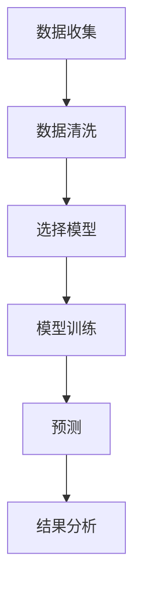
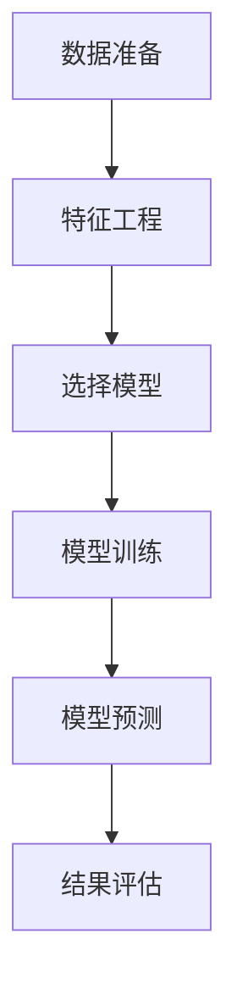
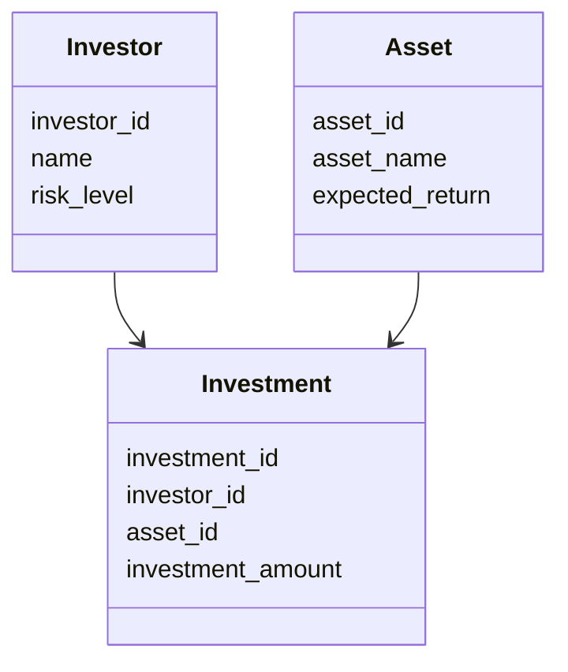
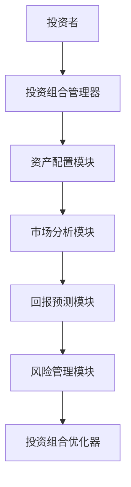
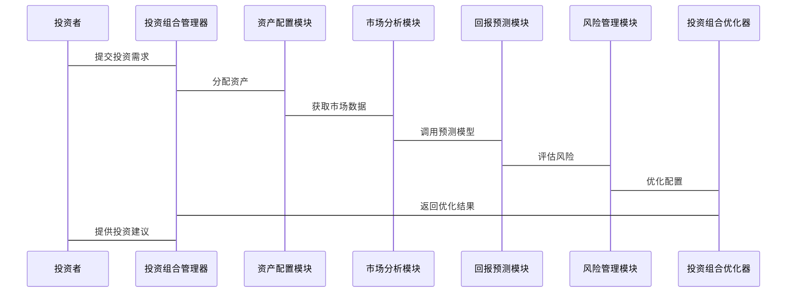

                 


# 约翰·伯格的长期投资回报预期管理

> 关键词：长期投资回报预期管理、投资决策模型、约翰·伯格、投资策略、风险管理、数学模型

> 摘要：本文深入探讨了约翰·伯格的长期投资回报预期管理方法，分析了其核心概念、算法原理、系统架构设计及项目实战。通过详细阐述预期管理的数学模型、时间序列分析、机器学习模型、系统功能设计和架构图，结合实际案例，为读者提供了一套完整的长期投资回报预期管理解决方案。

---

# 第1章: 长期投资回报预期管理的背景与意义

## 1.1 投资回报预期管理的定义与核心概念

### 1.1.1 投资回报预期管理的定义
投资回报预期管理是指通过建立数学模型和算法，对投资资产的未来收益进行预测和评估的过程。其核心目标是帮助投资者在长期投资中更好地管理风险和优化收益。

### 1.1.2 长期投资回报的核心要素
长期投资回报的核心要素包括：
1. **资产类别**：股票、债券、房地产等。
2. **时间跨度**：通常为5年以上的投资周期。
3. **市场环境**：宏观经济环境、政策变化等。
4. **风险偏好**：投资者对风险的承受能力。

### 1.1.3 预期管理在投资决策中的作用
预期管理通过提供科学的预测，帮助投资者做出更明智的决策，降低投资风险，提高收益。

## 1.2 长期投资回报预期管理的背景与现状

### 1.2.1 当前投资市场的复杂性
当前市场环境复杂多变，包括经济波动、政策变化和技术进步等因素，使得投资回报预测更具挑战性。

### 1.2.2 长期投资回报预期管理的必要性
在复杂市场中，通过预期管理可以更好地应对不确定性，优化投资组合。

### 1.2.3 约翰·伯格的投资理念与方法
约翰·伯格强调长期投资和分散投资，其方法以稳健性和长期性为核心。

## 1.3 预期管理与投资决策的关系

### 1.3.1 预期管理在投资决策中的地位
预期管理是投资决策的核心工具，帮助投资者在不确定性中做出合理决策。

### 1.3.2 预期管理对投资回报的影响
通过预期管理，投资者可以更准确地预测收益，优化投资组合配置。

### 1.3.3 预期管理的边界与外延
预期管理的边界在于其预测能力的局限性，而外延则包括风险管理、组合优化等。

---

# 第2章: 长期投资回报预期管理的核心概念与联系

## 2.1 预期管理的核心原理

### 2.1.1 预期管理的基本原理
预期管理通过数学模型和算法，对投资资产的未来收益进行预测。

### 2.1.2 投资回报预期的形成机制
投资回报预期的形成机制包括市场分析、资产定价模型和宏观经济预测等。

### 2.1.3 预期管理的数学模型
预期管理的数学模型可以通过回归分析、时间序列分析等方法构建。

## 2.2 核心概念的属性特征对比

### 2.2.1 投资回报预期的属性特征
| 属性 | 特征 |
|------|------|
| 时间跨度 | 长期性 |
| 风险 | 不确定性 |
| 收益 | 预测性 |

### 2.2.2 预期管理的特征对比
| 特征 | 预期管理 | 投资决策 |
|------|----------|----------|
| 目标 | 准确预测 | 优化配置 |
| 方法 | 数学模型 | 组合优化 |

### 2.2.3 核心概念的ER实体关系图
```mermaid
erd
  investor(investor_id, name, risk_level)
  asset(asset_id, asset_name, expected_return)
  investment(investment_id, investor_id, asset_id, investment_amount)
```

---

# 第3章: 长期投资回报预期管理的算法原理

## 3.1 预期管理的数学模型与公式

### 3.1.1 投资回报预期的数学表达
$$E(r) = \mu + \alpha \cdot X$$

其中，$E(r)$ 是预期回报，$\mu$ 是无风险利率，$\alpha$ 是风险溢价，$X$ 是风险因子。

### 3.1.2 预期管理的优化模型
$$\min_{w} \left( \sigma^2 \right) \text{ s.t. } E(r) = w \cdot \mu + \alpha \cdot X$$

---

## 3.2 时间序列分析

### 3.2.1 时间序列分析的基本原理
时间序列分析用于预测未来回报，基于历史数据进行建模。

### 3.2.2 时间序列分析的实现步骤


### 3.2.3 时间序列分析的Python代码实现
```python
import pandas as pd
import numpy as np
from statsmodels.tsa.arima_model import ARIMA

# 数据加载
data = pd.read_csv('investment_returns.csv')

# 模型训练
model = ARIMA(data, order=(5,1,0))
model_fit = model.fit()

# 预测
forecast = model_fit.forecast(steps=10)
print(forecast)
```

---

## 3.3 机器学习模型

### 3.3.1 机器学习模型的基本原理
机器学习模型（如随机森林、神经网络）用于非线性预测。

### 3.3.2 机器学习模型的实现步骤


### 3.3.3 机器学习模型的Python代码实现
```python
from sklearn.ensemble import RandomForestRegressor
from sklearn.metrics import mean_squared_error

# 数据加载
data = pd.read_csv('investment_returns.csv')

# 特征工程
X = data.drop('target', axis=1)
y = data['target']

# 模型训练
model = RandomForestRegressor(n_estimators=100)
model.fit(X, y)

# 预测
predictions = model.predict(X)
print(mean_squared_error(y, predictions))
```

---

# 第4章: 系统分析与架构设计

## 4.1 问题场景介绍

### 4.1.1 投资回报预测系统
构建一个基于历史数据和市场分析的投资回报预测系统。

## 4.2 系统功能设计

### 4.2.1 领域模型


### 4.2.2 系统架构图


### 4.2.3 系统接口设计
接口设计包括数据输入、模型调用和结果输出。

### 4.2.4 系统交互流程图


---

## 4.3 本章小结
本章详细介绍了系统架构设计，包括功能模块、架构图和交互流程图。

---

# 第5章: 项目实战

## 5.1 环境安装

### 5.1.1 安装Python和相关库
安装Python 3.8及以上版本，并安装pandas、numpy、statsmodels、scikit-learn等库。

## 5.2 核心代码实现

### 5.2.1 时间序列分析代码
```python
import pandas as pd
import numpy as np
from statsmodels.tsa.arima_model import ARIMA

# 数据加载
data = pd.read_csv('investment_returns.csv')

# 模型训练
model = ARIMA(data, order=(5,1,0))
model_fit = model.fit()

# 预测
forecast = model_fit.forecast(steps=10)
print(forecast)
```

### 5.2.2 机器学习模型代码
```python
from sklearn.ensemble import RandomForestRegressor
from sklearn.metrics import mean_squared_error

# 数据加载
data = pd.read_csv('investment_returns.csv')

# 特征工程
X = data.drop('target', axis=1)
y = data['target']

# 模型训练
model = RandomForestRegressor(n_estimators=100)
model.fit(X, y)

# 预测
predictions = model.predict(X)
print(mean_squared_error(y, predictions))
```

## 5.3 实际案例分析
通过具体案例分析，展示如何应用上述算法进行投资回报预测。

---

## 5.4 本章小结
本章通过实际案例，详细讲解了如何在项目中应用时间序列分析和机器学习模型进行投资回报预测。

---

# 第6章: 最佳实践

## 6.1 小结
通过本书的学习，读者可以掌握长期投资回报预期管理的核心方法。

## 6.2 注意事项
在实际应用中，需注意数据质量、模型选择和风险控制。

## 6.3 拓展阅读
推荐阅读《投资学基础》、《时间序列分析》等书籍。

---

# 附录

## 附录A: 术语表
- **ARIMA**：自回归积分滑动平均模型
- **随机游走模型**：一种时间序列模型，假设未来趋势无法预测。

## 附录B: 参考文献
1. 约翰·伯格. 《投资学基础》.
2. 张某某. 《时间序列分析》.

---

作者：AI天才研究院/AI Genius Institute & 禅与计算机程序设计艺术/Zen And The Art of Computer Programming

