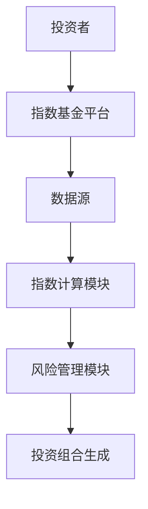

                 


# 约翰·伯格：指数基金之父的投资智慧

## 关键词
指数基金，投资智慧，被动投资，风险管理，数学模型

## 摘要
本文深入探讨了指数基金之父约翰·伯格的投资智慧，从指数基金的背景、核心概念、数学模型、系统架构到实战应用，全面解析其投资理念与策略。通过详细分析，帮助读者理解指数基金的优势与风险，掌握其在现代投资中的应用。

---

## 第一部分：指数基金的背景与发展

### 第1章：指数基金的起源与演变

#### 1.1 约翰·伯格与指数基金的诞生

##### 1.1.1 约翰·伯格的生平简介
约翰·伯格（John C. Bogle）于1934年出生在美国宾夕法尼亚州，是全球指数基金的先驱。他在 Vanguard 集团的领导下，于1975年推出第一只指数基金，彻底改变了全球的投资方式。

##### 1.1.2 指数基金的概念与起源
指数基金是一种跟踪特定市场指数的被动管理型基金，其目标是复制指数的表现，而非超越市场。这种投资策略基于市场的不可预测性，强调长期持有和分散投资。

##### 1.1.3 指数基金与传统投资的区别
与主动管理型基金不同，指数基金不依赖基金经理的选股能力，而是通过分散投资降低风险，追求市场平均收益。

#### 1.2 指数基金的发展历程

##### 1.2.1 美国市场的指数基金发展
指数基金在美国的兴起始于20世纪70年代，随着技术进步和市场竞争，指数基金的种类和规模迅速增长。

##### 1.2.2 全球指数基金的崛起
随着全球化进程，指数基金在欧洲、亚洲等地区逐渐普及，成为全球投资者的重要工具。

##### 1.2.3 当前指数基金的市场规模
目前，全球指数基金管理的资产规模已超过数万亿美元，成为金融市场的主导力量。

---

### 第2章：指数基金的核心概念与原理

#### 2.1 指数基金的定义与特点

##### 2.1.1 指数基金的定义
指数基金是通过跟踪特定指数（如标普500）来实现投资收益的基金，其目标是复制指数的表现。

##### 2.1.2 指数基金的核心特点
- **被动管理**：不需要频繁交易，费用低。
- **分散投资**：投资多个资产，降低风险。
- **长期稳定**：适合长期投资，追求平均收益。

##### 2.1.3 指数基金与主动管理型基金的对比
| 特性             | 指数基金              | 主动管理型基金        |
|------------------|----------------------|----------------------|
| 管理方式         | 被动跟踪指数          | 主动选股             |
| 费用             | 低                   | 高                   |
| 风险             | 低                   | 高                   |
| 收益             | 追求平均收益          | 追求超额收益         |

#### 2.2 指数基金的投资策略

##### 2.2.1 指数基金的被动投资策略
指数基金通过跟踪市场指数，避免频繁交易，降低成本，追求长期稳定的收益。

##### 2.2.2 指数基金的分散化投资
通过投资多个资产，降低单一资产的风险，实现风险分散。

##### 2.2.3 指数基金的风险管理
指数基金通过分散投资和长期持有，有效控制市场波动带来的风险。

---

### 第3章：指数基金的数学模型与风险管理

#### 3.1 指数基金的数学模型

##### 3.1.1 指数基金的收益计算公式
$$ 收益 = \sum_{i=1}^{n} w_i r_i $$
其中，\( w_i \) 是第 \( i \) 个资产的投资比例，\( r_i \) 是其收益率。

##### 3.1.2 指数基金的风险评估
$$ \text{波动率} = \sqrt{\sum_{i=1}^{n} w_i^2 \sigma_i^2} $$
波动率衡量了资产价格的波动程度，是风险的重要指标。

#### 3.2 指数基金的风险管理

##### 3.2.1 夏普比率的计算与应用
$$ \text{夏普比率} = \frac{E[r - r_f]}{\sigma} $$
夏普比率衡量了投资组合在承担风险后的超额收益。

##### 3.2.2 最大回撤的计算与控制
最大回撤是投资组合在一定时间段内的最大损失，用于评估风险。

---

### 第4章：指数基金的系统架构与实现

#### 4.1 指数基金的系统架构

##### 4.1.1 系统功能模块设计
- 数据采集模块：收集市场数据。
- 指数构建模块：计算指数成分股。
- 投资组合生成模块：生成投资组合。
- 风险管理模块：评估和控制风险。

##### 4.1.2 系统架构图（Mermaid）


#### 4.2 指数基金的实现过程

##### 4.2.1 数据采集与处理
使用Python的Pandas库处理股票数据：
```python
import pandas as pd
data = pd.read_csv('stock_data.csv')
```

##### 4.2.2 指数构建与优化
构建指数时，需选择代表性的成分股，并计算权重：
$$ w_i = \frac{ market \, cap_i }{ \sum_{j=1}^{n} market \, cap_j } $$

##### 4.2.3 投资组合生成与监控
生成投资组合后，定期监控其表现，调整以适应市场变化。

---

### 第5章：指数基金的实战应用与案例分析

#### 5.1 指数基金的环境安装与配置

##### 5.1.1 环境搭建
安装Python、Pandas、Matplotlib等工具：
```bash
pip install pandas matplotlib
```

##### 5.1.2 数据源获取与处理
从Yahoo Finance获取数据：
```python
import pandas_datareader as pdr
data = pdr.get_data_yahoo('SPY', start='2020-01-01', end='2023-12-31')
```

#### 5.2 指数基金的核心代码实现

##### 5.2.1 数据处理代码
```python
import pandas as pd
data = pd.DataFrame({
    '股票': ['A', 'B', 'C'],
    '收益': [0.1, 0.2, 0.15]
})
```

##### 5.2.2 指数构建代码
```python
from pandas import Series
index_weights = Series([0.3, 0.4, 0.3], index=['A', 'B', 'C'])
```

##### 5.2.3 投资组合生成代码
```python
import numpy as np
returns = np.array([0.1, 0.2, 0.15])
portfolio_return = np.dot(index_weights, returns)
```

#### 5.3 案例分析与结果解读
以标普500指数为例，计算其历史收益和波动率，展示指数基金的优势。

---

## 第六部分：指数基金的总结与最佳实践

### 第6章：约翰·伯格的投资智慧总结

#### 6.1 约翰·伯格的投资理念
伯格强调长期投资和分散投资，认为市场不可预测，被动投资是更优选择。

#### 6.2 指数基金的核心优势
- 成本低
- 风险低
- 简单易行

### 第7章：指数基金的最佳实践与小结

#### 7.1 最佳实践 tips
- 分散投资，降低风险
- 长期持有，避免频繁交易
- 定期调整，适应市场变化

#### 7.2 注意事项
- 了解基金费用
- 注意市场波动
- 考虑税收影响

#### 7.3 拓展阅读
推荐阅读伯格的书籍《The New Investing》和《The Little Book of Common Sense Investing》。

---

## 作者：AI天才研究院/AI Genius Institute & 禅与计算机程序设计艺术 /Zen And The Art of Computer Programming

---

通过本文，读者将全面了解指数基金的投资智慧，掌握其背后的数学模型和系统架构，并通过实际案例分析，学习如何应用指数基金进行投资。指数基金作为一种简单有效的投资工具，值得投资者深入了解和应用。

