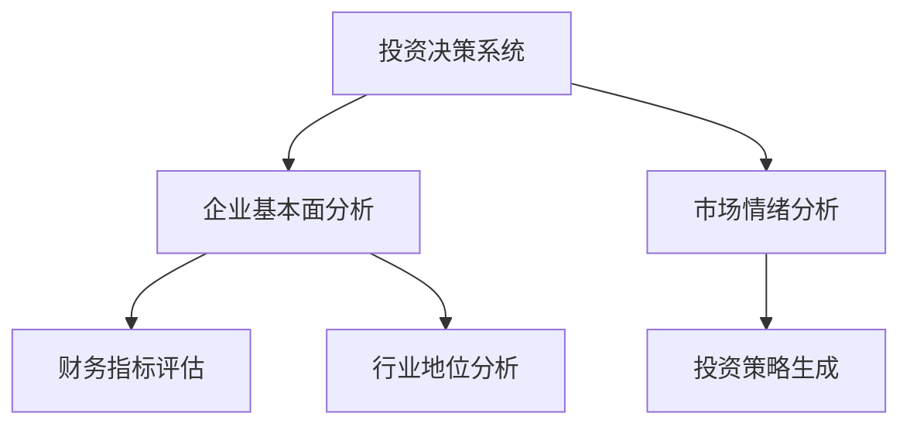
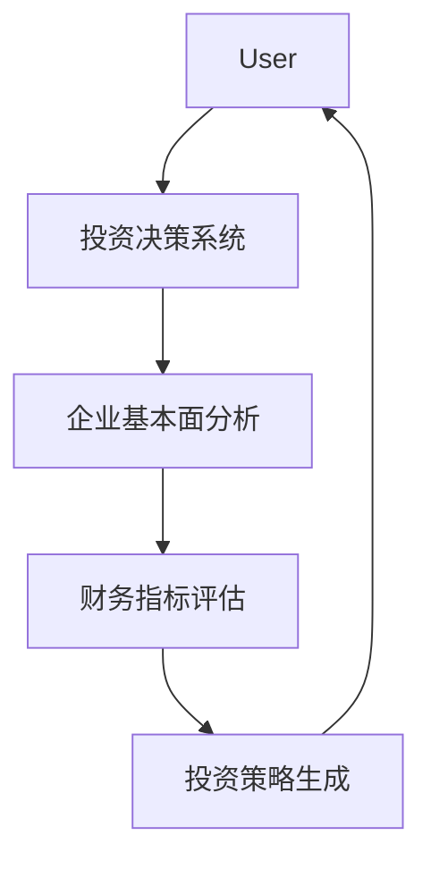

                 


# 罗杰·洛温斯坦的智慧型价值投资

## 关键词：智慧型价值投资, 投资策略, 长期投资, 安全边际, 企业评估, 风险管理

## 摘要：  
罗杰·洛温斯坦的智慧型价值投资是一种结合了深度基本面分析和长期投资策略的方法。本文将详细探讨其核心概念、算法原理、系统架构以及实际案例，帮助读者理解如何在投资实践中应用这一策略。

---

## 第一部分：价值投资的背景与基础

### 第1章：价值投资的起源与核心理念

#### 1.1 价值投资的定义与历史发展

价值投资是一种以企业内在价值为基础的投资策略，起源于20世纪初。其核心理念是购买价格低于内在价值的股票，长期持有，等待市场重新认识其价值。

#### 1.2 价值投资的核心理念

- **安全边际**：购买价格远低于内在价值，以降低风险。
- **长期视角**：关注企业的长期盈利能力，而非短期市场波动。
- **基本面分析**：通过财务报表等数据评估企业的内在价值。

---

## 第二部分：智慧型价值投资的核心概念

### 第2章：智慧型价值投资的定义与特点

#### 2.1 智慧型价值投资的定义

智慧型价值投资是罗杰·洛温斯坦提出的一种投资方法，结合了基本面分析和行为金融学，强调理性与情绪的平衡，注重长期投资和高质量企业的选择。

#### 2.2 智慧型价值投资的特点

| 特性 | 描述 |
|------|------|
| 理性与情绪的平衡 | 避免情绪化决策，结合市场情绪分析 |
| 高质量企业的选择 | 选择具有强大竞争优势的企业 |
| 长期持有与动态调整 | 长期持有优质资产，定期评估并调整 |

### 第3章：智慧型价值投资的决策模型

#### 3.1 投资决策的逻辑框架

- **企业基本面分析**：评估企业的盈利能力、财务状况和行业地位。
- **市场情绪分析**：判断市场的非理性波动，寻找低估机会。
- **安全边际计算**：确定买入价格与内在价值的差距。

#### 3.2 投资决策的数学模型

现值计算公式：
$$ PV = \frac{CF}{r} $$

折现现金流模型：
$$ DCF = \sum_{t=1}^{n} \frac{CF_t}{(1 + r)^t} $$

---

## 第三部分：智慧型价值投资的实践应用

### 第4章：智慧型投资策略的系统分析

#### 4.1 投资系统架构

- **系统功能设计**：包括企业基本面分析、市场情绪分析和财务指标预警模块。
- **系统架构图**：


### 第5章：智慧型投资的项目实战

#### 5.1 项目背景与目标

以投资苹果公司为例，分析其财务状况、行业地位和竞争优势。

#### 5.2 项目核心实现

- **数据收集**：收集苹果的财务报表和市场数据。
- **模型训练**：使用DCF模型计算苹果的内在价值。
- **系统实现**：开发一个简单的投资决策支持系统。

#### 5.3 项目案例分析

- **苹果公司分析**：通过DCF模型计算其内在价值，判断是否低估。

---

## 第四部分：智慧型价值投资的系统实现

### 第6章：智慧型投资的系统实现

#### 6.1 系统功能设计

- **企业基本面分析模块**：包括收入、利润和现金流分析。
- **市场情绪分析模块**：通过新闻和社交媒体数据判断市场情绪。
- **财务指标预警模块**：监控企业的财务健康状况。

#### 6.2 系统架构设计


#### 6.3 系统交互设计



---

## 第五部分：智慧型价值投资的项目实战

### 第7章：智慧型投资的项目实战

#### 7.1 环境安装

- **工具安装**：安装Python和相关库（如pandas、numpy）。
- **数据收集**：从Yahoo Finance获取股票数据。

#### 7.2 核心实现

```python
import pandas as pd
import numpy as np

# 示例代码：计算DCF模型
def calculateDCF(revenue, growth_rate, discount_rate):
    CF = revenue * (1 + growth_rate)
    PV = CF / discount_rate
    return PV

revenue = 1000000
growth_rate = 0.1
discount_rate = 0.05

DCF_value = calculateDCF(revenue, growth_rate, discount_rate)
print(f"DCF Value: {DCF_value}")
```

---

## 第六部分：智慧型价值投资的最佳实践

### 第8章：智慧型投资的最佳实践

#### 8.1 心态管理

- 避免情绪化决策，保持长期视角。
- 定期复盘，评估投资组合的表现。

#### 8.2 风险管理

- 设置止损点，控制风险敞口。
- 分散投资，降低集中风险。

#### 8.3 拓展阅读

- 《投资最重要的事情》——本杰明·格雷厄姆
- 《聪明的投资者》——沃伦·巴菲特

---

## 结论

罗杰·洛温斯坦的智慧型价值投资结合了基本面分析和长期投资策略，为投资者提供了一种理性与感性平衡的投资方法。通过系统的分析和实际案例的展示，我们可以更好地理解和应用这一投资策略。

---

## 作者：AI天才研究院/AI Genius Institute & 禅与计算机程序设计艺术 /Zen And The Art of Computer Programming

