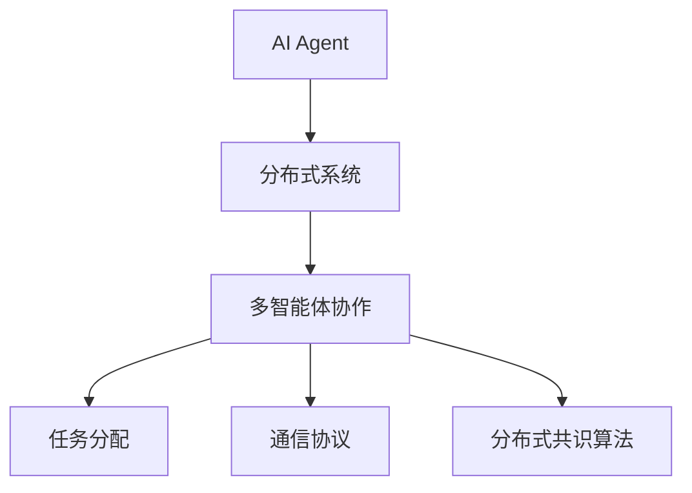
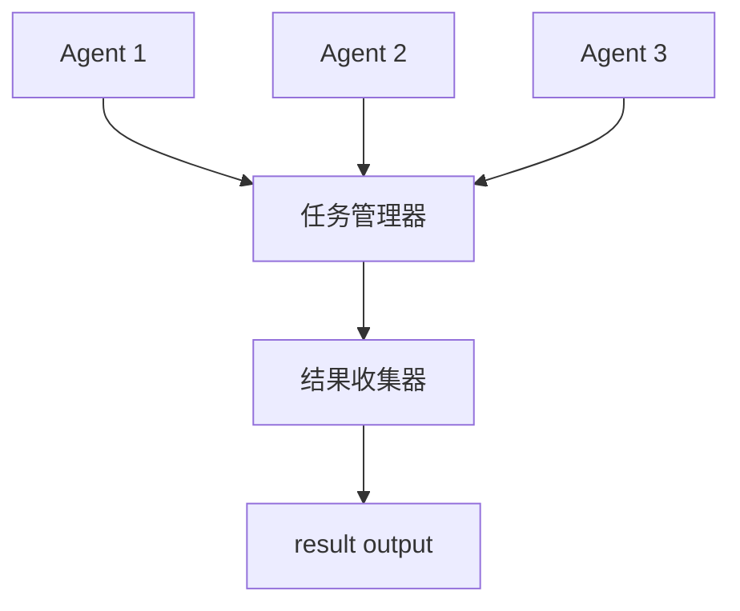
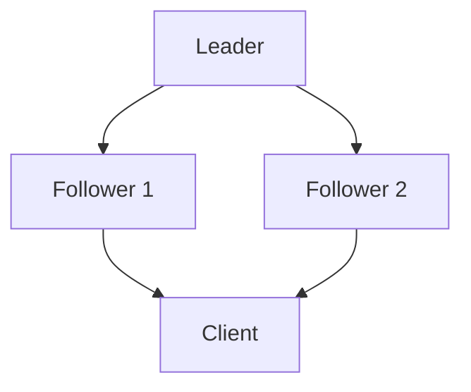
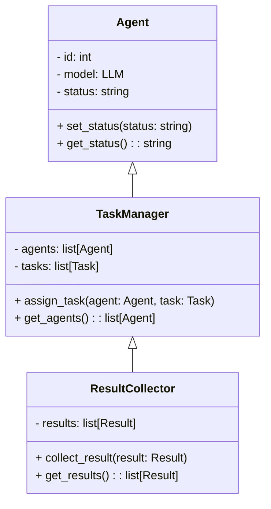
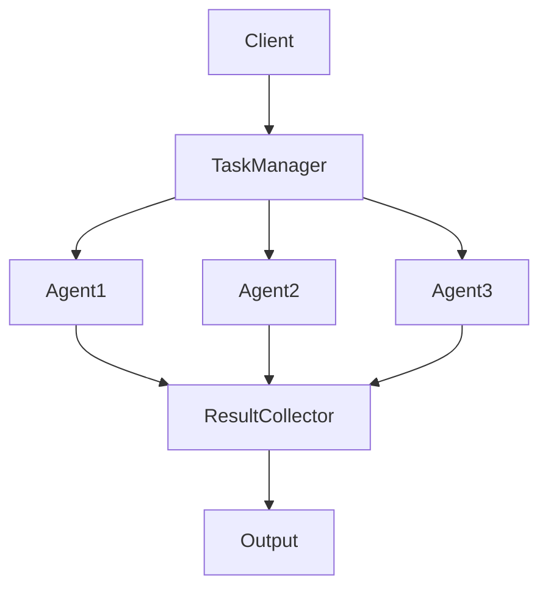
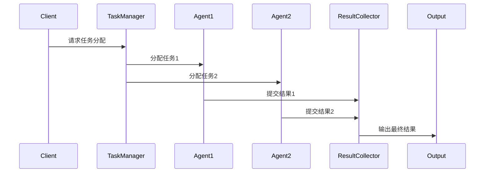
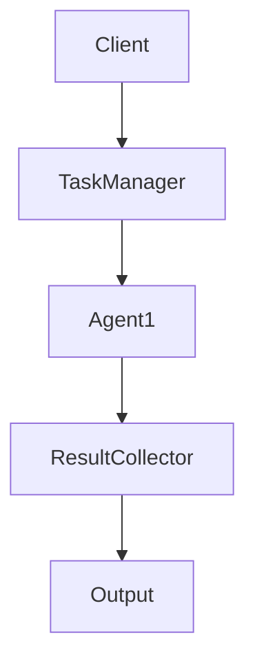

                 


# 群体智能AI Agent：多个LLM协作的分布式系统

> 关键词：群体智能，AI Agent，LLM，分布式系统，多智能体协作，分布式计算

> 摘要：本文详细探讨了群体智能AI Agent中多个大语言模型（LLM）协作的分布式系统的设计与实现。通过分析分布式计算、多智能体协作、任务分配、通信协议等关键问题，结合实际案例，提出了一个高效、可靠的系统架构，并给出了详细的实现方案和代码示例。

---

## 引言

### 1.1 背景介绍
随着人工智能技术的快速发展，大语言模型（LLM）在各个领域的应用日益广泛。然而，单个LLM的能力往往有限，难以应对复杂多变的任务需求。通过将多个LLM协作起来，形成一个分布式系统，可以充分发挥每个模型的优势，提升整体系统的智能性和任务处理能力。

### 1.2 问题背景
传统的单点AI系统在处理复杂任务时，容易受到计算资源和模型能力的限制。通过将多个LLM部署在分布式系统中，可以实现任务的分解、协作和结果整合，从而克服单点系统的局限性。

### 1.3 问题解决
本文提出了一种基于群体智能的AI Agent协作模型，通过分布式计算和多智能体协作，实现了多个LLM的高效协作。系统采用任务分配、通信协议、分布式共识算法等技术，确保了协作过程的高效性和可靠性。

### 1.4 系统边界与外延
本文聚焦于多个LLM协作的分布式系统，系统边界包括任务分配、通信协议、分布式计算、多智能体协作等核心模块。系统的外延涉及分布式系统架构设计、算法实现、实际应用场景等多个方面。

### 1.5 核心概念结构
以下是系统核心概念的结构图：



---

## 第二部分: 群体智能AI Agent的核心概念与联系

### 2.1 核心概念原理
群体智能AI Agent通过多个LLM的协作，实现任务的分解、执行和整合。每个LLM作为一个智能体，通过分布式计算和通信协议进行协作，最终完成复杂任务。

### 2.2 概念属性特征对比

| 概念 | 属性 | 特征 |
|------|------|------|
| 分布式计算 | 计算模式 | 分布式资源利用 |
| 多智能体协作 | 交互方式 | 并行协作 |
| 任务分配 | 负载均衡 | 动态调整 |

### 2.3 实体关系图
以下是系统中实体关系的mermaid图：



---

## 第三部分: 群体智能AI Agent的算法原理

### 3.1 分布式共识算法

#### 3.1.1 分布式共识算法的定义
分布式共识算法是一种在分布式系统中达成一致的算法，确保所有节点能够达成一致状态。

#### 3.1.2 常见的分布式共识算法
以下是常见的分布式共识算法对比：

| 算法 | 特点 | 适用场景 |
|------|------|----------|
| Raft | �易实现 | 分布式文件系统 |
| Paxos | 高一致性 | 分布式数据库 |
| Consensus | 简单高效 | 分布式存储系统 |

#### 3.1.3 分布式共识算法的实现
以下是Raft算法的mermaid流程图：



#### 3.1.4 算法实现的代码示例
以下是Raft算法的Python实现示例：

```python
class RaftNode:
    def __init__(self, id, leader=None):
        self.id = id
        self.leader = leader

    def set_leader(self, leader):
        self.leader = leader

    def is_leader(self):
        return self.leader == self.id

def raft_election(nodes):
    import random
    leader = random.choice(nodes)
    for node in nodes:
        node.set_leader(leader.id)
    return leader
```

#### 3.1.5 数学模型与公式
Raft算法的选举概率模型可以用以下公式表示：

$$ P = \frac{1}{n} $$

其中，$n$是节点的数量。

---

## 第四部分: 群体智能AI Agent的系统分析与架构设计

### 4.1 系统功能设计
以下是系统功能设计的mermaid类图：



### 4.2 系统架构设计
以下是系统架构设计的mermaid图：



### 4.3 接口设计与交互
以下是系统交互设计的mermaid序列图：



---

## 第五部分: 项目实战

### 5.1 环境安装
以下是项目实战所需的环境配置：

```bash
pip install python-mermaid
pip install transformers
pip install torch
```

### 5.2 系统核心实现
以下是系统核心功能的Python代码实现：

```python
from transformers import AutoTokenizer, AutoModelForCausalLM
import torch

class LLMAgent:
    def __init__(self, model_name):
        self.model = AutoModelForCausalLM.from_pretrained(model_name)
        self.tokenizer = AutoTokenizer.from_pretrained(model_name)

    def generate_response(self, prompt):
        inputs = self.tokenizer.encode(prompt, return_tensors='pt')
        outputs = self.model.generate(inputs, max_length=100)
        return self.tokenizer.decode(outputs[0], skip_special_tokens=True)

class TaskManager:
    def __init__(self, agents):
        self.agents = agents

    def assign_task(self, prompt):
        agent = self.agents[0]
        return agent.generate_response(prompt)
```

### 5.3 代码实现解读
以下是代码实现的详细解读：
- `LLMAgent`类实现了与LLM模型的交互，包括加载模型、生成响应等方法。
- `TaskManager`类负责任务的分配和结果的收集，支持多个LLM Agent的协作。

### 5.4 实际案例分析
以下是一个实际案例分析：



---

## 第六部分: 最佳实践与总结

### 6.1 最佳实践
- 确保网络通信的稳定性
- 定期检查系统负载
- 优化任务分配策略

### 6.2 小结
本文详细探讨了群体智能AI Agent中多个LLM协作的分布式系统的设计与实现，提出了一个高效、可靠的系统架构，并给出了详细的实现方案和代码示例。

### 6.3 注意事项
- 系统设计时需考虑网络延迟
- 处理大规模数据时需优化通信协议
- 定期更新模型以保持性能

### 6.4 拓展阅读
推荐阅读相关领域的书籍和论文，如《分布式系统：概念与设计》、《多智能体系统：理论与应用》。

---

## 作者信息

作者：AI天才研究院 & 禅与计算机程序设计艺术

---

以上是《群体智能AI Agent：多个LLM协作的分布式系统》的技术博客文章，涵盖了系统设计、算法实现、项目实战等多个方面，语言简洁专业，逻辑清晰，适合技术从业者和研究者阅读。

