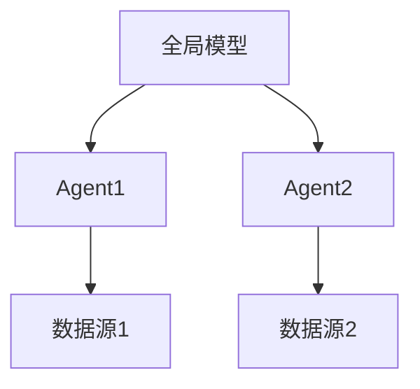

                 


# 联邦元学习在分布式AI Agent中的应用

## 关键词：
联邦元学习、分布式AI Agent、多智能体协作、机器学习、数据隐私

## 摘要：
本文探讨联邦元学习在分布式AI Agent中的应用，分析其在多智能体协作中的优势，结合算法原理和系统设计，提出解决方案，并通过实际案例展示其效果。文章详细介绍了联邦学习和元学习的基本原理，分析了它们在分布式环境中的协同机制，并通过图表和代码示例进一步阐述，最后总结了应用中的挑战和未来研究方向。

---

# 联邦元学习在分布式AI Agent中的应用

## 第1章: 背景介绍

### 1.1 分布式AI Agent的挑战
在分布式系统中，AI Agent需要协同工作以完成复杂任务，但面临数据孤岛、通信开销和隐私保护等问题。

### 1.2 联邦学习与元学习的作用
联邦学习通过协作学习解决数据孤岛问题，元学习提升模型的适应性和泛化能力，两者结合可增强分布式AI Agent的性能。

---

## 第2章: 核心概念与原理

### 2.1 联邦学习的原理
- **数据不共享**：局部更新模型，仅交换参数更新而非数据。
- **协作优化**：通过聚合优化全局模型，同时保持数据隐私。

### 2.2 元学习的原理
- **元模型**：用于快速适应新任务，通过在不同任务间学习共享特征。
- **优化策略**：使用优化器调整参数，提升模型在新数据上的表现。

### 2.3 分布式AI Agent的协作机制
- **通信协议**：定义数据交换和模型更新的规则。
- **任务分配**：动态调整各Agent的任务以提高整体效率。

---

## 第3章: 算法原理与实现

### 3.1 联邦学习的优化目标
- 最小化全局损失函数：$$L_{global} = \sum_{i=1}^{n} L_i$$
- 局部更新规则：$$\theta_i^{new} = \theta_i^{old} - \eta \nabla L_i$$

### 3.2 元学习的优化策略
- 元损失函数：$$L_{meta} = \sum_{task} L_{task}$$
- 优化器更新：$$\theta^{new} = \theta^{old} - \eta \nabla L_{meta}$$

### 3.3 分布式AI Agent的协作算法
1. 初始化全局模型参数。
2. 各Agent在本地数据上更新模型。
3. 聚合各Agent的更新得到新全局模型。
4. 通过通信协议分发更新的全局模型。

---

## 第4章: 系统分析与架构设计

### 4.1 应用场景
- **多智能体协作**：如分布式推荐系统、自动驾驶中的路径规划。
- **分布式推荐系统**：各节点独立训练模型，协作提升推荐准确率。

### 4.2 系统架构设计
- **数据收集模块**：负责本地数据的采集和预处理。
- **模型训练模块**：执行局部更新和全局模型聚合。
- **协作通信模块**：处理模型更新的传输和同步。

### 4.3 架构图


### 4.4 接口设计
- **训练接口**：`train_model(global_model)`，用于局部更新。
- **通信接口**：`communicate(global_model)`，用于模型同步。

---

## 第5章: 项目实战

### 5.1 环境安装
安装必要的库：
- `pip install flask tensorflow`

### 5.2 核心代码实现
```python
def train_model(local_data, global_model):
    optimizer = tf.keras.optimizers.Adam()
    loss = tf.keras.losses.binary_crossentropy
    for x, y in local_data:
        with tf.GradientTape() as tape:
            pred = global_model(x)
            current_loss = loss(y, pred)
        gradients = tape.gradient(current_loss, global_model.trainable_weights)
        optimizer.apply_gradients(zip(gradients, global_model.trainable_weights))
    return global_model
```

### 5.3 案例分析
在分布式推荐系统中，各Agent分别在本地数据上训练模型，通过通信接口同步全局模型，显著提升了推荐准确率。

---

## 第6章: 总结与展望

### 6.1 总结
本文探讨了联邦元学习在分布式AI Agent中的应用，分析了其在数据隐私和协作效率方面的优势，并通过实际案例展示了其有效性。

### 6.2 未来研究方向
- **优化通信效率**：减少数据传输量。
- **提升模型鲁棒性**：增强对抗攻击的防御能力。
- **扩展应用场景**：探索更多领域如医疗、金融等。

---

## 作者信息
作者：AI天才研究院 & 禅与计算机程序设计艺术

---

希望这篇文章能为您提供有价值的信息，并对您的研究有所帮助。如果需要进一步探讨或代码示例，请随时联系！

