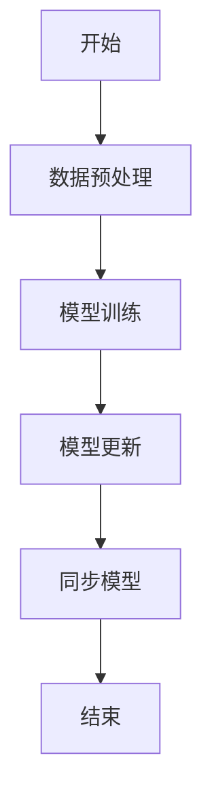
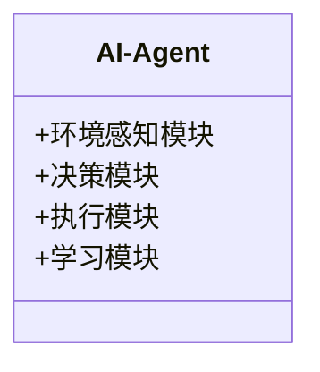
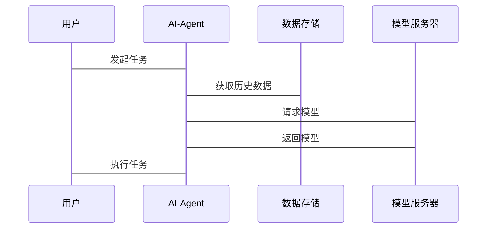

                 


# 联邦学习在AI Agent开发中的应用

## 关键词：联邦学习，AI Agent，分布式学习，模型训练，隐私保护，多智能体协作

## 摘要：  
本文探讨了联邦学习在AI Agent开发中的应用，分析了联邦学习的核心原理、算法实现以及在AI Agent中的具体应用场景。通过详细的技术分析和案例解读，本文揭示了联邦学习如何赋能AI Agent，提升其智能性和协作能力，同时解决了数据隐私和模型更新等关键问题。

---

# 第1章: 联邦学习与AI Agent的背景介绍

## 1.1 联邦学习的定义与背景  
### 1.1.1 问题背景与问题描述  
在AI Agent开发中，数据隐私和模型协作是两个核心挑战。传统的集中式学习方法依赖于将数据集中在中央服务器中进行训练，这不仅面临数据泄露风险，还可能导致模型训练效率低下。  

### 1.1.2 联邦学习的核心概念与特点  
联邦学习是一种分布式机器学习方法，允许多个参与方在不共享原始数据的情况下协作训练模型。其特点包括数据隐私保护、去中心化协作和高效模型更新。  

### 1.1.3 联邦学习在AI Agent中的应用前景  
通过联邦学习，AI Agent可以在多智能体协作场景中实现模型共享与更新，同时保护各方数据隐私。这为智能交通、智能制造等领域提供了新的解决方案。  

## 1.2 AI Agent的基本概念  
### 1.2.1 AI Agent的定义与分类  
AI Agent是指能够感知环境、自主决策并执行任务的智能体。根据功能和应用场景，AI Agent可以分为任务型、服务型和协作型等类别。  

### 1.2.2 AI Agent的核心功能与特点  
AI Agent的核心功能包括感知环境、自主决策、与人/系统交互和自适应学习。其特点在于智能化、自主性和协作性。  

### 1.2.3 联邦学习与AI Agent的结合  
联邦学习为AI Agent提供了分布式协作的框架，使其能够在不共享数据的情况下实现模型更新和任务协作。  

## 1.3 联邦学习与AI Agent的关系  
### 1.3.1 联邦学习如何赋能AI Agent  
通过联邦学习，AI Agent可以在去中心化的环境中实现模型共享与更新，提升协作效率和数据隐私保护能力。  

### 1.3.2 AI Agent如何推动联邦学习的发展  
AI Agent的应用场景丰富了联邦学习的应用场景，推动了其在多智能体协作中的技术进步。  

### 1.3.3 联邦学习与AI Agent的协同效应  
联邦学习与AI Agent的结合实现了数据隐私保护、高效协作和智能升级的协同效应。  

## 1.4 本章小结  
本章介绍了联邦学习和AI Agent的基本概念，分析了它们在AI Agent开发中的重要性及其相互关系。

---

# 第2章: 联邦学习的核心概念与原理  

## 2.1 联邦学习的核心原理  
### 2.1.1 联邦学习的基本原理  
联邦学习通过在多个参与方之间分布式训练模型，仅交换模型更新信息，而不共享原始数据。  

### 2.1.2 联邦学习的关键技术与实现方式  
包括数据加密、模型更新协议和通信机制等关键技术。  

### 2.1.3 联邦学习的优缺点与适用场景  
优点：数据隐私保护、去中心化协作；缺点：通信开销大、模型收敛速度慢；适用场景：多智能体协作、分布式系统等。  

## 2.2 联邦学习的核心概念对比  
### 2.2.1 联邦学习与其他分布式学习方法的对比  
包括横向联邦学习、纵向联邦学习和联邦学习的对比分析。  

### 2.2.2 联邦学习与数据隐私保护的关系  
联邦学习通过数据加密和模型更新机制保护数据隐私。  

### 2.2.3 联邦学习与模型更新机制的对比  
横向、纵向和全联结联邦学习的对比分析。  

## 2.3 联邦学习的ER实体关系图  
```mermaid
er
   _actor: 用户
   _role: 联邦学习角色
   _model: 模型
   _data: 数据
   _communication: 通信协议
   _actor --> _role: 用户选择联邦学习角色
    _role --> _model: 管理模型更新
    _role --> _data: 处理数据
    _role --> _communication: 设定通信协议
```

## 2.4 本章小结  
本章详细讲解了联邦学习的核心原理和相关概念，并通过对比分析和ER图展示了其在AI Agent开发中的应用潜力。

---

# 第3章: 联邦学习算法的原理与实现  

## 3.1 联邦学习算法的基本原理  
### 3.1.1 横向联邦学习  
横向联邦学习适用于数据样本维度相同但分布不同的场景。  

### 3.1.2 纵向联邦学习  
纵向联邦学习适用于数据特征维度不同的场景。  

### 3.1.3 联邦学习的三者关系  
横向、纵向和全联结联邦学习的三者关系及适用场景。  

## 3.2 联邦学习算法的实现流程  
### 3.2.1 数据准备阶段  
包括数据预处理和加密。  

### 3.2.2 模型训练阶段  
在本地数据上训练模型，并将模型更新信息上传到中央服务器。  

### 3.2.3 模型更新与同步阶段  
中央服务器将所有参与方的模型更新合并，生成最终模型。  

## 3.3 联邦学习算法的数学模型  
### 3.3.1 联邦学习的数学公式  
$$\text{损失函数} = \sum_{i=1}^{n} \text{损失}_i$$  

### 3.3.2 模型更新公式  
$$\theta_{i}^{new} = \theta_{i}^{old} + \eta \cdot \nabla L_i$$  

## 3.4 联邦学习算法的流程图  


## 3.5 本章小结  
本章详细讲解了联邦学习算法的实现流程和数学模型，并通过流程图展示了其在AI Agent开发中的应用。

---

# 第4章: AI Agent的架构与系统设计  

## 4.1 AI Agent的架构设计  
### 4.1.1 AI Agent的领域模型  


### 4.1.2 AI Agent的系统架构设计  


## 4.2 联邦学习在AI Agent中的系统设计  
### 4.2.1 联邦学习与AI Agent的结合  
通过联邦学习实现AI Agent的多智能体协作和分布式模型训练。  

### 4.2.2 AI Agent的系统接口设计  
包括模型更新接口、数据交互接口和通信协议接口。  

### 4.2.3 AI Agent的系统交互流程  


## 4.3 本章小结  
本章详细分析了AI Agent的架构设计，并探讨了联邦学习在其中的应用。

---

# 第5章: 联邦学习在AI Agent开发中的实战案例  

## 5.1 实战环境搭建  
### 5.1.1 环境搭建步骤  
安装Python、TensorFlow、Flask等工具。  

### 5.1.2 项目核心代码实现  
```python
import numpy as np
import tensorflow as tf
from flask import Flask, request, jsonify

# 初始化模型
model = tf.keras.Sequential([
    tf.keras.layers.Dense(64, activation='relu'),
    tf.keras.layers.Dense(1, activation='sigmoid')
])
model.compile(optimizer='adam', loss='binary_crossentropy')

# 本地训练
def train_model(local_data):
    model.fit(local_data, epochs=10, batch_size=32)
    return model.get_weights()

# 上传模型更新
def send_weights(weights):
    # 实际场景中应通过通信协议发送权重
    print("模型更新已上传")
```

## 5.2 代码实现与分析  
### 5.2.1 本地训练代码  
```python
def local_training(data, model):
    model_weights = model.get_weights()
    # 模型更新
    new_weights = train_model(data)
    # 同步模型
    send_weights(new_weights)
    return model
```

### 5.2.2 模型同步代码  
```python
def aggregate(weights_list):
    # 简单的平均权重合并
    return np.mean(weights_list, axis=0)
```

## 5.3 实战案例分析  
### 5.3.1 案例背景  
假设我们有三个AI Agent需要协作完成任务，每个Agent拥有本地数据集。  

### 5.3.2 案例实现步骤  
1. 初始化模型并分配给各个Agent。  
2. 各Agent在本地数据上训练模型，并将权重上传到中央服务器。  
3. 中央服务器合并所有Agent的权重，生成新的模型。  
4. 新模型分发给所有Agent，完成一轮联邦学习。  

## 5.4 本章小结  
本章通过具体案例展示了联邦学习在AI Agent开发中的应用，并提供了完整的代码实现和分析。

---

# 第6章: 总结与展望  

## 6.1 总结  
本文详细探讨了联邦学习在AI Agent开发中的应用，分析了其核心原理、算法实现和系统设计，并通过具体案例展示了其实际应用价值。  

## 6.2 展望  
未来，随着联邦学习技术的不断进步，AI Agent将在更多领域实现高效协作和智能升级。  

## 6.3 最佳实践Tips  
1. 在AI Agent开发中，优先选择联邦学习框架以保护数据隐私。  
2. 确保模型更新机制的高效性和安全性。  
3. 在实际应用中，结合具体场景优化联邦学习算法。  

## 6.4 本章小结  
总结全文并展望未来发展方向。

---

# 作者：AI天才研究院 & 禅与计算机程序设计艺术

