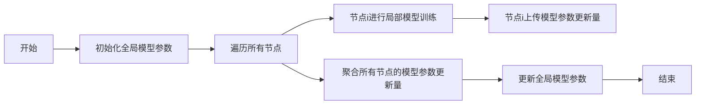
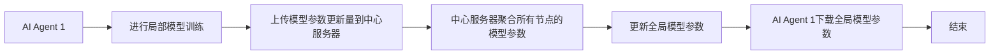

                 


# 联邦学习在AI Agent隐私保护中的高级应用

## 关键词
联邦学习, AI Agent, 隐私保护, 联邦聚合算法, 隐私计算

## 摘要
随着人工智能技术的快速发展，AI Agent在各个领域的应用越来越广泛。然而，AI Agent在执行任务时需要处理大量的敏感数据，这使得隐私保护成为一个重要的挑战。联邦学习作为一种新兴的技术，能够在保护数据隐私的前提下，实现多个机构之间的协作学习。本文将深入探讨联邦学习在AI Agent隐私保护中的高级应用，从理论到实践，全面分析其核心原理、系统架构和实际案例。

---

# 第一部分: 联邦学习与AI Agent隐私保护的背景与基础

## 第1章: 联邦学习与AI Agent概述

### 1.1 联邦学习的定义与背景
#### 1.1.1 联邦学习的起源与概念
联邦学习（Federated Learning）是一种分布式机器学习技术，旨在在不集中用户数据的情况下，通过多个边缘设备或服务器协作训练模型。它起源于2015年Google的研究，最初用于移动设备上的键盘预测任务。联邦学习的核心思想是“数据不动，模型动”，即数据仍然保留在原始设备或服务器中，只有模型参数在不同节点之间进行交换。

#### 1.1.2 AI Agent的基本概念
AI Agent（人工智能代理）是一种能够感知环境、自主决策并执行任务的智能实体。它可以是一个软件程序、一个机器人，甚至是智能家居中的一个设备。AI Agent的核心能力包括感知、推理、规划和执行。

#### 1.1.3 联邦学习在AI Agent中的应用价值
随着AI Agent的广泛应用，数据隐私问题日益突出。联邦学习能够有效解决这一问题，因为它允许多个AI Agent在不共享原始数据的情况下协作训练模型，从而保护数据隐私。

### 1.2 隐私保护的重要性
#### 1.2.1 数据隐私的现状与挑战
现代社会对数据的依赖程度越来越高，数据隐私问题也变得越来越重要。尤其是在AI Agent的应用中，数据可能涉及用户的敏感信息，如位置、健康状况、消费习惯等。如果这些数据被滥用，可能会导致严重的隐私泄露问题。

#### 1.2.2 AI Agent中的隐私保护需求
AI Agent在执行任务时需要处理大量的敏感数据，例如自动驾驶汽车需要处理的位置信息、智能音箱需要处理的语音数据等。这些数据如果被未经授权的第三方获取，可能会对用户的隐私造成威胁。

#### 1.2.3 联邦学习如何解决隐私保护问题
联邦学习通过在数据源端进行局部模型训练，并将训练得到的模型参数上传到中心服务器进行聚合，从而实现了模型的全局优化，而不需要传输原始数据。这种方式能够有效保护数据隐私。

### 1.3 本章小结
本章介绍了联邦学习和AI Agent的基本概念，并强调了隐私保护的重要性。联邦学习作为一种新兴的技术，能够有效解决AI Agent中的隐私保护问题。

---

## 第2章: 联邦学习的核心概念与原理

### 2.1 联邦学习的基本原理
#### 2.1.1 联邦学习的定义
联邦学习是一种分布式机器学习技术，允许多个边缘设备或服务器协作训练模型，而不必共享原始数据。

#### 2.1.2 联邦学习的核心思想
联邦学习的核心思想是“数据不动，模型动”，即数据仍然保留在原始设备或服务器中，只有模型参数在不同节点之间进行交换。

#### 2.1.3 联邦学习与传统数据共享的区别
传统的数据共享方式需要将原始数据集中到一个中心服务器中进行训练，而联邦学习则是在数据源端进行局部模型训练，并将训练得到的模型参数上传到中心服务器进行聚合。

### 2.2 AI Agent的隐私保护需求
#### 2.2.1 AI Agent的数据使用场景
AI Agent在执行任务时需要处理大量的敏感数据，例如自动驾驶汽车需要处理的位置信息、智能音箱需要处理的语音数据等。

#### 2.2.2 隐私保护在AI Agent中的具体体现
隐私保护在AI Agent中的具体体现包括数据加密、数据匿名化、访问控制等技术。

#### 2.2.3 联邦学习如何满足AI Agent的隐私需求
联邦学习通过在数据源端进行局部模型训练，并将训练得到的模型参数上传到中心服务器进行聚合，从而实现了模型的全局优化，而不需要传输原始数据。这种方式能够有效保护数据隐私。

### 2.3 联邦学习的核心概念对比
#### 2.3.1 联邦学习与数据孤岛
数据孤岛指的是数据分散在不同的系统或组织中，无法有效共享和利用。联邦学习通过在数据源端进行局部模型训练，并将训练得到的模型参数上传到中心服务器进行聚合，从而解决了数据孤岛问题。

#### 2.3.2 联邦学习与数据共享
传统的数据共享方式需要将原始数据集中到一个中心服务器中进行训练，而联邦学习则是在数据源端进行局部模型训练，并将训练得到的模型参数上传到中心服务器进行聚合。

#### 2.3.3 联邦学习与隐私计算的对比分析
隐私计算是一种保护数据隐私的技术，包括联邦学习、安全多方计算（SMC）、同态加密等。联邦学习通过在数据源端进行局部模型训练，并将训练得到的模型参数上传到中心服务器进行聚合，从而保护数据隐私。

### 2.4 本章小结
本章详细讲解了联邦学习的核心概念和原理，并对比了联邦学习与其他技术在隐私保护方面的区别。

---

## 第3章: 联邦学习的算法原理与数学模型

### 3.1 联邦学习的算法概述
#### 3.1.1 联邦平均算法（FedAvg）
联邦平均算法（FedAvg）是联邦学习中最常用的算法之一。其核心思想是每个节点在本地数据上进行模型训练，并将训练得到的模型参数上传到中心服务器。中心服务器将所有节点的模型参数进行加权平均，得到全局模型。

#### 3.1.2 联邦聚合算法（FedAggregation）
联邦聚合算法（FedAggregation）是另一种联邦学习算法，与FedAvg类似，但其聚合方式有所不同。FedAggregation允许每个节点上传模型参数的更新量，而不是直接上传模型参数。

#### 3.1.3 联邦学习的优化方法
为了提高联邦学习的效率和性能，研究人员提出了许多优化方法，例如联邦动量法（FedMomentum）、联邦自适应方法（FedAdaptive）等。

### 3.2 联邦学习的数学模型
#### 3.2.1 联邦平均算法的数学公式
FedAvg算法的数学公式如下：

$$
\theta_{\text{global}}^{(t+1)} = \sum_{i=1}^{n} w_i \theta_{\text{local}}^{(t)}
$$

其中，$\theta_{\text{global}}^{(t+1)}$ 表示全局模型参数，$w_i$ 表示节点i的权重，$\theta_{\text{local}}^{(t)}$ 表示节点i在第t轮的局部模型参数。

#### 3.2.2 联邦聚合算法的数学公式
FedAggregation算法的数学公式如下：

$$
\theta_{\text{global}}^{(t+1)} = \sum_{i=1}^{n} w_i (\theta_{\text{global}}^{(t)} + \Delta \theta_i)
$$

其中，$\Delta \theta_i$ 表示节点i的模型参数更新量。

#### 3.2.3 联邦学习的收敛性分析
联邦学习的收敛性分析涉及到数学中的优化理论和概率论。通过对FedAvg算法的分析，可以证明在满足一定条件下，联邦学习算法能够收敛到全局最优解。

### 3.3 联邦学习的算法流程图
使用 Mermaid 绘制联邦学习算法流程图：



### 3.4 本章小结
本章详细讲解了联邦学习的算法原理和数学模型，并通过流程图展示了联邦学习的算法流程。

---

## 第4章: AI Agent的联邦学习架构设计

### 4.1 AI Agent的系统架构
#### 4.1.1 AI Agent的基本架构
AI Agent的基本架构包括感知层、推理层和执行层。感知层负责采集环境中的数据，推理层负责对数据进行处理和决策，执行层负责执行具体的任务。

#### 4.1.2 联邦学习在AI Agent中的位置
在AI Agent中，联邦学习主要应用于推理层和执行层。通过联邦学习，AI Agent可以在不共享原始数据的情况下，与其他AI Agent协作训练模型，从而提高模型的准确性和泛化能力。

#### 4.1.3 联邦学习对AI Agent功能的影响
联邦学习能够增强AI Agent的协作能力，提高模型的准确性和泛化能力，同时保护数据隐私。

### 4.2 联邦学习在AI Agent中的具体实现
#### 4.2.1 数据局部训练模块
每个AI Agent在本地数据上进行模型训练，并将训练得到的模型参数上传到中心服务器。

#### 4.2.2 联邦聚合模块
中心服务器将所有节点的模型参数进行聚合，得到全局模型。

#### 4.2.3 隐私保护机制
通过加密、匿名化等技术，保护数据隐私。

### 4.3 联邦学习与AI Agent的交互流程
使用 Mermaid 绘制联邦学习与AI Agent的交互流程图：



### 4.4 本章小结
本章详细讲解了AI Agent的联邦学习架构设计，并通过流程图展示了联邦学习与AI Agent的交互流程。

---

## 第5章: 联邦学习在AI Agent中的项目实战

### 5.1 环境安装
为了实现联邦学习在AI Agent中的应用，首先需要安装必要的软件和库。例如，使用Python编程语言，安装Flask、TensorFlow、Keras等库。

### 5.2 系统核心实现源代码
以下是一个简单的联邦学习实现示例代码：

```python
import numpy as np
import tensorflow as tf

# 定义局部模型
class LocalModel:
    def __init__(self):
        self.model = tf.keras.Sequential([
            tf.keras.layers.Dense(128, activation='relu'),
            tf.keras.layers.Dense(10, activation='softmax')
        ])
        self.model.compile(optimizer='adam', loss='sparse_categorical_crossentropy', metrics=['accuracy'])

    def train(self, x, y, epochs):
        self.model.fit(x, y, epochs=epochs)

# 定义联邦聚合器
class FedAggregator:
    def __init__(self):
        self.global_model = LocalModel()

    def aggregate(self, local_models):
        # 假设每个节点的权重相同
        weights = [model.model.get_weights() for model in local_models]
        global_weights = []
        for i in range(len(weights[0])):
            avg_weights = np.mean([w[i] for w in weights], axis=0)
            global_weights.append(avg_weights)
        self.global_model.model.set_weights(global_weights)

    def get_global_model_weights(self):
        return self.global_model.model.get_weights()

# 示例：多个节点进行局部训练并聚合
def main():
    # 初始化联邦聚合器
    aggregator = FedAggregator()

    # 初始化多个节点
    num_nodes = 3
    nodes = [LocalModel() for _ in range(num_nodes)]

    # 每个节点进行局部训练
    for node in nodes:
        node.train(x_train, y_train, epochs=5)

    # 聚合所有节点的模型
    aggregator.aggregate(nodes)

    # 获取全局模型权重
    global_weights = aggregator.get_global_model_weights()
    print(global_weights)

if __name__ == "__main__":
    main()
```

### 5.3 系统接口设计
系统接口设计包括AI Agent与中心服务器之间的通信接口。例如，AI Agent可以通过HTTP协议向中心服务器发送模型参数更新量。

### 5.4 系统交互流程
使用 Mermaid 绘制系统交互流程图：


### 5.5 本章小结
本章通过实际项目案例，详细讲解了联邦学习在AI Agent中的实现过程，并给出了具体的代码示例和系统交互流程。

---

## 第6章: 联邦学习在AI Agent中的最佳实践与注意事项

### 6.1 最佳实践
#### 6.1.1 数据预处理与清洗
在进行联邦学习之前，需要对数据进行预处理和清洗，确保数据的质量和一致性。

#### 6.1.2 模型选择与优化
选择合适的模型，并对其进行优化，以提高模型的准确性和训练效率。

#### 6.1.3 联邦学习的参数调优
通过调整联邦学习的参数，例如通信频率、节点权重等，优化模型的性能。

### 6.2 注意事项
#### 6.2.1 数据隐私保护
在实际应用中，需要采取多种措施保护数据隐私，例如数据加密、访问控制等。

#### 6.2.2 模型收敛性
联邦学习的模型收敛性依赖于节点的数量和数据分布。在实际应用中，需要确保数据分布的均衡性，以提高模型的收敛速度和准确度。

#### 6.2.3 通信效率
联邦学习需要在节点之间进行频繁的通信，通信效率直接影响模型的训练速度和性能。在实际应用中，需要优化通信协议和数据传输方式，以提高通信效率。

### 6.3 拓展阅读
#### 6.3.1 联邦学习的研究现状
近年来，联邦学习的研究取得了许多进展，例如提出了多种优化算法、隐私保护机制等。

#### 6.3.2 联邦学习的应用场景
联邦学习已经在多个领域得到了广泛应用，例如医疗、金融、智能家居等。

#### 6.3.3 联邦学习的未来发展趋势
随着人工智能技术的不断发展，联邦学习将在更多领域得到应用，并且其算法和理论也将进一步完善。

### 6.4 本章小结
本章总结了联邦学习在AI Agent中的最佳实践和注意事项，并展望了联邦学习的未来发展趋势。

---

# 第七章: 总结与展望

## 7.1 总结
本文详细探讨了联邦学习在AI Agent隐私保护中的高级应用。从联邦学习的基本概念到算法原理，再到实际应用，全面分析了其核心技术和实现方法。通过实际案例，展示了联邦学习在保护数据隐私的同时，能够实现多个AI Agent之间的协作学习。

## 7.2 展望
随着人工智能技术的不断发展，联邦学习将在更多领域得到应用，并且其算法和理论也将进一步完善。未来的研究方向包括优化联邦学习的通信效率、提高模型的准确性和泛化能力、加强数据隐私保护等。

---

# 作者：AI天才研究院/AI Genius Institute & 禅与计算机程序设计艺术 /Zen And The Art of Computer Programming

---

以上是《联邦学习在AI Agent隐私保护中的高级应用》的技术博客文章的完整目录和内容。希望这篇文章能够为读者提供关于联邦学习在AI Agent隐私保护中的深入理解和实际应用的指导。

