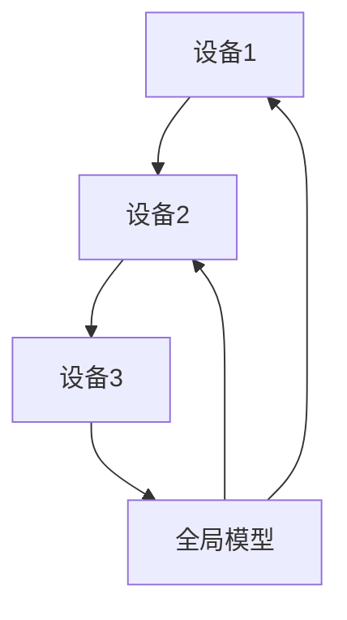
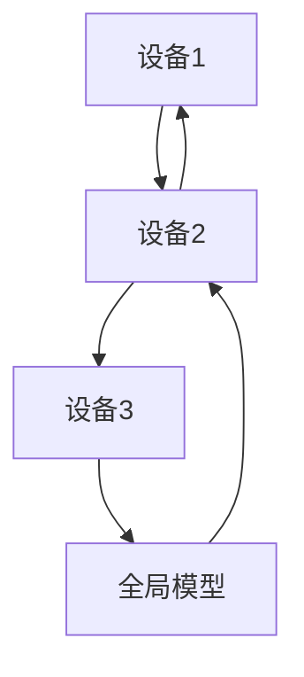
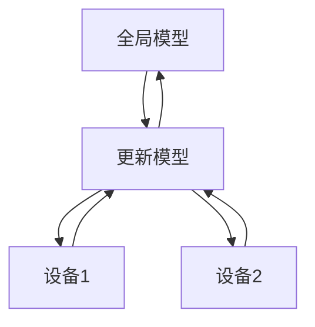
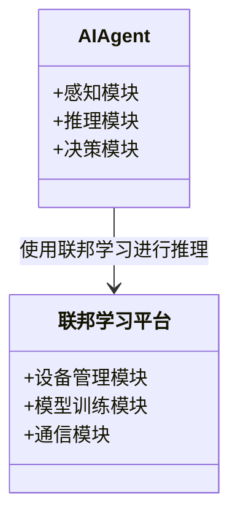
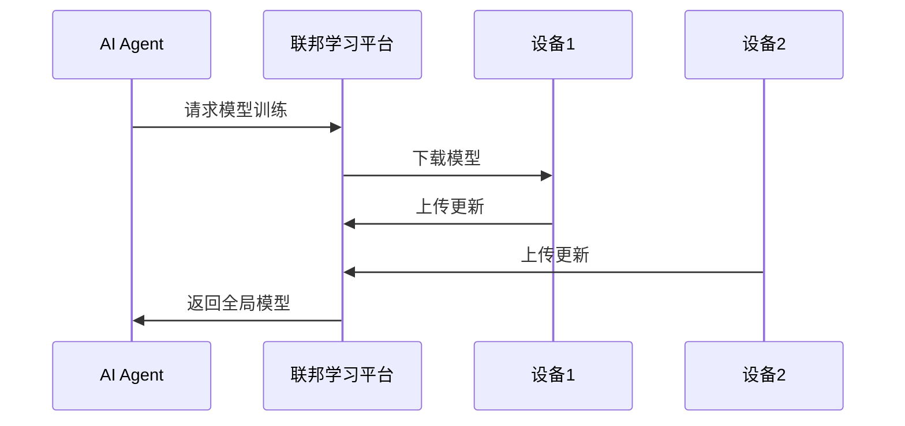

                 


# 《联邦学习在AI Agent隐私保护推理中的应用》

> **关键词**：联邦学习，AI Agent，隐私保护，分布式计算，安全推理，隐私计算，人工智能

> **摘要**：  
随着人工智能技术的快速发展，AI Agent在各个领域中的应用越来越广泛。然而，AI Agent在执行任务时需要处理大量的敏感数据，如何在保护隐私的前提下进行推理和决策成为一个重要挑战。联邦学习作为一种分布式机器学习技术，能够有效地保护数据隐私，为AI Agent的安全推理提供了新的解决方案。本文系统地介绍了联邦学习的核心原理、AI Agent的隐私保护机制，以及如何将联邦学习应用于AI Agent的隐私保护推理中。文章还通过实际案例分析了联邦学习在AI Agent中的应用，探讨了其未来的发展方向。

---

## 第1章: 联邦学习与AI Agent概述

### 1.1 联邦学习的核心概念

联邦学习（Federated Learning）是一种分布式机器学习技术，旨在在不集中用户数据的情况下训练全局模型。其核心思想是将数据分散在不同的设备或服务器上，通过通信协议进行模型更新，最终获得一个全局模型。与传统的集中式学习不同，联邦学习能够保护数据隐私，避免数据泄露的风险。

- **数据异构性**：联邦学习处理的数据通常是异构的，分布在不同的设备上，每个设备只贡献局部梯度信息，而不暴露原始数据。
- **通信协议**：联邦学习需要设计高效的通信协议，确保模型更新的准确性和隐私性。
- **模型同步**：联邦学习通过同步各个设备的模型更新，逐步逼近全局最优模型。

### 1.2 AI Agent的基本概念

AI Agent（人工智能代理）是一种能够感知环境、自主决策并执行任务的智能实体。AI Agent的核心能力包括感知、推理和决策。

- **感知**：AI Agent通过传感器或数据接口获取环境信息。
- **推理**：AI Agent基于感知的信息进行逻辑推理，生成决策方案。
- **决策**：AI Agent根据推理结果做出最优选择，并执行任务。

### 1.3 联邦学习与AI Agent的结合

AI Agent在执行任务时，通常需要处理大量的敏感数据，如用户的隐私信息。为了保护这些数据，联邦学习提供了一种分布式训练的解决方案，使得AI Agent能够在不暴露原始数据的情况下进行模型训练和推理。

- **隐私保护**：联邦学习通过局部模型更新，避免了原始数据的集中存储，从而保护了用户隐私。
- **协同推理**：AI Agent可以通过联邦学习平台进行模型训练，同时保持数据的分散性和安全性。

---

## 第2章: 联邦学习的核心原理

### 2.1 联邦学习的基本原理

联邦学习的核心原理包括数据异构性、通信协议和模型更新机制。

- **数据异构性**：联邦学习处理的数据分布在不同的设备上，每个设备的数据可能具有不同的分布和规模。
- **通信协议**：联邦学习需要设计高效的通信协议，确保模型更新的准确性和隐私性。
- **模型更新**：联邦学习通过同步各个设备的模型更新，逐步逼近全局最优模型。

### 2.2 联邦学习的数学模型

同步联邦学习的数学模型如下：

$$
\text{损失函数} = \frac{1}{n}\sum_{i=1}^{n} \mathcal{L}(\theta, X_i, y_i)
$$

其中，$\theta$表示模型参数，$X_i$和$y_i$表示第$i$个设备的数据和标签，$n$表示设备的数量。

模型更新的同步过程可以用以下流程图表示：



### 2.3 联邦学习的算法流程

异步联邦学习的算法流程图如下：



异步联邦学习的伪代码如下：

```python
def federated_learning(global_model, devices):
    for each device in devices:
        # 下载全局模型
        device.download_model(global_model)
        # 在本地数据上训练
        device.train_locally(global_model)
        # 上传更新到全局模型
        global_model.update(device.local_model)
    return global_model
```

---

## 第3章: AI Agent的隐私保护机制

### 3.1 隐私计算技术

隐私计算技术包括同态加密、秘密分享和差分隐私。

- **同态加密**：允许在加密数据上进行计算，确保数据的隐私性。
- **秘密分享**：将数据分成多个部分，每个部分都无法单独还原原始数据。
- **差分隐私**：通过添加噪声，保护数据的隐私性。

### 3.2 隐私保护在AI Agent推理中的应用

AI Agent在推理过程中，可以通过隐私计算技术保护用户的隐私信息。

- **隐私保护的推理流程**：
  1. AI Agent获取用户的隐私数据。
  2. 使用同态加密对数据进行加密。
  3. 在加密数据上进行推理和计算。
  4. 返回加密的结果，确保数据的隐私性。

### 3.3 联邦学习与隐私保护的协同优化

联邦学习与隐私保护的协同优化可以通过以下步骤实现：

1. 设备级的隐私保护：通过同态加密或秘密分享保护本地数据。
2. 模型更新的隐私保护：通过差分隐私技术保护模型更新过程中的隐私。
3. 全局模型的隐私保护：通过隐私计算技术保护全局模型的隐私性。

---

## 第4章: 联邦学习与AI Agent的结合

### 4.1 联邦学习平台与AI Agent的交互机制

联邦学习平台与AI Agent的交互机制可以通过以下流程图表示：



### 4.2 系统架构设计

联邦学习平台的系统架构图如下：



### 4.3 接口设计与交互流程

联邦学习平台与AI Agent的接口设计可以通过以下序列图表示：



---

## 第5章: 项目实战

### 5.1 环境搭建

为了实现联邦学习在AI Agent中的应用，首先需要搭建以下环境：

- **硬件环境**：推荐使用多台设备，模拟联邦学习的分布式环境。
- **软件环境**：安装Python、TensorFlow、Flask等库。

### 5.2 核心实现

以下是联邦学习平台的核心实现代码：

```python
import numpy as np
from flask import Flask, request, jsonify

app = Flask(__name__)

# 初始化全局模型
global_model = np.random.rand(10, 1)

@app.route('/download_model', methods=['GET'])
def download_model():
    return jsonify(global_model.tolist())

@app.route('/upload_update', methods=['POST'])
def upload_update():
    update = request.json['update']
    global_model += update
    return jsonify({'status': 'success'})

if __name__ == '__main__':
    app.run()
```

### 5.3 案例分析

通过上述代码，我们可以实现一个简单的联邦学习平台，AI Agent可以通过该平台进行模型训练和推理。

---

## 第6章: 扩展与展望

### 6.1 研究热点

未来的研究热点包括：

- **隐私保护的强化学习**：如何在强化学习中保护隐私。
- **多模态数据的安全处理**：如何在多模态数据中保护隐私。

### 6.2 挑战与未来方向

联邦学习在AI Agent中的应用还面临以下挑战：

- **模型收敛性**：如何在数据异构的情况下保证模型的收敛性。
- **通信效率**：如何提高联邦学习的通信效率。

### 6.3 未来展望

随着联邦学习技术的不断发展，AI Agent的隐私保护推理将更加智能化和高效化。未来，可以通过结合边缘计算、区块链等技术，进一步提升联邦学习的安全性和效率。

---

## 作者

作者：AI天才研究院 / AI Genius Institute  
邮箱：contact@aigeniusinstitute.com  
GitHub：https://github.com/AI-Genius-Institute  

---

**完。**

