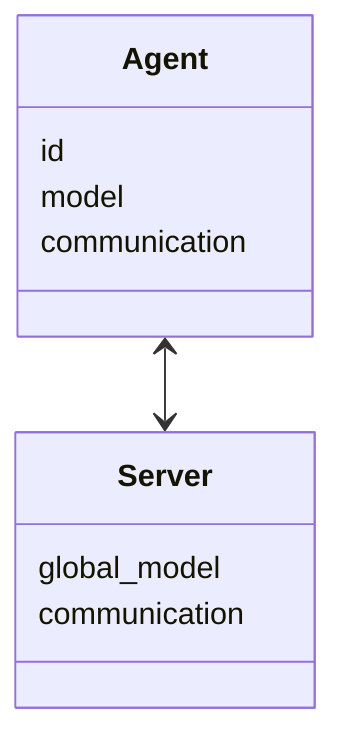
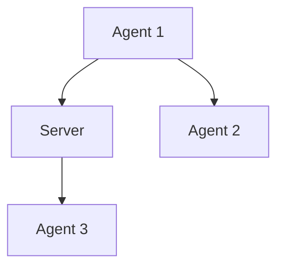

                 


# 联邦学习在分布式AI Agent系统中的应用

## 关键词：
- 联邦学习
- 分布式AI Agent
- 多智能体系统
- 数据隐私保护
- 联合机器学习

## 摘要：
本文深入探讨联邦学习在分布式AI Agent系统中的应用，从理论基础到实际应用进行全面分析。通过介绍联邦学习的核心原理和分布式AI Agent系统的架构，详细阐述两者结合的优势与挑战，并通过具体案例展示其实际应用，帮助读者全面理解并掌握相关技术。

---

## 第1章：联邦学习与分布式AI Agent系统背景

### 1.1 联邦学习的起源与概念
#### 1.1.1 联邦学习的定义与核心思想
联邦学习是一种分布式机器学习方法，允许多个参与方在不共享原始数据的情况下协同训练模型。其核心思想是通过模型参数的同步与更新，实现数据隐私保护下的模型协作。

#### 1.1.2 分布式AI Agent的定义
分布式AI Agent系统是由多个智能体组成的系统，这些智能体分布在不同的节点上，通过协同工作完成特定任务。每个智能体具备感知环境、决策和执行的能力。

#### 1.1.3 联邦学习与分布式AI Agent的结合
联邦学习为分布式AI Agent系统提供了一种数据协作机制，使得各智能体能够在不共享数据的情况下协同训练模型，同时保持数据隐私和系统高效性。

### 1.2 联邦学习的应用场景
#### 1.2.1 跨机构数据协作
在医疗、金融等领域，联邦学习允许多个机构在不共享患者或客户数据的情况下联合训练模型，保护数据隐私。

#### 1.2.2 联邦学习在分布式AI Agent中的应用
通过联邦学习，分布式AI Agent系统可以在不共享数据的情况下协同训练模型，提升系统的整体性能和智能性。

#### 1.2.3 分布式AI Agent在多智能体系统中的应用
在游戏AI、自动驾驶等领域，分布式AI Agent系统通过联邦学习实现多个智能体的协同决策和模型优化。

---

## 第2章：联邦学习的核心原理

### 2.1 联邦学习的通信协议
#### 2.1.1 联邦学习的通信机制
联邦学习通过客户端-服务器模式进行通信，每个参与方（客户端）在本地数据上训练模型，并将模型参数更新同步到服务器端，服务器端对所有客户端的参数更新进行聚合。

#### 2.1.2 联邦学习的同步与异步模式
- 同步模式：所有客户端等待服务器端的聚合结果后再进行下一步训练。
- 异步模式：客户端可以独立进行训练和参数更新，不等待服务器端的聚合结果。

### 2.2 联邦学习的数学模型
#### 2.2.1 联邦学习的优化目标
目标是最小化全局损失函数，通过聚合各客户端的局部更新来优化全局模型参数。

#### 2.2.2 联邦学习的聚合算法（如FedAvg）
$$\text{FedAvg} = \frac{1}{K} \sum_{k=1}^{K} \theta_k$$
其中，K是客户端的数量，θ_k是第k个客户端的模型参数。

#### 2.2.3 联邦学习的数学公式推导
通过优化目标函数，推导出联邦学习的参数更新公式：
$$\theta_{\text{new}} = \theta_{\text{old}} + \frac{1}{K} \sum_{k=1}^{K} (\theta_k - \theta_{\text{old}})$$

### 2.3 联邦学习的安全与隐私保护
#### 2.3.1 数据隐私保护技术
通过加密技术（如同态加密）和差分隐私技术保护数据隐私。

#### 2.3.2 联邦学习中的加密机制
使用安全多方计算（SMC）技术，在不泄露原始数据的情况下进行模型训练。

---

## 第3章：分布式AI Agent系统的核心原理

### 3.1 分布式AI Agent的定义与特点
#### 3.1.1 分布式AI Agent的定义
分布式AI Agent系统是由多个智能体组成的系统，每个智能体具备独立性、自主性和协作性。

#### 3.1.2 分布式AI Agent的核心特点
- 独立性：每个智能体具备独立的决策能力。
- 自主性：智能体能够在没有外部干预的情况下完成任务。
- 协作性：智能体之间通过通信和协作完成复杂任务。

### 3.2 分布式AI Agent与集中式系统的对比
#### 3.2.1 性能对比
- 分布式系统具备更好的扩展性和容错性，但可能在某些场景下性能较低。
- 集中式系统性能稳定，但扩展性和容错性较差。

#### 3.2.2 数据隐私保护
- 分布式系统通过联邦学习实现数据隐私保护。
- 集中式系统依赖于中心服务器，数据隐私风险较高。

---

## 第4章：联邦学习在分布式AI Agent系统中的应用

### 4.1 联邦学习与分布式AI Agent系统的结合
#### 4.1.1 联邦学习为分布式AI Agent系统提供数据协作机制
通过联邦学习，分布式AI Agent系统可以在不共享数据的情况下协同训练模型，提升系统的整体性能和智能性。

#### 4.1.2 分布式AI Agent系统为联邦学习提供多智能体协作环境
分布式AI Agent系统为联邦学习提供了多智能体协作环境，使得模型训练更加高效和多样化。

### 4.2 联邦学习在分布式AI Agent系统中的具体应用
#### 4.2.1 联邦学习在多智能体协同决策中的应用
通过联邦学习，多个智能体可以在不共享数据的情况下协同决策，提升系统的整体智能性。

#### 4.2.2 联邦学习在分布式AI Agent系统中的算法优化
通过联邦学习，分布式AI Agent系统可以实现模型参数的高效更新和优化。

---

## 第5章：系统分析与架构设计方案

### 5.1 问题场景介绍
#### 5.1.1 问题背景
在分布式AI Agent系统中，多个智能体需要协同训练模型，但数据隐私和通信效率是主要挑战。

#### 5.1.2 问题解决
通过联邦学习，分布式AI Agent系统可以在不共享数据的情况下高效协同训练模型。

### 5.2 项目介绍
#### 5.2.1 项目目标
通过联邦学习实现分布式AI Agent系统的协同训练和模型优化。

#### 5.2.2 项目功能设计
- 智能体通信模块
- 模型训练模块
- 参数聚合模块
- 数据隐私保护模块

### 5.3 系统架构设计
#### 5.3.1 领域模型类图


#### 5.3.2 系统架构图


---

## 第6章：项目实战

### 6.1 环境安装
- 安装Python和相关库（如Flask、TensorFlow）
- 安装联邦学习框架（如Federated Learning Library）

### 6.2 系统核心实现源代码
#### 6.2.1 服务器端代码
```python
import numpy as np

class Server:
    def __init__(self, model):
        self.model = model

    def aggregate(self, agents):
        weights = [agent.model.get_weights() for agent in agents]
        avg_weights = []
        for i in range(len(weights[0])):
            avg = np.mean([agent_weights[i] for agent_weights in weights], axis=0)
            avg_weights.append(avg)
        self.model.set_weights(avg_weights)
```

#### 6.2.2 客户端代码
```python
import tensorflow as tf

class Agent:
    def __init__(self, model, data):
        self.model = model
        self.data = data

    def train(self, epochs):
        self.model.fit(self.data, epochs=epochs, verbose=0)

    def get_weights(self):
        return self.model.get_weights()

    def set_weights(self, weights):
        self.model.set_weights(weights)
```

### 6.3 代码应用解读与分析
- 服务器端负责聚合各客户端的模型参数，实现模型的全局更新。
- 客户端在本地数据上训练模型，并将模型参数更新同步到服务器端。

### 6.4 实际案例分析
通过具体案例展示联邦学习在分布式AI Agent系统中的实际应用，分析其优势和挑战。

---

## 第7章：总结与展望

### 7.1 本章小结
总结联邦学习在分布式AI Agent系统中的应用，强调其在数据隐私保护和系统协作方面的重要作用。

### 7.2 最佳实践 tips
- 在实际应用中，建议结合具体的业务需求选择合适的联邦学习算法和分布式AI Agent系统架构。
- 注意数据隐私保护和系统性能优化之间的平衡。

### 7.3 注意事项
- 在实际部署中，需要考虑网络延迟和带宽限制对系统性能的影响。
- 数据隐私保护是系统设计的重点，需要采取多种技术手段确保数据安全。

### 7.4 拓展阅读
- 推荐阅读相关论文和书籍，深入理解联邦学习和分布式AI Agent系统的理论和实践。

---

## 作者：AI天才研究院/AI Genius Institute & 禅与计算机程序设计艺术 /Zen And The Art of Computer Programming

---

这篇文章系统地介绍了联邦学习在分布式AI Agent系统中的应用，从理论到实践，详细阐述了其核心原理、系统架构和实际案例，帮助读者全面理解并掌握相关技术。

