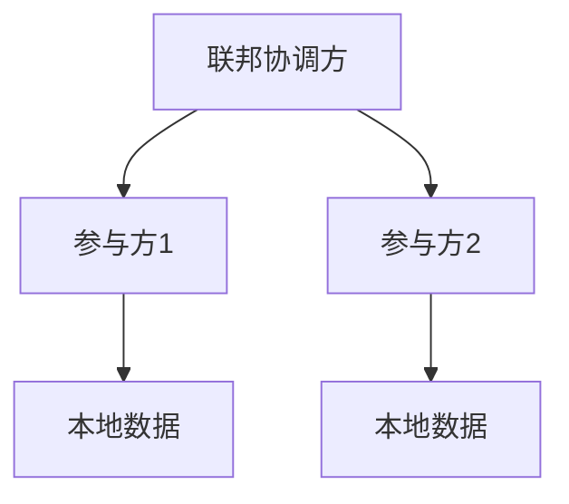
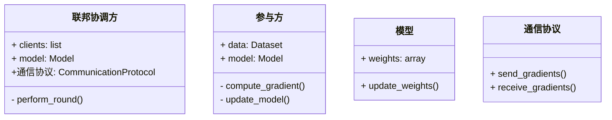
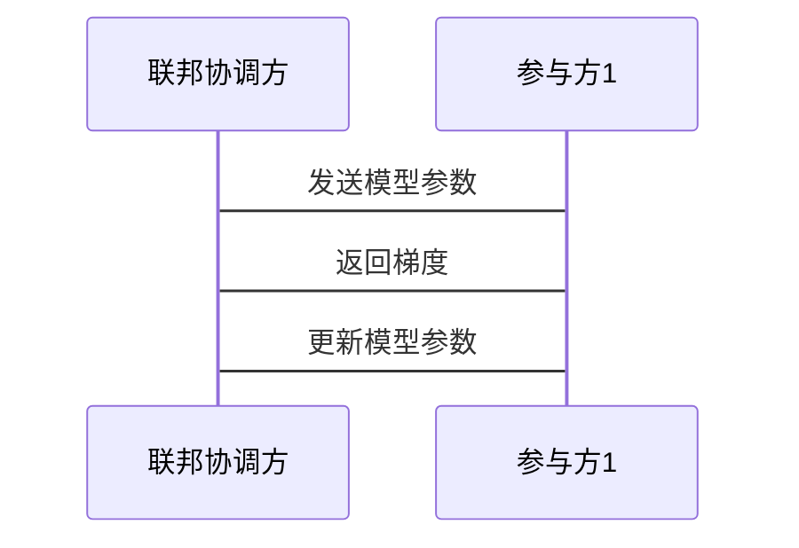

                 


# 联邦学习：保护隐私的分布式AI Agent训练

> 关键词：联邦学习、分布式AI、数据隐私、机器学习、通信协议

> 摘要：联邦学习是一种在保护数据隐私的前提下，通过分布式计算进行AI模型训练的方法。本文详细介绍了联邦学习的背景、核心概念、算法原理、系统架构以及实际应用，帮助读者全面理解这一技术。

---

## 目录

1. [联邦学习的背景与概念](#联邦学习的背景与概念)
   1.1 联邦学习的起源与定义
   1.2 联邦学习的核心概念与联系
   1.3 联邦学习的优势与应用场景

2. [联邦学习的核心概念与联系](#联邦学习的核心概念与联系)
   2.1 数据联邦的概念与属性
   2.2 联邦学习的通信协议
   2.3 联邦学习的安全机制

3. [联邦学习的算法原理](#联邦学习的算法原理)
   3.1 联邦学习的数学模型
   3.2 联邦学习的算法流程
   3.3 联邦学习的实现代码

4. [联邦学习的系统架构](#联邦学习的系统架构)
   4.1 系统设计与架构图
   4.2 系统功能设计
   4.3 系统接口与交互

5. [联邦学习的项目实战](#联邦学习的项目实战)
   5.1 环境搭建与数据准备
   5.2 核心算法实现
   5.3 案例分析与代码解读

6. [联邦学习的总结与展望](#联邦学习的总结与展望)
   6.1 全文总结
   6.2 最佳实践 tips
   6.3 未来展望

---

## 1. 联邦学习的背景与概念

### 1.1 联邦学习的起源与定义

#### 1.1.1 分布式AI的发展历程
- 从集中式AI到分布式AI的演变
- 分布式AI的优势：数据多样性、模型鲁棒性

#### 1.1.2 隐私保护的需求驱动
- 数据隐私的重要性
- 传统数据集中训练的局限性
- 联邦学习的出现背景

#### 1.1.3 联邦学习的诞生背景
- 人工智能的快速发展
- 隐私保护法规的日益严格
- 分布式计算技术的成熟

### 1.2 联邦学习的定义与特点

#### 1.2.1 联邦学习的核心概念
- 联邦学习的定义
- 数据联邦的定义
- 联邦学习的三大核心要素：数据隐私、模型同步、通信协议

#### 1.2.2 联邦学习与传统数据集中训练的区别
| 特性           | 联邦学习                | 传统数据集中训练          |
|----------------|------------------------|---------------------------|
| 数据分布       | 分散在不同机构或设备     | 集中在一个数据中心或平台   |
| 数据共享       | 不共享原始数据，仅共享模型 | 共享原始数据               |
| 隐私保护       | 高                     | 低                       |
| 计算效率       | 可能较低，但隐私性更好   | 高，但隐私性较差          |

#### 1.2.3 联邦学习的三大核心要素
- 数据联邦：确保数据不离开原始存储位置
- 模型同步：通过通信协议更新模型参数
- 安全机制：保护模型更新过程中的隐私安全

### 1.3 联邦学习的优势与应用场景

#### 1.3.1 保护数据隐私的重要性
- 隐私泄露的风险
- 数据隐私保护的法律法规（如GDPR）

#### 1.3.2 联邦学习在医疗、金融等领域的应用
- 医疗领域：联合多家医院数据训练模型，保护患者隐私
- 金融领域：联合多家金融机构数据训练风控模型，保护客户隐私

#### 1.3.3 联邦学习的扩展性与灵活性
- 支持多种模型架构
- 支持不同数据分布场景

---

## 2. 联邦学习的核心概念与联系

### 2.1 数据联邦的概念与属性

#### 2.1.1 数据联邦的定义
- 数据联邦：一种分布式数据组织方式，允许多个机构或设备在不共享原始数据的情况下进行联合训练。

#### 2.1.2 数据联邦的属性对比表格
| 属性         | 数据联邦                  | 非联邦数据共享            |
|--------------|--------------------------|---------------------------|
| 数据共享方式 | 不共享原始数据，仅共享模型 | 共享原始数据               |
| 隐私保护     | 高                     | 低                       |
| 数据可用性   | 高                     | 高                       |

#### 2.1.3 数据联邦的ER实体关系图
```mermaid
er
actor: 联邦学习参与者
roles: 参与者包括：数据提供方、模型训练方、联邦协调方
```

### 2.2 联邦学习的通信协议

#### 2.2.1 通信协议的作用
- 确保模型更新的安全性与高效性
- 支持不同参与方之间的数据交换

#### 2.2.2 常见通信协议的对比
| 通信协议 | 基于HTTP | 基于gRPC | 基于WebSocket |
|----------|----------|----------|-------------|
| 优点     | 简单易用 | 性能高    | 实时性好     |
| 缺点     | 性能低    | 配置复杂  | 易被拦截     |

#### 2.2.3 联邦学习中的安全机制
- 数据加密：确保数据在传输过程中的安全性
- 数据匿名化：通过匿名化处理保护用户隐私
- 访问控制：限制只有授权的参与者才能参与联邦训练

### 2.3 联邦学习的安全机制

#### 2.3.1 数据加密技术
- 使用同态加密技术：在不解密数据的情况下进行计算
- 使用差分隐私技术：通过添加噪声保护数据隐私

#### 2.3.2 数据匿名化处理
- 数据脱敏：去除或加密敏感信息
- 数据混淆：通过打乱数据顺序等方式保护隐私

#### 2.3.3 联邦学习中的访问控制
- 基于角色的访问控制（RBAC）
- 基于属性的访问控制（ABAC）

---

## 3. 联邦学习的算法原理

### 3.1 联邦学习的数学模型

#### 3.1.1 联邦学习的优化目标
$$ \text{目标函数} = \sum_{i=1}^{n} f_i(\theta) + \lambda \Omega(\theta) $$
其中，$f_i(\theta)$ 表示第i个参与方的损失函数，$\Omega(\theta)$ 表示正则项，$\lambda$ 是正则化系数。

#### 3.1.2 联邦学习的损失函数
$$ \mathcal{L}(\theta) = \sum_{i=1}^{n} \mathcal{L}_i(\theta) + \lambda \Omega(\theta) $$

#### 3.1.3 联邦学习的收敛条件
- 模型参数更新的收敛性
- 参与方之间的通信效率

### 3.2 联邦学习的算法流程

#### 3.2.1 联邦学习的初始化
1. 初始化模型参数 $\theta^{(0)}$
2. 确定参与方列表
3. 确定通信协议

#### 3.2.2 联邦学习的迭代过程
1. 参与方根据本地数据计算梯度
2. 梯度通过通信协议进行聚合
3. 模型参数更新
4. 重复上述步骤直到收敛

#### 3.2.3 联邦学习的终止条件
- 模型收敛
- 达到预设的训练轮数

### 3.3 联邦学习的实现代码

#### 3.3.1 环境搭建
- 安装必要的库：TensorFlow、Flask、gRPC等
- 确保网络连通性

#### 3.3.2 核心算法实现
```python
def federated_learning(client_data, num_rounds):
    theta = initialize_model()
    for round in range(num_rounds):
        # 收集所有参与方的梯度
        gradients = collect_gradients(theta, client_data)
        # 聚合梯度
        aggregated_gradients = aggregate_gradients(gradients)
        # 更新模型参数
        theta = update_model(theta, aggregated_gradients)
    return theta
```

#### 3.3.3 代码解读与分析
- `initialize_model`：初始化模型参数
- `collect_gradients`：收集所有参与方的梯度
- `aggregate_gradients`：聚合梯度（例如：平均、加权）
- `update_model`：更新模型参数

---

## 4. 联邦学习的系统架构

### 4.1 系统设计与架构图

#### 4.1.1 系统设计原则
- 分层设计：将系统分为数据层、计算层、通信层
- 可扩展性：支持不同数量和类型的参与方
- 安全性：确保数据和模型的安全性

#### 4.1.2 系统架构图


#### 4.1.3 系统功能模块
- 数据管理模块：负责数据的存储和访问控制
- 模型训练模块：负责模型的训练和更新
- 通信模块：负责模型参数的同步和交换

### 4.2 系统功能设计

#### 4.2.1 领域模型：领域类图


#### 4.2.2 系统架构设计：系统架构图


#### 4.2.3 系统接口设计
- `federated_coordinate.start_round()`：开始一轮联邦训练
- `client.compute_gradient()`：计算梯度
- `communication.send_gradients()`：发送梯度

### 4.3 系统交互：交互流程图

#### 4.3.1 交互流程图


---

## 5. 联邦学习的项目实战

### 5.1 环境搭建与数据准备

#### 5.1.1 环境搭建
- 安装必要的库：TensorFlow、Flask、gRPC等
- 配置网络环境：确保各参与方能够互相通信

#### 5.1.2 数据准备
- 数据分割：将数据分发到不同的参与方
- 数据预处理：清洗、归一化等

### 5.2 核心算法实现

#### 5.2.1 代码实现
```python
import tensorflow as tf
from tensorflow.keras import layers

def main():
    # 初始化模型
    model = tf.keras.Sequential([
        layers.Dense(64, activation='relu'),
        layers.Dense(1, activation='sigmoid')
    ])
    model.compile(optimizer='adam', loss='binary_crossentropy')
    
    # 联邦学习实现
    def train_model(model, data):
        # 训练模型
        model.fit(data, epochs=10, batch_size=32)
        return model
    
    # 执行联邦学习
    client_data = ...  # 加载数据
    trained_model = train_model(model, client_data)
    
    # 保存模型
    trained_model.save('federated_model.h5')

if __name__ == "__main__":
    main()
```

#### 5.2.2 代码解读与分析
- 模型定义：使用Keras构建一个简单的神经网络
- 数据训练：在本地数据上训练模型
- 模型保存：保存训练好的模型

### 5.3 案例分析与代码解读

#### 5.3.1 案例分析
- 医疗领域案例：联合多家医院数据训练疾病预测模型
- 金融领域案例：联合多家金融机构数据训练风控模型

#### 5.3.2 代码解读
- 数据加载与预处理
- 模型训练与保存
- 模型评估与分析

---

## 6. 联邦学习的总结与展望

### 6.1 全文总结

#### 6.1.1 联邦学习的核心思想
- 在保护数据隐私的前提下，通过分布式计算进行模型训练
- 通过通信协议和安全机制确保数据安全

#### 6.1.2 联邦学习的主要优势
- 保护数据隐私
- 支持分布式训练
- 提高模型泛化能力

### 6.2 最佳实践 tips

#### 6.2.1 实践中的注意事项
- 数据分布要合理
- 通信协议要安全可靠
- 模型要可扩展

#### 6.2.2 实践中的常见问题
- 模型收敛慢
- 通信延迟高
- 数据分布不均

#### 6.2.3 解决方案
- 优化通信协议
- 使用更高效的加密技术
- 增加参与方数量

### 6.3 未来展望

#### 6.3.1 联邦学习的发展趋势
- 更多领域的应用
- 更多机构的参与
- 更多技术的融合（如AI、区块链）

#### 6.3.2 联邦学习的技术创新点
- 更高效的通信协议
- 更安全的加密技术
- 更智能的模型优化算法

#### 6.3.3 联邦学习的潜在挑战
- 数据隐私保护的难度增加
- 模型的复杂性增加
- 通信成本的增加

---

## 作者信息

作者：AI天才研究院/AI Genius Institute & 禅与计算机程序设计艺术 /Zen And The Art of Computer Programming

---

以上是《联邦学习：保护隐私的分布式AI Agent训练》的完整目录结构和内容概要。如需进一步扩展或修改，请随时告知！

