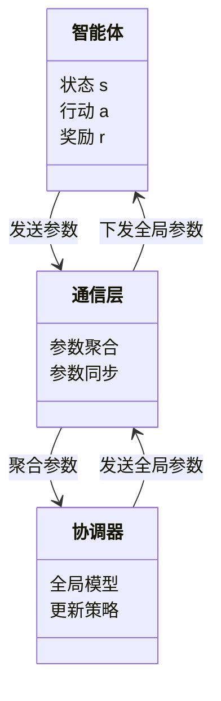

                 


# 联邦强化学习在分布式AI Agent控制中的应用

> 关键词：联邦强化学习、分布式AI、多智能体协作、数据隐私、系统架构

> 摘要：本文详细探讨了联邦强化学习在分布式AI Agent控制中的应用，分析了其核心概念、算法原理、系统架构，并通过实际案例展示了其在保护数据隐私的同时实现多智能体协作的能力。文章从背景介绍、核心概念、算法实现、系统设计到项目实战，全面阐述了联邦强化学习的理论与实践。

---

# 第1章: 联邦强化学习的背景与核心概念

## 1.1 联邦学习的起源与发展

### 1.1.1 联邦学习的定义与特点
联邦学习（Federated Learning）是一种分布式机器学习技术，允许多个参与方在不共享原始数据的情况下共同训练模型。其特点包括数据隐私保护、模型协作更新和分布式计算能力。

### 1.1.2 强化学习的基本概念与特点
强化学习（Reinforcement Learning）是一种通过智能体与环境交互来优化决策策略的学习方法，其特点包括试错学习、目标导向和状态转移。

### 1.1.3 联邦强化学习的定义与研究背景
联邦强化学习结合了联邦学习和强化学习的优势，允许多个智能体在不共享数据的情况下协作学习，研究背景包括分布式系统中的数据隐私保护和多智能体协作。

## 1.2 分布式AI Agent控制的挑战

### 1.2.1 分布式系统的基本概念
分布式系统是将功能分散到多个独立的节点上，通过通信和协调实现统一目标。其特点包括高可用性、高扩展性和复杂性。

### 1.2.2 AI Agent的基本概念与分类
AI Agent是一种能够感知环境并采取行动以实现目标的智能体，根据智能性和反应性可以分为简单反应式和复杂认知式。

### 1.2.3 分布式AI Agent控制的主要挑战
分布式AI Agent控制面临数据隐私、通信延迟和多智能体协作等挑战，需要在保护数据隐私的同时实现高效协作。

## 1.3 联邦强化学习的核心问题

### 1.3.1 联邦学习中的数据隐私与安全问题
联邦学习通过局部模型更新和参数聚合保护数据隐私，但需防止数据泄露和模型攻击。

### 1.3.2 强化学习中的多智能体协作问题
多智能体强化学习需要解决策略同步和价值函数协调问题，确保各智能体协作而非冲突。

### 1.3.3 联邦强化学习的目标与核心问题
联邦强化学习的目标是在保护数据隐私的前提下，实现多智能体协作和全局优化。核心问题包括模型同步、策略协调和隐私保护。

## 1.4 本章小结
本章介绍了联邦学习和强化学习的背景，分析了分布式AI Agent控制的挑战，并阐述了联邦强化学习的核心问题和研究意义。

---

# 第2章: 联邦强化学习的核心概念与联系

## 2.1 联邦学习的核心原理

### 2.1.1 联邦学习的基本原理
联邦学习通过局部模型训练和全局模型聚合，在不共享数据的情况下更新模型。其核心流程包括数据采样、模型更新和参数聚合。

### 2.1.2 联邦学习的关键技术
关键技术包括数据加密、模型压缩和通信优化，确保数据隐私和通信效率。

### 2.1.3 联邦学习与分布式计算的关系
联邦学习依赖分布式计算实现模型训练，而分布式计算为联邦学习提供了技术基础。

## 2.2 强化学习的核心原理

### 2.2.1 强化学习的基本概念
强化学习通过智能体与环境的交互，基于奖励机制优化决策策略。

### 2.2.2 强化学习的核心算法
核心算法包括Q-learning和策略梯度方法，通过状态转移和奖励函数更新策略。

### 2.2.3 多智能体强化学习的基本概念
多智能体强化学习涉及多个智能体协作完成任务，需解决策略同步和价值函数协调问题。

## 2.3 联邦强化学习的核心概念与联系

### 2.3.1 联邦学习与强化学习的联系
联邦学习的分布式模型更新与强化学习的多智能体协作结合，形成联邦强化学习。

### 2.3.2 联邦强化学习与数据隐私保护
通过联邦学习保护数据隐私，同时通过强化学习实现多智能体协作。

### 2.3.3 联邦强化学习与分布式AI的关系
联邦强化学习是分布式AI的重要组成部分，为多智能体协作提供新的解决方案。

## 2.4 本章小结
本章阐述了联邦学习和强化学习的核心原理，并分析了它们在分布式AI中的联系和应用。

---

# 第3章: 联邦强化学习的算法原理

## 3.1 联邦强化学习的基本算法

### 3.1.1 分布式Actor-Critic算法
分布式Actor-Critic算法通过多个Actor和Critic协作更新策略，实现全局优化。

### 3.1.2 联邦Q-learning算法
联邦Q-learning算法通过局部Q值更新和全局Q值聚合，实现多智能体协作。

### 3.1.3 联邦策略梯度算法
联邦策略梯度算法通过优化策略参数，实现全局策略同步。

## 3.2 联邦强化学习的算法流程

### 3.2.1 数据收集与预处理
智能体在本地环境中收集数据，进行预处理和特征提取。

### 3.2.2 模型更新与同步
智能体基于本地数据更新模型参数，通过通信层同步全局模型。

### 3.2.3 智能体协作与优化
智能体通过协作更新策略和价值函数，实现全局优化。

## 3.3 联邦强化学习的数学模型

### 3.3.1 联邦强化学习的数学表达式
全局目标函数为各智能体目标函数的加权和，通过参数聚合优化。

### 3.3.2 联邦Q-learning的数学模型
Q值更新公式为：$$ Q_i(s,a) = Q_i(s,a) + \alpha (r + \gamma \max Q_j(s',a) - Q_i(s,a)) $$

### 3.3.3 联邦策略梯度的数学推导
策略梯度方法通过最大化动作概率的梯度，优化策略参数：$$ \nabla \theta \log \pi_\theta(a|s) $$

## 3.4 本章小结
本章详细讲解了联邦强化学习的基本算法、流程和数学模型，为后续系统设计和实现奠定基础。

---

# 第4章: 联邦强化学习的系统分析与架构设计

## 4.1 系统分析

### 4.1.1 问题场景介绍
在分布式环境中，多个智能体需要协作完成任务，同时保护数据隐私。

### 4.1.2 系统功能需求分析
系统需实现数据采集、模型训练、通信和协调功能，确保多智能体协作和数据安全。

## 4.2 系统架构设计

### 4.2.1 领域模型
领域模型为一个多智能体协作系统，包括智能体、通信层和协调器。



### 4.2.2 系统架构
系统架构包括智能体、通信层和协调器，通过参数聚合和同步实现模型更新。

```mermaid
graph TD
    C[协调器] --> S[通信层]
    S --> A[智能体1]
    S --> A2[智能体2]
    A --> S: 本地参数
    A2 --> S: 本地参数
    S --> C: 全局参数
```

## 4.3 本章小结
本章通过系统分析和架构设计，展示了联邦强化学习在分布式环境中的实现框架。

---

# 第5章: 联邦强化学习的项目实战

## 5.1 环境安装

### 5.1.1 安装依赖
需要安装TensorFlow、Keras和Flask框架，用于模型训练和通信。

### 5.1.2 启动环境
配置分布式环境，启动多个智能体和协调器节点。

## 5.2 核心代码实现

### 5.2.1 智能体类
```python
class Agent:
    def __init__(self, id):
        self.id = id
        self.model = self.build_model()
    
    def build_model(self):
        # 定义模型结构
        pass
```

### 5.2.2 通信层类
```python
class Communicator:
    def __init__(self, coordinator):
        self.coordinator = coordinator
    
    def send_parameters(self, agent_id, parameters):
        # 发送参数到协调器
        pass
```

### 5.2.3 协调器类
```python
class Coordinator:
    def __init__(self, agents):
        self.agents = agents
    
    def aggregate_parameters(self):
        # 参数聚合
        pass
```

## 5.3 代码解读与分析

### 5.3.1 智能体与通信层交互
智能体通过通信层发送本地参数，接收全局参数。

### 5.3.2 协调器的参数聚合
协调器对所有智能体的参数进行加权平均，生成全局参数。

## 5.4 案例分析

### 5.4.1 案例场景
在一个分布式游戏中，多个智能体需要协作完成任务，通过联邦强化学习实现。

### 5.4.2 代码实现细节
详细讲解模型训练、参数更新和通信过程，展示实际案例的实现步骤。

## 5.5 项目小结
本章通过实际案例展示了联邦强化学习的实现过程，验证了其有效性和可行性。

---

# 第6章: 最佳实践与总结

## 6.1 最佳实践 tips
### 数据隐私保护
采用同态加密和差分隐私技术，确保数据安全。

### 系统优化
优化通信协议和模型压缩技术，减少通信开销。

## 6.2 小结
本文详细探讨了联邦强化学习在分布式AI Agent控制中的应用，分析了其核心概念、算法原理和系统架构，并通过实际案例展示了其应用价值。

## 6.3 注意事项
在实际应用中，需注意数据隐私保护、通信延迟和模型收敛问题，确保系统稳定性和效率。

## 6.4 拓展阅读
推荐阅读相关论文和书籍，深入理解联邦学习和强化学习的理论与实践。

---

# 作者：AI天才研究院/AI Genius Institute & 禅与计算机程序设计艺术 /Zen And The Art of Computer Programming

---

以上是文章的详细结构和内容，希望对您有所帮助！

