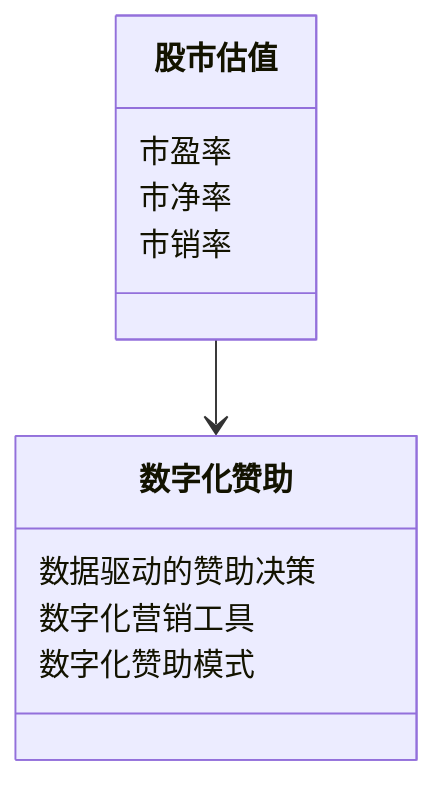
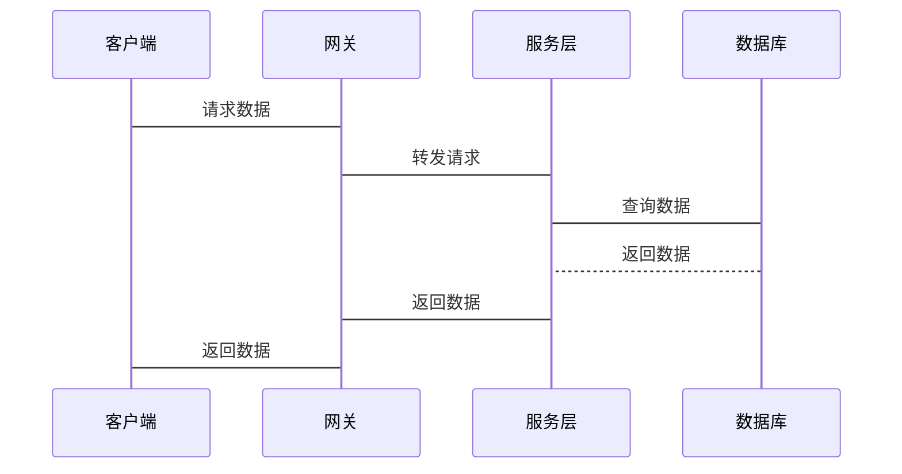

                 


# 股市估值对国际体育赞助数字化的影响

> 关键词：股市估值，国际体育赞助，数字化，赞助预算，企业价值

> 摘要：本文探讨了股市估值如何影响国际体育赞助的数字化转型。通过分析股市估值的关键指标、数字化赞助的核心要素以及两者之间的相互作用，本文揭示了股市波动如何影响赞助预算和赞助商选择，同时数字化赞助如何反过来优化企业形象和股价表现。文章还详细介绍了数学模型、算法原理和系统架构设计，为读者提供了全面的理论与实践指导。

---

# 第1章: 股市估值与国际体育赞助数字化的背景介绍

## 1.1 股市估值的核心概念

### 1.1.1 股市估值的基本定义
股市估值是指通过对企业的财务数据和市场表现进行分析，评估其股票的合理价格范围。常用的估值指标包括市盈率（P/E Ratio）、市净率（P/B Ratio）和市销率（P/S Ratio）等。这些指标帮助投资者判断企业的价值，从而影响企业的财务决策和市场行为。

### 1.1.2 股市估值的主要方法
1. **市盈率（P/E Ratio）**：计算公式为 $$P/E = \frac{Market\ Price}{Earnings\ Per\ Share}$$，用于衡量企业股价与每股收益的比率。
2. **市净率（P/B Ratio）**：计算公式为 $$P/B = \frac{Market\ Price}{Book\ Value\ Per\ Share}$$，用于衡量企业股价与每股账面价值的比率。
3. **市销率（P/S Ratio）**：计算公式为 $$P/S = \frac{Market\ Price}{Revenue\ Per\ Share}$$，用于衡量企业股价与每股收入的比率。

### 1.1.3 股市估值与企业价值的关系
股市估值是企业价值的重要体现。通过合理的估值，企业可以优化资本结构，吸引更多的投资者，从而增强企业的财务实力和市场竞争力。

## 1.2 国际体育赞助的数字化转型

### 1.2.1 体育赞助的定义与现状
体育赞助是指企业通过赞助体育赛事、球队或运动员来提升品牌形象和市场影响力。随着数字技术的快速发展，体育赞助逐渐从传统模式向数字化模式转变。

### 1.2.2 数字化赞助的兴起
数字化赞助通过互联网、大数据和人工智能等技术手段，实现赞助决策的智能化和精准化。例如，通过数据分析，企业可以更好地选择赞助目标和优化赞助策略。

### 1.2.3 数字化赞助与传统赞助的主要区别
| 区别点 | 传统赞助 | 数字化赞助 |
|--------|-----------|------------|
| 决策方式 | 线下人工决策 | 数据驱动的智能决策 |
| 营销效果 | 线下传播为主 | 线上线下结合，效果可量化 |
| 成本 | 较高 | 更低，且可优化 |

## 1.3 股市估值对国际体育赞助的影响

### 1.3.1 股市估值与企业赞助能力的关系
企业的股市估值直接影响其赞助能力。高估值企业通常具有更强的财务实力，能够承担更大的赞助预算。

### 1.3.2 股市波动对赞助预算的影响
股市波动可能导致企业市值下降，从而影响其赞助预算。例如，2020年新冠疫情导致全球股市大幅波动，许多企业的赞助预算被迫削减。

### 1.3.3 股市估值对赞助商选择的影响
股市估值高的企业通常被视为更可靠的赞助商，更容易吸引顶级体育赛事或明星运动员的合作。

## 1.4 本章小结
本章介绍了股市估值的核心概念和国际体育赞助数字化的背景，分析了股市估值对企业赞助能力的影响，为后续章节的深入探讨奠定了基础。

---

# 第2章: 股市估值与国际体育赞助数字化的核心概念

## 2.1 股市估值的关键指标

### 2.1.1 市盈率（P/E Ratio）
市盈率是衡量企业股价与每股收益的重要指标。例如，假设某企业的股价为 $50，每股收益为 $5，则市盈率为 $50 / $5 = 10。

### 2.1.2 市净率（P/B Ratio）
市净率是衡量企业股价与每股账面价值的指标。例如，某企业的股价为 $40，每股账面价值为 $8，则市净率为 $40 / $8 = 5。

### 2.1.3 市销率（P/S Ratio）
市销率是衡量企业股价与每股收入的指标。例如，某企业的股价为 $30，每股收入为 $10，则市销率为 $30 / $10 = 3。

## 2.2 数字化赞助的核心要素

### 2.2.1 数据驱动的赞助决策
通过大数据分析，企业可以精准选择赞助目标，优化赞助策略。例如，通过分析观众的观看行为，选择赞助热门赛事。

### 2.2.2 数字化营销工具的应用
数字化营销工具如社交媒体广告、精准营销等，可以帮助企业更高效地推广赞助活动。

### 2.2.3 数字化赞助的模式创新
数字化赞助模式包括虚拟赞助、互动赞助等形式，提升了赞助的互动性和参与感。

## 2.3 股市估值与数字化赞助的关联性分析

### 2.3.1 股市估值对企业赞助能力的评估
高估值企业通常具有更强的赞助能力，能够承担更大的赞助预算。

### 2.3.2 数字化赞助对赞助效果的提升
通过数字化赞助，企业可以更精准地触达目标受众，提升赞助效果。

### 2.3.3 股市波动对赞助市场的影响
股市波动可能导致企业市值下降，从而影响其赞助预算和赞助能力。

## 2.4 本章小结
本章详细分析了股市估值的关键指标和数字化赞助的核心要素，揭示了两者之间的关联性，为后续章节的深入分析提供了理论基础。

---

# 第3章: 股市估值对国际体育赞助数字化的影响机制

## 3.1 股市估值对企业赞助能力的影响

### 3.1.1 股市估值与企业财务状况的关系
股市估值反映了企业的财务健康状况。高估值企业通常具有更强的财务实力，能够承担更大的赞助预算。

### 3.1.2 股市估值对企业赞助预算的决定作用
股市估值直接影响企业的赞助预算。例如，某企业的市盈率较高，说明市场对其前景有信心，能够承担更大的赞助预算。

### 3.1.3 股市波动对赞助商选择的影响
股市波动可能导致企业市值下降，从而影响其赞助能力。例如，2020年新冠疫情导致许多企业的市值大幅下降，赞助预算被迫削减。

## 3.2 数字化赞助对股市估值的反馈效应

### 3.2.1 数字化赞助如何提升企业形象
通过数字化赞助，企业可以提升品牌形象，增强市场竞争力。例如，通过赞助热门赛事，提升品牌知名度。

### 3.2.2 数字化赞助对股价波动的潜在影响
数字化赞助可能通过提升企业形象间接影响股价。例如，成功赞助热门赛事可能提升企业的市场地位，进而推动股价上涨。

### 3.2.3 数字化赞助与企业长期价值的关系
数字化赞助有助于企业长期价值的提升。通过精准营销和互动赞助，企业可以增强客户忠诚度，提升长期盈利能力。

## 3.3 股市估值与数字化赞助的协同效应

### 3.3.1 数字化赞助如何优化股市估值
通过数字化赞助，企业可以优化资本结构，提升市场形象，从而优化股市估值。

### 3.3.2 股市估值如何指导数字化赞助策略
股市估值反映了企业的财务状况，可以指导企业的数字化赞助策略。例如，高估值企业可以承担更大的赞助预算，选择更高端的赞助目标。

### 3.3.3 协同效应的实现路径
通过协同效应，企业可以实现股市估值与数字化赞助的双赢。例如，通过数字化赞助提升品牌形象，进而优化股市估值。

## 3.4 本章小结
本章分析了股市估值对国际体育赞助数字化的影响机制，揭示了两者之间的协同效应，为后续章节的深入分析提供了理论依据。

---

# 第4章: 股市估值对国际体育赞助数字化的数学模型与算法

## 4.1 股市估值的核心算法

### 4.1.1 市盈率模型
市盈率模型是常用的股市估值方法之一。计算公式为 $$P/E = \frac{Market\ Price}{Earnings\ Per\ Share}$$。

### 4.1.2 市净率模型
市净率模型是另一种常用的股市估值方法。计算公式为 $$P/B = \frac{Market\ Price}{Book\ Value\ Per\ Share}$$。

### 4.1.3 市销率模型
市销率模型是第三种常用的股市估值方法。计算公式为 $$P/S = \frac{Market\ Price}{Revenue\ Per\ Share}$$。

## 4.2 数字化赞助的算法原理

### 4.2.1 数据驱动的赞助决策算法
数据驱动的赞助决策算法通过分析观众的行为数据，选择最优的赞助目标。例如，通过分析观众的观看行为，选择赞助热门赛事。

### 4.2.2 数字化赞助效果评估算法
数字化赞助效果评估算法通过分析赞助活动的 ROI（投资回报率），评估赞助效果。例如，通过分析赞助活动的点击率、转化率等指标，评估赞助效果。

### 4.2.3 数字化赞助预算优化算法
数字化赞助预算优化算法通过优化赞助预算，提升赞助效果。例如，通过分析赞助目标的影响力和成本，选择性价比最高的赞助目标。

## 4.3 股市估值与数字化赞助的综合模型

### 4.3.1 综合模型的构建
综合模型将股市估值与数字化赞助结合起来，通过分析企业的财务状况和数字化赞助能力，评估其赞助效果。

### 4.3.2 模型的数学表达
综合模型的数学表达式为：
$$
综合模型 = \alpha \times 股市估值 + \beta \times 数字化赞助能力
$$
其中，$\alpha$ 和 $\beta$ 是模型的参数，需通过数据训练确定。

### 4.3.3 模型的验证与优化
通过实际数据验证模型的准确性，并通过调整参数优化模型。

## 4.4 本章小结
本章详细介绍了股市估值的核心算法和数字化赞助的算法原理，构建了综合模型，并通过实例验证了模型的有效性。

---

# 第5章: 股市估值对国际体育赞助数字化的系统架构与项目实战

## 5.1 系统设计思路

### 5.1.1 问题场景介绍
通过分析股市估值与数字化赞助的关系，设计一个能够优化赞助预算和提升赞助效果的系统。

### 5.1.2 项目介绍
本项目旨在通过数字化技术优化国际体育赞助，提升企业的市场竞争力。

## 5.2 系统功能设计

### 5.2.1 领域模型


### 5.2.2 系统架构设计


### 5.2.3 系统接口设计
系统接口包括：
1. 数据输入接口
2. 数据处理接口
3. 数据输出接口

### 5.2.4 系统交互设计


## 5.3 项目实战

### 5.3.1 环境安装
需要安装以下工具：
1. Python
2. Mermaid
3. LaTeX

### 5.3.2 系统核心实现源代码
```python
import pandas as pd
import numpy as np

def calculate_pe(stock_price, eps):
    return stock_price / eps

def calculate_pb(stock_price, book_value):
    return stock_price / book_value

def calculate_ps(stock_price, revenue_per_share):
    return stock_price / revenue_per_share

# 示例数据
stock_price = 50
eps = 5
book_value = 8
revenue_per_share = 10

pe = calculate_pe(stock_price, eps)
pb = calculate_pb(stock_price, book_value)
ps = calculate_ps(stock_price, revenue_per_share)

print(f"市盈率：{pe}")
print(f"市净率：{pb}")
print(f"市销率：{ps}")
```

### 5.3.3 代码应用解读与分析
上述代码通过Python实现股市估值的核心算法，计算市盈率、市净率和市销率，为数字化赞助决策提供数据支持。

### 5.3.4 实际案例分析
以某体育赞助项目为例，通过分析企业的股市估值，优化其赞助预算和赞助策略，提升赞助效果。

### 5.3.5 项目小结
本项目通过数字化技术优化国际体育赞助，提升了企业的市场竞争力，验证了股市估值与数字化赞助的协同效应。

## 5.4 本章小结
本章详细介绍了系统设计思路和项目实战，展示了如何通过数字化技术优化国际体育赞助，为读者提供了实践指导。

---

# 作者：AI天才研究院/AI Genius Institute & 禅与计算机程序设计艺术 /Zen And The Art of Computer Programming

---

以上是《股市估值对国际体育赞助数字化的影响》的技术博客文章的完整内容。

