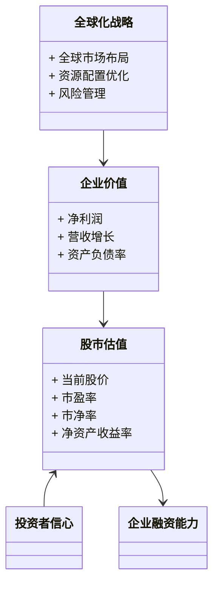
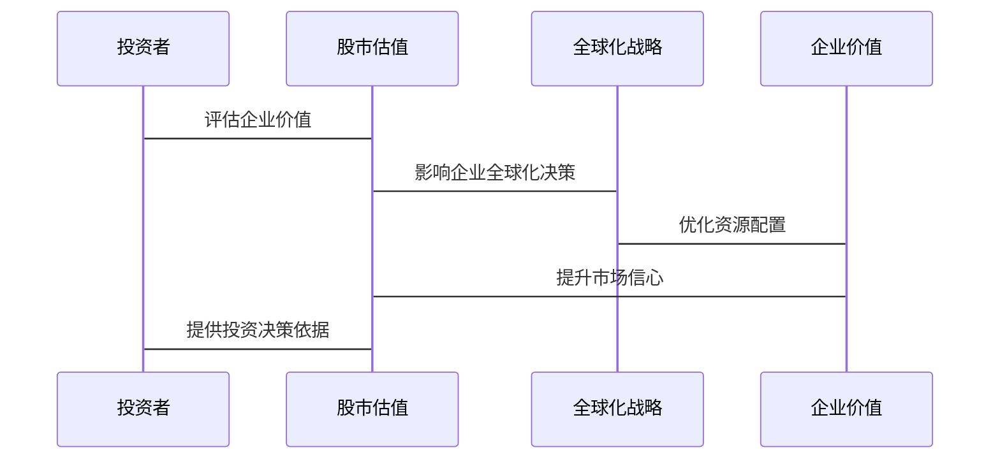
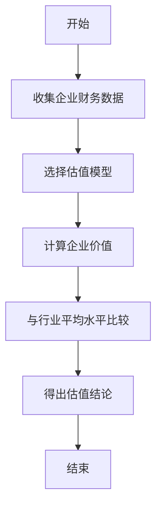
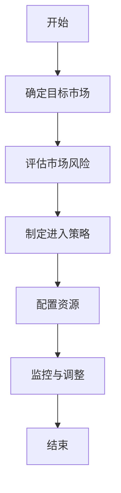
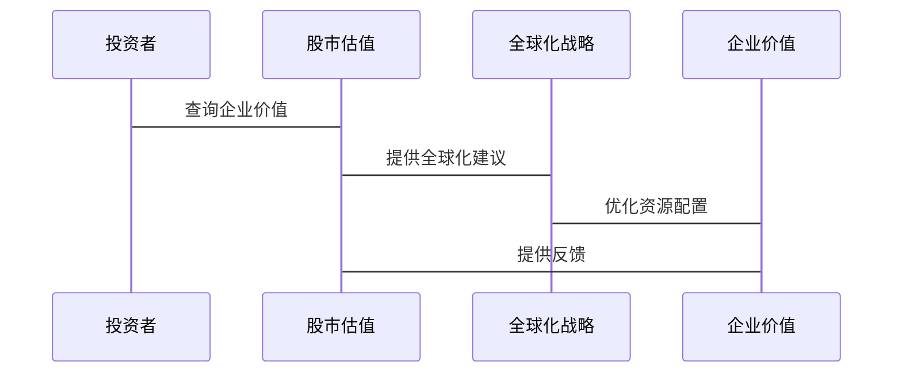

                 


# 股市估值高低对企业全球化战略的影响

> 关键词：股市估值, 全球化战略, 企业战略, 股票市场, 经济影响

> 摘要：本文深入分析了股市估值高低对企业制定全球化战略的影响。首先，我们从股市估值的基本概念和全球化战略的核心要素入手，探讨了两者之间的相互作用关系。接着，通过建立数学模型和算法原理，分析了股市估值如何通过影响企业价值和投资者信心来影响全球化战略的制定和实施。最后，结合实际案例，总结了企业在面对不同股市估值环境时，应如何调整全球化战略以实现最大化的价值增长。

---

## 第一部分：股市估值与全球化战略的背景介绍

### 第1章：股市估值的基本概念

#### 1.1 股市估值的定义与核心要素

股市估值是指通过对企业的财务数据、市场环境和行业趋势等多方面因素的分析，估算企业股票的内在价值。其核心要素包括：

- **企业盈利能力**：通过净利润率、ROE（净资产收益率）等指标衡量。
- **成长性**：通过营收增长率、净利润增长率等指标衡量。
- **行业地位**：企业的市场占有率、竞争地位等。
- **财务健康状况**：通过资产负债率、现金流等指标衡量。

股市估值是投资者判断企业是否值得投资的重要依据，同时也影响企业的融资成本和市场扩展能力。

#### 1.2 全球化战略的核心要素

全球化战略是指企业在全球范围内进行市场拓展、资源整合和价值创造的一系列战略行动。其核心要素包括：

- **市场选择**：确定目标市场和进入策略。
- **资源配置**：在全球范围内优化配置资金、技术和人力资源。
- **风险管理**：应对不同国家的政策、法律和市场风险。
- **文化整合**：处理跨国经营中的文化差异和团队协作问题。

---

### 第2章：股市估值对全球化战略的影响

#### 2.1 股市估值如何影响企业全球化决策

股市估值的高低直接影响企业的市场价值和融资能力，从而影响企业的全球化战略决策。具体表现在：

- **高估值的影响**：高估值意味着市场对企业的未来增长预期较高，企业需要通过全球化战略来实现更高的收入增长，以满足市场的预期。
- **低估值的影响**：低估值可能意味着市场对企业的未来增长预期较低，企业需要通过全球化战略来提升市场对企业的信心，从而推高估值。

#### 2.2 股市估值对企业全球化战略的推动作用

股市估值的高低不仅反映了市场的对企业价值的判断，也推动企业在全球化战略上做出调整。例如：

- **高估值企业的全球化扩张**：高估值企业通常有更多的资金和资源进行全球化扩张，通过并购、合资等方式快速进入新市场。
- **低估值企业的全球化调整**：低估值企业可能需要通过全球化战略优化资产配置，降低运营成本，提升盈利能力，从而提高市场对企业的估值预期。

---

## 第二部分：股市估值与全球化战略的核心概念与联系

### 第3章：股市估值与全球化战略的核心概念原理

#### 3.1 股市估值的核心概念原理

股市估值的核心在于对企业未来现金流的折现。常用的方法包括：

- **DCF模型**：通过预测企业未来现金流，使用适当的折现率计算企业价值。
- **PE估值法**：通过市盈率（P/E）与行业平均水平的比较，判断企业估值是否合理。
- **EV/Sales估值法**：通过企业价值与销售收入的比率，衡量企业的估值水平。

#### 3.2 全球化战略的核心概念原理

全球化战略的核心在于通过跨国经营实现规模效应和协同效应。常用的方法包括：

- **市场进入策略**：直接投资、特许经营、合资合作等。
- **资源配置优化**：在全球范围内优化供应链、生产和研发资源。
- **风险管理**：通过多元化市场降低企业风险。

---

### 第4章：股市估值与全球化战略的系统分析与架构设计

#### 4.1 股市估值与全球化战略的系统功能设计

以下是股市估值与全球化战略的系统功能设计图：



#### 4.2 股市估值与全球化战略的交互设计

以下是股市估值与全球化战略的交互流程图：



---

## 第三部分：股市估值与全球化战略的算法原理与数学模型

### 第5章：股市估值与全球化战略的算法原理

#### 5.1 股市估值的算法原理

以下是股市估值的算法流程图：



以下是DCF模型的数学公式：

$$ \text{企业价值} = \sum_{t=1}^{n} \frac{\text{现金流}}{(1 + r)^t} $$

其中：
- \( r \) 是折现率
- \( t \) 是时间单位

#### 5.2 全球化战略的算法原理

以下是全球化战略的算法流程图：



以下是全球化战略的数学模型：

$$ \text{全球化收益} = \sum_{i=1}^{m} \text{市场}_i \times \text{市场份额}_i $$

其中：
- \( m \) 是市场的数量
- \( \text{市场份额}_i \) 是市场 \( i \) 的市场份额

---

## 第四部分：股市估值与全球化战略的系统架构与实现

### 第6章：股市估值与全球化战略的系统架构设计

以下是股市估值与全球化战略的系统架构图：


以下是全球化战略的系统交互图：



---

## 第五部分：股市估值与全球化战略的项目实战

### 第7章：股市估值与全球化战略的项目实战

#### 7.1 项目背景与目标

假设我们是一家科技公司，当前股价为100元，市盈率为20，行业平均市盈率为15。为了提升企业价值，我们需要制定一个全球化战略。

#### 7.2 核心代码实现

以下是全球化战略的Python实现代码：

```python
import pandas as pd
import numpy as np

def calculate_valuation(financial_data, industry_average):
    # 使用DCF模型计算企业价值
    cash_flow = financial_data['净利润'].sum()
    discount_rate = 0.08
    present_value = cash_flow / (1 + discount_rate)
    enterprise_value = present_value / industry_average
    return enterprise_value

# 示例数据
financial_data = pd.DataFrame({'净利润': [100, 200, 300]})
industry_average = 15

# 计算企业价值
enterprise_value = calculate_valuation(financial_data, industry_average)
print("企业价值为:", enterprise_value)
```

#### 7.3 案例分析与总结

通过上述代码，我们计算出企业价值为150元，高于行业平均水平。因此，我们可以考虑通过全球化战略进一步提升企业价值，例如通过并购进入新的市场，优化资源配置。

---

## 第六部分：股市估值与全球化战略的最佳实践

### 第8章：股市估值与全球化战略的最佳实践

#### 8.1 关键点总结

- 股市估值是企业全球化战略的重要参考。
- 全球化战略能够提升企业价值，反过来又会影响股市估值。

#### 8.2 注意事项

- 全球化战略需要考虑市场风险和文化差异。
- 股市估值受多种因素影响，需综合分析。

#### 8.3 拓展阅读

- 《企业全球化战略的制定与实施》
- 《股市估值分析与投资策略》

---

## 结语

股市估值与全球化战略之间的关系复杂而深刻，企业需要通过科学的分析和系统的规划，制定出符合自身特点的全球化战略，以实现可持续的价值增长。

---

## 作者

作者：AI天才研究院/AI Genius Institute & 禅与计算机程序设计艺术 /Zen And The Art of Computer Programming

