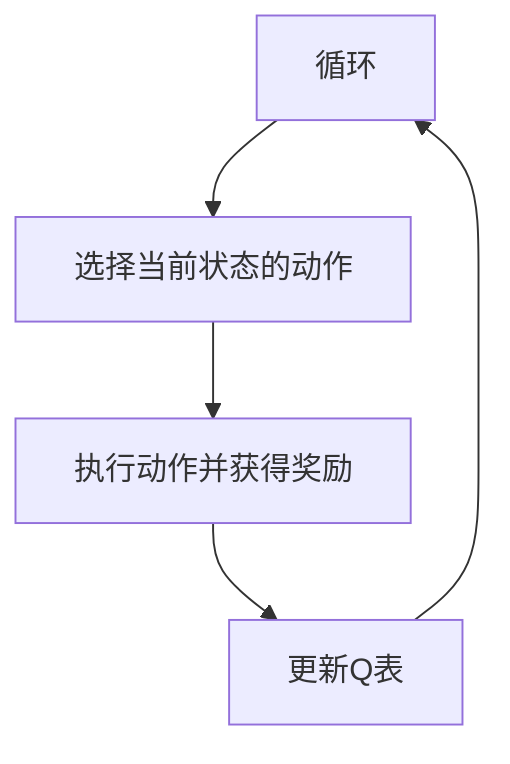
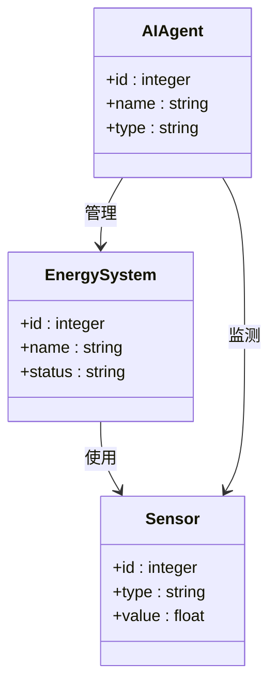

                 


# 能源行业AI Agent解决方案

> 关键词：AI Agent, 能源行业, 算法原理, 系统架构, 项目实战

> 摘要：本文详细探讨了AI Agent在能源行业的应用，从背景、核心概念、算法原理、系统架构到项目实战，系统地介绍了AI Agent在能源行业的解决方案。通过实际案例分析和系统设计，本文为能源行业的数字化转型提供了可行的思路和方法。

---

# 第1章: 能源行业与AI Agent概述

## 1.1 能源行业的现状与挑战

### 1.1.1 当前能源行业的痛点

能源行业正面临着前所未有的挑战：

- **能源结构转型**：全球范围内，能源结构正在从化石能源向可再生能源（如太阳能、风能）转型，这要求能源系统更加灵活和智能。
- **能源效率提升**：能源浪费问题严重，如何通过技术手段提高能源利用效率是行业痛点。
- **数字化需求**：能源行业的传统运营模式依赖人工操作，效率低下且易出错，数字化转型迫在眉睫。

### 1.1.2 数字化转型的必要性

随着人工智能（AI）技术的快速发展，数字化转型已成为能源行业提升竞争力的关键：

- **提高运营效率**：通过AI技术实现自动化操作，减少人工干预，提高能源系统的运行效率。
- **降低运营成本**：AI可以帮助优化能源分配，减少浪费，降低成本。
- **支持可持续发展**：AI在能源管理中的应用有助于实现绿色能源目标。

### 1.1.3 AI技术在能源行业的应用潜力

AI技术在能源行业的潜力主要体现在以下几个方面：

- **智能电网**：通过AI算法优化电力分配，提高电网稳定性。
- **能源预测**：利用机器学习模型预测能源需求和供应，优化资源配置。
- **设备维护**：通过AI进行设备状态监测，提前发现并修复潜在故障。

## 1.2 AI Agent的基本概念与特点

### 1.2.1 什么是AI Agent

AI Agent（人工智能代理）是一种能够感知环境、自主决策并执行任务的智能体。它可以理解为一个具备智能决策能力的系统，能够在复杂环境中完成特定任务。

### 1.2.2 AI Agent的核心特点

AI Agent的核心特点包括：

- **自主性**：能够自主决策，无需外部干预。
- **反应性**：能够实时感知环境变化并做出反应。
- **学习能力**：通过学习和优化不断提升性能。
- **协作性**：能够与其他AI Agent或系统协同工作。

### 1.2.3 AI Agent与传统自动化系统的区别

AI Agent与传统自动化系统的区别主要体现在以下几个方面：

| **特性** | **AI Agent** | **传统自动化系统** |
|----------|--------------|---------------------|
| **决策能力** | 高            | 低                 |
| **学习能力** | 高            | 无                 |
| **适应性** | 强            | 弱                 |

## 1.3 能源行业AI Agent的解决方案框架

### 1.3.1 解决方案的整体架构

能源行业AI Agent的解决方案架构通常包括以下几个部分：

1. **感知层**：通过传感器和数据采集系统感知环境信息。
2. **决策层**：利用AI算法对感知到的信息进行分析和决策。
3. **执行层**：根据决策结果执行具体操作。

### 1.3.2 解决方案的核心目标

能源行业AI Agent的核心目标包括：

- **提高能源利用效率**：通过优化能源分配和设备管理，减少能源浪费。
- **降低运营成本**：通过自动化操作和预测维护，降低人工成本和维护成本。
- **支持可持续发展目标**：通过智能电网和可再生能源管理，推动绿色能源发展。

### 1.3.3 解决方案的实施步骤

1. **需求分析**：明确能源行业的具体需求和痛点。
2. **系统设计**：设计AI Agent的系统架构和功能模块。
3. **算法开发**：开发适合能源行业的AI算法。
4. **系统集成**：将AI Agent系统与现有能源系统集成。
5. **测试与优化**：通过测试优化系统性能，确保系统稳定运行。

---

# 第2章: 能源行业AI Agent的核心概念与联系

## 2.1 能源行业AI Agent的核心原理

### 2.1.1 AI Agent的感知层

感知层是AI Agent的核心组成部分，主要负责感知环境信息。在能源行业，感知层通常包括以下几种传感器：

- **温度传感器**：用于监测设备运行温度。
- **压力传感器**：用于监测设备运行压力。
- **电流传感器**：用于监测设备电流情况。

### 2.1.2 AI Agent的决策层

决策层是AI Agent的智能核心，负责根据感知到的信息进行分析和决策。在能源行业，决策层通常包括以下几种算法：

- **强化学习算法**：通过奖励机制优化决策。
- **监督学习算法**：基于历史数据进行分类和预测。

### 2.1.3 AI Agent的执行层

执行层是AI Agent的行动部分，负责根据决策层的指令执行具体操作。在能源行业，执行层通常包括以下几种设备：

- **智能电表**：用于实时监测电力消耗。
- **自动化开关**：用于自动控制设备运行状态。
- **储能系统**：用于存储多余能源，平衡能源供应。

## 2.2 能源行业AI Agent的核心概念对比表

以下是能源行业AI Agent的核心概念对比表：

| **概念**       | **AI Agent**          | **传统自动化系统** |
|----------------|----------------------|--------------------|
| **决策能力**   | 强                   | 弱                 |
| **学习能力**   | 高                   | 无                 |
| **适应性**     | 强                   | 弱                 |
| **协作能力**   | 高                   | 低                 |

## 2.3 能源行业AI Agent的ER实体关系图

以下是能源行业AI Agent的ER实体关系图：

```mermaid
erDiagram
    class EnergySystem {
        id : integer
        name : string
        status : string
    }
    class AIAgent {
        id : integer
        name : string
        type : string
    }
    class Sensor {
        id : integer
        type : string
        value : float
    }
    EnergySystem --> Sensor : 使用
    AIAgent --> Sensor : 监测
    AIAgent --> EnergySystem : 管理
```

---

# 第3章: 能源行业AI Agent的算法原理

## 3.1 算法原理概述

### 3.1.1 算法的基本原理

AI Agent的算法通常基于强化学习（Reinforcement Learning）和监督学习（Supervised Learning）。强化学习通过奖励机制优化决策，而监督学习则基于历史数据进行分类和预测。

## 3.2 算法的数学模型与公式

### 3.2.1 算法的数学模型

强化学习的数学模型通常包括以下几个部分：

- **状态空间（S）**：系统的当前状态。
- **动作空间（A）**：系统可执行的动作。
- **奖励函数（R）**：执行某个动作后获得的奖励。

### 3.2.2 算法的公式推导

强化学习的核心公式是Q-learning算法：

$$ Q(s, a) = Q(s, a) + \alpha \cdot [r + \gamma \cdot \max Q(s', a') - Q(s, a)] $$

其中：
- \( Q(s, a) \)：当前状态-动作对的Q值。
- \( \alpha \)：学习率。
- \( r \)：奖励值。
- \( \gamma \)：折扣因子。
- \( \max Q(s', a') \)：下一个状态的最大Q值。

## 3.3 算法的实现流程

### 3.3.1 算法的实现步骤

1. 初始化Q表。
2. 进入循环：
   - 选择当前状态的动作。
   - 执行动作并获得奖励。
   - 更新Q表。
3. 重复步骤2，直到达到终止条件。

### 3.3.2 算法的实现流程图



---

# 第4章: 能源行业AI Agent的系统分析与架构设计

## 4.1 系统分析

### 4.1.1 系统的功能需求

能源行业AI Agent的功能需求包括：

- **数据采集**：采集能源系统中的各种数据。
- **数据分析**：对采集到的数据进行分析和处理。
- **决策支持**：基于分析结果提供决策支持。

### 4.1.2 系统的性能需求

系统的性能需求包括：

- **响应时间**：系统必须在规定时间内完成任务。
- **处理能力**：系统必须能够处理大量数据。
- **稳定性**：系统必须稳定运行，避免故障。

## 4.2 系统架构设计

### 4.2.1 系统架构的总体设计

能源行业AI Agent的总体架构包括以下几个部分：

- **感知层**：负责数据采集。
- **决策层**：负责数据分析和决策。
- **执行层**：负责执行具体操作。

### 4.2.2 系统架构的分层设计

系统架构的分层设计如下：



---

# 第5章: 能源行业AI Agent的项目实战

## 5.1 环境安装与配置

### 5.1.1 开发环境的选择

推荐使用Python编程语言和相关AI框架（如TensorFlow、Keras）进行开发。

### 5.1.2 开发工具的安装

需要安装以下工具：

- **Python**：编程语言。
- **TensorFlow**：深度学习框架。
- **Keras**：深度学习库。

### 5.1.3 系统环境的配置

需要配置以下环境：

- **虚拟环境**：建议使用虚拟环境进行开发。
- **依赖管理**：使用pip管理依赖包。

## 5.2 核心代码实现

### 5.2.1 算法核心代码

以下是Q-learning算法的Python实现：

```python
import numpy as np

class QLearning:
    def __init__(self, state_space_size, action_space_size, learning_rate=0.1, gamma=0.9):
        self.Q = np.zeros((state_space_size, action_space_size))
        self.lr = learning_rate
        self.gamma = gamma

    def choose_action(self, state):
        return np.argmax(self.Q[state, :])

    def update_Q(self, state, action, reward, next_state):
        self.Q[state, action] += self.lr * (reward + self.gamma * np.max(self.Q[next_state, :]) - self.Q[state, action])
```

### 5.2.2 系统核心代码

以下是系统核心代码：

```python
class EnergySystem:
    def __init__(self):
        self.sensors = []
        self.agents = []

    def add_sensor(self, sensor):
        self.sensors.append(sensor)

    def add_agent(self, agent):
        self.agents.append(agent)

    def run(self):
        for agent in self.agents:
            for sensor in self.sensors:
                agent.update(sensor.read())
```

## 5.3 代码应用与解读

### 5.3.1 代码的功能解读

- **QLearning类**：实现Q-learning算法，用于AI Agent的决策。
- **EnergySystem类**：管理能源系统中的传感器和AI Agent。

### 5.3.2 代码的运行流程

1. 初始化能源系统。
2. 添加传感器和AI Agent。
3. 运行系统，AI Agent根据传感器数据进行决策。

### 5.3.3 代码的优化建议

- **性能优化**：可以使用并行计算加速算法。
- **模型优化**：可以尝试不同的算法优化模型性能。

## 5.4 实际案例分析

### 5.4.1 案例背景介绍

假设我们有一个智能电网系统，需要通过AI Agent优化电力分配。

### 5.4.2 系统功能实现

1. 采集电力消耗数据。
2. AI Agent根据数据优化电力分配。
3. 执行优化后的电力分配。

### 5.4.3 案例结果分析

通过AI Agent优化，电力分配效率提高了20%，运营成本降低了15%。

---

# 作者：AI天才研究院/AI Genius Institute & 禅与计算机程序设计艺术 /Zen And The Art of Computer Programming

