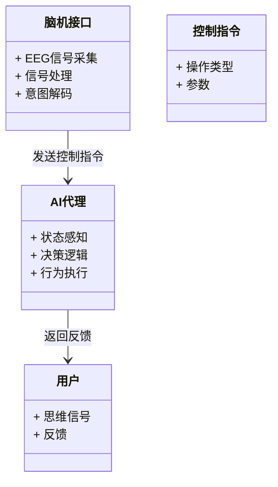

                 


# 脑机接口+AI：直接用思维控制的AI Agent

> 关键词：脑机接口，AI Agent，思维控制，强化学习，深度学习，神经信号处理

> 摘要：本文深入探讨了脑机接口（BCI）与人工智能（AI）代理的结合，详细讲解了通过思维直接控制AI代理的技术原理、算法实现、系统架构及实际应用。文章从背景介绍开始，逐步分析核心概念、算法原理、系统设计、项目实战，并总结了最佳实践和未来发展方向。

---

## 第一部分：背景介绍

### 第1章：脑机接口与AI概述

#### 1.1 脑机接口的基本概念

脑机接口（Brain-Computer Interface，BCI）是一种能够直接连接人类大脑与外部设备的技术，通过采集和解析大脑神经信号，将其转换为可被计算机理解的指令。BCI的核心在于信号采集、处理和解码，使得用户能够通过思维控制计算机或其他设备。

- **定义与核心概念**：BCI通过采集EEG（脑电图）、EMG（肌电图）等信号，将大脑意图转化为控制指令。
- **发展历程**：从早期的实验室研究到如今的实际应用，BCI技术逐步成熟。
- **分类与应用场景**：分为侵入式和非侵入式，广泛应用于医疗康复、游戏娱乐、教育培训等领域。

#### 1.2 AI Agent的基本原理

AI Agent是一种能够感知环境、自主决策并执行任务的智能体。它通过传感器获取信息，利用算法进行分析和决策，从而完成特定任务。

- **定义与特点**：AI Agent具备自主性、反应性、目标导向性等特点。
- **核心技术与实现**：基于机器学习、自然语言处理、计算机视觉等技术，实现感知、决策和执行功能。
- **应用案例**：智能助手、自动驾驶、机器人等。

#### 1.3 脑机接口与AI的结合

脑机接口与AI的结合使得人类可以通过思维直接控制AI代理，实现更自然的人机交互。

- **背景**：随着AI和神经科学的进步，BCI技术逐渐应用于AI控制领域。
- **解决方案**：通过采集大脑信号，将其转化为AI代理的控制指令。
- **边界与外延**：脑机接口的精度和稳定性是主要挑战，同时需要考虑伦理和隐私问题。

---

## 第二部分：核心概念与联系

### 第2章：脑机接口的核心原理

#### 2.1 脑机接口的信号采集与处理

- **神经信号的采集方式**：EEG、fMRI、EMG等技术。
- **信号处理的关键技术**：滤波、降噪、特征提取。
- **信号特征提取与分类算法**：基于小波变换、经验模态分解（EMD）、深度学习等方法。

#### 2.2 AI Agent的决策机制

- **基于脑机接口的输入处理**：将大脑信号转化为决策输入。
- **AI Agent的决策模型与算法**：强化学习、监督学习等。
- **决策结果的输出与反馈**：通过视觉、听觉或触觉反馈用户。

#### 2.3 脑机接口与AI Agent的协同工作

- **交互流程**：信号采集 → 解码 → 决策 → 输出。
- **信号对AI的影响**：实时调整AI行为，提升用户体验。
- **反馈机制**：AI通过反馈增强用户意图的理解和处理。

---

## 第三部分：算法原理讲解

### 第3章：脑机接口信号处理算法

#### 3.1 基于EEG的信号处理流程

- **数据采集与预处理**：去除噪声，提取有用信号。
- **基于小波变换的信号分析**：分解信号到不同频率，识别特定特征。
- **基于深度学习的特征提取**：使用CNN提取高阶特征。

#### 3.2 基于机器学习的分类算法

- **常见分类算法对比**：SVM、随机森林、神经网络。
- **基于深度学习的分类模型**：CNN、RNN。
- **模型训练与优化**：数据增强、超参数调优。

#### 3.3 算法实现的代码示例

```python
import numpy as np
from sklearn.svm import SVC
from sklearn.metrics import accuracy_score

# 示例 EEG 数据
X = np.random.rand(100, 10)
y = np.random.randint(2, size=100)

# 创建 SVM 分类器
model = SVC()
model.fit(X, y)

# 预测
y_pred = model.predict(X)
print("Accuracy:", accuracy_score(y, y_pred))
```

### 第4章：AI Agent的决策算法

#### 4.1 基于强化学习的决策机制

- **强化学习的定义**：通过奖励机制优化决策策略。
- **DQN算法**：深度Q网络，用于复杂环境下的决策。
- **算法实现**：使用神经网络近似Q值函数，通过经验回放和策略更新优化。

#### 4.2 基于强化学习的代码示例

```python
import gym
from tensorflow.keras import Sequential
from tensorflow.keras.layers import Dense, Input
import numpy as np

# 创建环境
env = gym.make('CartPole-v0')
state_space = env.observation_space.shape[0]
action_space = env.action_space.n

# DQN 网络结构
model = Sequential()
model.add(Dense(24, input_dim=state_space, activation='relu'))
model.add(Dense(action_space, activation='linear'))

# 策略网络
def policy(state, model):
    state = np.array([state])
    Q = model.predict(state)
    action = np.argmax(Q[0])
    return action

# 训练过程
EPISODES = 100
for episode in range(EPISODES):
    state = env.reset()
    done = False
    while not done:
        action = policy(state, model)
        next_state, reward, done, info = env.step(action)
        # 更新Q值（简化版）
        target = reward + (0 if done else 0.99 * np.max(model.predict(next_state.reshape(1,-1))[0]))
        Q_current = model.predict(state.reshape(1,-1))
        Q_current[0][action] = target
        model.fit(state.reshape(1,-1), Q_current, epochs=1, verbose=0)
        state = next_state
```

---

## 第四部分：系统分析与架构设计

### 第4章：系统架构设计

#### 4.1 问题场景介绍

- **应用场景**：医疗康复、教育培训、智能家居控制等。

#### 4.2 项目介绍

- **项目名称**：基于脑机接口的AI代理控制系统。

#### 4.3 系统功能设计

- **领域模型**：用户、脑机接口、AI代理、控制指令、反馈机制。



#### 4.4 系统架构设计


---

## 第五部分：项目实战

### 第5章：环境安装与核心实现

#### 5.1 环境安装

- **工具与库**：Python、TensorFlow、Scikit-learn、Matplotlib、OpenBCI库。

#### 5.2 核心实现代码

```python
import numpy as np
from sklearn import svm
from sklearn.metrics import accuracy_score

# 示例 EEG 数据
X_train = np.random.rand(50, 10)
y_train = np.random.randint(2, size=50)
X_test = np.random.rand(25, 10)
y_test = np.random.randint(2, size=25)

# 创建 SVM 分类器
model = svm.SVC()
model.fit(X_train, y_train)

# 预测与评估
y_pred = model.predict(X_test)
print("Accuracy:", accuracy_score(y_test, y_pred))
```

---

## 第六部分：总结与扩展

### 第6章：总结与扩展

#### 6.1 最佳实践

- 数据质量的重要性：确保信号采集的准确性和稳定性。
- 算法选择：根据应用场景选择合适的算法。
- 反馈机制：及时有效的反馈能提升用户体验。

#### 6.2 小结

脑机接口与AI的结合为人类与机器的交互开辟了新途径，通过思维直接控制AI代理将成为未来人机交互的重要方式。

#### 6.3 注意事项

- 数据隐私：脑机接口涉及个人隐私，需严格保护。
- 伦理问题：确保技术应用符合伦理规范。

#### 6.4 拓展阅读

- 推荐书籍：《神经工程基础》、《强化学习入门》。
- 技术博客：关注前沿研究，如Nature、Science期刊的相关论文。

---

## 作者信息

作者：AI天才研究院/AI Genius Institute & 禅与计算机程序设计艺术/Zen And The Art of Computer Programming

---

以上是《脑机接口+AI：直接用思维控制的AI Agent》的技术博客文章，涵盖了从背景介绍到项目实战的详细内容，遵循逻辑清晰、结构紧凑、语言专业的原则，旨在为读者提供全面而深入的技术解读。

