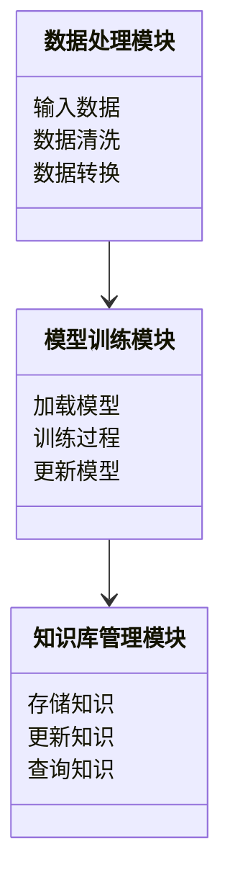

                 


# 自主学习AI Agent：LLM驱动的终身学习系统

> 关键词：自主学习AI Agent，LLM，终身学习系统，人工智能，机器学习，深度学习

> 摘要：本文深入探讨了自主学习AI Agent的设计与实现，重点分析了LLM（Large Language Model）在终身学习系统中的应用。文章从背景介绍、核心概念、算法原理、系统架构到项目实战，全面阐述了自主学习AI Agent的构建过程，帮助读者理解其技术本质和实际应用。

---

# 第一部分：自主学习AI Agent概述

## 第1章：背景介绍

### 1.1 问题背景

#### 1.1.1 自主学习AI Agent的定义
自主学习AI Agent是一种能够持续优化自身模型、适应新数据和任务的人工智能系统，通过LLM驱动，实现终身学习能力。

#### 1.1.2 自主学习AI Agent的重要性
在动态变化的环境中，传统AI系统需要频繁人工干预，而自主学习AI Agent能够自动调整，适应新任务，提高灵活性和效率。

#### 1.1.3 自主学习AI Agent与其他AI的区别
传统AI依赖于固定规则，而自主学习AI Agent具备自我学习和优化的能力，能够不断进化。

### 1.2 问题描述

#### 1.2.1 自主学习AI Agent的核心问题
如何设计系统使其具备持续学习和适应新任务的能力。

#### 1.2.2 自主学习AI Agent的挑战
数据稀疏性、模型更新效率、计算资源限制等。

#### 1.2.3 自主学习AI Agent的边界与外延
定义系统的功能边界，明确其与外部环境的交互方式。

---

## 第2章：核心概念与联系

### 2.1 自主学习AI Agent的原理

#### 2.1.1 LLM驱动的终身学习系统
LLM通过处理大量数据，进行模型微调和强化学习，实现持续优化。

#### 2.1.2 自主学习AI Agent的核心要素
数据处理模块、模型训练模块、知识库管理模块、反馈机制模块。

#### 2.1.3 自主学习AI Agent的系统架构
模块化设计，各模块协同工作，实现数据采集、模型训练、知识存储和更新。

### 2.2 核心概念对比

#### 2.2.1 监督学习与无监督学习的对比
| 特性 | 监督学习 | 无监督学习 |
|------|----------|------------|
| 数据 | 标签数据 | 无标签数据 |
| 目标 | 预测目标 | 发现结构 |

#### 2.2.2 自主学习AI Agent与传统AI的区别
- **学习方式**：自主学习AI Agent具备自我学习能力，传统AI依赖于预设规则。
- **适应性**：自主学习AI Agent能够适应新任务，传统AI需要人工干预。
- **效率**：自主学习AI Agent在动态环境中更高效。

#### 2.2.3 自主学习AI Agent与强化学习的联系
自主学习AI Agent结合强化学习，通过奖励机制优化模型。

---

## 第3章：自主学习AI Agent的算法原理

### 3.1 LLM驱动的终身学习系统

#### 3.1.1 LLM的定义与特点
LLM是基于大规模数据预训练的语言模型，具备强大的上下文理解和生成能力。

#### 3.1.2 LLM在自主学习AI Agent中的应用
- 数据预处理：清洗、格式化输入数据。
- 模型微调：在特定任务上进行微调，提升性能。
- 强化学习：通过奖励机制优化模型输出。

#### 3.1.3 LLM的训练过程
1. 数据预处理：清洗、分块。
2. 模型微调：使用任务相关数据，微调LLM。
3. 强化学习：通过奖励函数优化模型。

---

## 第4章：系统分析与架构设计

### 4.1 问题场景介绍

#### 4.1.1 自主学习AI Agent的应用场景
- 自然语言处理：文本生成、问答系统。
- 个性化推荐：根据用户行为动态调整推荐策略。
- 自动化决策：动态环境中的决策优化。

### 4.2 项目介绍

#### 4.2.1 项目目标
构建一个能够持续学习和优化的AI Agent，实现在不同任务中的适应能力。

### 4.3 系统功能设计

#### 4.3.1 领域模型（Mermaid类图）


#### 4.3.2 系统架构设计（Mermaid架构图）
```mermaid
contextDiagram
    participant 用户
    participant 环境
    participant 数据源
    participant 模型训练模块
    participant 知识库管理模块
    用户 --> 数据源: 提供数据
    数据源 --> 数据处理模块: 数据清洗
    数据处理模块 --> 模型训练模块: 更新模型
    模型训练模块 --> 知识库管理模块: 更新知识
```

---

## 第5章：项目实战

### 5.1 环境安装

#### 5.1.1 安装Python
```bash
python --version
pip install --upgrade pip
```

#### 5.1.2 安装依赖库
```bash
pip install transformers torch datasets
```

### 5.2 核心实现

#### 5.2.1 数据处理模块
```python
import torch
from transformers import AutoTokenizer, AutoModelForMaskedLM

tokenizer = AutoTokenizer.from_pretrained('bert-base-uncased')
model = AutoModelForMaskedLM.from_pretrained('bert-base-uncased')
```

#### 5.2.2 模型训练模块
```python
def train_model(model, tokenizer, optimizer, scheduler, epochs=3):
    model.train()
    for epoch in range(epochs):
        for batch in dataloader:
            optimizer.zero_grad()
            outputs = model(batch)
            loss = outputs.loss
            loss.backward()
            optimizer.step()
            scheduler.step()
```

#### 5.2.3 知识库管理模块
```python
def save_model(model, save_dir):
    torch.save(model.state_dict(), save_dir)
```

### 5.3 案例分析

#### 5.3.1 自然语言处理案例
- 任务：文本生成
- 步骤：数据预处理、模型微调、模型评估。

---

## 第6章：总结与展望

### 6.1 总结

#### 6.1.1 核心内容回顾
- 自主学习AI Agent的定义与重要性
- LLM驱动的终身学习系统
- 算法原理与系统架构

### 6.1.2 项目实战经验
- 环境搭建与数据处理
- 模型训练与知识库管理
- 实际案例分析

### 6.2 注意事项

#### 6.2.1 数据处理
- 数据清洗的重要性
- 数据格式化的注意事项

#### 6.2.2 模型训练
- 模型选择策略
- 训练过程中的参数调整

#### 6.2.3 知识库管理
- 知识存储的最佳实践
- 知识更新的频率和策略

### 6.3 拓展阅读

#### 6.3.1 推荐书籍
- 《深度学习》
- 《机器学习实战》

#### 6.3.2 推荐论文
- "Attention Is All You Need"
- "Transformers Are All You Need"

---

# 作者：AI天才研究院/AI Genius Institute & 禅与计算机程序设计艺术 /Zen And The Art of Computer Programming

